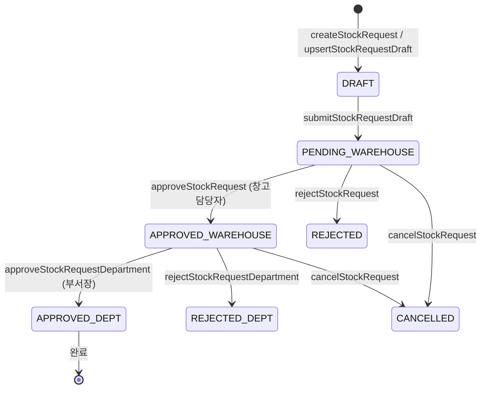
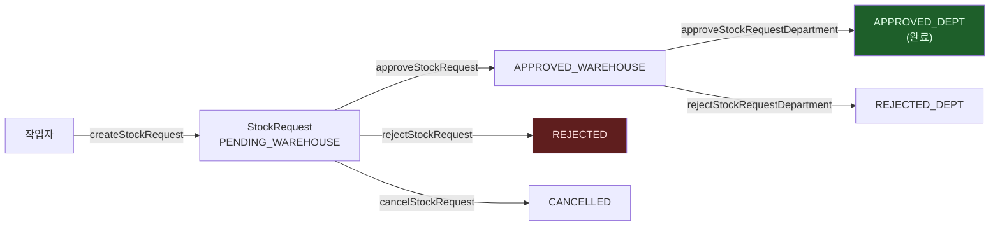

# lib/api/stock-requests.ts — 창고 결재 흐름 API (15 메소드)

#layer/frontend #topic/api

> [!summary] 한 줄 요약
> 구형 창고 출고 요청 결재 흐름(창고 승인/부서 승인/반려/취소)과 draft 장바구니 기능을 담는다. 입출고 2.0(`ioApi`) 과 병존하는 구형 방식이다.

---

## 1. 위치 & 관계

| 항목 | 내용 |
|------|------|
| 원본 | `erp/frontend/lib/api/stock-requests.ts` |
| 분리 시점 | Round-6 (R6-D8) |
| 역할 | 창고 결재 흐름 + draft 장바구니 |
| 백엔드 라우터 | [[erp/backend/app/routers/stock_requests.py]] |



---

## 2. 메소드 목록 (15개)

### 결재 흐름 (11개)

| 메소드 | HTTP | 엔드포인트 | 설명 |
|--------|------|-----------|------|
| `createStockRequest` | POST | `/api/stock-requests` | 요청 생성 (직접 제출) |
| `listMyStockRequests` | GET | `/api/stock-requests?...` | 내 요청 목록 |
| `listWarehouseQueue` | GET | `/api/stock-requests/warehouse-queue` | 창고 승인 대기 목록 |
| `listDepartmentQueue` | GET | `/api/stock-requests/department-queue?...` | 부서 승인 대기 목록 |
| `countWarehouseQueue` | GET | `/api/stock-requests/warehouse-queue/count` | 창고 큐 카운트 |
| `countDepartmentQueue` | GET | `/api/stock-requests/department-queue/count?...` | 부서 큐 카운트 |
| `approveStockRequest` | POST | `/api/stock-requests/{id}/approve` | 창고 승인 |
| `rejectStockRequest` | POST | `/api/stock-requests/{id}/reject` | 창고 반려 |
| `approveStockRequestDepartment` | POST | `/api/stock-requests/{id}/department-approve` | 부서 승인 |
| `rejectStockRequestDepartment` | POST | `/api/stock-requests/{id}/department-reject` | 부서 반려 |
| `cancelStockRequest` | POST | `/api/stock-requests/{id}/cancel` | 요청 취소 |

### draft 장바구니 (4개)

| 메소드 | HTTP | 엔드포인트 | 설명 |
|--------|------|-----------|------|
| `upsertStockRequestDraft` | PUT | `/api/stock-requests/draft` | draft 저장/갱신 (upsert) |
| `getStockRequestDraft` | GET | `/api/stock-requests/draft?...` | 단일 draft 조회 |
| `listStockRequestDrafts` | GET | `/api/stock-requests/drafts?...` | 직원별 draft 목록 |
| `deleteStockRequestDraft` | DELETE | `/api/stock-requests/draft/{id}?...` | draft 삭제 |
| `submitStockRequestDraft` | POST | `/api/stock-requests/{id}/submit` | draft 를 제출 (결재 시작) |
| `getItemReservations` | GET | `/api/stock-requests/reservations?...` | 품목 예약 현황 |

---

## 3. 코드 발췌

```typescript
import { deleteJson, fetcher, postJson, putJson, toApiUrl } from "../api-core";
import type {
  StockRequest, StockRequestActionPayload, StockRequestCreatePayload,
  StockRequestDraftUpsertPayload, StockRequestReservationLine, StockRequestType,
} from "./types";

export const stockRequestsApi = {
  // 결재 흐름
  createStockRequest: (payload: StockRequestCreatePayload) =>
    postJson<StockRequest>(toApiUrl("/api/stock-requests"), payload),

  listWarehouseQueue: () =>
    fetcher<StockRequest[]>(toApiUrl("/api/stock-requests/warehouse-queue")),

  countWarehouseQueue: () =>
    fetcher<{ count: number }>(toApiUrl("/api/stock-requests/warehouse-queue/count")),

  approveStockRequest: (requestId: string, payload: StockRequestActionPayload) =>
    postJson<StockRequest>(toApiUrl(`/api/stock-requests/${requestId}/approve`), payload),

  rejectStockRequest: (requestId: string, payload: StockRequestActionPayload) =>
    postJson<StockRequest>(toApiUrl(`/api/stock-requests/${requestId}/reject`), payload),

  // draft 장바구니
  upsertStockRequestDraft: (payload: StockRequestDraftUpsertPayload) =>
    putJson<StockRequest>(toApiUrl("/api/stock-requests/draft"), payload),

  listStockRequestDrafts: (requesterEmployeeId: string) =>
    fetcher<StockRequest[]>(
      toApiUrl(
        `/api/stock-requests/drafts?requester_employee_id=${encodeURIComponent(requesterEmployeeId)}`,
      ),
    ),

  deleteStockRequestDraft: (requestId: string, requesterEmployeeId: string) =>
# ... (이하 11줄 생략. 원본 참조)

```

---

## 4. 결재 흐름 상세



---

## 5. 큐 카운트 배지

`DesktopWarehouseView` 는 탭 배지 숫자를 위해 이 메소드들을 사용한다:

```typescript
// 창고 담당자 큐 카운트
api.countWarehouseQueue().then(({ count }) => setWarehouseQueueCount(count));

// 부서장 큐 카운트
api.countDepartmentQueue(operatorEmployeeId).then(({ count }) => setDeptQueueCount(count));
```

---

## 6. StockRequestActionPayload

결재/반려/취소 시 공통으로 넘기는 본문:

```typescript
// 실체는 api/types.ts 에 정의
interface StockRequestActionPayload {
  actor_employee_id: string;   // 처리하는 담당자 ID
  notes?: string;              // 메모 (반려 사유 등)
}
```

---

## 7. ioApi 와의 관계

> [!info] 구형 vs 신형 병존
> - `stockRequestsApi` : 구형. 결재 라인(창고 → 부서장)이 명시적으로 존재.
> - `ioApi` : 신형 입출고 2.0. preview → draft → submit 3단계.
> - `DesktopWarehouseView` 가 두 방식의 draft 를 합산하여 장바구니 배지 숫자를 표시.
> - 신규 작업은 `ioApi` 를 사용하는 방향으로 이동 중.

---

## 8. 관련 파일

- [[erp/frontend/lib/api.ts]] — 이 파일을 spread merge 하는 허브
- [[erp/frontend/lib/api/io.ts]] — 신형 입출고 2.0 API
- [[erp/frontend/app/legacy/_components/DesktopWarehouseView.tsx]] — 주요 소비자
- [[erp/backend/app/routers/stock_requests.py]] — 백엔드 라우터

---

## 9. 주의 사항

> [!warning] `listDepartmentQueue` — actor_employee_id 필수
> 부서장이 자신의 부서 요청만 볼 수 있도록 actor ID 를 쿼리에 포함해야 한다.

> [!warning] `upsertStockRequestDraft` — PUT (upsert)
> 같은 `requester_employee_id + request_type` 조합이면 기존 draft 를 덮어쓴다.
> 여러 draft 를 별도로 유지하려면 `request_type` 을 다르게 설정해야 한다.

---

## 10. 히스토리 메모

| 리비전 | 변경 내용 |
|--------|-----------|
| R6-D8 | stock-requests 도메인 최초 분리 (12메소드) |
| 이후 | `getItemReservations`, 부서 큐 카운트 추가 |

---

## 11. 정책

- `main` 브랜치: 코드만 유지
- `vault-sync` 브랜치: 코드 + `vault/` 노트
- 코드와 노트가 다르면 실제 코드 우선
