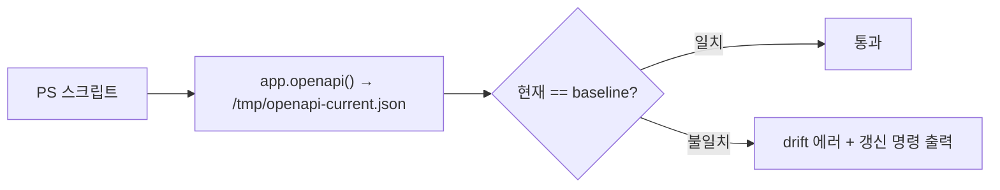

---
tags:
  - layer/scripts
  - topic/ops
aliases:
  - verify_local
created: 2026-05-21
---
type: code-note
status: active
updated: 2026-05-21
project: DEXCOWIN MES
---

# verify_local.ps1

> [!info] 한 줄 요약
> push 전 필수 로컬 검증 스크립트. Frontend lint·typecheck·테스트·빌드·번들 크기, Backend pytest, OpenAPI drift 를 순서대로 실행하여 GitHub CI 실패를 사전 차단한다.

## 1. 파일 위치

```
erp/scripts/dev/verify_local.ps1
```

## 2. 실행 방법

```powershell
# CLAUDE.md 기준 — push 전 항상 실행
powershell -ExecutionPolicy Bypass -File .\scripts\dev\verify_local.ps1

# 옵션: DB 정합성 검사 포함
powershell -ExecutionPolicy Bypass -File .\scripts\dev\verify_local.ps1 -DbReadOnlyCheck
```

## 3. 검사 항목 (순서대로)

| 순서 | 이름 | 명령 | 비고 |
|---|---|---|---|
| 1 | Backend pytest | `python -m pytest -q` | backend/ 에서 실행 |
| 2 | Frontend strict lint | `npm run lint:strict` | frontend/ 에서 실행 |
| 3 | Frontend type check | `npx tsc --noEmit` | TS 컴파일 오류 검출 |
| 4 | Frontend tests + coverage | `npm run test:coverage` | 50/50/50/50 threshold |
| 5 | Frontend production build | `npm run build` | 빌드 실패 사전 차단 |
| 6 | Frontend bundle size | `npm run check:bundle-size` | .next-prod chunks ≤ 2.0 MB |
| 7 | OpenAPI drift | Python 인라인 스크립트 | baseline 비교 |
| 8 | (옵션) DB read-only | Python 인라인 스크립트 | `-DbReadOnlyCheck` 플래그 시 |
| 9 | Git working tree | `git status --short` | 미커밋 파일 확인 |

## 4. OpenAPI drift 검사 상세



baseline 파일: `erp/_dev/baselines/openapi.json`

갱신 명령:
```bash
cd backend
python -c "from app.main import app; import json; open('../_dev/baselines/openapi.json','w',encoding='utf-8').write(json.dumps(app.openapi(),indent=2,sort_keys=True,ensure_ascii=False)+chr(10))"
```

## 5. 코드 발췌 (검사 실행 함수)

```powershell
# erp/scripts/dev/verify_local.ps1 (13-37)
function Invoke-Check {
    param(
        [Parameter(Mandatory = $true)] [string] $Name,
        [Parameter(Mandatory = $true)] [string] $WorkingDirectory,
        [Parameter(Mandatory = $true)] [scriptblock] $Command
    )
    Write-Host ""
    Write-Host "==> $Name"
    Push-Location $WorkingDirectory
    try {
        & $Command
        if ($LASTEXITCODE -ne 0) {
            throw "$Name failed with exit code $LASTEXITCODE"
        }
    }
    finally {
        Pop-Location
    }
}
```

## 6. DB 정합성 검사 (옵션)

`-DbReadOnlyCheck` 플래그 시 SQLite read-only 모드로 검사:

- 주요 테이블 행 수 출력
- `inventory_mismatch_count` = 0 검증
  (`quantity != warehouse_qty + location_sum` 인 항목 수)
- `open_queue_batches` 수 출력
- 마지막 거래 시각 출력

```
mismatch_count != 0 이면 exit 1 → 스크립트 전체 실패
```

## 7. RepoRoot 계산

```powershell
# erp/scripts/dev/verify_local.ps1 (9-11)
$RepoRoot = git rev-parse --show-toplevel
$FrontendRoot = Join-Path $RepoRoot "frontend"
$BackendRoot  = Join-Path $RepoRoot "backend"
```

스크립트 위치와 무관하게 git 루트 기준으로 경로 계산.

## 8. 에러 정책

```powershell
$ErrorActionPreference = "Stop"
Set-StrictMode -Version Latest
```

어느 한 검사라도 실패 시 즉시 중단. 이후 검사는 실행되지 않음.

## 9. 자주 하는 실수 / 주의

> [!warning] OpenAPI drift 발생 시
> 백엔드 라우터 또는 스키마를 수정했는데 baseline 을 갱신하지 않으면 이 스크립트가 실패한다. 에러 메시지에 출력된 갱신 명령 한 줄을 실행 후 `_dev/baselines/openapi.json` 을 커밋에 포함하면 된다.

> [!note] CI 와 동일 threshold
> coverage 50/50/50/50 은 GitHub CI 와 동일. 로컬 통과 = CI 통과.

## 10. 관련 파일

- `[[erp/CLAUDE.md]]` — "Before commit/push, run verify_local.ps1" 기준 명시
- `erp/_dev/baselines/openapi.json` — OpenAPI drift baseline
- `[[erp/frontend/package.json]]` — lint:strict, test:coverage, check:bundle-size 스크립트 정의
