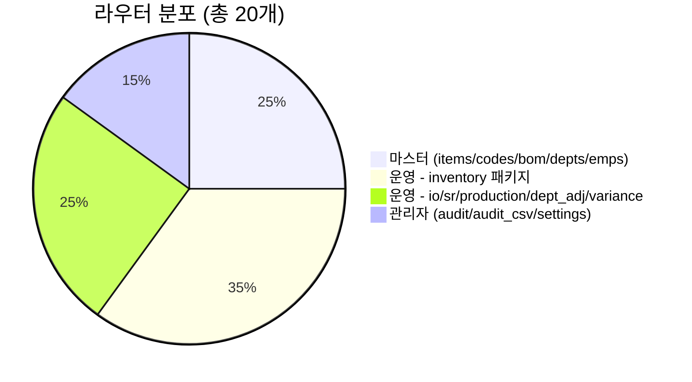

# 🎛 DEXCOWIN MES 컨트롤룸

> [!summary] 한 줄 요약
> **시스템 전체를 한 화면에서 조망한다.** 라우터 20개, 데스크탑 화면 5섹션, 가이드/시나리오 9건이 어디 있고 어떻게 묶여 있는지 — 여기서 다 시작한다.

> [!quote] 이 시스템의 정체
> 사용자가 Claude Code / Codex 로 바이브 코딩한 **DEXCOWIN MES**. 1년 2개월 차 IT 신입(비전공)이 인수받아 운영·확장한다. 공식명은 **DEXCOWIN MES** — 본문에서 절대 "ERP" / "X-Ray" 로 부르지 말 것 (단, `xray-erp`, `erp_code` 같은 내부 식별자는 의도적으로 보존).

---

## 🩺 시스템 헬스 한눈에

> [!info]+ 시스템 카운트 (2026-05-21)
> | 항목 | 수치 | 진입점 |
> |---|---|---|
> | 라우터 (`erp/backend/app/routers/`) | **20개** | [[backend/app/routers/routers\|라우터 목록]] |
> | 데스크탑 섹션 (`erp/frontend/app/legacy/_components/`) | **5섹션** (inventory · history · admin · warehouse · weekly-report) | [[frontend/app/legacy/legacy\|legacy 셸]] |
> | 운영 시나리오 | **4건** | [[_vault/guides/_guides\|guides/]] |
> | 신입 온보딩 가이드 | **5건** (신규) | 아래 "빠른 진입점" |
> | DB 엔진 | SQLite (단일 파일) | `erp/backend/data/` |
> | 백엔드 진입점 | `erp/backend/app/main.py` | uvicorn |
> | 프론트엔드 라이브 경로 | `erp/frontend/app/legacy` | (모바일은 별도 셸) |

> [!warning]+ 브랜치 정책
> `main` 은 **항상 vault-free**. `vault-sync` 만 `vault/` 를 포함한다. 코드와 노트가 다르면 — **무조건 코드가 진실**.

---

## 🚀 빠른 진입점 (신입 → 베테랑 순)

> [!info]+ 🆕 신입 첫 1주 — 비전공자용 (NEW)
> 바이브 코딩된 시스템을 처음 만지는 사람을 위해 새로 만든 5종 세트.
>
> | 순서 | 가이드 | 무엇 |
> |---|---|---|
> | 1 | [[_vault/guides/왜_이_시스템인가\|왜 이 시스템인가]] | 회사가 왜 MES 를 직접 만들었는지 |
> | 2 | [[_vault/guides/바이브_코딩_컨텍스트\|바이브 코딩 컨텍스트]] | Claude/Codex 로 만든 코드의 특징과 함정 |
> | 3 | [[_vault/guides/AI_생성_코드_읽는_법\|AI 생성 코드 읽는 법]] | 패턴/주석/네이밍 어떻게 해석할지 |
> | 4 | [[_vault/guides/위험지대_지도\|위험지대 지도]] | 건드리면 터지는 곳, 안 터지는 곳 |
> | 5 | [[_vault/guides/첫주_체크리스트\|첫주 체크리스트]] | 환경/계정/리뷰 체크리스트 |

> [!info]+ 🗺 시스템 전체 지도
> | 목적 | 바로가기 |
> |---|---|
> | 전체 MOC | [[_vault/guides/ERP_MOC\|MES MOC]] |
> | 용어 사전 | [[_vault/guides/용어사전\|용어사전]] |
> | 자주 막히는 질문 | [[_vault/guides/FAQ_전체\|FAQ 전체]] |
> | 처음 읽는 사람용 | [[_vault/guides/처음_읽는_사람\|처음 읽는 사람]] |
> | 시스템 캔버스 | [[_vault/dashboards/ERP_System_Map.canvas\|시스템 캔버스]] |

> [!example]+ 🎬 4대 운영 시나리오
> 실제 현장에서 일어나는 일을 코드/화면/라우터까지 따라가는 워크스루.
>
> | 시나리오 | 무엇 |
> |---|---|
> | [[_vault/guides/시나리오_품목등록\|품목 등록]] | 신규 품목을 시스템에 등록하기까지 |
> | [[_vault/guides/시나리오_재고입출고\|재고 입출고]] | 입고 → 분배 → 출고의 전체 흐름 |
> | [[_vault/guides/시나리오_생산배치\|생산 배치]] | BOM 기반 생산 묶음 처리 |
> | [[_vault/guides/시나리오_분해반품\|분해 / 반품]] | 역방향 흐름 (분해·반품·불량) |

---

## 🆕 최근 굵직한 변경 (2026-04-28 → 2026-05-21 · 3.5주치)

> [!quote]+ 변경 요약 (10건)
> 이 기간은 "**ERP → MES 이름 정리 + 죽은 코드 청소 + 불량 흐름 재설계**" 가 핵심이다.

| # | 날짜 | 카테고리 | 무엇 | 참고 |
|---|---|---|---|---|
| 1 | 2026-05-21 | 도메인 | **`items.item_code` 통합 + `ErpCode → ItemCode` 도메인 rename** | commit `f1ff96c` |
| 2 | 2026-05-21 | 설계 | **불량 처리 흐름 전면 재설계** (격리/폐기/반품/재작업 허브) | [[erp/docs/defect-handling-redesign\|defect-handling-redesign.md]] · commit `4d5861a` |
| 3 | 2026-05-21 | 운영 | **외부 PC 첫 실행 안정화** — `.gitattributes` + `start.bat` 사전 검사 | commit `fe1c1ba` |
| 4 | 2026-05-20 | 청소 | **죽은 거래 타입 5종 제거** — 입출고 내역 구분 라벨 정합 | commit `b792f7a` |
| 5 | 2026-05-20 | 청소 | **죽은 라우터 제거** — `queue` / `alerts` / `counts` / `loss` / `ship_packages` 흔적 완전 제거 | commit `7f73550`, `cab3e4f` |
| 6 | 2026-05-20 | 표기 | **ERP / erp → MES 표기 일괄 정리** (식별자 `erp_code`, `xray-erp` 는 의도 보존) | commit `214020e` |
| 7 | 2026-05-20 | 스키마 | **F4b 완료 — `UtcDatetime` 응답 스키마 전체 확산** (9h 오차 근본 수정) | commit `4db421a` |
| 8 | 2026-05-20 | UX | **입출고 내역 우측 카드 재정비** — Hero 통합, 좌측 톤 일관 | commit `f169579`, `5097913` |
| 9 | 2026-05-20 | UX | **모바일 UI/UX 전면 개편 머지** (대시보드/입출고/내역/주간보고 디자이너 검수 PASS) | commit `667eb67` |
| 10 | 2026-05-20 | 백엔드 | **inventory 패키지에 `weekly_report` 모듈 추가** + 모델 매트릭스 동적 매핑 | commit `e91f1fe` |

> [!tip] 죽은 라우터 5종은 **본문/문서/노트 어디에도 더 이상 등장하지 않는다.** 검색하다 나오면 그건 잔재 — 청소 대상.

---

## 🧭 레이어별 진입점

> [!info]+ 백엔드 (`erp/backend/`)
> | 항목 | 경로 | 메모 |
> |---|---|---|
> | 앱 엔트리 | `erp/backend/app/main.py` | FastAPI |
> | 라우터 | `erp/backend/app/routers/` | 아래 표 참조 |
> | 서비스 레이어 | `erp/backend/app/services/` | 비즈니스 로직 |
> | 모델 / 스키마 | `erp/backend/app/models.py`, `schemas/` | SQLAlchemy + Pydantic |
> | DB 부트스트랩 | `erp/backend/bootstrap_db.py` | `--all` 로 시드까지 |
> | DB 파일 | `erp/backend/data/` | SQLite |

> [!info]+ 프론트엔드 (`erp/frontend/`)
> | 항목 | 경로 | 메모 |
> |---|---|---|
> | 라이브 UI | `erp/frontend/app/legacy/` | **실제 운영 화면** |
> | 컴포넌트 | `erp/frontend/app/legacy/_components/` | 섹션별로 폴더 분리 |
> | 모바일 셸 | `erp/frontend/app/legacy/` (Mobile* 컴포넌트) | 2026-05-19 도입 |
> | API 클라이언트 | `erp/frontend/lib/api.ts` | 백엔드 호출 진입점 |

> [!info]+ 인프라 / 운영 (`erp/scripts/`, `erp/docker/`, `erp/.github/`)
> | 항목 | 경로 | 메모 |
> |---|---|---|
> | 운영 스크립트 | `erp/scripts/ops/` | 백업·복구·헬스체크·정합성 점검 |
> | 개발자 검증 | `erp/scripts/dev/verify_local.ps1` | commit/push 직전 필수 |
> | CI | `erp/.github/workflows/ci.yml` | 백엔드/프론트 동시 검증 |
> | 도커 | `erp/docker/` | 외부 PC 첫 실행용 자산 |

> [!info]+ 문서 / 데이터 (`erp/docs/`, `erp/data/`)
> | 항목 | 경로 | 메모 |
> |---|---|---|
> | 핵심 인수인계 | `erp/docs/AI_HANDOVER.md` | AI 가 쓴 인수인계 원본 |
> | 진행 기록 | `erp/docs/CODEX_PROGRESS.md` | Codex 단위 작업 로그 |
> | 코드 규칙 | `erp/docs/ITEM_CODE_RULES.md` | `item_code` 통합 이후 규칙 |
> | 불량 흐름 설계 | `erp/docs/defect-handling-redesign.md` | 2026-05-21 신규 |
> | 마스터 데이터 | `erp/backend/data/seed/` | 시드 자료 |

---

## 🛣 현재 라우터 목록 (실제 파일 기준)

> [!info]+ 최상위 라우터 (13개) — `erp/backend/app/routers/*.py`
> | # | 파일 | 도메인 |
> |---|---|---|
> | 1 | `admin_audit.py` | 관리자 감사 로그 |
> | 2 | `admin_audit_csv.py` | 감사 로그 CSV 미러 (외부 심사용) |
> | 3 | `bom.py` | BOM (자식·부모·미매칭 원자재) |
> | 4 | `codes.py` | 마스터 코드 |
> | 5 | `departments.py` | 부서 (생산부 산하 6라인 등) |
> | 6 | `dept_adjustment.py` | 부서 재고 조정 |
> | 7 | `employees.py` | 사원 |
> | 8 | `io.py` | 입출고 |
> | 9 | `items.py` | 품목 (`item_code` 통합 이후) |
> | 10 | `production.py` | 생산 배치 |
> | 11 | `settings.py` | 설정 |
> | 12 | `stock_requests.py` | 재고 요청 워크플로 |
> | 13 | `variance.py` | 재고 차이 분석 |

> [!info]+ 재고 패키지 (7개) — `erp/backend/app/routers/inventory/`
> 한때 단일 `inventory.py` 였으나 패키지로 쪼갬. 2026-05 시점에는 `weekly_report` 까지 추가됨.
>
> | # | 파일 | 역할 |
> |---|---|---|
> | 1 | `query.py` | 조회 (재고 현황) |
> | 2 | `transactions.py` | 거래 내역 |
> | 3 | `transfer.py` | 부서 간 이동 |
> | 4 | `receive.py` | 입고 |
> | 5 | `supplier.py` | 공급처 (반품 포함) |
> | 6 | `defective.py` | 불량 처리 (격리/폐기/반품/재작업) |
> | 7 | `weekly_report.py` | 주간 보고 (모델 매트릭스 동적 매핑) |
> | – | `_shared.py` | 패키지 내부 공용 헬퍼 |

> [!warning] 더 이상 존재하지 않는 라우터
> `queue` / `alerts` / `counts` / `loss` / `ship_packages` — 2026-05-20 일괄 제거 (commit `7f73550`). 코드/문서에서 발견되면 잔재이므로 청소 대상.

---

## 🖼 현재 화면 섹션 (실제 폴더 기준)

> [!info]+ `erp/frontend/app/legacy/_components/`
> | 섹션 | 디렉터리 | 핵심 컴포넌트 |
> |---|---|---|
> | 셸 / 공통 | `_components/` (루트) | `DesktopLegacyShell`, `DesktopSidebar`, `DesktopTopbar`, `DesktopRightPanel`, `DesktopPinLock` |
> | 인벤토리 | `_components/_inventory_sections/` | `DesktopInventoryView`, `InventoryItemsTable`, `InventoryDetailPanel`, `InventoryKpiPanel`, `InventoryCapacityPanel`, `InventoryActionRequired` |
> | 입출고 내역 | `_components/_history_sections/` | `DesktopHistoryView`, `HistoryTable`, `HistoryFilterBar`, `HistoryDetailPanel`, `HistoryCalendarPanel`, `TransactionEditUnifiedModal`, `BomBatchDetail` |
> | 창고 / 입출고 작업 | `_components/_warehouse_sections/` | `DesktopWarehouseView`, `DraftCartPanel`, `IoDraftWorkCard`, `DepartmentQueuePanel`, `MyRequestsPanel`, `WarehouseSectionTabs` |
> | 관리자 | `_components/_admin_sections/` | `DesktopAdminView`, `AdminSidebar`, `AdminEmployeesSection`, `AdminMasterItemsSection`, `AdminDepartmentsSection`, `AdminModelsSection`, `AdminAuditLogSection`, `AdminExportSection`, `AdminDangerZone` |
> | 관리자 / BOM 워크벤치 | `_admin_sections/_bom_workbench/` | `BomWorkbench`, `BomParentList`, `BomEditPanel`, `BomWhereUsedPanel`, `BomUnmatchedRawsDrawer`, `BomReviewModal` |
> | 주간 보고 | `_components/` (루트) | `DesktopWeeklyReportView` |
> | 모바일 | `_components/` (Mobile* 접두) | 2026-05-19 신규 — 대시보드/입출고/내역/주간보고 4화면 머지 완료 |
> | 모달 / 유틸 | `_components/` (루트) | `BarcodeScannerModal`, `CapacityDetailModal`, `ItemDetailSheet`, `PinLock`, `ThemeToggle`, `FilterPills`, `SelectedItemsPanel` |

> [!warning] `_archive/` 안의 컴포넌트 (`DeptIOTab`, `HistoryTab`, `InventoryTab`, `WarehouseIOTab`)
> 옛 탭형 UI 의 잔재. **건드리지 말 것.** `CLAUDE.md` 의 archive 규칙을 따른다.

---

## 🚨 위험지대 한눈에

> [!warning]+ 건드리면 터지는 영역 — 자세한 건 [[_vault/guides/위험지대_지도\|위험지대 지도]] 로 위임
> | 영역 | 왜 위험한가 |
> |---|---|
> | `erp/backend/app/models.py` 의 enum (`TransactionType`, `LocationStatus`) | 5종 죽은 enum 청소 직후 — 잘못 추가하면 또 잔재 양산 |
> | `erp/backend/app/routers/inventory/` 트랜잭션 흐름 | 불량 흐름 재설계가 진행 중. PR 전 [[erp/docs/defect-handling-redesign\|설계 문서]] 먼저 |
> | `UtcDatetime` 응답 스키마 (F4b) | 9시간 오차 근본 수정. 새 응답 추가 시 반드시 `UtcDatetime` 사용 |
> | `items.item_code` 통합 (`ErpCode → ItemCode`) | 도메인 식별자명 변경. 새 코드는 `ItemCode` 만 사용 |
> | `_archive/` · `_attic/` · `_backup/` | **수정 금지**. `CLAUDE.md` 의 archive 규칙 |
> | `main` 브랜치 vault 파일 | `main` 은 vault-free. `vault-sync` 에서만 작업 |
> | DB 시작 시 변경 | 서버 기동만으로 DB 가 바뀌면 안 됨. 마이그레이션은 `bootstrap_db.py --all` 로 명시적으로 |

---

## ⚡ 자주 쓰는 명령

> [!tip]+ 백엔드
> ```bash
> cd erp/backend
> python -m uvicorn app.main:app --reload
> ```

> [!tip]+ DB 부트스트랩 (스키마/시드 변경 시)
> ```bash
> cd erp/backend
> python bootstrap_db.py --all
> ```
> 영향이 큰 작업이므로 **실행 전에 무엇이 바뀌는지 먼저 설명** 하는 게 원칙.

> [!tip]+ commit / push 직전 로컬 검증
> ```powershell
> powershell -ExecutionPolicy Bypass -File .\scripts\dev\verify_local.ps1
> ```
> GitHub CI 실패를 줄이기 위한 사전 검증. **자동 commit/push 금지** — 사용자가 명시적으로 요청할 때만.

> [!tip]+ 외부 PC 첫 실행 (2026-05-21 신규)
> 윈도우 다른 PC 에서 처음 받았을 때:
> 1. `.gitattributes` 가 줄바꿈을 잡아 줌 (CRLF/LF 이슈 사라짐)
> 2. `start.bat` 이 파이썬·node 버전을 사전 검사하고 친절히 안내

---

## 🗺 시스템 캔버스

> [!info] 보드로 보기
> [[_vault/dashboards/ERP_System_Map.canvas|시스템 캔버스]] — Obsidian Canvas 로 라우터·화면·도메인을 시각화한 보드. 노트와 노트 사이의 거리를 한눈에 본다.

---

## 🔁 도메인 의존 관계 (mermaid)

```mermaid
flowchart LR
    subgraph 마스터[마스터 데이터]
        items[items.py<br/>품목]
        codes[codes.py<br/>마스터 코드]
        departments[departments.py<br/>부서/라인]
        employees[employees.py<br/>사원]
        bom[bom.py<br/>BOM]
    end

    subgraph 운영[운영 흐름]
        io[io.py<br/>입출고]
        sr[stock_requests.py<br/>재고 요청]
        production[production.py<br/>생산 배치]
        inv_q[inventory/query.py]
        inv_tx[inventory/transactions.py]
        inv_tr[inventory/transfer.py]
        inv_rc[inventory/receive.py]
        inv_sp[inventory/supplier.py]
        inv_df[inventory/defective.py]
        inv_wk[inventory/weekly_report.py]
        dept_adj[dept_adjustment.py]
        variance[variance.py]
    end

    subgraph 관리[관리자]
        audit[admin_audit.py]
        audit_csv[admin_audit_csv.py]
        settings[settings.py]
    end

    items --> bom
    items --> inv_q
    items --> io
    departments --> sr
    departments --> inv_tr
# ... (이하 17줄 생략. 원본 참조)

```

> [!tip] 위 다이어그램의 정확성은 코드가 진실. 의심되면 `erp/backend/app/routers/` 글로브로 다시 확인할 것.

---

## 📌 Active Notes

```dataview
TABLE layer AS "Layer", type AS "Type", source_path AS "Source"
FROM ""
WHERE project = "DEXCOWIN MES" AND status = "active"
SORT layer ASC, file.name ASC
LIMIT 80
```

> [!info] 위 쿼리에 안 잡히는 노트는 frontmatter 의 `project: DEXCOWIN MES` 가 아닐 가능성. 옛 `project: ERP` 표기가 남아 있을 수 있음 — 보일 때마다 정리.

---

## 🧪 검증 / 로컬 체크 흐름

> [!example]+ commit → push 전 권장 시퀀스
> 1. **변경 의도 정리** — "왜 이 줄을 바꾸나" 한 줄
> 2. **`verify_local.ps1` 실행** — 백엔드/프론트 검증 한 번에
> 3. **DB 변경이 있다면** `bootstrap_db.py --all` 의 영향부터 설명 (자동 실행 금지)
> 4. **commit 메시지** 는 한국어, 분류 prefix 사용 (예: `refactor:`, `chore:`, `backend:`, `desktop:`, `mobile:`, `docs:`, `data:`)
> 5. **현재 세션 변경만 commit** — 다른 미커밋 변경은 건드리지 않는다
> 6. push 는 **명시적 요청이 있을 때만** — 자동 push 절대 금지

> [!warning]+ 자동화 금지 사항 (CLAUDE.md 발췌)
> - 사용자가 명시하지 않은 commit/push 금지
> - `_archive/` / `_backup/` / `frontend/_archive/` 수정 금지
> - `_attic/` 캐주얼 수정 금지 (자료/백업/작업노트)
> - 큰 폴더 이동·리네임 금지 (요청 시에만)
> - 레거시 식별자 `xray-erp`, `erp_code` 리네임 금지 (의도 보존)
> - 샘플 데이터 ↔ 실데이터 혼합 금지

---

## 🔬 코드 ↔ 노트 동기화 메모

> [!quote]+ "코드와 노트가 다르면 코드가 진실"
> 이 대시보드는 다음 명령으로 항상 검증 가능하다.
>
> ```bash
> # 라우터 실제 목록
> ls erp/backend/app/routers/*.py
> ls erp/backend/app/routers/inventory/*.py
>
> # 화면 섹션 폴더
> ls erp/frontend/app/legacy/_components/_*_sections/
>
> # 최근 변경 흐름
> git log --oneline --since=2026-04-28
> ```
>
> 위 결과와 본 대시보드가 어긋나면 — **대시보드를 갱신할 것**, 코드를 거꾸로 맞추지 말 것.

> [!info]+ 다음 갱신 트리거
> | 트리거 | 갱신해야 할 섹션 |
> |---|---|
> | 라우터 추가/삭제 | 🛣 현재 라우터 목록, 🔁 mermaid |
> | `_components/*_sections/` 폴더 추가 | 🖼 현재 화면 섹션 |
> | 가이드 신규 작성 | 🚀 빠른 진입점 |
> | 굵직한 PR 머지 | 🆕 최근 굵직한 변경 |
> | `CLAUDE.md` 갱신 | ⚡ 자주 쓰는 명령, 🧪 검증 흐름 |

---

## 📊 도메인 카운트 보조 다이어그램



> [!tip] 분포가 한쪽으로 쏠리면 — 도메인 분할을 고려할 때. 현재는 운영(12) / 마스터(5) / 관리자(3) 로 합리적 분포.

> [!info]+ 화면 섹션 분포
> - **5섹션** (inventory / history / warehouse / admin / weekly-report) + 모바일 셸
> - admin 안에 BOM 워크벤치가 추가로 패키징 — 가장 무거운 단일 영역
> - 옛 탭형 (`_archive/*Tab.tsx`) 는 잔재이므로 카운트에서 제외

---

## 🧷 Up / 관련

- Up: [[_vault/dashboards/_dashboards]]
- 같은 레이어: [[_vault/dashboards/ERP_System_Map.canvas|시스템 캔버스]]
- 시작점: [[_vault/guides/처음_읽는_사람]]
- 신입 1주: [[_vault/guides/첫주_체크리스트]]
- MOC: [[_vault/guides/ERP_MOC|MES MOC]]
- 용어: [[_vault/guides/용어사전]]
- FAQ: [[_vault/guides/FAQ_전체]]
- 위험지대: [[_vault/guides/위험지대_지도]]
- 바이브 코딩 컨텍스트: [[_vault/guides/바이브_코딩_컨텍스트]]
- AI 생성 코드 읽는 법: [[_vault/guides/AI_생성_코드_읽는_법]]
- 왜 이 시스템인가: [[_vault/guides/왜_이_시스템인가]]
