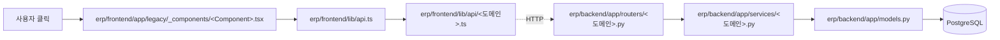
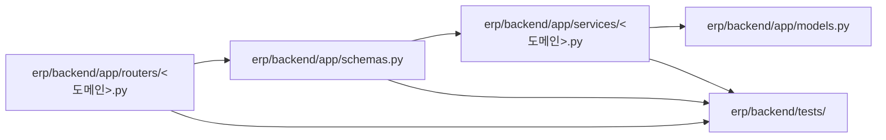
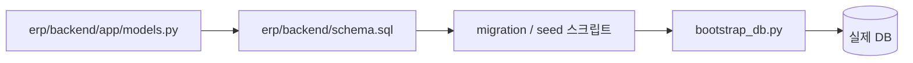

# 🧭 AI 가 짠 코드 읽는 법

> [!summary] 한 줄 결론
> **AI 가 짠 코드를 읽는다는 건, 의도가 적힌 곳을 먼저 찾는 일이다.**
> 코드 안에 주석이 거의 없는 건 게으름이 아니라 정책이다. 의도는 다른 곳에 있다.

---

## 0. 이 문서를 읽기 전에

이 시스템(DEXCOWIN MES)은 평범한 사람이 손으로 한 줄 한 줄 짠 코드가 **아니다**.
**Claude Code / Codex 같은 AI 도구로 "바이브 코딩"** 한 결과물이다.
즉, 다음 특성이 있다:

- **주석이 적다** — 일부러 그렇게 만들었다 (뒤에서 설명)
- **같은 일을 하는 함수가 2~3개일 수 있다** — 통합(consolidation) 안 된 잔재
- **한 PR 안에서 스타일이 흔들릴 수 있다** — AI 가 컨텍스트를 잃은 흔적
- **죽은 코드(dead code)가 남아 있을 수 있다** — 라우터가 사라졌어도 vault 노트엔 잔재
- **변수명/함수명이 무겁다** — 주석이 없는 대신 이름이 길고 설명적

이 가이드는 그런 코드를 **헤매지 않고 안전하게 읽는 법**을 알려준다.

> [!tip] 대상 독자
> 1년 2개월 IT 경력의 비전공자 신입. 인수인계 첫 주를 막 시작한 당신.

---

## 1. 왜 주석이 적은가 — 의도된 정책

이 프로젝트는 명시적으로 **"주석은 기본적으로 쓰지 않는다"** 를 채택했다.
`CLAUDE.md` 에 그 이유가 적혀 있다.

> [!quote] CLAUDE.md 의 원칙 요약
> - **Simplicity First** — 요청받지 않은 추상화, 설명, 유연성은 코드에 넣지 않는다.
> - **Surgical Changes** — 건드릴 곳만 건드린다. 옆에 있는 코드를 "개선" 하지 않는다.
> - **Match existing style** — 기존 스타일을 따른다. 자기 취향대로 다시 안 쓴다.

여기서 자연스럽게 따라오는 결과:

| 항목 | 이 프로젝트 방식 | 학교/책에서 배운 방식 |
|---|---|---|
| 함수 의미 전달 | **함수명/변수명**에 담는다 | 주석으로 설명한다 |
| 왜 이렇게 짰는지 | **commit 메시지 / plans / docs** | 코드 상단 주석 |
| 임시 메모 | **TODO 코멘트 최소화**, plans 노트에 기록 | 코드 안에 TODO |
| 데드 코드 처리 | 보이면 별도로 말한다 (혼자 지우지 않음) | 발견 즉시 정리 |

> [!warning] "왜 주석이 없냐"고 화내지 말 것
> **주석이 잡음(noise)이 되는 경우가 많기 때문**이다. 코드가 바뀌면 주석은 거짓말이 된다.
> 대신 의도는 코드 바깥(plans, docs, git log)에 더 잘 보관돼 있다.

---

## 2. 의도를 찾는 우선순위 — "어디부터 볼까?"

코드를 읽다 막혔을 때 **이 순서로** 정보를 찾는다. 위에서 아래로.

| 순위 | 어디 보나 | 무엇을 알 수 있나 |
|---|---|---|
| 1 | **실제 코드** (변수명/함수명) | 지금 무엇을 하는지 |
| 2 | **`erp/plans/`** | 누가 어떤 의도로 작업했는지 (작업 단위) |
| 3 | **`erp/docs/`** | 설계 결정, 흐름도, 운영 문서 |
| 4 | **`erp/CLAUDE.md`** | 프로젝트 규칙 (스타일/금지사항) |
| 5 | **vault 노트** (이 가이드 자체) | 도메인 설명, 시나리오, 용어 |
| 6 | **git log** | 언제·왜 그 라인이 들어왔는지 |

> [!example] 우선순위 적용 예시
> "왜 `Item.item_code` 가 4파트(`376-TR-0012-BG`)로 쪼개져 있지?"
> 1. 코드: `erp/backend/app/utils/item_code.py` 상단 docstring 에 형식 명세 있음 → ✅ 여기서 끝.
> 2. 그래도 모르겠으면 `erp/plans/` 에서 "item_code" grep
> 3. git log 에서 `f1ff96c chore: items.item_code 통합 + ErpCode → ItemCode 도메인 rename` 확인

---

## 3. 3대 추적 동선 — "이 화면 만지면 어디까지 영향 가지?"

가장 자주 마주칠 세 가지 흐름이다. 머릿속에 이 그림이 박혀 있으면 안 헤맨다.

### 3-1. 화면 변경 흐름 (사용자가 버튼 눌렀을 때)



> [!tip] 이 흐름이 왜 중요한가
> 화면에서 "재고 수량이 안 맞아요" 라는 버그 리포트가 오면, 위 다이어그램의 **어느 단계든** 범인일 수 있다.
> 동선을 모르면 디버깅이 운빨이 된다.

**시작점 예시 — `erp/frontend/lib/api.ts`**

```typescript
// R5-5: 도메인별 API 분리 시작 (items).
import { itemsApi } from "./api/items";
// R6-D1: inventory 도메인 분리.
import { inventoryApi } from "./api/inventory";
// R6-D7: production / transactions / exports 도메인 분리.
import { productionApi } from "./api/production";
```

→ `api.ts` 는 얇은 **재수출(re-export)** 레이어다. 실제 함수는 `erp/frontend/lib/api/<도메인>.ts` 안에 있다.
**이름이 헷갈리면 도메인 파일까지 한 번 더 들어간다.**

### 3-2. API 변경 흐름 (백엔드 엔드포인트 추가/수정)



| 레이어 | 역할 | 보통 무엇이 들어가나 |
|---|---|---|
| `routers/` | HTTP 입출구 | URL 정의, 권한, 입력 검증 호출 |
| `schemas.py` | Pydantic DTO | 요청/응답 모양 |
| `services/` | 도메인 로직 | "재고 차감 어떻게 할지" 같은 진짜 일 |
| `models.py` | SQLAlchemy ORM | DB 테이블 정의 |
| `tests/` | 검증 | 단위/통합 테스트 |

> [!warning] 라우터에 비즈니스 로직 넣지 말 것
> AI 가 가끔 라우터 안에서 직접 DB 쿼리를 짤 때가 있다. 그게 보이면 **services/** 로 옮겨야 할 후보다.
> 단, 혼자 리팩토링 시작하기 전에 **CLAUDE.md 의 "Surgical Changes" 원칙**을 떠올리자.

### 3-3. DB 변경 흐름 (스키마 건드릴 때)



> [!danger] DB 변경은 가장 위험하다
> - `CLAUDE.md` 가 못 박는다: **"Starting the server must not change the DB."**
> - DB 바꾸는 작업은 반드시 **영향 먼저 설명** → 동의 받고 진행.
> - 셋업/스키마/마이그레이션/시드는 `python bootstrap_db.py --all` 로만.

---

## 4. 막혔을 때 길찾기 체크리스트

상황별로 어떤 도구를 쓸지 표로 정리.

| 증상 | 첫 번째 도구 | 두 번째 도구 |
|---|---|---|
| 변수/함수가 어디서 왔는지 모를 때 | `git grep <name>` | IDE "Go to Definition" |
| "왜 이렇게 됐지?" 라는 의문 | `git log -p <file>` | `git blame <file>` |
| "이거 죽은 코드인가?" | import/export 역추적 grep | [[위험지대_지도]] 확인 |
| 디자인 의도/맥락 모르겠음 | `erp/plans/` grep | `erp/docs/` grep |
| 도메인 용어가 헷갈림 | [[용어사전]] | [[처음_읽는_사람]] |
| 화면이 어느 파일인지 모름 | `erp/frontend/app/legacy/` 트리 확인 | 컴포넌트 이름으로 grep |

### 4-1. 자주 쓰는 명령 모음

```bash
# 함수/변수 이름으로 전체 검색
git -C erp grep -n "make_item_code"

# 특정 파일의 변경 이력 보기 (왜 이 코드가 들어왔는지)
git -C erp log -p backend/app/utils/item_code.py

# 특정 라인이 누가/언제 작성한 것인지
git -C erp blame backend/app/models.py

# 최근 30개 커밋만 훑어보기
git -C erp log --oneline -n 30
```

> [!tip] commit 메시지가 의외로 잘 적혀있다
> 이 프로젝트는 commit 메시지 첫 줄에 `chore:`, `feat:`, `refactor:`, `docs:` 같은 **prefix + 한국어 요약**이 붙는다.
> 즉, `git log --oneline` 만 봐도 변경의 "성격"을 빠르게 파악할 수 있다.

---

## 5. AI 코드의 흔한 함정 5가지

> [!warning] 이걸 모르면 똑같은 함수를 세 번째로 또 만들게 된다

### ① 같은 일을 하는 함수가 2~3개 있다

AI 는 컨텍스트 윈도우가 유한해서 **이미 있는 함수를 못 보고** 같은 일을 또 짤 때가 있다.
새 함수 만들기 전에 항상:

```bash
git grep -n "함수가_할만한_일_키워드"
```

특히 `erp/backend/app/services/` 와 `erp/frontend/lib/api/` 에서 **유사 함수 중복**이 자주 보인다.

### ② 이름이 헷갈리는 식별자 — `ItemCode` vs `ErpCode`

> [!example] 실제 사례
> `f1ff96c chore: items.item_code 통합 + ErpCode → ItemCode 도메인 rename`
> - **`ItemCode`** = 현재 정식 이름 (4파트 코드 `376-TR-0012-BG`)
> - **`ErpCode`** = legacy 이름. 코드 안 일부에 잔재 있을 수 있음.
>
> 둘이 같은 걸 가리킨다. legacy 쪽이 보이면 **건들지 말고 보고** (`CLAUDE.md` 의 "legacy 식별자 보존" 규칙).

### ③ 한 PR 안에서도 스타일 일관성이 흔들린다

- 한 파일에선 `async/await` 쓰는데 옆 파일에선 `.then()` 쓰는 식.
- 한 라우터는 `services/` 거치는데 옆 라우터는 직접 DB 찌르는 식.
- → **고치고 싶어도 참자**. "Surgical Changes" 원칙. 별도 이슈로 빼서 따로 처리.

### ④ 죽은 코드가 남아 있다

> [!example] 실제 잔재 사례
> `queue` / `alerts` / `counts` / `loss` / `ship_packages` 라우터는 이미 삭제됐다.
> 하지만 **vault 노트나 docs** 에는 여전히 언급이 남아 있을 수 있다.
> → "vault 가 거짓말일 수 있다"는 걸 항상 의심.
> → `CLAUDE.md` 의 **"If docs and live code disagree, trust the live code"** 를 기억.

### ⑤ 주석이 거짓말일 수 있다

코드만 수정되고 옆 주석은 그대로 남는 경우. 신뢰 순서:

```text
실제 코드 동작 > 변수/함수명 > git log > 주석
```

주석을 보조로만 쓰자.

---

## 6. 수정 전 체크리스트

코드를 한 글자라도 바꾸기 전에 **이 순서**를 돌린다. ([[위험지대_지도]] 와 같이 보면 좋다)

> [!example] 수정 전 5단계
> 1. **`git status`** — 지금 워킹트리가 깨끗한가? 다른 사람 미커밋 변경 섞이지 않았나?
> 2. **`git log --oneline -n 10`** — 최근에 누가 뭘 바꿨나? 내가 만질 영역과 충돌하나?
> 3. **3대 추적 동선** — 이 변경이 화면/API/DB 중 어디에 어떻게 영향 가지?
> 4. **`verify_local.ps1` 베이스라인** — 손대기 전에 일단 통과하는지 확인. 아니면 내 변경이 깨뜨린 게 아니다.
> 5. **`git grep`** 으로 중복 함수 확인 — 같은 일을 이미 누가 해놨는지.

### 6-1. verify 명령

```powershell
powershell -ExecutionPolicy Bypass -File .\scripts\dev\verify_local.ps1
```

> [!tip] 베이스라인 통과 확인의 의미
> 수정 **전에** 한 번 돌리고, 수정 **후에** 또 한 번 돌린다. 그래야 "내가 깨뜨린 건지" 명확해진다.
> AI 가 짠 코드는 워낙 손이 많이 갔으므로, **변경 전 상태를 기록**하는 습관이 중요하다.

---

## 7. 도구별 용도 정리

| 도구/명령 | 언제 쓰나 | 한 줄 예시 |
|---|---|---|
| `git grep` | 이름으로 코드 위치 찾기 | `git grep -n "make_item_code"` |
| `git log -p <file>` | 그 파일이 어떻게 변해왔나 | `git log -p backend/app/models.py` |
| `git blame <file>` | 특정 라인 누가 언제 썼나 | `git blame backend/app/routers/items.py` |
| `git log --oneline` | 최근 변경 흐름 요약 | `git log --oneline -n 30` |
| Obsidian wiki-link | vault 안에서 노트 이동 | `[[처음_읽는_사람]]` |
| IDE "Find References" | 함수가 어디서 호출되나 | (VSCode/PyCharm) |
| Obsidian Graph view | 노트 연결 구조 시각화 | Obsidian 좌측 패널 |

---

## 8. 실전 예시 — `Item.item_code` 따라가보기

> [!example] 미니 시뮬레이션
> 가정: "품목 코드 자동 생성 로직이 이상해요" 라는 버그 리포트가 들어왔다고 치자.

**Step 1. 코드 위치 찾기**

```bash
git -C erp grep -n "make_item_code"
```

→ `erp/backend/app/utils/item_code.py` 와 `erp/backend/app/routers/items.py` 가 잡힌다.

**Step 2. 의도 읽기**

`erp/backend/app/utils/item_code.py` 상단 docstring 발췌:

```python
"""4-part 품목 코드 utilities: parse, format, validate, generate.

Code format: [제품기호]-[구분코드]-[일련번호]-[옵션코드]

Examples
    376-TR-0012-BG   (raw material shared across DX3000, COCOON, ADX6000FB)
    3-PA-0012-WM     (DX3000 finished good, white matte)
"""
```

→ 주석이 적다고 했지만, 이렇게 **도메인 형식 명세**는 모듈 docstring 에 남겨두기도 한다.

**Step 3. 라우터 흐름 확인**

`erp/backend/app/routers/items.py` 상단:

```python
from app.utils.item_code import make_item_code, next_serial_no, slots_to_model_symbol
```

→ 라우터가 utils 를 호출. 비즈니스 로직이 utils 에 있다.

**Step 4. git log 로 맥락 확인**

```bash
git -C erp log --oneline -- backend/app/utils/item_code.py
```

→ `f1ff96c chore: items.item_code 통합 + ErpCode → ItemCode 도메인 rename` 같은 commit 이 보임.

**Step 5. 영향 범위 추정 — 3대 동선 적용**

- 화면: `erp/frontend/app/legacy/_components/` 중 품목 등록 폼
- API: `erp/backend/app/routers/items.py`
- DB: `erp/backend/app/models.py` 의 `Item` 테이블

→ 이제 어디를 더 봐야 할지 그림이 잡힌다.

> [!success] 핵심
> **5단계 안에 도메인 절반이 머릿속에 들어온다.** 처음엔 느리지만 곧 익숙해진다.

---

## 8-A. 보너스 — `services/` 한 겹 더 들여다보기

위 시뮬레이션의 연장. **services 레이어**는 도메인 로직의 심장이다. AI 가 짠 코드라도 이 레이어 안에선 의도가 비교적 정직하게 드러난다.

> [!example] `erp/backend/app/services/codes.py` 발췌 의도 읽기
> 모듈 시작부 docstring 만 봐도 도메인 규칙이 다 정리돼 있다.

```python
"""4-part 품목 코드 utilities: parse, format, validate, generate.

Rules
    - Symbol is a non-empty string composed of single-slot digits.
    - For PA (최종 완제품) and AA (최종 조립체), symbol MUST be a single slot.
    - Process type is always exactly 2 characters.
    - Serial is a zero-padded integer (default width 4).
    - Option is exactly 2 characters from option_codes.code, or empty/None.
"""
```

이 5줄짜리 규칙 묶음이 곧 **도메인 명세**다. 함수 본문보다 이 docstring 을 먼저 읽어야 함수가 이해된다.

### services 레이어 읽기 순서

1. **모듈 docstring** — 도메인 규칙 한 페이지 요약
2. **dataclass / TypedDict 선언** — DTO 모양
3. **public 함수 시그니처만 훑기** — 무엇을 외부에 노출하나
4. **private (`_` 접두사) 함수는 마지막** — 구현 세부

> [!tip] 함수 본문은 마지막에 본다
> 처음부터 본문을 한 줄씩 읽으면 길을 잃는다. **선언만 먼저 훑고**, 본문은 디버깅할 때만 깊이 들어간다.

---

## 9. 자주 묻는 질문

> [!question] Q1. 주석이 진짜 한 줄도 없어요?
> A. 완전히 없진 않다. **모듈 docstring**, **복잡한 비즈니스 로직 옆 짧은 주석**, **TODO 가 아닌 "WHY" 주석**은 살아 있다.
> 예: `backend/app/utils/item_code.py` 의 형식 명세, `models.py` 의 `BoolAsString` TypeDecorator 설명.

> [!question] Q2. AI 가 짠 코드라 믿어도 되나요?
> A. **테스트와 검증을 신뢰**하자. 코드 자체보다 `erp/backend/tests/` 와 `verify_local.ps1` 결과가 더 진실에 가깝다.

> [!question] Q3. 같은 함수 중복 발견하면 바로 합쳐도 되나요?
> A. **No.** `CLAUDE.md` 가 명확하다: **"Do not perform large refactors unless explicitly asked."**
> 발견 → 노트에 기록 → 사용자에게 보고 → 지시 받은 후 진행.

> [!question] Q4. 죽은 코드 같은데 지워도 되나요?
> A. **혼자 지우지 말 것.** `CLAUDE.md`: **"If you notice unrelated dead code, mention it - don't delete it."**
> [[위험지대_지도]] 에 추가하거나, plans 노트에 후보로 남기는 게 안전하다.

---

## 10. 추가로 읽을 것

- [[처음_읽는_사람]] — 인수인계 첫날 안내서
- [[바이브_코딩_컨텍스트]] — 이 시스템이 어떻게 만들어졌는지의 배경
- [[위험지대_지도]] — 함부로 손대면 안 되는 영역 지도
- [[용어사전]] — 도메인 용어와 legacy 이름 매핑
- [[첫주_체크리스트]] — 첫 일주일 할 일 순서

---

## 11. 마지막 한 마디

> [!summary] 다시 강조
> - **주석이 적은 건 정책**이다. 의도는 다른 곳에 있다.
> - **이름·plans·docs·git log** 순서로 의도를 추적한다.
> - **3대 동선**(화면·API·DB)을 머릿속에 박아두면 안 헤맨다.
> - **수정 전 5단계 체크리스트**를 습관화하면 사고가 줄어든다.
> - **혼자 정리하지 말 것** — 발견은 좋지만 정리는 지시 받고.

이걸 알면 한 달 만에도 도메인이 잡힌다. 모르면 1년 가도 헤맨다.

Up: [[_vault/guides/_guides]]

#layer/meta #topic/navigation #topic/ai-code
