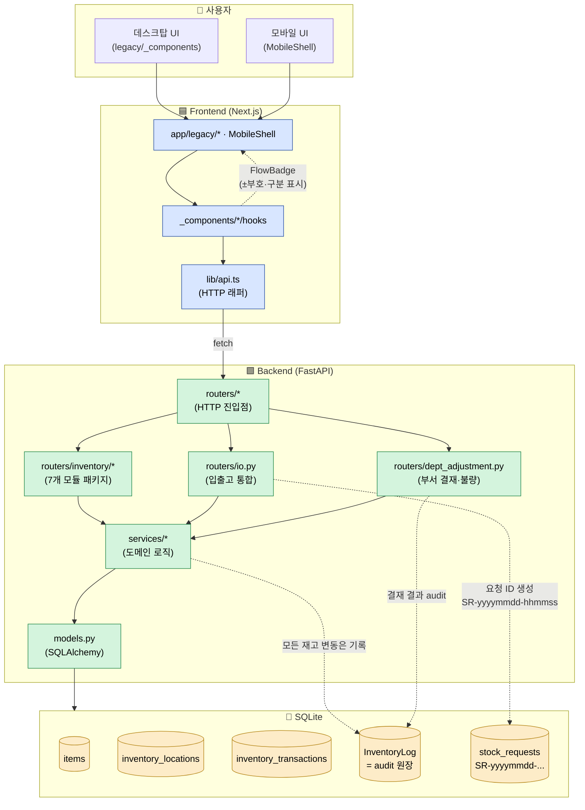

# 🗺 DEXCOWIN MES MOC

> [!summary] 이 문서의 역할
> **DEXCOWIN MES** 는 데스크원에서 자체 구축한 내부 운영 시스템이다(공식 명칭은 MES 이며, 사내 문서·과거 커밋에 "ERP" 표기가 남아 있어도 같은 시스템을 가리킨다).
> 이 문서는 "**재고 보려면 어디?**", "**부서 결재 코드는 어디?**", "**대시보드는?**" 같은 질문을 받았을 때 **한 클릭 안에 정답 노트**로 보내주는 **지도(Map of Content)** 다.
>
> 신입(IT 경력 1년 2개월, 비전공 출신) 기준으로, 첫 출근 일주일 안에 "어느 노트를 펴면 어디로 이어지는지"가 머릿속에 그려지도록 설계했다.

> [!info] 읽기 전 약속
> - **실제 수정은 항상 원본 코드(`erp/backend`, `erp/frontend`, `erp/scripts`, `erp/docs`)에서** 한다. Vault 노트는 설명·탐색용이다.
> - 문서와 코드가 어긋나면 **코드를 진실**로 친다.
> - 경로는 항상 `erp/...` 로 표기한다. 절대 경로(`C:\...`)는 쓰지 않는다.
> - `_attic/` 안의 모든 폴더(옛 `_archive/`, `_backup/`, `frontend/_archive/` 가 모두 이 안으로 통합됐다)는 명시 지시 없이 건드리지 않는다. `_attic/.obsidian/` 등 옵시디언 설정도 보호 영역.

---

## 🚪 0. 시작점: 처음 펴는 7개 문서

> [!tip] 입사 첫주 신입에게 권하는 읽기 순서
> 위에서 아래로, 한 노트 30분 안에 훑어볼 수 있는 분량이다. **5번까지만 읽어도 "왜 이렇게 짜여 있는지"는 잡힌다.**

| 순서 | 노트 | 무엇을 얻나 |
|---:|---|---|
| 1 | [[_vault/guides/처음_읽는_사람]] | "이 Vault 가 뭐고 어디서부터 봐야 하나" — 첫날 안내서 |
| 2 | [[왜_이_시스템인가]] | 왜 SAP·더존을 안 쓰고 자체 MES 를 만들었나 — 의사결정 맥락 |
| 3 | [[AI_생성_코드_읽는_법]] | Claude·Codex 가 작성한 코드를 신입이 안전하게 읽고 손대는 법 |
| 4 | [[바이브_코딩_컨텍스트]] | 이 프로젝트의 작업 스타일(짧은 PR·인터뷰 우선·검증 루프) |
| 5 | [[위험지대_지도]] | 절대 건드리면 안 되는 곳·건드릴 때 반드시 확인할 곳 |
| 6 | [[첫주_체크리스트]] | 첫주 동안 손으로 확인해야 할 30개 항목 |
| 7 | [[_vault/guides/ERP_MOC]] | (지금 이 문서) — 머릿속에 지도를 박는 마지막 단계 |

> [!example] 신입이 자주 하는 질문 → 어디로 가나
> - "재고 수량 계산이 어디서 되는지?" → §2.2 재고 입출고
> - "불량 격리 결재는 누가 어떻게?" → §2.3 부서 결재 / 불량 처리
> - "품목코드 규칙은?" → §2.1 품목 마스터 → [[docs/ITEM_CODE_RULES.md.md]]
> - "백업 한 번 돌려보고 싶음" → §2.5 운영 → [[scripts/ops/ops]]
> - "AI 가 짠 코드인데 무서움" → [[AI_생성_코드_읽는_법]]

---

## 🧭 1. 시스템 전체 흐름

> [!info] 이 그림 한 장만 이해하면, 어느 화면을 봐도 "지금 어느 레이어인지" 가 보인다.



> [!tip] 다이어그램 읽는 법 (핵심 4가지)
> 1. **InventoryLog (audit)**: 모든 재고 변동(입고·출고·이동·격리·폐기·분해) 은 트랜잭션과 함께 **감사 로그**가 같이 남는다. CSV 미러는 [[backend/app/routers/admin_audit.py.md|admin_audit]] / `admin_audit_csv.py` 에서 만든다.
> 2. **SR-yyyymmdd-hhmmss**: 입출고 요청 ID 접두사. `io.py` 에서 생성되며, 화면 어디서나 이 ID 로 한 건을 끝까지 추적할 수 있다.
> 3. **FlowBadge**: 입출고 내역/BOM/단품 chip 모두 같은 규칙(`min-w-6.5rem · px-3 py-1 · text-xs`)으로 ± 부호와 구분을 한 알약(pill)으로 표시한다.
> 4. **부서 결재 (dept_adjustment)**: 격리·복귀는 즉시 처리, **폐기/공급처 반품/분해**는 결재가 필요하다. 결재 권한은 생산부장 OR 창고장.

---

## 🏷 2. 도메인별 진입점

> [!toc] 도메인 6개
> 2.1 품목 마스터 (ItemCode · BOM)
> 2.2 재고 입출고
> 2.3 부서 결재 / 불량 처리
> 2.4 생산 배치
> 2.5 운영 (백업 · 복구 · CI)
> 2.6 감사 / CSV 미러

---

### 2.1 품목 마스터 (ItemCode · BOM)

> [!summary] 한 줄 요약
> 모든 화면이 참조하는 **품목 기준**. `items.item_code` 가 단일 식별자다(과거 `erp_code` 는 도메인 식별자로 보존되나, 컬럼명은 `item_code` 로 통일됨).

| 항목 | 진입점 |
|---|---|
| 코드 규칙 | [[docs/ITEM_CODE_RULES.md.md]] |
| 백엔드 라우터 | [[backend/app/routers/items.py.md]] |
| BOM 라우터 | [[backend/app/routers/bom.py.md]] |
| 시리얼 카테고리 | [[backend/app/routers/codes.py.md]] |
| 데이터 모델 | [[backend/app/models.py.md]] |
| 시나리오 | [[_vault/guides/시나리오_품목등록]] |
| 용어 | [[_vault/guides/용어사전]] |

> [!info] 2026-05-20 변경
> 품목 추가 시 `erp_code` 시리얼 카테고리가 **전역 스코프**가 되고, `sort_order` 가 자동 부여된다. 신입이 품목을 손으로 추가할 때 시리얼이 충돌하지 않는다.

---

### 2.2 재고 입출고

> [!summary] 한 줄 요약
> **`erp/backend/app/routers/inventory/` 패키지(7개 모듈)** + **`erp/backend/app/routers/io.py`** 두 축으로 본다. 단일 파일이던 시절은 끝났다.

#### inventory 패키지 (7개 모듈)

| 모듈 | 역할 | Vault 노트 |
|---|---|---|
| `__init__.py` | 라우터 묶음 / prefix 등록 | [[backend/app/routers/inventory/__init__.py.md]] |
| `_shared.py` | 모듈 공통 헬퍼·DTO·검증 | [[backend/app/routers/inventory/_shared.py.md]] |
| `query.py` | 조회(현재고·위치별·이력 필터) | [[backend/app/routers/inventory/query.py.md]] |
| `transactions.py` | 트랜잭션 기록·내역 조회 | [[backend/app/routers/inventory/transactions.py.md]] |
| `transfer.py` | 부서 ↔ 부서 이동 | [[backend/app/routers/inventory/transfer.py.md]] |
| `receive.py` | 입고(공급처 → 창고) | [[backend/app/routers/inventory/receive.py.md]] |
| `weekly_report.py` | 주간보고 집계 | [[backend/app/routers/inventory/weekly_report.py.md]] |

> [!tip] 추가 확인 모듈
> 같은 패키지에 `defective.py`, `supplier.py` 도 있다. 이 둘은 **불량 처리** 도메인(§2.3) 의 일부로 함께 본다.

#### 입출고 통합 라우터 (`io.py`)

> [!info] 핵심
> `erp/backend/app/routers/io.py` 는 **요청 생성(SR-…)·승인 흐름·작업 중 상태 전이**를 한 곳에서 다룬다. 죽은 라우터 5종(queue / alerts / counts / loss / ship_packages)을 합쳐 단순화한 결과다.

| 진입점 | 설명 |
|---|---|
| `erp/backend/app/routers/io.py` | 입출고 요청 생성·승인·작업중 처리 통합 |
| [[backend/app/routers/stock_requests.py.md]] | SR(요청) 마스터 |
| [[backend/app/routers/variance.py.md]] | 수량 차이(variance) 보고 |
| [[frontend/app/legacy/_components/_warehouse_steps/_warehouse_steps]] | 데스크탑 워크플로우 step 묶음 |
| [[frontend/app/legacy/_components/_inventory_sections/_inventory_sections]] | 입출고 화면 섹션 묶음 |

#### 시나리오 / 가이드

- [[_vault/guides/시나리오_재고입출고]]
- [[_vault/guides/시나리오_분해반품]]

---

### 2.3 부서 결재 / 불량 처리

> [!summary] 한 줄 요약
> **`erp/backend/app/routers/dept_adjustment.py`** 가 결재 흐름의 단일 진입점이다. 불량 격리·복귀는 결재 없이 즉시, **폐기·공급처 반품·분해**는 결재가 필요하다.

| 진입점 | 설명 |
|---|---|
| `erp/backend/app/routers/dept_adjustment.py` | 부서 결재 / 불량 조정 라우터 |
| `erp/backend/app/services/dept_adjustment.py` | 결재 도메인 로직 (defective 라인) |
| [[backend/app/routers/inventory/defective.py.md]] | 불량 격리 (`MARK_DEFECTIVE`) 라우터 |
| [[backend/app/routers/inventory/supplier.py.md]] | 공급처 반품 (`SUPPLIER_RETURN`) |
| [[backend/app/routers/departments.py.md]] | 부서 마스터 |
| [[backend/app/routers/employees.py.md]] | 사원 / 권한 |

#### 설계 문서 (2026-05-21 신규)

- [[erp/docs/defect-handling-redesign.md]] — 불량 처리 흐름 재설계 (그릴 인터뷰 결과)
- [[erp/docs/defect-handling-for-operators.txt]] — 현장 작업자 안내용 텍스트

> [!info] 결재 권한 요약 (2026-05-21 결정)
> - **발의**: 누구나
> - **격리 / 정상 복귀**: 즉시 (결재 X)
> - **폐기 / 공급처 반품 / 분해**: 결재 필요
> - **결재자**: 생산부장(이필욱·김건호) OR 창고장(정/부)
> - **사유 입력**: 모든 액션 필수 (카테고리 + 자유 메모)
> - **격리 = 재작업 대기**: 같은 풀 (별도 상태 안 만듦)
> - **상태값**: `PRODUCTION` / `DEFECTIVE` 2가지뿐

---

### 2.4 생산 배치

> [!summary] 한 줄 요약
> 분해·재조립·배치 이동까지 production 라우터와 서비스가 책임진다. BOM 워크벤치 UI 와 직접 연결된다.

| 진입점 | 설명 |
|---|---|
| [[backend/app/routers/production.py.md]] | 생산 배치 라우터 |
| [[backend/app/routers/bom.py.md]] | BOM 트리 |
| [[_vault/guides/시나리오_생산배치]] | 시나리오 |
| [[_vault/guides/시나리오_분해반품]] | 분해·반품 시나리오 |

> [!tip] 2026-05-20 UX
> BOM 워크벤치에서 잘린 품목명은 hover 시 풀네임 툴팁이 뜨고, BOM/단품 chip 도 모두 FlowBadge 규칙(`min-w-6.5rem · px-3 py-1`)으로 통일됐다.

---

### 2.5 운영 (백업 · 복구 · CI)

> [!summary] 한 줄 요약
> 운영 작업은 **반드시 `erp/scripts/ops` 를 먼저 본다**. 사람 손으로 DB 를 직접 만지지 않는다.

| 진입점 | 설명 |
|---|---|
| [[scripts/ops/ops]] | 백업·복구·헬스체크·정합성 |
| [[scripts/migrations/migrations]] | 일회성 마이그레이션 |
| [[docs/OPERATIONS.md.md]] | 운영 매뉴얼 |
| [[docker/docker]] | 도커 구성 |
| [[.github/workflows/workflows]] | CI (lint·typecheck·tests·OpenAPI baseline) |

> [!info] 첫 실행 안정성 (2026-05-21)
> 외부 PC 첫 실행 안정화를 위해 `.gitattributes` 와 `start.bat` 사전 검사가 추가됐다. 신입 PC 에 옮길 때 라인엔딩 문제로 깨지는 일이 줄었다.

> [!example] DB 작업 전 반드시
> ```bash
> cd backend
> python bootstrap_db.py --all
> ```
> 그리고 커밋/푸시 전:
> ```powershell
> powershell -ExecutionPolicy Bypass -File .\scripts\dev\verify_local.ps1
> ```

---

### 2.6 감사 / CSV 미러

> [!summary] 한 줄 요약
> **모든 재고 변동은 InventoryLog 에 남고, 외부 심사용 CSV 가 매월 자동 누적된다.**

| 진입점 | 설명 |
|---|---|
| [[backend/app/routers/admin_audit.py.md]] | 관리자 감사 조회 |
| `erp/backend/app/routers/admin_audit_csv.py` | 입출고 audit CSV 미러 (월별 다운로드 4종) |
| [[backend/app/routers/models.py.md]] | audit 관련 모델 |

> [!tip] OpenAPI baseline
> 라우터 추가/변경 시 OpenAPI baseline 도 재생성해야 CI 가 통과한다(`audit-csv` 4종, `UtcDatetime` 확산이 그 예시).

---

## 🧱 3. 레이어별 진입점

> [!toc] 코드 6 레이어
> 백엔드 / 프론트엔드 / 스크립트 / 문서 / 데이터 / 도커

### 3.1 Backend

| 노트 | 의미 |
|---|---|
| [[backend/backend]] | 백엔드 루트 |
| [[backend/app/routers/routers]] | 라우터 목록 허브 |
| [[backend/app/routers/inventory/inventory]] | inventory 패키지 허브 |
| [[backend/app/services/services]] | 서비스(도메인 로직) 허브 |
| [[backend/app/models.py.md]] | SQLAlchemy 모델 |

> [!info] 살아있는 라우터 (2026-05-21 기준 16개)
> `__init__`, `_errors`, `admin_audit`, `admin_audit_csv`, `bom`, `codes`, `departments`, **`dept_adjustment`** (신규 강조), `employees`, **`io`** (신규 강조), `items`, `models`, `production`, `settings`, `stock_requests`, `variance` + `inventory/` 패키지.
> **죽은 라우터 5종** (queue / alerts / counts / loss / ship_packages) 은 2026-05-20 에 완전 제거됐다. 옛 노트가 보여도 무시한다.

### 3.2 Frontend

| 노트 | 의미 |
|---|---|
| [[frontend/frontend]] | 프론트 루트 |
| [[frontend/app/legacy/legacy]] | 실제 렌더되는 데스크탑 영역 |
| [[frontend/app/legacy/_components/_components]] | 컴포넌트 허브 |
| [[frontend/app/legacy/_components/_inventory_sections/_inventory_sections]] | 입출고 섹션 |
| [[frontend/app/legacy/_components/_warehouse_steps/_warehouse_steps]] | 창고 step 워크플로우 |
| [[frontend/app/legacy/_components/_admin_sections/_admin_sections]] | 관리자 섹션 |
| [[frontend/lib/api.ts.md]] | HTTP 클라이언트 |

> [!tip] 프론트 수정 전 규칙
> "**진짜로 렌더되는 경로**" 를 먼저 확인한다. `app/legacy/_components` 와 모바일 `MobileShell` 어느 쪽에서 import 되는지 grep 으로 검증 후 손댄다.

### 3.3 Scripts

| 노트 | 의미 |
|---|---|
| [[scripts/ops/ops]] | 운영 (백업/복구/헬스체크) |
| [[scripts/migrations/migrations]] | 일회성 마이그레이션 |

### 3.4 Docs

| 노트 | 의미 |
|---|---|
| [[docs/docs]] | docs 허브 |
| [[docs/AI_HANDOVER.md.md]] | 최신 인수인계 원본 |
| [[docs/CODEX_PROGRESS.md.md]] | 진행 기록 원본 |
| [[docs/ARCHITECTURE.md.md]] | 아키텍처 개요 |
| [[docs/ERD.md.md]] | ERD |
| [[docs/ITEM_CODE_RULES.md.md]] | 품목코드 규칙 |
| [[docs/OPERATIONS.md.md]] | 운영 매뉴얼 |
| [[docs/USER_GUIDE.md.md]] | 사용자 가이드 |
| [[docs/MOBILE_SCAN_TESTING.md.md]] | 모바일 스캔 테스트 |
| [[erp/docs/defect-handling-redesign.md]] | 불량 처리 재설계 (2026-05-21) |
| [[erp/docs/defect-handling-for-operators.txt]] | 작업자 안내 텍스트 (2026-05-21) |

### 3.5 Data

| 노트 | 의미 |
|---|---|
| [[data/data]] | 현장 엑셀/CSV 기준 자료 |

> [!info] 샘플 데이터 분리
> 샘플 데이터와 실데이터는 절대 섞지 않는다(`CLAUDE.md` 규칙).

### 3.6 Docker / CI

- [[docker/docker]]
- [[.github/workflows/workflows]]

---

## 🎬 4. 시나리오 4종

> [!summary] 시나리오는 "**이 시스템을 손으로 한 번 끝까지 돌려본다**" 가 목적이다. MOC 다음에 시나리오를 읽어야 머릿속이 맞물린다.

| 시나리오 | 무엇을 따라가나 |
|---|---|
| [[_vault/guides/시나리오_품목등록]] | 새 품목을 만든다 → item_code 부여 → BOM 등록까지 |
| [[_vault/guides/시나리오_재고입출고]] | 입고/출고/이동 요청 SR 생성 → 승인 → 작업중 → 완료 |
| [[_vault/guides/시나리오_생산배치]] | 생산 배치 만들기 → 자식 자재 차감 → 완제품 입고 |
| [[_vault/guides/시나리오_분해반품]] | 완제품 분해 → 자식 부서 정상 재고 입고 / 공급처 반품 결재 |

---

## 📊 5. 대시보드 / 캔버스

| 노트 | 의미 |
|---|---|
| [[_vault/dashboards/ERP_Control_Room]] | MES 관제실(첫 화면) |
| [[_vault/dashboards/_dashboards]] | 대시보드 허브 |

> [!tip] 위치별 재고 카드의 빨간색
> 위치별 재고 카드/게이지에는 **불량 행/구간이 빨간색**으로 표시된다. 디자인 의도는 [[erp/docs/defect-handling-redesign.md]] §0 참고.

---

## 📚 6. 용어사전 · FAQ · 인수인계

| 노트 | 언제 펴나 |
|---|---|
| [[_vault/guides/용어사전]] | "FlowBadge?", "SR-?", "DEFECTIVE 상태?" 모르는 단어 만났을 때 |
| [[_vault/guides/FAQ_전체]] | "왜 9시간 차이?", "왜 ADJUST 가 묶음으로 보이지?" 같은 반복 질문 |
| [[docs/AI_HANDOVER.md.md]] | 최신 인수인계 원본 (코드 변경 직후 갱신) |
| [[docs/GLOSSARY.md.md]] | 코드 측 용어 정의 |

---

## 🆕 7. 최근 구조 변화 (2026-04-28 → 2026-05-21)

> [!info] 신입이 알아야 할 큼직한 변화만 추렸다. 세부는 `git log` 와 [[docs/CODEX_PROGRESS.md.md]] 참고.

| 날짜 | 변화 | 영향 |
|---|---|---|
| 2026-05-21 | 불량 처리 흐름 재설계 문서 합의 | §2.3 전체 재정비 예정 |
| 2026-05-21 | 외부 PC 첫 실행 안정화 (`.gitattributes`, `start.bat`) | 신입 PC 셋업이 수월해짐 |
| 2026-05-20 | 죽은 라우터 5종 (queue/alerts/counts/loss/ship_packages) 완전 제거 | 옛 노트가 보여도 따라가지 않는다 |
| 2026-05-20 | `dept_adjustment.py` 라우터 정착 | 부서 결재 단일 진입점 |
| 2026-05-20 | `io.py` 입출고 통합 라우터 | 요청·승인·작업중 일관 |
| 2026-05-20 | `inventory/` 패키지 7+ 모듈로 분리 | 단일 파일 시대 종료 |
| 2026-05-20 | OpenAPI baseline 재생성 (audit-csv 4종, UtcDatetime 확산) | 시각 9h 오차 근본 수정 |
| 2026-05-20 | 외부 심사용 CSV 미러 (`admin_audit_csv`) | 매월 자동 누적·다운로드 |
| 2026-05-20 | 모바일 UI 전면 개편 머지 (대시보드·입출고·내역·주간보고) | 데스크탑/모바일 듀얼 셸 |
| 2026-05-19 | MobileShell 도입 + 모바일 평가 파이프라인 복구 | 모바일은 별 트리로 본다 |
| 2026-05-19 | items.item_code 통합 + `ErpCode → ItemCode` 도메인 rename | 식별자 일관 |
| 2026-04-28~ | scripts → `dev` / `migrations` / `ops` 3분할 | 운영 작업은 ops 부터 |

---

## 🚦 8. 안전 / 위험지대 요약

> [!tip] 신입이 첫주에 빠지기 쉬운 함정
> 1. **`_attic/` 안의 모든 폴더**(옛 `_archive`, `_backup`, `frontend/_archive` 가 다 이 안으로 들어옴)를 "정리할까?" 하고 손대지 않는다. **건드리지 않는다.** `_attic/.obsidian/` 도 마찬가지.
> 2. 죽은 라우터 노트(queue/alerts/counts/loss/ship_packages) 가 vault 안에 남아 있어도 **실제 코드에는 없다.** 따라가지 않는다.
> 3. DB 마이그레이션 전 [[scripts/ops/ops]] 의 백업 절차를 먼저 본다.
> 4. 시간 비교 시 `UtcDatetime` 컨벤션을 확인한다 (9시간 오차 함정).
> 5. AI 가 작성한 코드를 그대로 머지하지 않는다 → [[AI_생성_코드_읽는_법]] 참고.
> 6. 자세한 위험 목록은 [[위험지대_지도]] 한 장에 모았다.

---

## 🧷 9. 읽기 원칙 5조

1. **실제 수정은 항상 원본 코드**(`erp/backend`, `erp/frontend`)에서 한다. Vault 노트는 탐색·설명 용이다.
2. 코드와 문서가 어긋나면 **코드를 진실**로 친다. 문서를 코드에 맞춘다.
3. 품목코드 기준은 [[docs/ITEM_CODE_RULES.md.md]] 가 우선한다.
4. 재고 수량 규칙은 **백엔드 서비스와 프론트 표시가 같은 계산**을 써야 한다. 둘이 다르면 백엔드가 정답.
5. 운영 작업은 [[scripts/ops/ops]] 와 백업 절차를 먼저 확인한다.

---

## 🧬 10. 메타 정보

| 항목 | 값 |
|---|---|
| 시스템 공식명 | **DEXCOWIN MES** |
| Vault 정책 | `main` 은 코드만, `vault-sync` 는 같은 코드에 Vault 문서를 더한다 |
| 작성 기준일 | 2026-05-21 |
| 대상 독자 | 1년 2개월 IT 경력의 비전공 신입 |
| 다음 갱신 트리거 | 도메인 라우터 추가/삭제, 시나리오 추가, 불량 처리 구현 머지 시 |

Up: [[_vault/guides/_guides]]
