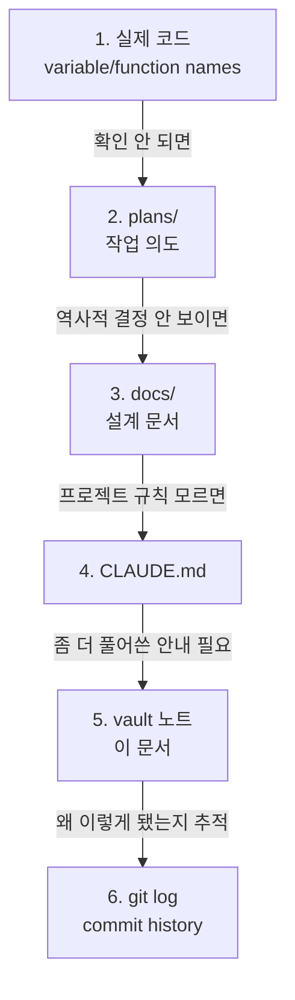

# 🎨 바이브 코딩 컨텍스트

> [!summary] 한 줄 요약
> 이 코드는 사람이 처음부터 끝까지 짠 게 아니다. Claude Code / Codex 와 대화하면서 만들어졌다. 이걸 알고 코드를 보면 눈이 달라진다.

## 솔직한 시작

DEXCOWIN MES 의 코드를 처음 펼쳤을 때 이런 의문이 생기는 경우가 있다.

- "왜 같은 일을 하는 함수가 두 개나 있지?"
- "이 라우터엔 테스트가 빵빵한데 저 라우터엔 왜 하나도 없지?"
- "여긴 주석이 친절한데 여긴 왜 한 줄도 없지?"
- "이 폴더 구조는 왜 이렇게 됐지? 책에서 본 패턴이랑 다른데?"

답을 먼저 말한다.

> [!info] 이 시스템의 정체
> - **코드 의뢰인(사용자)** 은 IT 비전공자다.
> - 하지만 도메인(공장 자재 흐름, 부서, 결재, 불량 처리)은 현장 그 자체로 안다.
> - 코드는 사용자가 **Claude Code / Codex** 와 대화하면서 만들어졌다.
> - 사용자가 직접 한 줄 한 줄 친 코드가 아니라, **요구사항을 자연어로 던지고 AI 가 구현한 결과물**이다.
> - 이걸 우리는 **"바이브 코딩(Vibe Coding)"** 이라고 부른다.

이건 부끄러운 일도, 자랑할 일도 아니다. **그냥 사실**이다. 그리고 이 사실을 알아야 코드를 제대로 읽을 수 있다.

## 바이브 코딩이 의미하는 것

### 1. 일관성이 시기별로 다르다

같은 프로젝트인데 4월에 작성된 모듈과 5월에 작성된 모듈의 스타일이 다를 수 있다.

- AI 모델 자체가 업데이트되면서 선호하는 패턴이 바뀌었다.
- 작업자가 그동안 학습하면서 더 나은 지시를 내리게 됐다.
- 같은 함수라도 처음 만든 시점과 리팩토링한 시점이 다르면 결이 달라진다.


> [!tip] 코드 시간대 확인법
> "왜 이 파일만 스타일이 달라?" 싶으면 `git log -- <파일경로>` 로 작성 시점을 확인한다. 4월 작업물이면 패턴이 다를 가능성이 높다.

### 2. 같은 일을 하는 함수가 2-3개 있을 수 있다

AI 는 컨텍스트 한계가 있다. 이미 비슷한 함수가 있는데도 모르고 새로 만드는 경우가 있다.

- `erp/backend/app/services/` 안에 비슷한 헬퍼가 중복되는 경우 발견 가능
- `erp/frontend/lib/` 의 유틸리티 중에도 후보가 있을 수 있음

이런 게 보이면 곧바로 지우지 말고, [[처음_읽는_사람]] 의 "처음 수정하기 전 체크" 를 따른다. **consolidation 후보로 보고**하는 게 맞다.

### 3. 주석이 적은 건 의도된 정책이다

AI 가 코드를 만들 때 주석은 일부러 최소화했다. 자세한 건 [[AI_생성_코드_읽는_법]] 에서 다룬다. 짧게 말하면:

- AI 가 만든 주석은 종종 **현재가 아닌 의도된 미래**를 설명한다.
- 코드와 주석이 어긋날 위험이 코드만 두는 것보다 더 크다.
- 그래서 **함수명·변수명에 의미를 싣고, 주석은 줄이는 정책**을 택했다.

### 4. 설계 결정은 코드보다 문서에 남아있다

코드만 봐서는 "왜 이렇게 했지?" 답이 안 나오는 경우가 많다. 그 이유는 보통 다른 곳에 적혀있다.

- `erp/plans/` — 작업 의도, 단계별 계획
- `erp/docs/` — 설계 문서, ADR (Architecture Decision Record)
- `erp/CLAUDE.md` — 프로젝트 규칙
- `erp/vault/_vault/` — 인수인계용 안내 (지금 보고 있는 문서)

### 5. Vault 노트는 사양서가 아니다

> [!warning] Vault 의 위치
> Vault 노트는 **인수인계용 안내 레이어**다. 사양서도, 설계 문서도 아니다.
> 코드와 어긋날 때는 **언제나 코드가 진실**이다.

## 진실의 소스 순서 (가장 중요한 단원)

"이게 정확한 정보야?" 라고 의심할 때, 다음 순서로 확인한다.



### 1단계: 실제 코드 (가장 강한 진실)

- 함수명, 변수명, 타입, import 구조가 **현재 동작하는 진실**이다.
- IDE 의 "Go to Definition", "Find Usages" 가 가장 신뢰할 수 있는 도구다.
- 한계: **왜** 이렇게 됐는지는 말해주지 않는다.

### 2단계: `erp/plans/`

- 그 코드를 짤 때 **무엇을 하려고 했는지** 가 적혀 있다.
- 예: 부서 이동 로직을 왜 분리했는지, 불량 처리 흐름을 왜 재설계했는지.
- 한계: 작업이 끝난 뒤 코드가 더 진화했을 수 있다. plans 가 현재와 어긋나면 코드가 우선.

### 3단계: `erp/docs/`

- 설계 문서, ADR, 인수인계 문서가 들어있다.
- 예: `erp/docs/AI_HANDOVER.md`, `erp/docs/CODEX_PROGRESS.md`.
- 한계: 일부 문서는 작성 시점에서 멈춰있다. 날짜를 보고 신선도 판단.

### 4단계: `erp/CLAUDE.md`

- 프로젝트 절대 규칙. AI 에게 주는 지시인 동시에 사람에게도 적용된다.
- "DEXCOWIN MES 라고 불러라", "DB 변경 전 영향 설명", "auto-commit 금지" 등.
- 한계: 규칙이지 동작 설명은 아니다.

### 5단계: Vault 노트

- 지금 보는 이 문서를 포함해 `erp/vault/_vault/` 의 모든 가이드.
- 인수인계 톤으로 풀어서 설명한다.
- 한계: 코드 변경에 자동으로 따라오지 않는다. 어긋나면 코드가 우선.

### 6단계: `git log`

- 마지막 보루. **왜 이렇게 바뀌었는지**를 시간순으로 추적한다.
- commit 메시지 패턴이 잘 잡혀있어서 (`refactor:`, `backend:`, `desktop:`, `mobile:` 등) 검색이 쉽다.
- 예: `git log --oneline | findstr "BOM"` 으로 BOM 관련 변경 추적.

> [!tip] 실전 팁
> 인수인계 초반에는 5단계 → 1단계 순서로 갈 일이 많다. 익숙해지면 1단계에서 거의 답이 나오고, 막힐 때만 위로 거슬러 올라간다.

## AI / Claude / Codex 가 만진 흔적

> [!info] 이런 패턴이 보이면 AI 가 만진 것
> - frontmatter 양식 (모든 문서 상단의 `---` 블록)
> - 함수명 카멜케이스 일관성
> - Obsidian callout 사용 (`> [!summary]`, `> [!tip]` 등)
> - commit 메시지의 정형화된 prefix (`refactor:`, `backend:`, `desktop:`)
> - 변수명·함수명이 영어로 의미를 풍부하게 담고 있음

> [!info] 이런 패턴은 거의 안 나타남
> - `# noqa`, `# type: ignore` 같은 임시 우회
> - 사람이 급하게 친 듯한 매직 넘버
> - "TODO: fix later" 같은 미완성 흔적
>
> AI 는 보통 코드를 **깔끔하게 마무리**한다. 미완성을 남기기 싫어한다.

### 균일하지 않은 부분

> [!warning] 테스트 커버리지는 균일하지 않다
> - 어떤 라우터엔 테스트가 풍부하다.
> - 어떤 라우터엔 테스트가 거의 없다.
> - 이건 AI 의 실력 문제가 아니라, **그 시점의 작업 우선순위**가 달랐기 때문이다.
> - 테스트 없는 부분을 수정할 땐 더 조심한다. → [[위험지대_지도]]

> [!warning] 스타일 일관성도 시기별로 다름
> - 4월 초기 작업물과 5월 모바일 개편 작업물의 스타일이 다르다.
> - 같은 기능이라도 폴더가 다르면 컨벤션이 다를 수 있다.
> - 이걸 일괄로 맞추려고 큰 리팩토링을 하지 말 것 — `CLAUDE.md` 의 "Surgical Changes" 규칙에 위배된다.

## 작업 시 마인드셋

### 1. "왜 이렇게 됐지?" 라고 물을 권리가 있다

코드 한 줄을 봐서 이해 안 되면, 그건 읽는 사람 실력 부족이 아닐 가능성이 높다. 진실의 소스 순서로 한 번은 거슬러 올라가본 다음 물어보면 된다.

### 2. 주석 없으면 git log 부터 본다

```bash
# 특정 파일의 변경 이력
git log --oneline -- erp/backend/app/routers/inventory.py

# 특정 키워드가 들어간 commit
git log --oneline --grep="불량"

# 특정 줄을 누가 언제 왜 바꿨는지
git blame erp/backend/app/services/transfer.py
```

### 3. 같은 일 하는 함수 2개 보이면 → 보고

> [!question] 검증 순서
> 1. 둘 다 호출되는지? (`Find Usages`)
> 2. 입력/출력이 정말 같은지? (테스트로 확인)
> 3. 한쪽이 더 새로운지? (`git log`)
> 4. 보고 후 판단 받기 — 함부로 지우지 말기.

### 4. "이건 죽은 코드 같은데?" → 함부로 안 지운다

> [!warning] 죽은 코드 처리 원칙
> - import 역추적 (Find Usages) 으로 확인
> - 그래도 죽어보이면 git log 로 마지막 변경 시점 확인
> - 보고 → 사용자 확인 → 별도 commit 으로 제거
> - 한 commit 에서 기능 변경과 죽은 코드 제거를 섞지 말 것

이건 `CLAUDE.md` 의 "Surgical Changes" 규칙과 같은 정신이다.

## 코드 의뢰인과 일하는 법

> [!note] 코드 의뢰인 특성
> - 도메인(공장 자재 흐름, 부서, 결재, 불량 처리)에 대한 이해는 완전하다.
> - **현장 흐름**으로 설명하면 가장 잘 통한다.

### 잘 통하는 설명

- "이 함수가 자재가 부서 간 이동할 때 호출됩니다"
- "이 화면은 박○○ 차장님이 매일 오전 결재할 때 보는 화면입니다"
- "이 버튼 누르면 창고에서 검사실로 batch 가 넘어갑니다"

### 잘 안 통하는 설명

- "이건 N+1 쿼리 문제라 dataloader 패턴으로 풀어야 합니다"
- "RESTful 원칙상 PATCH 가 맞습니다"
- "이건 SOLID 의 OCP 위반입니다"

> [!tip] PR / 작업 보고 작성 요령
> 코드 diff 보다 **그 변화가 현장에 어떤 영향**을 끼치는지 먼저 적는다.
>
> 나쁜 예: "transfer.py 의 validate_batch 함수에서 분기문 조건 변경"
> 좋은 예: "검사실 → 조립실로 batch 가 이동할 때 동일 부서 내 작업이면 그 부서 한 곳만 표시되도록 수정 (커밋 db7ae55 와 같은 흐름)"

## 핵심 5문장

> [!summary] 핵심 5문장
> 1. 사람이 한 줄씩 친 코드 아니다. AI 와 대화로 만들었다.
> 2. 일관성·테스트 커버리지·스타일은 시기별로 다를 수 있다.
> 3. 진실의 순서는 **코드 → plans → docs → CLAUDE.md → vault → git log**.
> 4. 코드가 이해 안 되면 물어볼 수 있다. 단, 묻기 전에 한 번은 거슬러 올라간다.
> 5. 코드 의뢰인에겐 코드가 아니라 **현장 흐름**으로 설명한다.

## 추가로 읽을 것

- [[처음_읽는_사람]] — 첫날 안내서
- [[AI_생성_코드_읽는_법]] — AI 가 짠 코드를 사람처럼 읽는 법
- [[위험지대_지도]] — 테스트 적은 영역, 손대기 무서운 영역
- [[왜_이_시스템인가]] — 왜 자체 MES 였나 (자체 구축 의사결정 배경)
- [[첫주_체크리스트]] — 인수인계 첫 주 해야 할 일

---

#layer/meta #topic/vibe-coding #topic/transparency

Up: [[_guides]]
