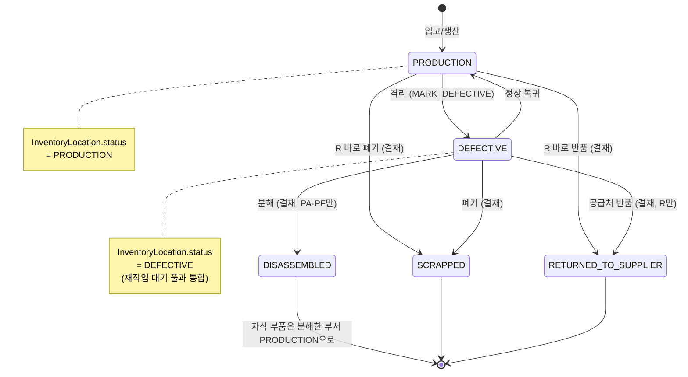
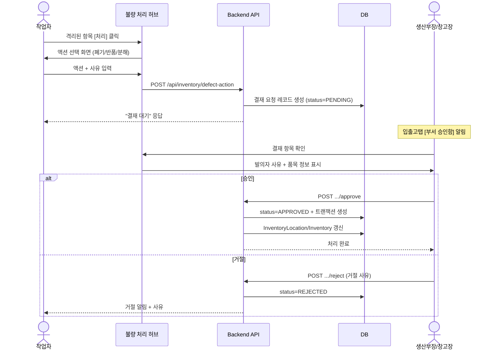

# 🔧 시나리오: 불량 처리 (격리 / 폐기 / 반품 / 분해)

> [!summary] 한 줄 요약
> 자재에 불량이 발견됐을 때부터 **폐기 / 공급처 반품 / 분해까지의 전체 흐름**을 시나리오로 풀어쓴 문서. 핵심은 "**격리는 즉시, 그 다음은 결재**"라는 두 박자 리듬이다.

> [!info] 이 문서의 위치
> - 상위 흐름: [[처음_읽는_사람]] → [[ERP_MOC]] → 이 문서
> - 용어가 헷갈리면: [[용어사전]]
> - 코드가 어떻게 생겼는지 두려우면: [[AI_생성_코드_읽는_법]]
> - 어느 부분이 위험한지: [[위험지대_지도]]
> - 현장 작업자용 쉬운 설명서: [[erp/docs/defect-handling-for-operators.txt]]
> - 설계 합의 원본: [[erp/docs/defect-handling-redesign.md]]

---

## 0. 왜 이 흐름이 다시 설계됐나

> [!quote] 사용자 요구사항 (원문)
> "입출고탭에서 불량 세부 작업과 부서 로직을 개선해야함. 불량 격리, 불량 폐기, 공급처 반품, 재작업..?등등 ... 불량 격리되어 있는 품목도 폐기랑 반품을 할 수 있어야함."

기존 흐름은 **"누가 / 언제 / 왜 / 어디서"** 가 두루뭉술했다. 진공부에는 1년 묵은 불량이 쌓여 있는데 시스템에 안 보였고, 다른 부서 일은 결재 길이 막혀서 멈춰버렸다. 이 시나리오는 그걸 **2개 상태 + 4가지 결말** 로 정리한 결과다.

> [!warning] 1년 전 코드와의 차이
> 옛 가이드는 분해(DISASSEMBLE)·반품(RETURN)을 queue 배치 위주로 설명했다. 지금은 **입출고탭 → 불량 처리 허브** 중심 흐름이고, queue 배치는 부서 입출고의 한 갈래로 흡수됐다. 옛 위자드 코드는 [[위험지대_지도]] 의 "재설계 전 잔존 코드" 항목 참고.

---

## 1. 한눈에 보기 (재설계 합의 사항)

> [!example] DEXCOWIN MES 불량 처리 16개 합의 사항
> | # | 항목 | 결정 |
> |---|---|---|
> | 1 | 불량 상태 | `PRODUCTION` / `DEFECTIVE` 2개만 |
> | 2 | 격리 단위 | 부서별로 따로 쌓임 |
> | 3 | 격리 = 재작업 대기 | 같은 풀로 통합 (별도 상태 X) |
> | 4 | 부서 조직 | 생산부 산하 6라인 (튜브/고압/진공/튜닝/조립/출하) |
> | 5 | 결재 권한 | 생산부장(이필욱·김건호) OR 창고장(정/부) |
> | 6 | 발의 | 누구나 |
> | 7 | 격리 / 정상복귀 | 즉시 (결재 X) |
> | 8 | 폐기 / 반품 / 분해 | 결재 필요 |
> | 9 | R 처리 | 4버튼 (격리 없이 정상에서 바로 가능) |
> | 10 | PA · PF 처리 | 무조건 격리 → BOM 트리 펼침 |
> | 11 | 분해 살린 자식 | 분해한 부서의 정상 재고로 즉시 입고 |
> | 12 | 사유 입력 | 모든 액션 필수 (카테고리 + 자유 메모) |
> | 13 | UI 위치 | 입출고탭 → 요청 작성 → Step 1 [불량] → 불량 처리 허브 |
> | 14 | 허브 디자인 | 대시보드 패턴 (KPI 카드 + 액션 + 부서별 목록) |
> | 15 | 대시보드 표시 | 위치별 재고 카드/게이지에 빨간색 불량 행/구간 |
> | 16 | 1년 묵은 항목 | KPI 카드 `[1년 이상]` 으로 별도 카운트 |

---

## 2. 등장인물

| 역할 | 누구 | 권한 |
|---|---|---|
| 발의자 | **누구나** (현장 작업자 포함) | 격리 / 정상복귀 즉시 처리, 폐기/반품/분해는 결재 요청 |
| 라인 담당 | 튜브 / 고압 / 진공 / 튜닝 / 조립 / 출하 라인 작업자 | 발의만 가능 (라인 자체에는 부서장 없음) |
| **생산부장 (정)** | 이필욱 | 생산부 산하 6라인 결재 권한 통째로 보유 |
| **생산부장 (부)** | 김건호 | 동일. 정/부 중 누구든 한 명이면 통과 |
| **창고장 (정/부)** | 창고 담당자 | 생산부장과 OR 관계로 결재 가능 |

> [!info] 라인에는 부서장이 없다
> 코드 측면에서 `department_role=primary/deputy` 는 **생산부** 단위로만 부여된다. 라인 단위 결재자 풀은 비어 있고, 결재는 항상 (생산부장) OR (창고장) 경로로만 처리된다.

> [!danger] 시드 데이터 주의
> 이필욱·김건호의 `Employee.department` 값은 `조립` 이 아니라 **`생산부`** 여야 한다. 기존 시드가 `조립` 으로 박혀 있으면 다른 라인(진공·튜브 등) 결재 시 권한 거부가 발생한다. [[위험지대_지도]] 의 "부서 결재 라우팅" 참조.

---

## 3. 시나리오 A — 불량 발견부터 격리까지

### 3.1 누가 / 언제

> [!example] 격리는 4가지 순간에 모두 발생한다
> 1. **창고 입고 검수 중** — 사 온 원자재(R) 가 깨져 있음
> 2. **부서 작업 중** — 진공부에서 조립하다가 게터 불량 발견
> 3. **부서 자체 검사** — QC 단계에서 치수 미달 적발
> 4. **출고 직전 검사** — 출하부 마지막 점검에서 외관 불량

### 3.2 흐름

```
1. 작업자가 불량 발견
    ↓
2. [입출고탭] → [요청 작성] → Step 1 [불량] → 불량 처리 허브 진입
    ↓
3. [+ 새 격리 추가] 클릭
    ↓
4. 부서 / 품목 / 수량 / 사유(카테고리 + 메모) 입력
    ↓
5. 제출
    ↓ (결재 없음, 즉시 반영)
6. InventoryLocation.status: PRODUCTION → DEFECTIVE
   TransactionLog: MARK_DEFECTIVE 기록
   대시보드 빨간색 [불량 N] 행에 즉시 반영
```

### 3.3 DB 영향

| 테이블 | 변경 |
|---|---|
| `inventory_locations` | `(item_id, department, PRODUCTION)` 행 quantity 감소, `(item_id, department, DEFECTIVE)` 행 quantity 증가 (없으면 생성) |
| `transaction_logs` | `MARK_DEFECTIVE` 1행 신규 |
| `inventories` | **변동 없음** (총 보유량은 그대로, 상태만 이동) |

> [!warning] 격리는 "재고가 사라지는" 게 아니다
> 정상 재고에서 빠질 뿐, 총 보유량(`Inventory.quantity`)은 그대로다. **가용 재고** 표시만 줄어든다. 폐기/반품을 해야 비로소 총 보유량이 감소한다.

### 3.4 구체 예시 — 진공부 게터 8개 격리

> [!example] 시나리오 예시
> **상황**: 진공부 작업자가 게터(`7-MAT-0099`) 8개의 진공 누설 발견.
>
> **격리 전**:
> | item | department | status | quantity |
> |---|---|---|---|
> | 게터 | 진공 | PRODUCTION | 50 |
> | 게터 | 진공 | DEFECTIVE | 0 |
>
> **작업자 액션**:
> 1. 입출고탭 → 요청 작성 → Step 1 [불량] → 허브 진입
> 2. `[+ 새 격리 추가]` → 부서: 진공 / 품목: 게터 / 수량: 8
> 3. 사유: 카테고리 "기능 불량" + 메모 "진공 누설, 재검사 시도 가능"
> 4. 제출 — 결재 없음, 즉시 반영
>
> **격리 후**:
> | item | department | status | quantity |
> |---|---|---|---|
> | 게터 | 진공 | PRODUCTION | 42 |
> | 게터 | 진공 | DEFECTIVE | 8 |
>
> **transaction_logs**: `MARK_DEFECTIVE` +8 (진공·게터, 사유 포함)
>
> **대시보드 우측**: 진공부 [불량 8] 빨간 행 즉시 출현.

---

## 4. 시나리오 B — 격리에서 4갈래로 분기

> [!summary] 격리된 항목은 결국 4가지 결말로 간다
> 1. **정상 복귀** — 잘못 격리했거나 재검사 통과
> 2. **폐기** — 그냥 버림 (DB에서도 소멸)
> 3. **공급처 반품** — 사 온 데로 돌려보냄 (R 한정)
> 4. **분해** — BOM 트리 펼쳐서 자식 부품별로 살리거나 버림 (PA · PF 한정)

### 4.1 정상 복귀 (즉시)

| 항목 | 값 |
|---|---|
| 발의 | 누구나 |
| 결재 | **불필요** (즉시 반영) |
| DB | `DEFECTIVE` → `PRODUCTION` 행 이동 |
| 트랜잭션 | `MARK_DEFECTIVE` 역방향 (또는 향후 `UNMARK_DEFECTIVE` 신설 검토) |
| 사유 | 필수 (카테고리: "검사 통과" 등) |

> [!info] 가볍게 격리, 가볍게 복귀
> 격리 부담을 낮추기 위해 정상 복귀도 결재 없이 즉시 처리된다. "쌓아둬도 됩니다, 묵혀도 됩니다" — [[erp/docs/defect-handling-for-operators.txt]] 의 핵심 메시지.

### 4.2 폐기 (결재 필요)

| 항목 | 값 |
|---|---|
| 발의 | 누구나 |
| 결재 | **필요** (생산부장 OR 창고장 1인) |
| DB | `DEFECTIVE` 행 quantity 감소, `Inventory.quantity` 감소 |
| 트랜잭션 | `SCRAP` |
| 사유 | 필수 |

### 4.3 공급처 반품 (결재 필요, R 한정)

| 항목 | 값 |
|---|---|
| 발의 | 누구나 |
| 결재 | **필요** (생산부장 OR 창고장 1인) |
| 대상 | **R(원자재) 만** — PA/PF는 자기가 만든 거라 의미 없음 |
| DB | `DEFECTIVE` 행 quantity 감소, `Inventory.quantity` 감소 |
| 트랜잭션 | `SUPPLIER_RETURN` |
| 사유 | 필수 |

> [!question] R 정상에서도 바로 공급처 반품 가능?
> **가능**. 입고 검수에서 사 온 원자재가 불량이면 격리 단계 건너뛰고 바로 `[R 바로 반품]` 액션으로 처리. 두 번 일할 필요 없음. 단 사유와 결재는 그대로 받는다.

### 4.4 분해 (결재 필요, PA · PF 한정)

| 항목 | 값 |
|---|---|
| 발의 | 누구나 |
| 결재 | **필요** (생산부장 OR 창고장 1인) |
| 대상 | **PA(조립품) / PF(완제품)** — BOM 있는 품목 |
| DB | 본인은 `DISASSEMBLE` 로 소멸, 자식 부품은 살린 것만 `PRODUCTION` 으로 입고 |
| 트랜잭션 | 본인 `DISASSEMBLE` + 자식별 `RECEIVE`(살림) 또는 `SCRAP`(버림) |
| 사유 | 라인별로 각각 필수 |

> [!warning] 살린 자식은 "분해한 부서" 의 정상 재고로 입고된다
> 창고로 자동 회수되는 게 **아니다**. 진공부에서 분해했으면 진공부 정상 재고로 즉시 입고. 즉시 사용 가능.

### 4.5 구체 예시 — 전극 어셈블리 5대 분해

> [!example] 시나리오 예시
> **상황**: 조립부에서 격리해둔 전극 어셈블리(70kV) 5대 분해 결정.
> BOM: 필라멘트 1 + 게터 1 + 애노드 1.
>
> **분해 전 (조립부)**:
> | item | status | quantity |
> |---|---|---|
> | 전극 어셈블리 | DEFECTIVE | 5 |
> | 필라멘트 | PRODUCTION | 20 |
> | 게터 | PRODUCTION | 30 |
> | 애노드 | PRODUCTION | 15 |
>
> **분해 결정**:
> - 본인 (전극 어셈블리): 분해 (소멸)
> - 필라멘트 5개: 살림 (검사 통과)
> - 게터 5개: 폐기 (진공 불량으로 사용 불가)
> - 애노드 5개: 살림 (검사 통과)
>
> 결재 요청 → 생산부장 김건호 승인.
>
> **분해 후 (조립부)**:
> | item | status | quantity | 변화 |
> |---|---|---|---|
> | 전극 어셈블리 | DEFECTIVE | 0 | ⬇ -5 (DISASSEMBLE) |
> | 필라멘트 | PRODUCTION | 25 | ⬆ +5 |
> | 게터 | PRODUCTION | 30 | (변동 없음, 폐기됨) |
> | 게터 | (소멸) | — | ⬇ -5 (SCRAP) |
> | 애노드 | PRODUCTION | 20 | ⬆ +5 |
>
> **transaction_logs**:
> 1. `DISASSEMBLE` -5 전극 어셈블리 (사유: 출력 부족)
> 2. `RECEIVE` +5 필라멘트 (사유: 검사 통과)
> 3. `SCRAP` -5 게터 (사유: 진공 불량)
> 4. `RECEIVE` +5 애노드 (사유: 검사 통과)
>
> 모두 한 결재로 묶여 처리됨.

---

## 5. mermaid 상태 다이어그램

### 5.1 PRODUCTION ↔ DEFECTIVE + 4갈래 종료 상태



### 5.2 격리 결재 흐름 (시퀀스 다이어그램)



---

## 6. PA · PF 분해 위자드 — BOM 트리 펼침

> [!example] 분해 처리 화면 (와이어프레임)
> ```
> [처리] 7-TR-0001 전극 어셈블리(70kV) × 5개
> 조립부 [불량] / 격리 2025-08-15 / 격리자: 김건호
> 사유: 기능 불량 (출력 부족)
> ─────────────────────────────────────────
> 이 격리 항목을 어떻게 할까요?
>
> ○ 정상 복귀  (잘못 격리한 거였음)
> ○ 전부 폐기  (BOM 통째로 버림)
> ● 분해 + 자식 처리  ← 선택 시 아래 트리 펼침
> ─────────────────────────────────────────
> [BOM 트리 (분해 결과 결정)]
>   본인  전극 어셈블리 × 5  →  분해됨 (소멸)
>   ├ 필라멘트          × 5  →  [정상 입고 ▼]   살림
>   ├ 게터              × 5  →  [폐기 ▼]
>   └ 애노드            × 5  →  [정상 입고 ▼]   살림
>
> 각 라인별 사유 입력:
>   ├ 필라멘트: 검사 통과
>   ├ 게터: 진공 불량으로 사용 불가
>   └ 애노드: 검사 통과
>
> [결재 요청 →]
> ```

> [!warning] BOM 재귀 전개 안 함
> 분해는 **직계 자식 1단계** 만. 필라멘트 안의 텅스텐 와이어까지 자동으로 분해되지 않는다. 필요하면 살린 필라멘트에 대해 또 격리 → 분해를 수행.

---

## 7. R 처리 — 단순 4버튼

원자재(R)는 BOM 자식이 없으니 트리도 없다. 단순 4가지 액션.

```
[처리] 7-MAT-0001 텅스텐 와이어 × 5개
조립부 [불량] / 격리 2025-08-15 / 격리자: 김건호
사유: 외관 불량 (스크래치 다수)
─────────────────────────────────────────
[정상 복귀]  [폐기]  [공급처 반품]
       ↓ 누르면 사유 입력 + 결재 필요한 액션은 결재 흐름 시작
```

> [!info] 격리를 건너뛰는 단축 경로
> R 정상 재고 상태에서도 `[+ R 바로 반품]`, `[+ R 바로 폐기]` 액션을 통해 격리 단계 없이 바로 처리 가능. 입고 검수에서 즉시 처리하는 흐름.

### 7.1 PA/PF vs R 비교표

| 구분 | R (원자재) | PA · PF (조립품 · 완제품) |
|---|---|---|
| BOM 트리 | 없음 | **펼침** |
| 분해 액션 | 없음 | 있음 |
| 공급처 반품 | **가능** | 불가 (자기가 만든 거) |
| 격리 → 폐기 | 가능 | 가능 (전부 폐기) |
| 정상에서 바로 액션 | 폐기/반품 가능 | **격리 무조건** |
| 결과 자식 입고 | 해당 없음 | 분해한 부서의 정상 재고로 즉시 |

---

## 8. 액션별 결재 매트릭스

| 액션 | 대상 | 발의자 | 결재 필요 | 결재자 | 트랜잭션 |
|---|---|---|---|---|---|
| 격리 | 정상 → 불량 | 누구나 | ✗ | — | `MARK_DEFECTIVE` |
| 정상 복귀 | 불량 → 정상 | 누구나 | ✗ | — | `MARK_DEFECTIVE` 역방향 |
| R 정상 → 공급처 반품 | R 정상 재고 | 누구나 | ✓ | 생산부장 OR 창고장 | `SUPPLIER_RETURN` |
| R 정상 → 폐기 | R 정상 재고 | 누구나 | ✓ | 동일 | `SCRAP` |
| R 격리 → 폐기 | R 격리 | 누구나 | ✓ | 동일 | `SCRAP` |
| R 격리 → 공급처 반품 | R 격리 | 누구나 | ✓ | 동일 | `SUPPLIER_RETURN` |
| PA · PF 격리 → 전부 폐기 | PA · PF 격리 | 누구나 | ✓ | 동일 | `SCRAP` |
| PA · PF 격리 → 분해 처리 | PA · PF 격리 | 누구나 | ✓ | 동일 | `DISASSEMBLE` + 자식별 |
| PA · PF 격리 → 정상 복귀 | PA · PF 격리 | 누구나 | ✗ | — | `MARK_DEFECTIVE` 역방향 |

> [!quote] 결재 원칙 (defect-handling-redesign §7.4)
> 1. 격리·정상복귀는 가벼움 → 즉시
> 2. 돈/외부 관계 걸린 결정(폐기·반품·분해)은 결재
> 3. 결재자는 **생산부장 OR 창고장** — 둘 중 한 명이면 OK

---

## 9. 사유 입력 — 모든 액션 필수

> [!danger] 사유가 빠지면 시스템 만든 의미가 없다
> 격리든 폐기든 반품이든 분해든, **모든 액션에 사유 입력 필수**. 이게 빠지면 1년 후 "이게 왜 격리됐지?" 를 영원히 알 수 없다.

### 9.1 형식

| 항목 | 종류 |
|---|---|
| 카테고리 (필수) | 외관 불량 / 치수 불량 / 기능 불량 / 검사 통과 / 기타 |
| 자유 메모 (선택) | "스크래치 다수 / 우측 끝단", "치수 +0.05 over", "재검사 시 통과 가능성 있음" 등 |

### 9.2 활용

- 격리 시 사유 → 처리 화면에 자동 표시 (결재자가 판단 근거로 사용)
- 처리 시 사유 → `transaction_logs` 에 영구 기록
- 통계 — "이번 달 외관 불량 30건, 어느 공정에서 많이 나오나" 자동 집계

---

## 10. 코드 위치 — 어디에 뭐가 있나

### 10.1 백엔드

| 파일 | 라인 | 역할 |
|---|---|---|
| [[erp/backend/app/models.py]] | 59-71 | `TransactionTypeEnum` — `MARK_DEFECTIVE`, `SCRAP`, `SUPPLIER_RETURN`, `DISASSEMBLE` 등 |
| [[erp/backend/app/models.py]] | 73-75 | `LocationStatusEnum` — `PRODUCTION` / `DEFECTIVE` 2개만 |
| [[erp/backend/app/models.py]] | 78-88 | `DepartmentEnum` — 평면 구조. **재설계 대상** (parent_id 추가 예정) |
| [[erp/backend/app/models.py]] | 103-110 | `Department` 마스터 테이블. `parent_id` 마이그레이션 예정 |
| [[erp/backend/app/models.py]] | 211-245 | `InventoryLocation` — `(item_id, department, status)` 단위 |
| [[erp/backend/app/services/dept_adjustment.py]] | 195-205 | `_TRANSACTION_TYPE_MAP` — `direction="defective"` → `MARK_DEFECTIVE` |
| `erp/backend/app/services/stock_requests.py` | 1022-1023 | 결재 권한 체크 — **현재 단일 부서 문자열 비교, 재설계로 ancestor + 창고장 OR 확장 예정** |
| `erp/backend/app/routers/inventory.py` | — | `POST /api/inventory/mark-defective` 라우터 |

### 10.2 프론트

| 파일 | 역할 |
|---|---|
| [[erp/frontend/app/legacy/_components/_warehouse_v2/ioWorkType.ts]] | `IO_WORK_TYPES` — Step 1 워크타입 정의 ([불량] 포함) |
| `erp/frontend/app/legacy/_components/_warehouse_v2/ioWorkType.ts` (13-23행) | 불량 워크타입 카드 |
| `erp/frontend/app/legacy/_components/_warehouse_v2/ioWorkType.ts` (53-57행) | 서브탭 `defect_quarantine` / `supplier_return` |
| `erp/frontend/app/legacy/_components/_warehouse_v2/` | **불량 처리 허브 컴포넌트들** (재설계로 신규 추가 예정) |
| `erp/frontend/app/legacy/_components/_warehouse_sections/WarehouseSectionTabs.tsx` | 입출고탭 5개 섹션 (요청 작성 / 작업 중 / 내 요청 / 창고 승인함 / 부서 승인함) |

### 10.3 트랜잭션 enum 정리

| enum 값 | 의미 | 발생 조건 |
|---|---|---|
| `MARK_DEFECTIVE` | 격리 (정상↔불량 이동) | 격리 / 정상복귀 |
| `SCRAP` | 폐기 | 폐기 액션 |
| `SUPPLIER_RETURN` | 공급처 반품 | R 반품 |
| `DISASSEMBLE` | 분해 | PA · PF 분해 시 본인에 기록 |
| `RECEIVE` | 입고 | 분해 결과 살린 자식 입고 |
| `LOSS` | 손실 | 반품 시 누락분 (기존 queue 흐름 잔존) |

---

## 10.4 자주 등장하는 엔터티 한눈 정리

| 엔터티 | 어디 정의 | 무엇 |
|---|---|---|
| `Inventory` | `erp/backend/app/models.py` | 품목별 총 보유량 (단일 합계) |
| `InventoryLocation` | `erp/backend/app/models.py:211-245` | (품목, 부서, 상태) 단위 분포 |
| `TransactionLog` | `erp/backend/app/models.py` | 모든 재고 변동 이력 (audit log) |
| `Department` | `erp/backend/app/models.py:103-110` | 부서 마스터. `parent_id` 추가 예정 |
| `Employee` | `erp/backend/app/models.py` | 발의자 / 결재자. `department` 단일 컬럼 |
| `StockRequest` | `erp/backend/app/models.py` | 결재 요청 묶음 (status: PENDING/APPROVED/REJECTED) |

---

## 11. UI 동선 — 입출고탭 → 불량 처리 허브

### 11.1 진입 경로

```
[입출고탭]
 └ 요청 작성
    └ Step 1: 워크타입 선택
       ├─ 원자재 입고 ──→ 기존 4단계 위자드
       ├─ 창고 입출고 ──→ 기존 4단계 위자드
       ├─ 부서 입출고 ──→ 기존 4단계 위자드
       └─ 불량 ────────→ 불량 처리 허브 (별도 화면)
```

대시보드의 빨간 `[불량 N]` 행을 클릭해도 허브로 점프 (해당 부서 필터링 상태).

### 11.2 허브 화면 구조

> [!example] 불량 처리 허브 (대시보드 패턴)
> ```
> ┌──────────────────────────────────────────────────────────────────┐
> │ 불량 처리 허브                              김건호 · 생산부 부장 │
> ├──────────────────────────────────────────────────────────────────┤
> │  ┌──────────┐ ┌──────────┐ ┌──────────┐ ┌──────────┐             │
> │  │ 격리 중  │ │ 1년 이상 │ │ 결재 대기│ │ 오늘 처리│             │
> │  │   17건   │ │   3건 ⚠ │ │   2건    │ │   1건    │             │
> │  └──────────┘ └──────────┘ └──────────┘ └──────────┘             │
> │                                                                  │
> │  [+ 새 격리 추가] [+ R 바로 반품] [+ R 바로 폐기]                │
> ├──────────────────────────────────────────────────────────────────┤
> │ 부서: ●내 부서  ○생산부 전체  ○전체   정렬: 오래된 순 ▼          │
> ├──────────────────────────────────────────────────────────────────┤
> │  ▼ 조립부 [불량 5]                                               │
> │   ─ 7-TR-0001 전극(70kV)  3개  격리 2025-08-15      [처리]       │
> │   ─ 7-TR-0002 필라멘트    2개  격리 2025-12-01      [처리]       │
> │                                                                  │
> │  ▼ 진공부 [불량 8]                                               │
> │   ─ 7-TR-0003 게터        8개  격리 2024-11-20 ⚠1년 [처리]       │
> └──────────────────────────────────────────────────────────────────┘
> ```

### 11.3 대시보드 표시 변경

| 위치 | 변경 |
|---|---|
| 우측 위치별 재고 카드 | 부서 정상 행 다음에 **빨간색 `[불량 N]` 행** 추가 (불량 있는 부서만) |
| 가운데 게이지 바 | 부서별 누적 게이지 뒤에 **빨간색 불량 구간** 추가 |
| 가용 재고 | 정상 수량만 합계 |
| 총 보유 | 정상 + 격리 (참고용) |

---

## 12. 위험 포인트 — 어디가 잘못될 수 있나

> [!danger] 이 시나리오의 위험지대
> 자세한 내용은 [[위험지대_지도]] 의 다음 섹션 참고.
> - **"불량 처리 흐름"** — 격리/폐기/반품/분해 액션이 결재와 트랜잭션을 일관되게 발생시키는지
> - **"부서 결재 라우팅"** — 생산부장이 산하 6라인 모두 결재 가능한지 (`is_ancestor_department` 헬퍼 + 창고장 OR)
> - **"AI 생성 코드"** — 분해 위자드 BOM 트리 펼침은 AI가 만들기 쉽지만 검증이 어려운 영역. [[AI_생성_코드_읽는_법]] 참고

### 12.1 흔한 실수 패턴

| 실수 | 결과 | 방어 |
|---|---|---|
| 사유 입력 스킵 | 1년 후 근거 추적 불가 | 폼 레벨 필수 검증 |
| 격리 단계에 결재 추가 | 현장 속도 저하, 격리 안 함 → 부정확 재고 | "격리는 즉시" 원칙 사수 |
| 살린 자식을 창고로 자동 회수 | 분해한 부서에서 못 씀 | 분해한 부서 정상 재고로 입고 |
| 생산부장 결재 권한 못 받음 | 다른 라인 결재 거부 | `is_ancestor_department` + 시드 데이터(이필욱·김건호 = 생산부) |
| 옛 위자드와 새 허브 동시 노출 | 사용자 혼란, 데이터 두 경로 | Step 1 [불량] → 허브로 강제 redirect |

---

## 12.2 결재 라우팅 변경의 핵심 — `is_ancestor_department`

> [!warning] 현재 코드 (재설계 전)
> ```python
> # erp/backend/app/services/stock_requests.py:1022-1023
> if approver.department != request.requester_department:
>     raise PermissionError("다른 부서의 요청은 결재할 수 없습니다.")
> ```
> 이필욱(`department=조립`) 이 진공부 격리를 결재하면 즉시 거부됨. 라인 단위 비교는 사용자 멘탈 모델(생산부 = 상위)과 불일치.

> [!info] 재설계 후 (의사 코드)
> ```python
> # 1) 같은 부서 (영업·연구·AS 같은 단독 부서 한정)
> if approver.department == request.requester_department:
>     pass  # OK
> # 2) 상위 부서의 책임자 — 생산부장이 산하 라인 결재
> elif is_ancestor_department(approver.department, request.requester_department):
>     pass  # OK
> # 3) 창고 정/부도 결재 가능 (OR 백업)
> elif approver.warehouse_role in ("primary", "deputy"):
>     pass  # OK
> else:
>     raise PermissionError(...)
> ```
> 핵심 변경: `is_ancestor_department(a, b)` 가 a가 b의 parent 체인 어딘가에 있으면 True. 즉 "생산부" 가 "진공" 의 ancestor 이므로 통과.

---

## 13. 마이그레이션 / 호환성

> [!warning] 기존 데이터 영향
> - **기존 격리 데이터**: `InventoryLocation.status = DEFECTIVE` 행이 이미 존재할 수 있음. 격리 일자가 없으면 `created_at` 또는 `MARK_DEFECTIVE` 트랜잭션 시각을 채워 넣기.
> - **기존 부서 결재 흐름**: `Employee.department` 단일 컬럼 유지, `Department.parent_id` 만 추가해 권한 체크 확장.
> - **기존 [불량] 워크타입 코드**: Step 1에서 [불량] 누르면 라우터가 허브로 redirect. 기존 위자드 컴포넌트는 폐기 (또는 허브의 액션 위자드로 재활용).
> - **OpenAPI 게이트**: 백엔드 스키마 변경 시 `_attic/docs/openapi.json` 재생성 필수.

---

## 13.1 구현 로드맵 (Phase 1 → 6 요약)

> [!info] defect-handling-redesign §10 참고
> 각 Phase 끝에 검증 단계 포함. 단계별 커밋 권장.

| Phase | 내용 | 예상 소요 |
|---|---|---|
| 1 | 데이터 모델 + 부서 계층 (`Department.parent_id`, 결재 권한 ancestor + 창고장 OR) | 반나절~하루 |
| 2 | 격리/처리 API + 사유 필드 + 격리 일자 컬럼 | 하루 |
| 3 | 대시보드 UI (빨간 [불량 N] 행, 게이지 빨간 구간, 점프 라우팅) | 하루 |
| 4 | 불량 처리 허브 (KPI 카드 4 + 액션 3 + 부서별 목록) | 이틀 |
| 5 | 처리 위자드 (R 4버튼 / PA · PF BOM 트리 / 결재 흐름 통합) | 이틀 |
| 6 | E2E 검증 + 부서 계층 결재 시나리오 + 회귀 테스트 | 하루 |

---

## 13.2 1년 묵은 항목 운영 시나리오

> [!example] 운영 시나리오 — "묵은 불량 처리의 날"
> **상황**: 진공부에 1년 이상 격리된 게터 3건, 필라멘트 2건, 애노드 1건 적재.
>
> **흐름**:
> 1. 분기 첫째 주 월요일, 김건호 과장이 허브 상단 `[1년 이상] 6건 ⚠` KPI 카드 클릭
> 2. 자동 필터링된 6개 항목 노출 (오래된 순)
> 3. 각 항목별 [처리] 클릭 → 재검사 결과에 따라:
>    - 살릴 수 있는 것 → 정상 복귀 (결재 X)
>    - 폐기할 것 → 폐기 결재 요청
>    - 분해 가능한 PA · PF → 자식 별 결정 + 결재
> 4. 한꺼번에 결재 처리 → 빨간 불량 카운트 일괄 감소
>
> **사후 효과**:
> - 진공부 가용 재고가 정확해짐
> - 대시보드 빨간색 행 정리
> - `transaction_logs` 에 모든 결과가 사유와 함께 영구 기록

---

## 14. FAQ

> [!question] Q. "재작업중" 상태는 왜 안 만들었나?
> 회사 현장에서 재작업은 며칠~1년씩 걸린다. 시스템이 "지금 손대고 있는지" 알 필요가 없다. **격리 = 재작업 대기 풀** 로 통합. 작업 끝나면 [처리] 눌러서 결과(살림/폐기)만 기록.

> [!question] Q. PA · PF 도 공급처 반품 가능?
> **불가**. 내가 만든 거니까. R(외부에서 사 온 원자재)만 공급처 반품 대상.

> [!question] Q. 격리한 거 정상 복귀하면 결재 받아야 하나?
> **아니다**. 격리·정상복귀는 가벼운 액션이라 즉시. 폐기·반품·분해(돈/외부 관계 걸린 결정)만 결재.

> [!question] Q. 분해할 때 자식 전부 살리면 어떻게 되나?
> 본인은 `DISASSEMBLE` 로 소멸, 자식 N개가 분해한 부서의 정상 재고로 입고. BOM 비율 그대로.

> [!question] Q. 분해 결과를 다른 부서 재고로 보낼 수 있나?
> **현재 흐름은 분해한 부서 정상 재고로만 입고**. 다른 부서로 옮기려면 추가로 [부서 입출고] 워크타입 사용. (향후 옵션 검토 — defect-handling-redesign §12 참고)

> [!question] Q. 생산부장 자리가 비어있으면 결재 막히나?
> **아니다**. 생산부장(이필욱·김건호) OR 창고장(정/부) — 두 풀 중 누구 한 명이라도 결재하면 OK. 자리 비움에 대한 백업이 설계상 보장됨.

> [!question] Q. 1년 묵은 격리 항목은 어떻게 찾나?
> 허브 상단 KPI 카드 `[1년 이상]` 누르면 자동 필터링. 정렬도 "오래된 순" 기본값.

> [!question] Q. R 정상 → 바로 폐기/반품도 결재 필요?
> **필요**. 격리 단계는 건너뛰지만, 돈 걸린 결정이므로 결재는 받는다.

> [!question] Q. 옛 queue 배치(`DISASSEMBLE`, `RETURN`)는 어떻게 되나?
> queue 배치 자체는 **부서 입출고** 워크타입 안의 `disassemble` / `produce` 서브타입으로 흡수. 불량 처리에서의 "분해" 는 이 BOM 트리 펼침 위자드를 통해 결재와 함께 일어난다. 두 경로가 다르므로 혼동 주의.

> [!question] Q. 격리 일자는 어디에 기록되나?
> 현재 설계상 `InventoryLocation.updated_at` 또는 `MARK_DEFECTIVE` 트랜잭션의 `created_at` 을 기준으로 표시. 별도 컬럼 추가 여부는 구현 단계에서 결정 (defect-handling-redesign §12.3 미결 사항).

> [!question] Q. 분해 시 BOM 비율은 자동 계산되나?
> 본인 N개 분해 시 자식은 BOM 정량 × N 이 기본값으로 채워짐. 실제 분해해보니 다르다면(예: 게터 일부 깨짐) 수량 수정 가능 + 차액은 별도 LOSS 또는 폐기로 처리.

> [!question] Q. 결재가 거절되면?
> 발의 상태로 되돌아가고 발의자에게 거절 사유와 함께 알림. 발의자가 수정/취하 결정. 거절 사유 입력 + 알림 흐름은 [부서 승인함] 섹션에서 확인.

> [!question] Q. 같은 부서장이 자기 발의를 결재할 수 있나?
> 일반적인 결재 정책상 셀프 결재는 불가. 생산부장 둘(정·부)이 있는 이유 중 하나이며, 창고장이 OR 백업으로 결재 가능하므로 막힘 없음.

> [!question] Q. 격리 시점에 사진 첨부 가능?
> 현재 설계에는 카테고리 + 자유 메모만. 사진/첨부는 향후 확장 옵션 (미결 사항).

> [!question] Q. 불량 처리 허브의 KPI 카드 4개가 정확히 뭐?
> `격리 중` / `1년 이상` / `결재 대기` / `오늘 처리` 4개. 누르면 그 조건으로 자동 필터링.

---

## 15. 관련 문서 · 위키 링크

### 15.1 입문 · 길잡이
- [[처음_읽는_사람]] — DEXCOWIN MES 첫 발걸음
- [[ERP_MOC]] — 전체 지도
- [[용어사전]] — R / PA / PF / BOM / 격리 / 결재 용어
- [[첫주_체크리스트]] — 신입 첫 주 할 일

### 15.2 코드 읽기 · 위험 회피
- [[AI_생성_코드_읽는_법]] — AI가 만든 코드를 신뢰 없이 읽는 법
- [[위험지대_지도]] — 어디가 무너지기 쉬운지

### 15.3 설계 원본 · 운영 가이드
- [[erp/docs/defect-handling-redesign.md]] — 설계 합의 16개 사항 원본
- [[erp/docs/defect-handling-for-operators.txt]] — 현장 작업자용 쉬운 설명서

### 15.4 코드 위치
- [[erp/backend/app/models.py]] — 도메인 모델 + enum 정의
- [[erp/backend/app/services/dept_adjustment.py]] — `defective` direction 처리
- [[erp/frontend/app/legacy/_components/_warehouse_v2/ioWorkType.ts]] — Step 1 워크타입 + 서브탭

### 15.5 인접 시나리오
- [[시나리오_재고입출고]] — 정상 흐름의 입출고
- [[시나리오_생산배치]] — 생산 흐름 (정상 경로)
- [[시나리오_품목등록]] — BOM 등록 (분해 시 BOM 트리 펼침 기반)
- [[FAQ_전체]]

---

Up: [[_guides]]
