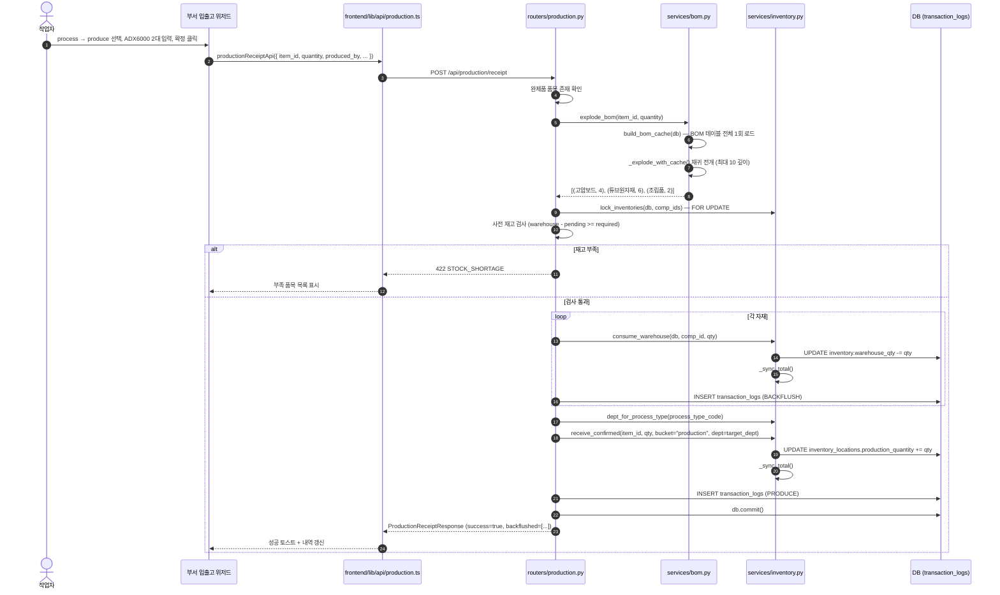

# 🏭 시나리오: 생산 배치 (BOM 기반 Backflush)

> [!summary] 한 줄 요약
> 완제품을 생산할 때 **자재가 자동으로 차감(Backflush)되고 완제품 재고가 늘어나는 흐름**을 화면 → API → DB 까지 한 동선으로 따라간다. DEXCOWIN MES 에서 가장 복잡하고 중요한 시나리오.

> [!info] 누가 읽어야 하나
> - 입사 1년차 비전공자 개발자 (오늘의 너)
> - "완제품 1대를 만들 때 어떤 자재가 어떻게 줄어드는지" 코드로 추적하고 싶은 사람
> - `process` 워크타입 버튼을 처음 만지는 사람
>
> 먼저 [[처음_읽는_사람]] → [[ERP_MOC]] 를 훑었다고 가정한다. 용어는 [[용어사전]] 참고.

---

## 🎯 시나리오가 끝나면 너가 알게 되는 것

1. `ioWorkType.ts` 의 `process` 워크타입이 **생산과 분해를 모두 담당**하는 이유
2. **PA·PF 계열 품목**은 BOM 트리를 전부 펼쳐 자재를 자동 차감하는 반면, **R 계열 품목**은 BOM 없이 4개 버튼으로 단순 처리되는 차이
3. `production_receipt` API 가 어떤 순서로 **BOM 전개 → 재고 잠금 → Backflush → PRODUCE 기록** 을 처리하는지
4. `TransactionLog` 에 `PRODUCE` 와 `BACKFLUSH` 가 왜 같은 묶음으로 생성되는지
5. **순환 BOM / 재고 부족 / Backflush 누락** 세 위험 지점이 어디에 있는지

---

## 🧑‍🤝‍🧑 등장인물

| 역할 | 누구 | 화면에서 뭘 하나 |
|---|---|---|
| 생산 작업자 | 예: 조립팀 / 고압팀 직원 | 부서 입출고 위저드 → `process` 탭 → `생산` 선택 → 완제품 품목 선택 → 확정 |
| 부서장 | 팀장급 | 완료된 생산 내역을 입출고 이력 탭에서 확인 |

---

## 🔑 핵심 개념 두 가지

**Backflush (백플러시)** = "거꾸로 씻어내리기".
완제품 생산이 확정되면, 필요한 자재들을 **한꺼번에** 재고에서 자동 차감하는 방식.
수동으로 자재마다 출고 신청을 넣지 않아도 되니까 편하다.
단, BOM 이 정확해야 제대로 차감된다는 전제가 있다.

**BOM (Bill of Materials)** = 완제품 1단위를 만들 때 필요한 자재 목록.
트리 구조로 부품 아래에 부품이 있을 수 있다 (최대 10 깊이).
[[erp/backend/app/services/bom.py]] 의 `explode_bom()` 이 이 트리를 **리프 노드까지 전부 펼쳐서** 최종 소모 자재 목록을 만든다.

---

## 🗂️ process 워크타입 — 생산과 분해를 한 곳에서

> [!info] ioWorkType.ts 의 `process`
> [[erp/frontend/app/legacy/_components/_warehouse_v2/ioWorkType.ts]] 에서 `IO_WORK_TYPES` 배열의 세 번째 항목이다.
>
> ```ts
> { id: "process", label: "부서 입출고", description: "부서 내 작업", icon: Wrench }
> ```
>
> `process` 하나가 **생산(produce)·분해(disassemble)·수량보정 입고(adjust_in)·수량보정 출고(adjust_out)** 네 가지 sub_type 을 모두 포함한다.

`IO_SUB_TYPES.process` 를 펼치면:

| sub_type | 레이블 | 방향 | BOM 전개? |
|---|---|---|---|
| `produce` | 생산 | IN (결과품 입고) | **예** — `isBomForced()` = true |
| `disassemble` | 분해 | OUT (분해 대상 출고) | **예** — `isBomForced()` = true |
| `adjust_in` | 수량보정 입고 | IN | 아니오 — 낱개 |
| `adjust_out` | 수량보정 출고 | OUT | 아니오 — 낱개 |

`isBomForced(subType)` 함수가 `produce` 와 `disassemble` 일 때만 `true` 를 반환한다 — 그래서 이 두 sub_type 에서만 품목 선택 시 BOM 하위 라인이 **자동 전개·잠금** 된다.

```ts
// ioWorkType.ts
export function isBomForced(subType: IoSubType) {
  return subType === "produce" || subType === "disassemble";
}
```

`getItemActionMode(subType)` 은 `produce`·`disassemble` 일 때 `"bom_or_single"` 을 반환해 "BOM 적용" / "이 품목만" 두 버튼을 노출한다.
`adjust_in`·`adjust_out` 은 `"single_only"` 라 버튼이 하나("선택").

---

## 🏷️ PA·PF 와 R 계열 — 처리 방식의 차이

품목 테이블(`items`)에는 `process_type_code` 컬럼이 있다 ([[erp/backend/app/models.py]] `ProcessType`).

| process_type_code | suffix | 의미 | 생산 배치 처리 |
|---|---|---|---|
| PA, HA, VA, TA, NA, AA | A (Assembly) | 조립/생산 완제품 | **BOM 트리 전개** → Backflush |
| PF (최상위 완제품) | — | BOM 최상위 | **BOM 트리 전개** → Backflush |
| TR, HR, VR, TA, ... | R (Raw) | 원자재·반제품 | BOM 없음 → **4버튼(낱개)** |

**PA·PF 계열** : `explode_bom()` 이 BOM 트리를 리프까지 전개해 자재를 모두 차감한다. `production_receipt` API 가 이 경로를 담당한다.

**R 계열** : 원자재는 더 쪼갤 BOM 이 없다. 사용자는 `adjust_in` / `adjust_out` 단순 버튼 네 개로 직접 수량을 조작한다. Backflush 없음, BOM 전개 없음.

> [!warning] R 계열에 BOM 을 등록하면?
> `production_receipt` 진입 시 `_explode_bom()` 이 비어 있는 결과를 반환하고 400 에러("BOM 없음")를 던진다.
> R 계열 품목을 완제품 생산 대상으로 쓰려면 먼저 BOM 을 등록해야 한다.

---

## 🎬 일반 시나리오 — PA·PF 생산 (BOM 트리 전개)

### Step 1. 화면에서 process 워크타입 선택

> [!example] 화면 위치
> - `erp/frontend/app/legacy/_components/_warehouse_v2/` 영역의 부서 입출고 위저드
> - Step 1: 워크타입 카드 중 "부서 입출고(process)" 선택
> - Step 2: sub_type = `produce` 선택, 대상 부서 선택
> - Step 3: 품목 검색 → ADX6000 같은 PA/PF 완제품 선택 → **"BOM 적용"** 클릭

"BOM 적용" 을 누르는 순간 frontend 가 BOM 1단계 하위를 사전 조회해 **bundle 라인**을 채운다.
`produce` sub_type 이므로 `isBomForced()` = true → 하위 라인(투입 자재들)은 체크 변경·수량 편집이 잠긴다.

라인 태그 표시 (`lineTagLabel`):
- 완제품 라인: `{ text: "생산 결과품", tone: "green" }`
- 자재 라인: `{ text: "투입 자재", tone: "red" }`

### Step 2. BOM 트리 자동 전개 (어떤 자재를 소모할지 표시)

사용자가 수량을 입력하면 frontend 가 **BOM 1단계 자동 포함** 으로 라인을 구성한다.
backend 의 실제 전개는 확정(confirm) 시점에 `explode_bom()` 이 수행한다.

`explode_bom()` 이 하는 일:

```
ADX6000 (1대 생산 요청)
  └─ BOM cache 조회 → child 목록 반환
      ├─ 고압보드  x2  (child_id 에 BOM 없음 → 리프 → 결과에 추가)
      ├─ 튜브     x1  (child_id 에 BOM 있음 → 재귀)
      │    └─ 튜브원자재 x3  (리프 → 결과에 추가)
      └─ 조립품   x1  (child_id 에 BOM 있음 → 재귀)
           └─ ...
```

`build_bom_cache(db)` 가 BOM 테이블 전체를 **한 번에** 읽어 메모리 dict 를 만든다.
이후 재귀는 DB 쿼리 없이 dict 탐색만 한다 (N+1 없음).

### Step 3. API 호출 → production 라우터 → BOM 서비스 → 재고 차감 + 완제품 증가

사용자가 확정 버튼을 누르면:

```
POST /api/production/receipt
Body: {
  "item_id": "<ADX6000 uuid>",
  "quantity": 2,
  "produced_by": "김씨",
  "reference_no": "PROD-20260521-001"
}
```

`production_receipt()` 함수 [[erp/backend/app/routers/production.py]] 의 처리 순서:

1. `item_id` 로 완제품 품목 존재 확인
2. `_explode_bom(db, item_id, quantity)` 호출 → 리프 자재 목록 반환
3. 같은 자재 중복 합산 (`merge_requirements`)
4. **bulk IN 쿼리** 로 자재 Items + Inventory 한 번에 사전 로드
5. `inventory_svc.lock_inventories(db, comp_ids)` — **FOR UPDATE 잠금** (동시 Backflush 경합 방지)
6. **사전 재고 검사**: 각 자재의 `warehouse_qty - pending_quantity >= required_qty` 확인. 부족하면 422 반환
7. 검사 통과 → 각 자재에 대해:
   - `inventory_svc.consume_warehouse(db, comp_item_id, required_qty)` — 창고 재고 차감
   - `TransactionLog(BACKFLUSH, quantity_change=-required_qty)` INSERT
8. 완제품 처리: `process_type_code` 로 대상 부서 결정 (`dept_for_process_type`)
   - PA/PF 계열 → 해당 부서의 `production` 버킷으로 적재 (`receive_confirmed(..., bucket="production", dept=target_dept)`)
   - R 계열 또는 부서 없음 → 창고 폴백 (`receive_confirmed(db, item_id, quantity)`)
9. `TransactionLog(PRODUCE, quantity_change=+quantity)` INSERT
10. `db.commit()`

### Step 4. TransactionLog 에 PRODUCE + BACKFLUSH 기록

확정 직후 `transaction_logs` 에 다음 행들이 생긴다:

| transaction_type | item | quantity_change | notes |
|---|---|---|---|
| BACKFLUSH | 고압보드 | -4 | 생산 입고 Backflush: ADX6000 x 2 |
| BACKFLUSH | 튜브원자재 | -6 | 생산 입고 Backflush: ADX6000 x 2 |
| BACKFLUSH | 조립품 | -2 | 생산 입고 Backflush: ADX6000 x 2 |
| PRODUCE | ADX6000 | +2 | 생산 입고: ADX6000 x 2 |

같은 `reference_no` 로 묶이므로 이력 화면에서 한 묶음으로 볼 수 있다.

---

## 🔘 단순 시나리오 — R 계열 처리 (4버튼)

> [!info] 원자재·반제품은 BOM 트리를 펼치지 않는다

R(Raw) suffix 품목 (TR, HR, VR 등)은 BOM 하위가 없다.
사용자는 `process` 워크타입 → `adjust_in` / `adjust_out` sub_type 으로 **낱개 수량 보정**만 한다.

| 버튼 | sub_type | 동작 |
|---|---|---|
| 입고 · 낱개 | `adjust_in` | 해당 품목 수량 직접 증가 |
| 출고 · 낱개 | `adjust_out` | 해당 품목 수량 직접 감소 |
| 생산 (BOM) | `produce` | R 계열 에 BOM 없으면 오류 |
| 분해 (BOM) | `disassemble` | R 계열 에 BOM 없으면 오류 |

`deptIoSubType(direction, mode)` 함수가 이 조합을 결정한다:

```ts
// ioWorkType.ts
export function deptIoSubType(direction: DeptIoDirection, mode: "bom" | "single"): IoSubType {
  if (direction === "in") return mode === "bom" ? "produce" : "adjust_in";
  return mode === "bom" ? "disassemble" : "adjust_out";
}
```

R 계열 품목을 선택하면 `getItemActionMode("produce")` 는 `"bom_or_single"` 을 반환하지만,
품목에 BOM 이 없으면 backend 가 400 에러를 내보낸다.
따라서 실제 운용에서는 R 계열은 `adjust_in` / `adjust_out` 만 사용한다.

`dept_adjustment.py` [[erp/backend/app/services/dept_adjustment.py]] 가 이 보정을 처리하며,
`TransactionLog(PRODUCE)` 또는 `TransactionLog(DISASSEMBLE)` 이 아닌
`ADJUST` 유형으로 기록된다.

---

## 🔁 mermaid 시퀀스 다이어그램



---

## 🏗️ BOM 서비스 내부 동작 — 코드 단위로 짚기

> [!info] 이 절은 처음에 넘겨도 된다. 나중에 BOM 관련 버그를 추적할 때 돌아와라.

[[erp/backend/app/services/bom.py]] 에는 세 개의 공개 함수가 있다.

### `build_bom_cache(db)`

```python
def build_bom_cache(db: Session) -> BomCache:
    cache: BomCache = {}
    for row in db.query(BOM).all():
        cache.setdefault(row.parent_item_id, []).append((row.child_item_id, row.quantity))
    return cache
```

BOM 테이블 **전체** 를 한 번에 읽어 `{parent_id: [(child_id, qty), ...]}` dict 로 만든다.
이후 재귀 전개는 이 dict 만 참조하므로 DB 쿼리가 추가 발생하지 않는다.
`/capacity` 엔드포인트처럼 여러 완제품을 연속으로 전개해야 할 때는 이 캐시를 **한 번만** 만들고 재사용한다.

### `explode_bom(db, parent_item_id, qty_to_produce, ...)`

```python
def explode_bom(db, parent_item_id, qty_to_produce, depth=0, visited=frozenset(), *, cache=None):
    if cache is None:
        cache = build_bom_cache(db)   # 첫 호출 시 자동 생성
    return _explode_with_cache(parent_item_id, qty_to_produce, depth, visited, cache)
```

`production_receipt` 라우터는 `cache` 인자 없이 호출하므로 내부에서 자동 생성한다.

**재귀 규칙** (`_explode_with_cache`):
- `depth > 10` 또는 `parent_item_id in visited` → 빈 리스트 반환 (사이클·깊이 제한)
- `child_id` 가 캐시에 없으면 리프 → `(child_id, qty)` 결과에 추가
- `child_id` 가 캐시에 있으면 자체 BOM 이 있다 → 재귀

리프만 결과에 들어간다는 점이 핵심이다. **중간 조립품은 결과에 없고 그 재귀 후손인 원자재만 남는다.**

### `merge_requirements(pairs)`

`explode_bom` 결과는 같은 `item_id` 가 여러 번 나올 수 있다 (트리의 다른 경로에서 같은 자재 참조).
`merge_requirements` 가 `{item_id: total_qty}` 로 합산한다.
라우터는 이 merged dict 를 순회해 Backflush 를 수행한다.

### `direct_children(db, parent_item_id)`

분해(disassemble) 시나리오 전용. 리프까지 전개하지 않고 **BOM 1단계 자식만** 반환한다.
생산 배치에서는 사용하지 않는다 — [[시나리오_분해반품]] 참고.

---

## 📊 생산 가능 수량 사전 확인 — bom-check 와 capacity

생산을 실제로 확정하기 전에 "지금 재고로 만들 수 있나?" 를 두 가지 방법으로 확인할 수 있다.

### bom-check (단일 품목)

```
GET /api/production/bom-check/{item_id}?quantity=N
```

`check_production_feasibility()` 함수가 처리한다.
`explode_bom()` 으로 자재를 전개한 뒤 각 자재의 `warehouse_available`(= `warehouse_qty - pending`) 을 `stock_math.bulk_compute()` 로 한 번에 조회해 부족 여부를 반환한다.

응답 예시:
```json
{
  "item_name": "ADX6000",
  "quantity_to_produce": 2,
  "can_produce": false,
  "components": [
    { "item_code": "GB-001", "item_name": "고압보드", "required": 4, "available": 3, "shortage": 1, "ok": false },
    { "item_code": "TR-002", "item_name": "튜브원자재", "required": 6, "available": 10, "shortage": 0, "ok": true }
  ]
}
```

이 엔드포인트는 **읽기 전용** 이다. 재고를 바꾸지 않는다.

### capacity (전체 완제품)

```
GET /api/production/capacity
```

BOM 최상위 완제품(다른 BOM 의 자식이 아닌 품목) 전체에 대해
- **immediate**: `stage_order >= 60` 인 NF 이상 품목 재고만 기준으로 즉시 생산 가능수량
- **maximum**: 원자재(TR, stage_order=10)까지 전부 재귀해 이론적 최대 생산 가능수량

두 값을 계산해 반환한다. 병목 품목(`limiting_item`)도 포함한다.

`stage_order` 는 `process_types` 테이블의 컬럼으로 TR=10, HA=60 처럼 공정 순서를 숫자로 나타낸다. 낮을수록 원자재에 가깝다.

---

## 🗃️ Backflush 와 재고 3계층

[[시나리오_재고입출고]] 에서 설명한 재고 3계층이 생산 배치에서도 적용된다.

| 위치 | 컬럼 | Backflush 시 변화 |
|---|---|---|
| 중앙 창고 | `inventory.warehouse_qty` | **자재**: `-required_qty` 차감 |
| 부서별 production | `inventory_locations.production_quantity` | **완제품**: `+quantity` 증가 (target_dept) |
| 부서별 defective | `inventory_locations.defective_quantity` | 생산 배치에서는 변동 없음 |

> [!example] 불변식
> `_sync_total()` 이 `consume_warehouse` 와 `receive_confirmed` 직후 자동 호출된다.
> 자재 차감 → 완제품 증가가 서로 다른 품목이므로 **각 품목마다** `total_quantity` 가 정확히 유지된다.

결재(approval) 흐름:
`process` → `produce` sub_type 은 `requiresApproval()` 에서 `false` 를 반환한다 — 즉 **창고 승인 없이 즉시 반영**된다.
부서 내 작업이므로 창고장 결재가 불필요한 설계다.
(`approvalKind("produce", bundles)` = `"none"` 또는 라인에 manual 이 있으면 `"department"`)

---

## 📁 관련 코드 위치

| 역할 | 경로 |
|---|---|
| 생산 입고 API 라우터 | [[erp/backend/app/routers/production.py]] |
| BOM 전개 서비스 | [[erp/backend/app/services/bom.py]] |
| 재고 이동 서비스 | [[erp/backend/app/services/inventory.py]] |
| 부서 조정 서비스 (R 계열 보정) | [[erp/backend/app/services/dept_adjustment.py]] |
| TransactionTypeEnum (PRODUCE·BACKFLUSH) | [[erp/backend/app/models.py]] |
| process 워크타입 정의 | [[erp/frontend/app/legacy/_components/_warehouse_v2/ioWorkType.ts]] |
| backend 진입점 | `erp/backend/app/main.py` (라우터 마운트: `/api/production`) |

---

## 🧪 실제 예시 — ADX6000 2대 생산

**BOM 구성** (ADX6000 1대 기준):
- 고압보드 2개
- 튜브원자재 3개
- 조립품 1개

**생산 전 재고**:

| 품목 | warehouse_qty | pending |
|---|---|---|
| ADX6000 | 5 | 0 |
| 고압보드 | 20 | 0 |
| 튜브원자재 | 15 | 0 |
| 조립품 | 8 | 0 |

**`POST /api/production/receipt` 요청** (`quantity=2`):

`explode_bom` 결과:
- 고압보드 4 (2×2)
- 튜브원자재 6 (3×2)
- 조립품 2 (1×2)

**생산 확정 후 재고**:

| 품목 | warehouse_qty | 변화 |
|---|---|---|
| ADX6000 | 5 (+ production 버킷 2) | 부서 production 증가 ⬆ |
| 고압보드 | 16 | -4 ⬇ |
| 튜브원자재 | 9 | -6 ⬇ |
| 조립품 | 6 | -2 ⬇ |

**TransactionLog 추가 행 (4줄)**:

| type | item | change |
|---|---|---|
| BACKFLUSH | 고압보드 | -4 |
| BACKFLUSH | 튜브원자재 | -6 |
| BACKFLUSH | 조립품 | -2 |
| PRODUCE | ADX6000 | +2 |

---

## 🚨 에러 처리 흐름 — 라우터가 예외를 어떻게 다루나

`production_receipt` 라우터는 예외를 세 갈래로 나눠 처리한다.

| 예외 유형 | 발생 지점 | 라우터 처리 | HTTP 응답 |
|---|---|---|---|
| `RecursionError` | `_explode_bom()` 순환 BOM | `http_error(400, BAD_REQUEST)` | 400 |
| 빈 BOM 결과 | `explode_bom()` 반환 리스트 비어있음 | `http_error(400, BAD_REQUEST)` | 400 |
| 사전 재고 부족 | shortage_errors 리스트 비어있지 않을 때 | `http_error(422, STOCK_SHORTAGE)` | 422 |
| `HTTPException` | 부품 item 미존재 등 | 그대로 재던짐(pass-through) | 원본 4xx |
| `ValueError` | `consume_warehouse` 원자적 가드 실패 (경합 패배) | `db.rollback()` + `http_error(422)` | 422 |
| `Exception` | 그 외 예기치 않은 오류 | `logger.exception` + `db.rollback()` + 500 | 500 |

`ValueError` 분기가 중요하다. 사전 검사를 통과했더라도 동시성 경합으로 `consume_warehouse` 에서 늦게 실패하면, `except ValueError` 가 잡아서 **db.rollback() + 깨끗한 422** 로 돌려준다. orphan TransactionLog 가 남지 않는다.

> [!warning] db.rollback() 위치
> `except HTTPException` 절에는 `db.rollback()` 이 없다. 그 시점까지 flush 된 로그들은 `db.commit()` 이 호출되지 않았으므로 자동으로 롤백된다. 단 `db.flush()` 만 된 상태라면 SQLAlchemy session 이 살아있으므로 `db.rollback()` 을 명시적으로 호출하는 것이 안전하다.

---

## ⚠️ 위험 포인트

> [!warning] 이 절은 [[위험지대_지도]] 와 함께 읽자

### 1. BOM 깊이 무한 루프 / 순환 참조

`_explode_with_cache()` 는 `visited` frozenset 으로 사이클을 탐지하고, `depth > MAX_DEPTH(10)` 이면 전개를 멈춘다.
**A → B → A 같은 순환 BOM 은 즉시 `RecursionError` 를 던지고 400 으로 변환**된다.
BOM 등록 화면에서 순환이 생기지 않도록 주의할 것.

### 2. 재고 음수 — Backflush 시점 경합

사전 검사(`warehouse - pending >= required`)를 통과했더라도, 동시에 두 사람이 같은 자재를 사용하는 생산 배치를 확정하면 경합이 생긴다.
`lock_inventories(db, comp_ids)` 가 `SELECT ... FOR UPDATE` 로 행 잠금을 걸어 이를 방지한다.
잠금 없이 직접 `inventory.warehouse_qty` 를 수정하면 음수 재고가 발생할 수 있다.

늦게 도착한 요청이 `consume_warehouse` 내부의 원자적 검사에서 `ValueError` 를 던지면,
`except ValueError` 블록이 잡아서 `db.rollback()` + 422 로 깨끗하게 처리한다.

### 3. Backflush 누락 — TransactionLog 빠짐

라우터가 `consume_warehouse` 만 호출하고 `TransactionLog(BACKFLUSH)` INSERT 를 빠뜨리면,
재고는 줄었는데 이력이 안 보이는 감사 불능 상태가 된다.
**수량 변동과 TransactionLog INSERT 는 반드시 같은 트랜잭션 안에** 있어야 한다.
`db.commit()` 은 루프가 끝난 후 한 번만 호출된다 — 중간에 개별 commit 하지 말 것.

### 4. BOM 없는 완제품 등록

`explode_bom()` 이 빈 리스트를 반환하면 라우터가 `400 "BOM 없음"` 을 던진다.
PA/PF 계열 신규 품목을 등록할 때 BOM 을 함께 등록하지 않으면 생산 배치가 막힌다.

### 5. process_type_code 미등록 → 창고 폴백

`dept_for_process_type(None)` 은 `None` 을 반환하고, 라우터는 창고 폴백으로 완제품을 적재한다.
의도치 않게 완제품이 부서 버킷이 아니라 창고로 들어갈 수 있으니 신규 품목 등록 시 `process_type_code` 를 반드시 채울 것.

---

## ❓ FAQ

> [!question] Q. 확정 전에 재고가 실제로 차감되나?
> 아니다. `POST /api/production/receipt` 가 호출되고 `db.commit()` 이 완료되어야 `warehouse_qty` 가 줄어든다. 위저드 draft 단계에서는 아무것도 안 움직인다.

> [!question] Q. "BOM 적용"과 "이 품목만" 의 차이는?
> "BOM 적용" = `produce` sub_type → `isBomForced()` true → BOM 하위 자재 자동 생성·잠금.
> "이 품목만" = `adjust_in` sub_type → BOM 무시, 선택 품목만 수량 증가.
> 완제품을 만들 때는 반드시 "BOM 적용"을 써야 Backflush 가 발생한다.

> [!question] Q. 같은 자재가 BOM 트리 두 곳에서 나오면 중복으로 차감되나?
> 아니다. `merge_requirements()` 가 `explode_bom()` 결과를 `{item_id: total_qty}` 로 합산한 다음 차감한다. 동일 자재는 한 번만 차감된다.

> [!question] Q. BOM 이 바뀌면 이미 진행 중인 생산 배치에 영향이 있나?
> `production_receipt` 는 호출 시점에 BOM 을 전개한다. 확정 버튼을 누른 그 순간의 BOM 이 적용된다. 위저드에 품목을 올려놓고 다음 날 확정하면, 그 사이 BOM 이 바뀐 내용이 반영될 수 있다. 배치를 오래 열어두지 말 것.

> [!question] Q. Backflush 후 재고가 음수로 나왔다?
> 두 가지 가능성: (a) 직접 SQL 로 재고를 수정해 락이 우회됐다, (b) 사전 검사가 없는 새 라우터를 만들었다.
> `lock_inventories` + `consume_warehouse` 의 원자적 가드를 거치면 정상 경로에서는 음수가 나올 수 없다. ([[위험지대_지도]])

> [!question] Q. PRODUCE 와 BACKFLUSH 는 어디서 enum 정의되나?
> [[erp/backend/app/models.py]] 의 `TransactionTypeEnum` 클래스 안 `PRODUCE = "PRODUCE"`, `BACKFLUSH = "BACKFLUSH"`.
> frontend 는 `erp/frontend/lib/api/types/shared.ts` 의 `TransactionType` union 11종 중 두 항목.

> [!question] Q. 생산 가능 수량을 미리 확인하려면?
> `GET /api/production/bom-check/{item_id}?quantity=N` — 자재별 부족 여부를 확정 전에 미리 볼 수 있다. 화면의 "생산 가능 확인" 버튼이 이 엔드포인트를 호출한다.

---

## 🔗 함께 읽으면 도움 되는 것

- [[처음_읽는_사람]] — 코드베이스 첫 발자국
- [[ERP_MOC]] — 전체 지도
- [[용어사전]] — BOM·Backflush·pending·process_type_code 용어
- [[시나리오_재고입출고]] — 단순 입출고와의 비교
- [[시나리오_분해반품]] — 반대 방향(분해) 흐름
- [[AI_생성_코드_읽는_법]] — LLM 자동완성이 권하는 죽은 코드 식별
- [[위험지대_지도]] — BOM / 재고 음수 / Backflush 안전선

---

Up: [[_guides]]
