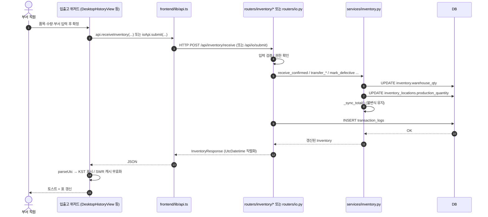

# 📦 시나리오: 재고 입출고

> [!summary] 한 줄 요약
> 자재가 **창고로 들어오거나(입고)**, **부서로 이동하거나(이관)**, **출고되는** 모든 순간에 화면 → API → 서비스 → DB 가 어떻게 맞물려 도는지를 한 동선으로 따라가는 시나리오. 코드와 데이터가 실제로 어느 파일을 거치는지 손가락으로 짚을 수 있도록 그린다.

> [!info] 누가 읽어야 하나
> - 입사 1년차 비전공자 개발자 (오늘의 너)
> - DEXCOWIN MES 코드베이스에 처음 들어와서 "재고가 어떻게 움직이는지" 머릿속에 그림이 안 그려지는 사람
> - 입출고 내역 화면을 만지려고 우측 카드 영역을 처음 여는 사람
>
> 먼저 [[처음_읽는_사람]] → [[ERP_MOC]] 를 훑었다고 가정한다. 용어는 [[용어사전]] 참고.

---

## 🎯 시나리오가 끝나면 너가 알게 되는 것

1. 입출고 화면에서 **버튼 한 번 클릭**이 어느 라우터의 어느 함수까지 흘러 들어가는지
2. **inventory 패키지**(`erp/backend/app/routers/inventory/`)가 왜 6 모듈로 쪼개져 있는지
3. **`io.py` 라우터**(입출고 탭 2.0)와 기존 `/api/inventory/*` 라우터가 어떻게 함께 살아남았는지
4. 입출고 내역 화면이 보여주는 **시간이 왜 한국 시간으로 안 어긋나는지** (UtcDatetime)
5. 입출고에서 실제로 살아 있는 **거래 타입 11종**이 무엇이고, 왜 16종 → 11종으로 줄었는지

---

## 🧑‍🤝‍🧑 등장인물

| 역할 | 누구 | 화면에서 뭘 하나 |
|---|---|---|
| 요청자 | 부서 직원 (예: 조립팀 김씨) | 입출고 위저드를 열어 "이 자재 N개 보내주세요" 또는 "받았어요" 작성 |
| 창고 담당 | 창고에서 자재를 실제로 옮기는 사람 | 화면에서 확정 / 보정 / 조정 누름 |
| 부서장 | 부서 책임자 | 입출고 내역 화면에서 어제·오늘 흐름 확인, 필요 시 정정 |
| 관리자 | MES 운영자 | audit 로그·정정 이력 점검 |

---

## 🗺️ 큰 그림 — 입출고 한 건이 흐르는 동선

```
[사용자]
   │ 화면에서 버튼 클릭
   ▼
[Frontend 컴포넌트]  (입출고 위저드 / 입출고 내역 화면)
   │ api.*() 호출
   ▼
[frontend/lib/api.ts]  →  domain 별 분리
   ├─ api/inventory.ts   ─ 단순 입고/조정/이관/불량/공급사반품
   ├─ api/io.ts          ─ 입출고 탭 2.0 (위저드형 batch)
   ├─ api/production.ts  ─ transactions(내역) 조회
   └─ api/dept-adjustment.ts ─ 부서 안 생산/분해/보정
   │ HTTP POST/GET
   ▼
[Backend 라우터]
   ├─ erp/backend/app/routers/inventory/   ← 패키지(6 모듈)
   │   ├─ receive.py     ─ /receive, /adjust
   │   ├─ transfer.py    ─ /transfer-to-{production,warehouse}, /transfer-between-depts
   │   ├─ defective.py   ─ /mark-defective
   │   ├─ supplier.py    ─ /return-to-supplier
   │   ├─ query.py       ─ /summary, /locations/{item_id}
   │   └─ transactions.py─ /transactions, /transactions/summary, export.{csv,xlsx}, meta-edit
   ├─ erp/backend/app/routers/io.py             ← 입출고 탭 2.0 batch
   └─ erp/backend/app/routers/dept_adjustment.py← 부서 내 생산/분해/보정
   │ inventory_svc.* 호출
   ▼
[Service]  erp/backend/app/services/inventory.py
   ├─ warehouse_qty 증감
   ├─ inventory_locations.production_quantity / defective_quantity 증감
   ├─ _sync_total()  ← 위치 합 == 총수량 불변식
   └─ TransactionLog 한 줄 기록
   ▼
[DB]
   ├─ inventory                 ← 품목별 합계
   ├─ inventory_locations       ← 부서별 production/defective 버킷
   ├─ transaction_logs          ← 모든 입출고 이력
   └─ io_batches                ← 입출고 탭 2.0 의 묶음 단위
```

> [!info] 라우터가 어디서 마운트되나
> `erp/backend/app/main.py` 217~231 행이 모든 라우터를 `/api/...` 접두사로 마운트한다.
> - `/api/inventory` → `inventory` 패키지 (`__init__.py` 가 내부 6 라우터를 묶어서 export)
> - `/api/io`        → `io.py` (입출고 탭 2.0)
> - `/api/dept-adjustment` → `dept_adjustment.py`

---

## 🧱 재고 3계층 (시나리오 들어가기 전 필독)

DEXCOWIN MES 의 모든 입출고는 다음 3개 수량을 **동시에** 관리한다.

| 위치 | 컬럼 | 예시 |
|---|---|---|
| 중앙 창고 | `inventory.warehouse_qty` | 100 |
| 부서별 (조립/고압/...) | `inventory_locations.production_quantity` | 조립 30, 고압 20 |
| 부서별 불량 | `inventory_locations.defective_quantity` | 조립 2 |

> [!example] 불변식
> `sum(모든 위치 수량) == inventory.total_quantity`
> — 서비스 레이어의 `_sync_total()` 이 입출고 직후 자동으로 맞춘다. 너가 신경 쓰지 않아도 된다. **다만 직접 SQL 로 수량을 손대면 무너진다.** ([[위험지대_지도]] 참고)

---

## 🎬 일반 시나리오 — 정상 입출고

여기서는 가장 흔한 케이스인 **"창고로 자재 입고 → 조립팀에 이관 → 일부 출고"** 를 한 줄기로 따라간다.

### Step 1. 화면에서 요청 작성

> [!example] 화면 위치
> - 데스크탑: 입출고 탭 (위저드형) — `erp/frontend/app/legacy/_components/_io_wizard/` 영역
> - 또는 단순 입고/이관일 때: 창고 입출고 탭의 입고/이관 버튼
>
> "입출고 내역" 화면은 **결과만 보는 화면**이지 입력 화면이 아니다. 헷갈리지 말 것.

위저드 모드에서는 사용자가 다음을 차례로 채운다.

1. work_type 선택 (입고 / 부서 반출 / 부서 반입 / 부서 이동 / ...)
2. 품목 라인 추가 (BOM 전개 가능)
3. 수량 입력, 부서 선택
4. **저장(draft)** 또는 **확정(submit)**

저장만 누르면 `io_batches` 에 `is_draft=true` 로 남아 있어서 나중에 다시 와서 마무리할 수 있다. 확정을 눌러야 실제 재고가 움직인다.

### Step 2. API 호출 — frontend 가 어느 함수를 부르는가

> [!info] 두 갈래 경로
> 현재 DEXCOWIN MES 의 입출고 frontend → backend 경로는 **단일 동작이냐, 위저드 묶음이냐**에 따라 두 갈래로 나뉜다. **둘 다 살아 있다.**

#### 갈래 A — 단순 단건 (예: 그냥 입고만 + 즉시 확정)

```ts
// 호출
api.receiveInventory({ item_id, quantity, notes });
//  ↑ frontend/lib/api/inventory.ts:26
//  → POST /api/inventory/receive
//  → erp/backend/app/routers/inventory/receive.py
```

해당하는 메소드들 ([[erp/frontend/lib/api/inventory.ts]]):
- `receiveInventory`        → `/api/inventory/receive`
- `adjustInventory`         → `/api/inventory/adjust`
- `transferToProduction`    → `/api/inventory/transfer-to-production`
- `transferToWarehouse`     → `/api/inventory/transfer-to-warehouse`
- `transferBetweenDepts`    → `/api/inventory/transfer-between-depts`
- `markDefective`           → `/api/inventory/mark-defective`
- `returnToSupplier`        → `/api/inventory/return-to-supplier`

#### 갈래 B — 위저드 묶음 (입출고 탭 2.0)

```ts
// 호출
ioApi.preview(payload);   // 실제 처리 전 사전 검증 / 부족 수량 표시
ioApi.saveDraft(payload); // draft 저장
ioApi.submit(payload);    // 확정 — 여기서 재고 변동
//  ↑ frontend/lib/api/io.ts
//  → POST /api/io/preview, PUT /api/io/draft, POST /api/io/submit
//  → erp/backend/app/routers/io.py
```

`io.py` 라우터는 입출고 탭 2.0 의 **묶음 단위** 입출고를 처리한다. 한 batch 안에 여러 품목 라인이 들어가고, sub_type(`receive_supplier`, `warehouse_to_dept`, `dept_to_warehouse`, `dept_transfer`, ...) 으로 어떤 동작인지 구분한다.

내부적으로 `services/io.py` 가 sub_type 별로 갈래 A 와 같은 서비스 함수를 호출한다 — **즉 최종 재고 변동은 `services/inventory.py` 의 같은 진입점을 공유한다.** 두 갈래가 진짜로 분리된 시스템이 아니라는 점이 중요하다.

#### 갈래 C — 부서 안에서 일어나는 조정 (참고)

부서에 이관된 자재가 부서 안에서 **생산/분해/수량 보정** 으로 다시 움직일 때는 `dept_adjustment.py` 가 받는다. 이 시나리오의 주제는 아니지만 입출고 내역 화면에는 같이 보인다는 점만 기억하자.

### Step 3. 서비스 처리

> [!example] 서비스 한 줄 요약
> 모든 입출고 라우터는 결국 `erp/backend/app/services/inventory.py` 의 한 함수를 호출한다. 라우터는 검증 + TransactionLog 기록 담당, 서비스는 실제 수량 이동 담당.

| 라우터 엔드포인트 | 서비스 함수 | 무엇이 바뀌나 | 거래 타입 |
|---|---|---|---|
| POST /api/inventory/receive | `receive_confirmed(bucket="warehouse")` | `warehouse_qty += qty` | RECEIVE |
| POST /api/inventory/adjust | `adjust_warehouse(target_qty)` | `warehouse_qty := target_qty` | ADJUST |
| POST /api/inventory/transfer-to-production | `transfer_to_production` | 창고 → 부서 생산 버킷 | TRANSFER_TO_PROD |
| POST /api/inventory/transfer-to-warehouse | `transfer_to_warehouse` | 부서 생산 → 창고 | TRANSFER_TO_WH |
| POST /api/inventory/transfer-between-depts | `transfer_between_departments` | 부서 ↔ 부서 | TRANSFER_DEPT |
| POST /api/inventory/mark-defective | `mark_defective` | production → defective (같은/다른 부서) | MARK_DEFECTIVE |
| POST /api/inventory/return-to-supplier | `return_to_supplier` | defective 또는 warehouse 감소, 총수량 감소 | SUPPLIER_RETURN |

확정 직후 서비스는 **두 가지를 반드시 한다**:
1. `_sync_total()` 호출 — 위치 합 == 총수량 불변식 유지
2. 라우터가 `TransactionLog` row 한 줄 INSERT — 이력 영구 기록

> [!warning] 음수 재고 방지
> 출고 / 이관 / 반품 함수들은 사전 검증으로 부족하면 `ValueError` 를 던지고, 라우터가 422 로 변환한다. 그래서 직접 SQL 만 안 만지면 음수 재고는 발생할 수 없도록 설계되어 있다. ([[위험지대_지도]])

### Step 4. 응답 + 화면 반영

라우터는 `to_response()` 를 거쳐 `InventoryResponse` 스키마로 답을 돌려준다. 거기에 들어 있는 시간 필드는 모두 **UtcDatetime** 을 거친다.

> [!info] UtcDatetime 한 줄 요약
> `erp/backend/app/schemas.py:27` 에 정의된 type alias. DB 에 있는 **naive datetime** (timezone 정보 없음) 을 `+00:00` 을 붙여 직렬화한다. 그래서 frontend 가 받을 때는 항상 UTC 임이 명시되고, `parseUtc()` 가 사용자의 로컬(KST) 로 변환한다. **9시간 어긋남 버그가 5월 20일 자로 근본 수정된 이유가 이 단일 alias 의 전체 응답 스키마 확산**이다 (커밋 `4db421a`).

화면 측은 응답을 받아:
- 입출고 위저드: 성공 토스트 + 라인 초기화
- 입출고 내역: SWR 캐시 무효화 → 자동 리프레시 → 표 / 우측 카드 갱신

---

## 📜 입출고 내역 화면 — 결과를 보는 자리

입출고가 끝나면 그 흔적은 입출고 내역 화면에서 확인한다. **데이터를 만드는 화면이 아니라 데이터를 보는 화면**이라는 사실을 다시 한 번.

### 어떤 컴포넌트가 그리나

> [!example] 핵심 파일
> - 화면 entry: `erp/frontend/app/legacy/_components/DesktopHistoryView.tsx`
> - 좌측 목록 / 필터: `erp/frontend/app/legacy/_components/_history_sections/`
>   - `HistoryFilterBar.tsx`, `HistoryFilterPanel.tsx`, `HistoryStatsBar.tsx`
>   - `HistoryTable.tsx`, `HistoryLogRow.tsx`, `HistoryCalendarPanel.tsx`
> - **우측 카드** (한 건/한 묶음 상세):
>   - `DesktopHistoryRightPanel.tsx` (헤더)
>   - `HistoryDetailPanel.tsx` (단건 — Hero 통합 카드)
>   - `HistoryBatchDetailPanel.tsx` (묶음 — 작업묶음 단일 카드)
>   - `HistoryDetailEditHistory.tsx`, `HistoryDetailRecentLogs.tsx` (Collapsible)
> - 데이터: `_hooks/useHistoryData.ts`, `_history_hooks/useHistoryDerivations.ts`

### 5월 20일 — 우측 카드 / 좌측 톤 재정비

> [!info] 무엇이 바뀌었나 (commit `f169579`, merge `5097913`)
> - 우측 단건 패널: **4 카드 → 3 카드로 압축**. Hero(FlowBadge + 이동요약 + 흐름 chip + 처리전/후) + MetaStrip + Collapsible 묶음. 「수정 이력」·「최근 거래」는 기본 접힘.
> - 우측 묶음 패널: 「(부서 작업)」·endpoints·라인카운트·메타를 **Hero 4줄 단일 카드**로 통합. 작업묶음/메타 2 카드 → 1 카드.
> - 좌측 helper 직접 재사용: `getSingleLogMovement`, `MovementSummaryCell`, `FlowBadge`, `TONE_COLOR` — 좌·우 톤이 같아짐.
> - `BundleBlock` 의 「현재 필터 목록에 없음」 문구 → 「목록 외」 chip + tooltip 으로 정돈.
> - `LineStatusBadge` / `StatusBadge` 의 「포함」(ok) chip 미렌더 — 부족·제외 같은 부정 신호만 시각화.
> - `DesktopRightPanel` 제목: `truncate` → `line-clamp-2` (헤더 정체성 2줄 풀 노출).
>
> 의도: **"오른쪽이 왼쪽 정보를 다시 한 번 떠드는" 중복 노이즈 제거**. 한눈에 흐름이 보이도록.

### 우측 카드가 보여주는 시간

`TransactionLogResponse.created_at` 은 UtcDatetime 직렬화 → frontend 의 `parseUtc()` → 사용자 KST 표시. `historyFormat.ts` 안의 `parseUtc / toDateKey` 가 그 마지막 변환을 담당한다.

---

## 🚨 살아 있는 거래 타입 11종 (2026-05-21 기준)

> [!warning] 5종이 사라졌다 — commit `b792f7a`
> 입출고 내역에서 **죽은 거래 타입 5종이 enum / 라우터 / 라벨맵 / 테스트 / OpenAPI baseline 전체에서 일소**되었다. 더 이상 코드에서 만들 수도, UI 에 노출할 수도 없다. `mes.db` 실측 분포와 일치하도록 정리한 결과 16종 → 11종. **죽은 라벨이 자동완성이나 옛 문서에 보이면 그건 이미 죽은 코드다. 추가 작업의 단서로 삼지 말 것.**

### 살아 있는 11종

| Enum | UI 라벨 | 의미 | 어디서 생성 |
|---|---|---|---|
| RECEIVE | 원자재 입고 | 공급사 → 창고 | `inventory/receive.py`, `io.py` |
| SHIP | 출고 | 창고 → 외부 (완제품 출하 등) | `inventory/transactions.py` 흐름 외 |
| ADJUST | 수량 조정 | 창고 절대값 보정 | `inventory/receive.py` `/adjust`, `transactions.py` 수량 보정 |
| BACKFLUSH | 자동 차감 | 생산 묶음에서 자재 자동 차감 | `dept_adjustment.py`, `production.py` |
| DISASSEMBLE | 재작업 | 생산 분해 (역방향) | `dept_adjustment.py` |
| TRANSFER_TO_PROD | 창고 반출 | 창고 → 부서 production 버킷 | `inventory/transfer.py` |
| TRANSFER_TO_WH | 창고 반입 | 부서 production → 창고 | `inventory/transfer.py` |
| TRANSFER_DEPT | 부서 이동 | 부서 ↔ 부서 | `inventory/transfer.py` |
| PRODUCE | 생산 등록 | 부서에서 완제품 생산 | `dept_adjustment.py`, `production.py` |
| MARK_DEFECTIVE | 불량 처리 | production → defective 격리 | `inventory/defective.py` |
| SUPPLIER_RETURN | 공급사 반품 | 불량/창고 차감 + 총수량 감소 | `inventory/supplier.py` |

frontend 의 같은 union 은 `erp/frontend/lib/api/types/shared.ts` 의 `TransactionType` 에 11종으로 일치한다.

---

## ❌ 예외 시나리오 — 불량으로 격리되거나 반품되는 경우

불량 처리 흐름은 입출고 시나리오의 **분기**다. 본 문서는 정상 동선에 집중하고, 자세한 동선은 다음 두 곳으로 위임한다.

- [[시나리오_분해반품]] — 부서에서 발견된 불량의 분해 / 회수 / 공급사 반품
- 본 문서 안의 짧은 요약:
  - **MARK_DEFECTIVE**: 부서의 production 버킷에서 같은/다른 부서의 defective 버킷으로 이동. **총수량은 안 변한다** (불량도 재고로 친다).
  - **SUPPLIER_RETURN**: defective 또는 warehouse 에서 감소 + **총수량 감소**. 공급사로 실제로 돌려보낼 때만.

> [!warning] 「불량 등록 ≠ 폐기」
> 불량 등록은 격리일 뿐 재고가 사라지지 않는다. 실제로 줄이고 싶다면 `SUPPLIER_RETURN` (공급사 반품) 으로 가야 한다. 과거에는 SCRAP / LOSS 라우터가 있었지만 **2026-05-21 정리로 제거**됐다. (자세히는 [[AI_생성_코드_읽는_법]] 의 "죽은 잔재 식별" 절 참고)

---

## 🧭 시퀀스 다이어그램 — 한 건의 일생



읽는 법: **검증은 라우터가, 수량 이동은 서비스가, 이력 기록은 다시 라우터가** — 이 분담을 머리에 박아 두면 어디서 무엇이 일어나는지 헷갈리지 않는다.

---

## 📁 관련 코드 위치 — 한눈에

| 역할 | 경로 |
|---|---|
| 입출고 패키지 진입점 | [[erp/backend/app/routers/inventory/__init__.py]] |
| 단순 입고 / 조정 라우터 | [[erp/backend/app/routers/inventory/receive.py]] |
| 부서 이관 라우터 | [[erp/backend/app/routers/inventory/transfer.py]] |
| 불량 등록 라우터 | [[erp/backend/app/routers/inventory/defective.py]] |
| 공급사 반품 라우터 | [[erp/backend/app/routers/inventory/supplier.py]] |
| 요약 / 위치 조회 라우터 | [[erp/backend/app/routers/inventory/query.py]] |
| 거래 이력 라우터 (목록·summary·export·meta-edit) | [[erp/backend/app/routers/inventory/transactions.py]] |
| 입출고 탭 2.0 (위저드형 batch) | [[erp/backend/app/routers/io.py]] |
| 부서 안 생산/분해/보정 | [[erp/backend/app/routers/dept_adjustment.py]] |
| 입출고 서비스 (재고 실제 이동) | [[erp/backend/app/services/inventory.py]] |
| 거래 타입 enum 정의 | [[erp/backend/app/models.py]] (TransactionTypeEnum) |
| UtcDatetime alias | [[erp/backend/app/schemas.py]] L27 |
| frontend inventory API | [[erp/frontend/lib/api/inventory.ts]] |
| frontend io API (입출고 탭 2.0) | [[erp/frontend/lib/api/io.ts]] |
| frontend 거래 타입 union | [[erp/frontend/lib/api/types/shared.ts]] |
| 입출고 내역 화면 entry | [[erp/frontend/app/legacy/_components/DesktopHistoryView.tsx]] |
| 우측 단건 패널 (Hero 통합) | [[erp/frontend/app/legacy/_components/_history_sections/HistoryDetailPanel.tsx]] |
| 우측 묶음 패널 (작업묶음 단일 카드) | [[erp/frontend/app/legacy/_components/_history_sections/HistoryBatchDetailPanel.tsx]] |

---

## ⚠️ 위험 포인트 — 입출고에서 까딱하면 망가지는 곳

> [!warning] 이 절은 [[위험지대_지도]] 와 같이 읽자
> 입출고는 데이터 일관성을 책임지는 가장 큰 영역이라 실수의 비용이 크다.

1. **위치 합 == 총수량 불변식**
   - `_sync_total()` 우회 = 곧 데이터 깨짐. 직접 `UPDATE inventory SET warehouse_qty = ...` 같은 짓을 하지 말 것.
2. **음수 재고**
   - 출고 / 이관 / 반품 함수가 사전 검증으로 막는다. 라우터를 새로 만들 때 **반드시 서비스 함수를 거쳐야 한다.** 직접 모델을 만지면 검증을 건너뛴다.
3. **TransactionLog 누락**
   - 라우터가 수량을 바꾸고 `TransactionLog` row 를 INSERT 하지 않으면 입출고 내역에 안 보인다 = 감사 불가. 새 입출고 동작을 만들 땐 **수량 변동과 로그 INSERT 는 한 트랜잭션**.
4. **죽은 거래 타입을 다시 만들지 말 것**
   - 옛 문서나 LLM 자동완성이 SCRAP / LOSS / RETURN / RESERVE / RESERVE_RELEASE 를 권할 수 있다. 살아 있는 11종 안에서 해결할 것. ([[AI_생성_코드_읽는_법]])
5. **시간대**
   - 새 응답 스키마를 만들 때 `datetime` 대신 `UtcDatetime` 을 쓸 것. 안 그러면 9시간 어긋남이 다시 살아난다.
6. **io_batches.is_draft**
   - draft 상태에서는 실제 재고가 안 움직여야 한다. submit 단계에서만 서비스 호출. draft 단계에서 잘못 호출하면 "취소한 입출고가 실제로 차감되어 있는" 사고가 난다.
7. **동시성**
   - 같은 품목에 두 명이 동시에 출고를 누르면? — 현재 코드는 트랜잭션 격리에 의존한다. 새 흐름을 만들 때 락 전략을 함부로 손대지 말 것.

---

## ❓ 자주 묻는 것

> [!question] Q. SCRAP 라우터를 본 적이 있는데 사라졌다?
> 그렇다. 2026-05-21 (`b792f7a`) 에 `/api/scrap` , `/api/loss` 라우터와 `ScrapLog` / `LossLog` 모델·테스트·스키마가 전부 제거됐다. 실제 UI 경로에서 발생하지 않는 죽은 코드였다. 폐기/손실에 해당하는 실제 자재 이동은 **공급사 반품(SUPPLIER_RETURN)** 으로 일원화됐다.

> [!question] Q. `/api/inventory/*` 와 `/api/io/*` 중 어느 걸 써야 하나?
> 새 화면을 만든다면 **입출고 탭 2.0 (`/api/io`)** 을 우선 검토하라. 위저드형 묶음 / draft / preview 가 필요하면 io. 단건이고 이미 다 알고 있는 정보를 즉시 반영만 하면 되면 `/api/inventory/*` 단건이 더 가볍다. **둘 다 최종적으로 같은 서비스 함수를 호출**하니 비즈니스 의미는 동일하다.

> [!question] Q. 부서 안에서 자재가 줄어들었을 때(불량이 아니라 그냥 썼을 때) 는?
> `dept_adjustment.py` 의 sub_type=`disassembly` 또는 `correction` 으로 보정한다. BOM 기반으로 자동 전개도 된다. 이건 본 시나리오의 주제가 아니다 — [[시나리오_분해반품]] 참고.

> [!question] Q. 입출고 내역 우측 카드가 안 보인다?
> 좌측 표에서 row 를 클릭해야 selection 이 채워진다. selection 이 단건이면 `HistoryDetailPanel`, 묶음(`operation_batch_id` 가 있으면)이면 `HistoryBatchDetailPanel` 이 뜬다. `DesktopHistoryView.tsx` 의 `selection` state 흐름을 따라가 보자.

> [!question] Q. 시간이 9시간 차이로 표시된다 / 미래 시각이 보인다?
> 응답 스키마에서 `UtcDatetime` 대신 `datetime` 을 쓰고 있을 가능성이 높다. `erp/backend/app/schemas.py` 의 type alias 적용 여부 확인. frontend 가 `parseUtc()` 가 아니라 `new Date(str)` 만 쓸 때도 비슷한 증상이 난다.

> [!question] Q. 음수 재고가 나왔다?
> 두 가지 가능성. (a) 서비스 함수를 우회한 직접 SQL — `_sync_total` 미호출. (b) 사전 검증이 빠진 새 라우터. 두 번째 가능성을 우선 의심하라.

---

## 🔗 함께 읽으면 도움 되는 것

- [[처음_읽는_사람]] — 코드베이스 첫 발자국
- [[ERP_MOC]] — 전체 지도
- [[용어사전]] — 재고 3계층 / pending / batch / sub_type
- [[AI_생성_코드_읽는_법]] — LLM 자동완성이 권하는 죽은 코드 식별
- [[위험지대_지도]] — 입출고 안전선
- [[시나리오_분해반품]] — 불량 분기
- [[시나리오_생산배치]] — 부서 생산 시나리오와의 접점
- [[FAQ_전체]] — 그 외 질문 모음

---

Up: [[_guides]]
