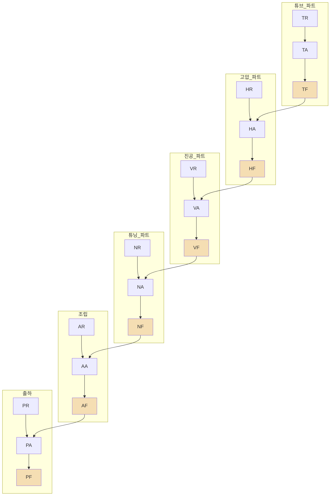
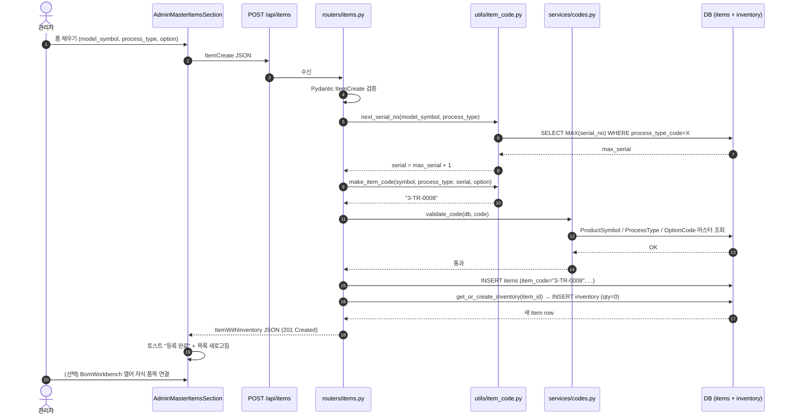

# 🏷 시나리오: 품목 등록

> [!summary] 한 줄 요약
> 관리자가 새 품목을 등록할 때 **ItemCode 4-파트 코드**(`{model_symbol}-{process_type}-{serial:04d}[-{option}]`)가 어떻게 자동 생성되고, **BOM** 과 어떻게 연결되는지를 화면 → API → 서비스 → DB 순서로 손가락으로 짚어 본다.

> [!info] 누가 읽어야 하나
> - 입사 1~2년차 비전공자 개발자 (오늘의 너)
> - DEXCOWIN MES 코드베이스에 처음 들어와서 "품목 코드가 뭔지, 어떻게 만들어지는지" 감이 없는 사람
> - AdminMasterItemsSection 또는 BomWorkbench 를 처음 여는 사람
>
> 먼저 [[처음_읽는_사람]] → [[ERP_MOC]] 를 훑었다고 가정한다. 용어는 [[용어사전]] 참고.

---

## 🎯 이 시나리오를 읽고 나면 알게 되는 것

1. **ItemCode 4-파트 코드** 각 파트가 무엇을 뜻하는지
2. `model_symbol` 이 슬롯 숫자들의 조합이라는 것 (예: DX3000 + ADX6000FB = `"36"`)
3. **process_type 18종** 이 어떤 분류 체계로 구성되는지 (부서 × 단계 행렬)
4. 코드가 중복 없이 만들어지는 `serial_no` 경합 위험과 대처법
5. 품목 등록 후 **BomWorkbench** 로 자식 품목을 연결하는 시점

---

## 🧑‍💼 등장인물

| 역할 | 누구 | 하는 일 |
|---|---|---|
| 관리자 | MES 운영자 | 품목 마스터 탭에서 새 품목 추가, model_symbol / process_type / option 선택 |
| 시스템 | DEXCOWIN MES 백엔드 | ItemCode 자동 생성, 중복 검증, DB 저장, 초기 재고 레코드 생성 |

---

## 🗺️ 큰 그림 — 품목 한 건이 만들어지는 동선

```
[관리자]
   │ 관리자 탭 → 품목 마스터 → "새 품목 추가" 클릭
   ▼
[AdminMasterItemsSection]
   │ model_symbol / process_type / option 선택
   ▼
[frontend/lib/api.ts]  →  POST /api/items
   ▼
[erp/backend/app/routers/items.py]
   │ ItemCreate 스키마 검증
   ▼
[erp/backend/app/utils/item_code.py]
   │ next_serial_no() → make_item_code()
   ▼
[erp/backend/app/services/codes.py]  (optional: /api/codes/generate 경로)
   │ validate_code() — 마스터 테이블 존재 여부 확인
   ▼
[erp/backend/app/models.py]  →  items 테이블 INSERT
   ▼
[erp/backend/app/services/inventory.py]
   │ get_or_create_inventory()  →  inventory 레코드(0수량) 생성
   ▼
[BomWorkbench]  (선택)
   │ 자식 품목 연결 → bom 테이블 INSERT
   ▼
[화면] 품목 목록 새로고침 + "등록 완료" 토스트
```

---

## 🎬 일반 시나리오 — 정상 흐름

### Step 1. 관리자 탭 → 품목 마스터 → 새 품목 추가

> [!example] 화면 위치
> - 화면 entry: `erp/frontend/app/legacy/_components/AdminMasterItemsSection.tsx`
> - "품목 추가" 버튼 클릭 → 모달 폼 오픈
>
> 아래 필드를 채운다.

| 입력 필드 | 예시 | 설명 |
|---|---|---|
| 품목명 | `튜브_A타입_신형` | 자유 텍스트. 고유 제약 없음 |
| model_symbol (슬롯 선택) | `[1, 5]` → `"36"` | DX3000(슬롯 1→기호 "3") + ADX6000FB(슬롯 5→기호 "6") |
| process_type | `TR` | 18종 중 선택 (아래 표 참고) |
| option_code | `BG` | 선택사항. 2자리 |
| 단위 | `EA` | EA / KG / L 등 |
| 안전재고 | `10` | 부족 경고 기준 수량 |

> [!info] model_symbol 이란
> 슬롯 번호(1~5) 여러 개를 고르면 각 슬롯의 기호 숫자를 **오름차순 정렬·연결** 한 문자열이 된다.  
> 예: 슬롯 [1, 4, 5] → 기호 ["3", "4", "6"] → `model_symbol = "346"`.  
> 단일 모델(완제품/최종조립체)은 반드시 **한 자리** 기호만 사용한다.  
> 관련 코드: [[erp/backend/app/utils/item_code.py]]

### Step 2. model_symbol / process_type / option 선택 → ItemCode 자동 생성

관리자가 폼을 채우면 프론트가 `POST /api/items` 를 호출한다. 코드 생성 순서:

1. `next_serial_no(model_symbol, process_type, db)` 호출
   - `items` 테이블에서 같은 `(model_symbol, process_type)` 의 최대 `serial_no` 조회
   - `+1` 해서 다음 serial 확정
2. `make_item_code(model_symbol, process_type, serial_no, option_code)` 로 코드 문자열 조립
3. `validate_code(db, code)` — ProductSymbol / ProcessType / OptionCode 마스터에 존재하는지 검증

결과 예시:

| 입력 | 결과 ItemCode |
|---|---|
| symbol=`3`, process=`TR`, option=없음 | `3-TR-0008` |
| symbol=`36`, process=`AR`, option=`BG` | `36-AR-0012-BG` |
| symbol=`346`, process=`TR`, option=없음 | `346-TR-0023` |

### Step 3. API 호출 → items 라우터 → 코드 서비스 → DB 저장

> [!example] 핵심 파일
> - 라우터: [[erp/backend/app/routers/items.py]]
> - 코드 유틸: [[erp/backend/app/utils/item_code.py]]
> - 코드 서비스(generate/validate): [[erp/backend/app/services/codes.py]]
> - DB 모델: [[erp/backend/app/models.py]]

`items` 테이블 INSERT 시 주요 컬럼:

| 컬럼 | 예시 값 | 비고 |
|---|---|---|
| `item_id` | UUID (자동) | PK |
| `item_name` | `"튜브_A타입_신형"` | |
| `item_code` | `"3-TR-0008"` | **통합 식별자** (commit f1ff96c) |
| `model_symbol` | `"3"` | 슬롯 기호 조합 |
| `process_type_code` | `"TR"` | FK → process_types.code |
| `serial_no` | `8` | 정수 (코드 표시 시 :04d 패딩) |
| `option_code` | `null` | 2자 또는 null |
| `unit` | `"EA"` | |

> [!info] item_code vs erp_code
> commit `f1ff96c` 에서 **`erp_code` 컬럼이 `item_code` 로 rename** 됐다.  
> DB 컬럼명은 `item_code`, 코드 내부 도메인 식별자(`erp_code`)는 레거시 문맥에서 여전히 보일 수 있다.  
> `io_lines.erp_code_snapshot` 같은 스냅샷 컬럼도 동일하게 rename 됐으니 혼동하지 말 것.

등록 직후 `services/inventory.py` 의 `get_or_create_inventory(item_id)` 가 호출되어 **수량 0** 인 inventory 레코드가 자동 생성된다. 이후 입고 시나리오는 [[시나리오_재고입출고]] 참고.

### Step 4. BOM 등록 (선택) — BomWorkbench 로 자식 품목 연결

> [!example] 화면 위치
> `erp/frontend/app/legacy/_components/_admin_sections/_bom_workbench/BomWorkbench.tsx`
>
> 품목 마스터에서 방금 만든 품목을 선택 → "BOM 편집" 버튼 → BomWorkbench 모달 오픈

BomWorkbench 에서:
1. 부모 품목 고정 (방금 만든 품목)
2. 자식 품목 검색 → 수량 입력 → 행 추가
3. 저장 → `POST /api/items/{item_id}/bom` → `bom` 테이블 INSERT
4. 여러 자식을 반복해서 추가하면 계층 구조(트리) 형성
5. 완료 후 "BOM 완료 표시" 버튼 → `items.bom_completed_at` 필드 세팅

BOM 등록은 선택이지만, 생산 배치에서 백플러시(자재 자동 차감) 가 제대로 동작하려면 BOM 이 연결되어야 한다. 자세한 생산 흐름은 [[시나리오_생산배치]] 참고.

---

## 🔢 ItemCode 4-파트 분해 예시

> [!example] 예시: `346-TR-0023-BG`

| 파트 | 값 | 의미 |
|---|---|---|
| `model_symbol` | `346` | DX3000(`3`) + ADX4000W(`4`) + ADX6000FB(`6`) 공용 품목 |
| `process_type` | `TR` | 튜브 파트 원자재 |
| `serial` | `0023` | TR 카테고리 내 23번째 |
| `option` | `BG` | 옵션코드 BG (베이지 등 색상/사양 구분) |

> [!example] 예시: `3-PA-0001`

| 파트 | 값 | 의미 |
|---|---|---|
| `model_symbol` | `3` | DX3000 단일 완제품 |
| `process_type` | `PA` | 출하 중간공정 (최종 완제품에만 단일 기호 허용) |
| `serial` | `0001` | PA 카테고리 첫 번째 |
| `option` | _(없음)_ | 옵션 없는 품목 |

파싱 로직은 [[erp/backend/app/services/codes.py]] 의 `parse_item_code()` 함수. 3토큰(option 없음)과 4토큰(option 있음) 모두 허용한다.

---

## 📊 process_type 18종

> [!info] 분류 원칙
> **부서(영역) × 단계(R/A/F)** 의 6×3 행렬.  
> - `R` = Raw (원자재·입고 단계)  
> - `A` = Assembly/중간공정 (가공·조립 중)  
> - `F` = Finished (공정완료·출하 가능)  
> suffix `F` 는 창고 배치 불가 — 출하 대기 상태.

| 코드 | 영역 | 단계 | 설명 | stage_order |
|---|---|---|---|---|
| `TR` | 튜브(T) | R | 튜브 원자재 | 10 |
| `TA` | 튜브(T) | A | 튜브 중간공정 | 20 |
| `TF` | 튜브(T) | F | 튜브 공정완료 | 25 |
| `HR` | 고압(H) | R | 고압 원자재 | 15 |
| `HA` | 고압(H) | A | 고압 중간공정 | 30 |
| `HF` | 고압(H) | F | 고압 공정완료 | 35 |
| `VR` | 진공(V) | R | 진공 원자재 | 25 |
| `VA` | 진공(V) | A | 진공 중간공정 | 40 |
| `VF` | 진공(V) | F | 진공 공정완료 | 45 |
| `NR` | 튜닝(N) | R | 튜닝 원자재 | 50 |
| `NA` | 튜닝(N) | A | 튜닝 중간공정 | 55 |
| `NF` | 튜닝(N) | F | 튜닝 공정완료 | 60 |
| `AR` | 조립(A) | R | 조립 원자재 | 45 |
| `AA` | 조립(A) | A | 조립 중간공정 | 65 |
| `AF` | 조립(A) | F | 조립 공정완료 | 70 |
| `PR` | 출하(P) | R | 출하 원자재 | 55 |
| `PA` | 출하(P) | A | 출하 중간공정 (최종 완제품) | 75 |
| `PF` | 출하(P) | F | 출하 공정완료 | 80 |



> [!info] 공정 흐름 규칙
> 화살표 `TF → HA` 는 "튜브 공정완료 품목이 고압 파트의 원재료로 투입된다"는 뜻.  
> 이 흐름 규칙은 `process_flow_rules` 테이블에 저장되고, 생산 배치 BOM 전개에 활용된다.  
> [[erp/backend/app/routers/codes.py]] 의 `GET /api/codes/process-flows` 로 조회 가능.

---

## 🔄 시퀀스 다이어그램 — 품목 등록 한 건의 일생



읽는 법: **serial 계산은 Util**, **마스터 검증은 Service**, **실제 INSERT 는 Router** — 역할 분담을 이렇게 기억하자.

---

## 📁 코드 위치 표

| 역할 | 경로 |
|---|---|
| 품목 마스터 화면 | [[erp/frontend/app/legacy/_components/AdminMasterItemsSection.tsx]] |
| BOM 편집 워크벤치 | [[erp/frontend/app/legacy/_components/_admin_sections/_bom_workbench/BomWorkbench.tsx]] |
| 품목 CRUD 라우터 | [[erp/backend/app/routers/items.py]] |
| 코드 마스터 라우터 (공정·기호·옵션) | [[erp/backend/app/routers/codes.py]] |
| 4-파트 코드 유틸 (make/next_serial) | [[erp/backend/app/utils/item_code.py]] |
| 코드 생성·검증 서비스 | [[erp/backend/app/services/codes.py]] |
| DB 모델 (Item, ProcessType, ProductSymbol) | [[erp/backend/app/models.py]] |

---

## ⚠️ 위험 포인트

> [!warning] 이 절은 [[위험지대_지도]] 와 같이 읽자

### 1. serial_no 경합 (Race Condition)

`next_serial_no()` 는 `SELECT MAX(serial_no)` 후 `+1` 하는 방식이다.  
두 명의 관리자가 **동시에** 같은 `(model_symbol, process_type)` 으로 등록 버튼을 누르면 **같은 serial** 을 계산할 수 있다.

- 현재 보호막: `item_code` 컬럼에 `UNIQUE` 제약 — 나중에 INSERT 된 쪽이 `IntegrityError` 로 실패하고 409 로 변환된다.
- 실질적으로 동시 등록은 드물지만, **대량 시드 스크립트** 를 병렬로 돌릴 때는 반드시 직렬 실행할 것.

### 2. 코드 중복 생성 방지선

`validate_code()` 는 마스터 테이블 **존재 여부**만 확인하고 중복 코드 여부는 확인하지 않는다.  
최종 중복 방지는 **DB UNIQUE 제약** 이므로, 직접 SQL 로 `item_code` 를 수동 설정하면 이 보호막이 뚫린다.

### 3. PA / AA 단일 슬롯 제약

`process_type` 이 `PA`(출하 중간공정) 또는 `AA`(조립 중간공정) 인 품목은 **model_symbol 이 한 자리** 이어야 하고, 해당 기호가 `is_finished_good=True` 인 슬롯이어야 한다.  
`validate_code()` 가 이를 검증하므로, 이 타입에 다중 기호(예: `"36"`)를 쓰면 400 에러.

### 4. process_type 을 새로 만들고 싶을 때

임의로 `"XR"` 같은 코드를 쓰면 `validate_code()` 에서 막힌다.  
새 공정 타입이 필요하면 `process_types` 테이블에 먼저 추가해야 한다. 함부로 추가하면 BOM 흐름 규칙과 생산 배치 로직이 예상 밖으로 동작할 수 있다. ([[AI_생성_코드_읽는_법]] 참고)

---

## ❓ FAQ

> [!question] Q. ItemCode 를 수동으로 지정할 수 있나?
> 기본 경로는 자동 생성. 수동으로 코드를 검증하려면 `POST /api/codes/parse` 로 파싱·검증 후 결과를 확인할 수 있다. 하지만 수동 지정은 serial_no 역추적이 불가능해지므로 **권장하지 않는다**.

> [!question] Q. 같은 이름의 품목을 두 개 만들 수 있나?
> `item_name` 에는 UNIQUE 제약이 없다. 실질적 고유 식별자는 `item_code` 다. 같은 이름 중복 시 목록에서 혼동하기 쉬우니 등록 전에 검색 먼저.

> [!question] Q. 품목을 삭제하면 BOM 과 재고도 지워지나?
> `items` 의 삭제는 `bom`, `inventory`, `transaction_logs` 에 `ON DELETE CASCADE` 가 걸려 있어 연쇄 삭제된다. 이력 보존을 원하면 삭제 대신 `item_name` 에 `[삭제]` 접두사를 붙이는 소프트 처리 관행을 쓴다. 실제 delete 구현은 [[erp/backend/app/routers/items.py]] 확인.

> [!question] Q. 엑셀에 있던 품목을 대량으로 올리려면?
> `backend/bootstrap_db.py --all` 또는 별도 seed 스크립트를 직렬로 실행한다. 런타임 API 는 현재 한 건씩 단건 등록이 표준이다.

> [!question] Q. BOM 없이 품목만 등록해도 괜찮나?
> 완전히 괜찮다. 재고 입출고는 BOM 없이도 동작한다. BOM 이 없으면 **생산 배치에서 백플러시(자동 자재 차감)** 가 동작하지 않는다는 차이만 있다.

> [!question] Q. process_type 이 정확히 몇 종인가?
> 2026-05-21 기준 **18종** (T/H/V/N/A/P 6 영역 × R/A/F 3 단계). 위 표 참고.

---

## 🔗 함께 읽으면 도움 되는 것

- [[처음_읽는_사람]] — 코드베이스 첫 발자국
- [[ERP_MOC]] — 전체 지도
- [[용어사전]] — ItemCode, model_symbol, process_type, BOM
- [[시나리오_재고입출고]] — 품목 등록 후 재고가 움직이는 흐름
- [[시나리오_생산배치]] — BOM 이 실제로 쓰이는 생산 현장
- [[AI_생성_코드_읽는_법]] — LLM 자동완성이 권하는 죽은 코드 식별
- [[위험지대_지도]] — serial_no 경합 / UNIQUE 제약 / PA 단일 슬롯 룰

---

Up: [[_guides]]
