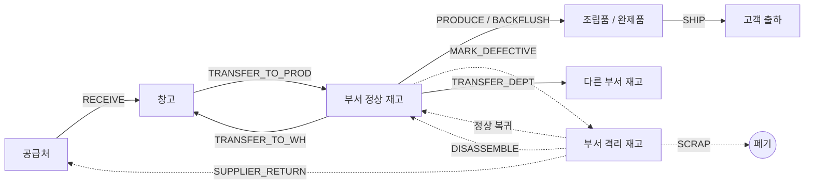
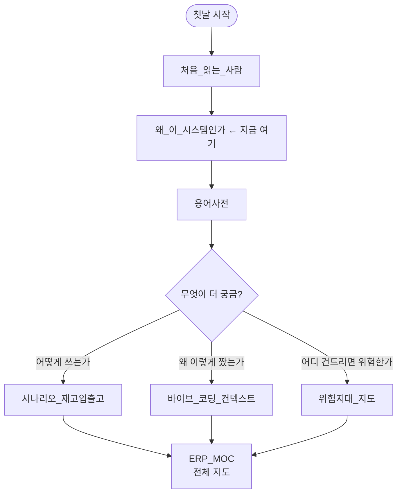

# 🎯 왜 이 시스템인가

> [!summary] 한 줄 결론
> **DEXCOWIN MES 는 "공장 자재가 지금 어디에, 얼마나, 어떤 상태로 있는지" 를 종이가 아닌 컴퓨터로 추적하기 위해 만들어진 제조 현장 운영 시스템이다.**

> [!info] 이 문서의 역할
> 이 가이드는 [[처음_읽는_사람]] 다음으로 읽는 두 번째 문서다. "이 시스템이 풀려는 진짜 문제가 뭐냐", "왜 ERP 가 아니라 MES 라고 부르냐", "이 시스템이 **아닌** 것은 뭐냐" 를 분명히 잡고 가는 게 목적이다. 코드 위치나 화면 사용법은 다루지 않는다.

#layer/meta #topic/vision

---

## 🏭 이 시스템이 풀려는 진짜 문제

먼저 시스템이 없을 때 현장에서 실제로 일어나던 일들을 보자. 이게 풀려는 문제다.

### 문제 1. 자재가 어디 얼마나 있는지 아무도 모른다

- 창고에 부품이 100개 들어왔는데, 며칠 뒤 조립 부서가 50개 가져가고, 진공 부서가 20개 가져갔다. 남은 게 몇 개인지 물어보면 "한 30개?" 같은 추측이 돌아온다.
- 같은 부품을 또 발주하기 직전, 사실은 조립 부서 한 구석에 박스째로 남아 있던 게 발견된다.
- 월말 재고 실사 때 장부와 실재고가 안 맞아서 몇 시간씩 맞추기 작업을 한다.

### 문제 2. 부서 간 재고 이동이 추적되지 않는다

- 창고 → 조립부 → 고압부 → 다시 창고. 이 흐름이 종이 전표나 카톡 메시지로만 굴러간다.
- "내가 분명히 줬는데" vs "안 받았는데" 같은 분쟁이 잦다.
- 부서장이 자기 부서 안에 뭐가 얼마나 있는지 실시간으로 모른다.

### 문제 3. 불량/폐기/공급처 반품 흐름이 종이로만 굴러간다

- 검사에서 불량이 나와도 "어디 한쪽에 빼둬" 로 끝난다. 그 부품이 격리됐다는 사실 자체를 시스템이 모른다.
- 며칠 뒤 다른 작업자가 그 격리 부품을 정상인 줄 알고 가져다 쓴다.
- 공급처에 반품한 수량과 폐기한 수량이 헷갈리고, 월말에 회계에 넘길 자료를 만들 때마다 다시 끌어모은다.

### 문제 4. BOM(부품 구성표)과 실제 생산이 따로 논다

- 한 제품 한 대를 만들려면 부품 30~50종이 필요하다. 누가 어떤 부품을 얼마나 가져갔는지 손으로 적는다.
- 분해 회수(완제품을 다시 뜯어서 자식 부품을 회수)할 때 무엇이 살아 돌아왔는지 추적이 안 된다.

> [!tip] 핵심 통찰
> 위 4가지를 한 줄로 묶으면 — **"부품 하나가 회사 안에서 거치는 모든 순간이 기록되어야 한다"** 이다. 이 한 줄을 위해 만들어진 게 DEXCOWIN MES 다.

---

## 🏷️ 왜 ERP 가 아니라 MES 라고 부르는가

> [!warning] 공식 명칭 규칙
> [[erp/CLAUDE.md]] 의 첫 줄에 명시되어 있다 — **Official system name: DEXCOWIN MES. Do not call it ERP or X-Ray in user-facing text or documents.**
>
> 폴더 이름은 `erp/` 이고 내부 식별자에 `xray-erp`, `erp_code` 같은 legacy 이름이 그대로 남아 있지만, **사용자 대상 문서/UI 에서는 무조건 "MES"** 라고 부른다. 이건 명칭 합의이고 협상 대상이 아니다.

### ERP vs MES 의 핵심 차이

| 항목 | ERP (전사적 자원 관리) | MES (제조 실행 시스템) |
|---|---|---|
| 주 대상 | 회사 전체 (회계/인사/영업/생산) | **제조 현장** |
| 다루는 데이터 | 돈, 사람, 계약, 매출 | **부품, 재고, 공정, 불량** |
| 단위 시간 | 월/분기/연 | **실시간 / 일 단위** |
| 사용자 | 본사 관리부서 | **현장 작업자, 부서장, 창고 담당** |
| 결재 흐름 | 전결 규정 / 비용 승인 | **부서 입출고 / 폐기 / 공급처 반품** |
| 대표 화면 | 회계 장부, 손익 보고서 | **재고 카드, 입출고 내역, 불량 허브** |

### 이 시스템이 MES 인 이유 (5가지)

1. **재고 위치를 부서×상태 단위로 잡는다.** [[erp/backend/app/models.py]] 의 `InventoryLocation` 은 `(item_id, department, status)` 로 한 행이 잡힌다. 회계 ERP 에는 이런 개념이 없다.
2. **결재가 회계 결재가 아니라 부서 결재다.** 창고 담당자와 부서장(생산부장 등)이 입출고를 승인한다 — 회계팀이 아니다.
3. **불량 처리 흐름이 1급 시민이다.** `MARK_DEFECTIVE`, `SCRAP`, `SUPPLIER_RETURN`, `DISASSEMBLE` 같은 트랜잭션 타입이 코어 enum 에 박혀 있다.
4. **BOM 과 생산 배치가 핵심 도메인이다.** 한 완제품을 만들기 위해 어떤 자식 부품이 얼마나 소모됐는지 (BOM expected vs actual used) 를 추적한다.
5. **품목코드가 공정 기반이다.** `TR/TA/TF` (튜브 라인), `HR/HA/HF` (고압) 같은 18개 공정코드로 품목을 분류한다. 회계 계정코드가 아니라 현장 공정 코드다.

> [!example] 한 번 더 못 박기
> 외부 사람에게 이 시스템을 설명할 때는 "DEXCOWIN 의 **제조 현장 운영** 을 위한 MES 입니다" 라고 말하면 된다. "ERP" 라고 말하면 회계/인사까지 한다는 오해를 산다.

---

## 🧱 핵심 기능 5가지

이 시스템이 실제로 무엇을 해주는지 5가지로 압축한다. 각각의 자세한 흐름은 별도 시나리오 노트로 분리되어 있다.

### 1. 재고 입출고 추적

- 부품이 회사에 들어오는 순간(`RECEIVE`) 부터 회사 밖으로 나가는 순간(`SHIP`) 까지 모든 이동이 기록된다.
- 창고와 부서를 오가는 이동(`TRANSFER_TO_PROD`, `TRANSFER_TO_WH`, `TRANSFER_DEPT`)도 한 줄씩 남는다.
- 어떤 부품을 누가 언제 얼마나 어디에서 어디로 옮겼는지 — 입출고 내역 화면 하나로 다 본다.
- 상세 흐름: [[시나리오_재고입출고]]

### 2. 부서 결재 라우팅

- 부품이 그냥 움직이지 않는다. 창고에서 부서로 나갈 때는 창고 담당이, 부서 안에서 낱개 보정이 있을 때는 부서장이 승인한다.
- 결재자가 **자기 부서** 만이 아니라 **상위 부서(생산부) 의 부서장** 이거나 **창고장(정/부)** 이어도 결재 가능하다.
- 결재 라우팅 모델: [[erp/docs/defect-handling-redesign.md]] 의 §3.3 참조.

### 3. 불량 처리 흐름

- 부품이 불량으로 발견되면 **격리** (`MARK_DEFECTIVE`) → 재고 위치 status 가 `PRODUCTION` → `DEFECTIVE` 로 바뀐다. 재고는 안 사라진다. 못 쓰는 상태로 표시될 뿐.
- 격리된 부품은 **정상 복귀** / **폐기** (`SCRAP`) / **공급처 반품** (`SUPPLIER_RETURN`) / **분해 회수** (`DISASSEMBLE`) 중 하나로 처리된다.
- 완제품(PA·PF) 격리 시 BOM 트리를 펼쳐서 자식 부품 단위로 살릴지 버릴지 결정한다.
- 상세 흐름: [[시나리오_분해반품]], [[erp/docs/defect-handling-redesign.md]]

### 4. 생산 배치 (큐 / 배치 단위 작업)

- 한 번에 한 줄씩 입출고를 찍는 게 아니라, 사용자가 여러 라인을 묶어서 한 번에 제출한다 — 이게 **IoBatch / IoBundle / IoLine** 구조다.
- `pending_quantity` 로 창고 보관량 중 큐에 잡힌 예약분을 따로 잡아둔다. 가용 재고 = 창고 + 생산 - 예약.
- 상세 흐름: [[시나리오_생산배치]]

### 5. 품목 마스터 / 품목코드 체계

- 부품 하나하나가 `Item` 로우로 존재한다. 현재 기준 722건.
- 품목코드는 4-파트 구조: `{모델기호}-{공정코드}-{일련번호}-{옵션코드}`. 예: `346-AF-0001`, `3-PA-0001-BG`.
- 공정코드 18종, 모델기호 100슬롯, 옵션코드 자유 텍스트. 자세한 규칙은 [[erp/docs/ITEM_CODE_RULES.md]].
- 상세 흐름: [[시나리오_품목등록]]

---

## 🔁 부품 한 개의 여행 (Mermaid)

부품 하나가 회사 안에서 어떤 길을 거치는지 한눈에 보자. 이 흐름의 모든 화살표가 트랜잭션 한 줄씩으로 기록된다.

> [!question] 화살표 옆 영문이 뭐예요?
> `RECEIVE`, `SHIP`, `MARK_DEFECTIVE` 같은 건 코드 안의 `TransactionTypeEnum` 값이다. 입출고 내역 화면에서 각 라인이 이 중 어떤 타입인지로 색이 다르게 표시된다. 자세한 의미는 [[용어사전]] 참조.

---

## 🗣️ 어떤 도메인 언어가 쓰이는가

이 시스템은 자기만의 어휘가 있다. 코드를 처음 보면 낯선 약어가 쏟아진다. 다음 용어들은 본문에서 풀지 않고 [[용어사전]] 으로 위임한다 — 거기 한 곳에만 정의를 둔다.

| 약어 / 용어 | 한 줄 의미 | 자세한 정의 |
|---|---|---|
| `ItemCode` | 4-파트 품목코드 ({모델기호}-{공정코드}-{일련번호}-{옵션코드}) | [[용어사전]] |
| `FlowBadge` | 입출고 내역에서 거래 타입을 시각적으로 보여주는 배지 | [[용어사전]] |
| `ADJUST 묶음` | 낱개 보정 라인이 들어간 작업 묶음 (부서 결재 필요) | [[용어사전]] |
| `SR-prefix` | StockRequest 의 인간 친화 코드 접두사 | [[용어사전]] |
| `MARK_DEFECTIVE` | 정상 재고를 불량으로 격리하는 트랜잭션 타입 | [[용어사전]] |
| `R / A / F 타입` | 원자재 / 조립품 / 완제품 공정 구분 | [[용어사전]] |
| `process_type_code` | 부서 필터의 진짜 기준 (category 아님) | [[용어사전]] |
| `RequestBucketEnum` | warehouse / production / defective / none — 재고가 어느 양동이에 있는지 | [[용어사전]] |
| `IoBatch / IoBundle / IoLine` | 한 번 제출의 감사 단위 / 펼친 묶음 / 실제 반영 라인 | [[용어사전]] |
| `pending_quantity` | 창고 보관량 중 큐 배치로 예약된 수량 | [[용어사전]] |

> [!warning] legacy 식별자 그대로 둘 것
> 본문에서는 "MES" 라고 부르지만, 코드 안의 `erp_code`, `xray-erp`, `frontend/app/legacy/` 같은 내부 식별자는 **이름만 보고 함부로 바꾸지 마라**. legacy 라는 이름이지만 사실 현재 활성 UI 다. 자세한 함정은 [[처음_읽는_사람]] 의 "헷갈리기 쉬운 것" 섹션 참조.

---

## 🚫 이 시스템이 아닌 것

이 시스템은 **이런 것을 하지 않는다.**

| 안 하는 것 | 왜 안 하나 |
|---|---|
| 회계 처리 | 매출/매입 전표, 손익계산, 세금계산서 — 다 안 한다. MES 는 부품의 물리적 이동만 본다. 돈은 보지 않는다. |
| 인사 관리 | 급여 / 근태 / 휴가 / 평가 — 다 안 한다. `Employee` 테이블이 있긴 하지만 이건 "이 작업을 누가 찍었나" 를 기록하는 용도지 인사 시스템이 아니다. |
| 고객 관리 (CRM) | 영업 활동, 거래처 관리, 견적/계약 — 안 한다. `SHIP` 트랜잭션의 reference_no 에 출하 정보가 기록될 뿐이다. |
| 생산 일정 계획 (MRP/APS) | "이번 주 어떤 제품을 몇 대 만들지" 자동 계획 — 안 한다. 사람이 결정해서 입력하면 그 결과를 기록할 뿐이다. |
| 품질 관리 시스템 (QMS) | 검사 성적서, 측정값 기록, SPC 차트 — 안 한다. 불량 격리만 한다. 어떤 측정치가 어땠는지는 기록하지 않는다. |
| 설비 관리 (CMMS) | 장비 점검, 보전 일정 — 안 한다. |
| 모바일 바코드 스캐너 (현재) | 아직 안 한다. 외부 연구 문서([[erp/docs/research/MOBILE_BARCODE_ARCHITECTURE.md]])는 있지만 구현 안 됨. |

> [!tip] 한 줄 정리
> **돈, 사람, 고객, 미래 계획은 다 다른 시스템의 영역이다. MES 는 "부품이 지금 어디에 있나" 한 가지만 잘 한다.** 새 요구사항이 들어왔을 때 이 한 줄에 안 맞으면 일단 의심해야 한다.

---

## 🧭 이 시스템의 작은 비밀

> [!info] 메타 컨텍스트
> 이 시스템은 Claude Code / Codex 와 함께 **바이브 코딩** 으로 만들어낸 결과물이다. 코드 한 줄 한 줄을 직접 타이핑한 게 아니라, 요구사항을 자연어로 던지고 AI 가 구현한 구조다.

이게 무슨 뜻이냐 하면:

- **주석이 적다.** 코드만 보고는 의도를 못 잡는 경우가 많다. 그래서 이 vault 가 존재한다.
- **AI 가 "있어 보이는" 코드를 만들어둔 흔적이 곳곳에 있다.** 안 쓰는 함수, 과한 추상화, 한 번 쓰고 만 helper — 의심하면서 봐라.
- **테스트 / verify 게이트가 안전망이다.** `scripts/dev/verify_local.ps1` 가 commit 전에 돌아가서 큰 사고를 막는다.
- **문서가 코드보다 빨리 거짓말한다.** [[erp/CLAUDE.md]] 가 명시하듯이 "docs 와 live code 가 충돌하면 live code 를 믿어라". 이 노트도 예외 아니다 — 확신이 안 서면 실제 코드를 확인하라.

자세한 메타 맥락과 작업 가이드는 [[바이브_코딩_컨텍스트]], 위험한 코드 구역 지도는 [[위험지대_지도]] 참조.

---

## 🗺️ 30분 / 2시간 추천 동선

| 순서 | 노트 | 왜 읽나 |
|---|---|---|
| 1 | [[처음_읽는_사람]] | 폴더 구조와 첫날 동선 |
| 2 | [[왜_이_시스템인가]] | 지금 이 노트 — 시스템의 존재 이유 |
| 3 | [[용어사전]] | 도메인 어휘 한 곳에 모음 |
| 4 | [[시나리오_재고입출고]] | 가장 자주 쓰이는 흐름의 구체 시나리오 |
| 5 | [[바이브_코딩_컨텍스트]] | 이 코드의 성격 / AI 협업 컨텍스트 |
| 6 | [[위험지대_지도]] | 함부로 건드리면 안 되는 구역 |
| 7 | [[ERP_MOC]] | Vault 전체 지도 (Map of Content) |

---

## 📚 추가로 읽을 것

### Vault 내부

- [[처음_읽는_사람]] — 첫날 안내서, 폴더 구조
- [[용어사전]] — 도메인 어휘 단일 소스
- [[바이브_코딩_컨텍스트]] — 이 시스템이 어떻게 만들어졌는가
- [[위험지대_지도]] — 코드의 함정과 위험 구역
- [[FAQ_전체]] — 자주 묻는 질문
- [[시나리오_재고입출고]] / [[시나리오_분해반품]] / [[시나리오_생산배치]] / [[시나리오_품목등록]] — 4대 시나리오
- [[ERP_MOC]] — Vault 전체 Map of Content

### 코드 / 문서 원본 (확신이 안 설 때 진짜 보러 가는 곳)

- [[erp/CLAUDE.md]] — AI/개발자 작업 규칙, 공식 명칭 규정
- [[erp/README.md]] — 최상위 소개
- [[erp/backend/app/models.py]] — 모든 도메인 엔티티의 원본 정의
- [[erp/docs/ITEM_CODE_RULES.md]] — 품목코드 최종 기준
- [[erp/docs/GLOSSARY.md]] — 백엔드 관점 용어집
- [[erp/docs/ARCHITECTURE.md]] — 폴더 구조와 레이어
- [[erp/docs/ERD.md]] — 엔티티 관계도
- [[erp/docs/defect-handling-redesign.md]] — 불량 처리 흐름 재설계 (설계 합의 / 구현 대기)
- [[erp/docs/AI_HANDOVER.md]] — AI 협업자 인수인계
- [[erp/docs/CODEX_PROGRESS.md]] — 진행 기록

---

> [!summary] 이 노트를 덮을 때 머리에 남아야 할 한 줄
> **DEXCOWIN MES = 부품이 회사 안에서 거치는 모든 순간을 기록하는 제조 현장 운영 시스템. ERP 아님. 회계/인사/CRM 아님.**

Up: [[_guides]]
