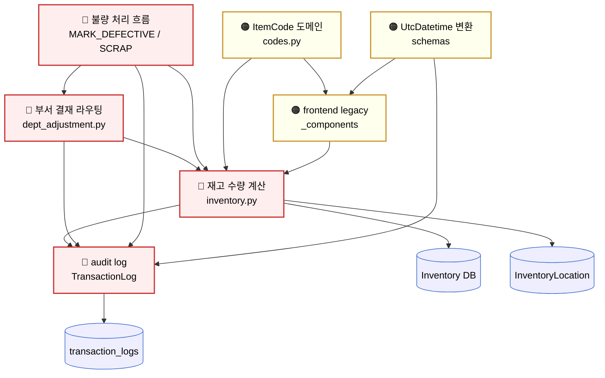
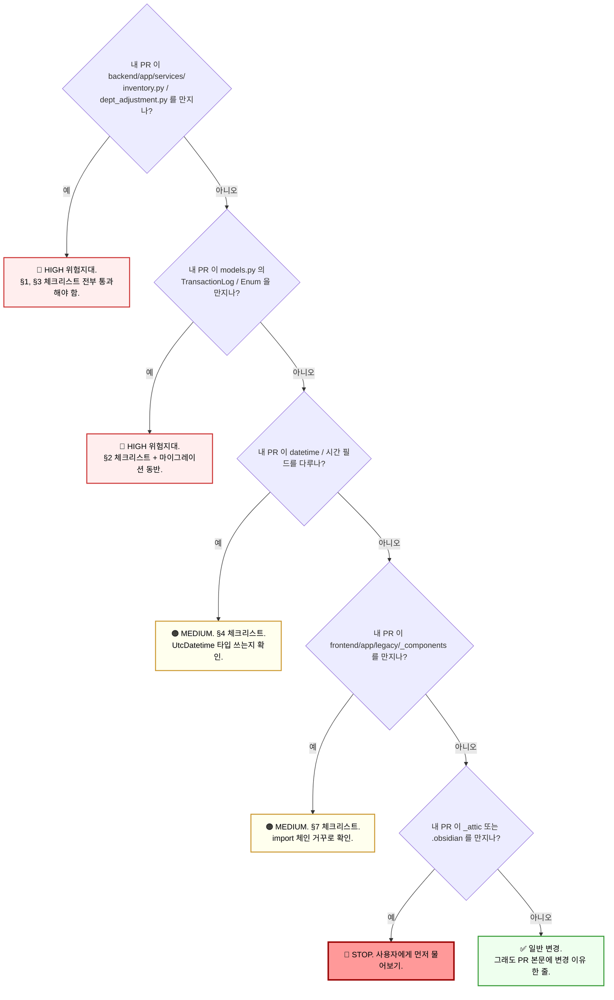

# ⚠️ 위험지대 지도

> [!danger] 한 줄 결론
> **이 영역들은 한 줄만 바꿔도 운영 데이터가 망가질 수 있다.**
> 손대기 전엔 반드시 이 문서를 읽고, 모르겠으면 물어봐라.

DEXCOWIN MES 는 Claude Code / Codex 로 "바이브 코딩" 된 시스템이다.
이 말은: **잘 돌아가는 것처럼 보이는 코드가 사실은 미묘한 가정 위에 서 있다는 뜻**이다.
무심코 한 줄 고치면, 재고 수량·결재·시간이 어긋난다.

이 문서는 "어디가 위험한지" 와 "왜 위험한지" 를 정리한다.
"손대지 마라" 가 아니라, **"왜 위험한지 알고 안전하게 손대라"** 가 목적이다.

---

## 🎯 이 문서를 읽는 법

1. 먼저 [§ 위험지대 한눈에 보기](#-위험지대-한눈에-보기) 표로 전체 영역을 훑는다.
2. 본인이 만지려는 파일이 있는 위험지대 섹션으로 점프.
3. "수정 전 체크리스트" 를 종이 또는 별도 메모에 옮겨 적고 한 줄씩 확인한다.
4. 체크리스트 중 하나라도 ❓ 가 남으면, 커밋하기 전에 시니어/사용자에게 물어본다.

> [!tip] 황금률
> **PR 한 줄도 위험지대를 건드린다면 설명 한 단락이 따라붙어야 한다.**
> "왜 이 변경이 안전한가" 를 본인이 PR 본문에 못 쓰면, 아직 안전하지 않은 거다.

---

## 🚦 위험 등급 정의

| 등급 | 의미 | 깨졌을 때 영향 |
| --- | --- | --- |
| 🔴 **높음 (HIGH)** | 운영 데이터 / 재고 수량 / audit 흐름에 영향 | 실제 재고와 시스템 재고가 어긋남, 감사 로그 손실, 결재 우회 |
| 🟠 **중간 (MEDIUM)** | 화면 정확성 / 권한 / 시간대 | 사용자가 잘못된 숫자/시간을 보고 잘못된 결정 |
| 🟡 **낮음 (LOW)** | 라벨 / 색상 / 정렬 | 사용자가 불편하지만 데이터는 정확 |

이 문서에서는 🔴 4개 + 🟠 3개 = 7개 위험지대를 다룬다.

`#risk/high` `#risk/medium`

---

## 🗺️ 위험지대 의존 관계

아래 다이어그램은 한 위험지대를 만졌을 때 **어디까지 영향이 번질 수 있는지** 보여준다.
화살표는 "이쪽이 깨지면 저쪽도 깨진다" 의 방향이다.



> [!info] 읽는 법
> - **재고 수량 계산** 이 무너지면 → audit, 결재, 불량, 프런트 전부 무너진다 (가장 깊은 뿌리).
> - **audit log** 가 무너지면 → 감사 추적 불가, 사고 시 원인 못 찾음.
> - **ItemCode** 가 무너지면 → 프런트 표시도 같이 무너진다.

---

## 🔴 1. 재고 수량 계산 (HIGH)

> [!danger] 손대기 전 반드시 [[처음_읽는_사람]] · [[erp/backend/app/services/integrity.py]] 확인
> 재고는 **3-bucket 모델**(창고 / 부서 PRODUCTION / 부서 DEFECTIVE)로 쪼개져 있고,
> `Inventory.quantity = warehouse_qty + Σ InventoryLocation.quantity` **불변식**이 항상 성립해야 한다.

**왜 위험한가**:
- `_sync_total()` 누락 → 총량과 부분합이 어긋남. **이미 실제 운영 데이터로 발생한 적 있음**.
- `_lock_inventory()` / `_lock_location()` 없이 `Inventory.warehouse_qty += qty` 식으로 직접 더하면, 동시에 두 요청이 들어왔을 때 **race condition** 으로 음수 재고 또는 수량 손실 발생.
- 가용 재고 = `warehouse_qty + Σ(PRODUCTION) - pending_quantity` 이고 **불량은 가용에서 빠진다**. 이 공식을 바꾸면 출고 가능 여부 판단이 깨진다.
- `sa_update().where(... >= qty)` 패턴(원자적 조건부 UPDATE) 을 그냥 `if loc.quantity >= qty: loc.quantity -= qty` 로 바꾸면 동시성 안전성이 사라진다.

**관련 파일**:
- [[erp/backend/app/services/inventory.py]] — 3-bucket 모델 핵심 서비스 (713 lines)
- [[erp/backend/app/routers/inventory/transactions.py]] — 트랜잭션 라우터
- [[erp/backend/app/services/integrity.py]] — 정합성 점검 (오프라인 검증 도구)
- [[erp/backend/app/models.py]] — `Inventory`, `InventoryLocation` 모델

**수정 전 체크리스트**:
- [ ] `Inventory.quantity = warehouse_qty + Σ InventoryLocation.quantity` 불변식이 내 변경 후에도 성립하는가?
- [ ] 쓰기 경로(`write`)에서 `_lock_inventory()` 또는 `_lock_location()` 을 호출했는가?
- [ ] 수량을 변경한 모든 경로에서 마지막에 `_sync_total(db, inv)` 가 호출되는가?
- [ ] 부서간 이동인 경우 데드락 방지 정렬(`sorted([...])`)이 들어갔는가?
- [ ] 음수 재고가 생길 수 있는 경로인가? (조건부 UPDATE 의 `>= qty` 가드)
- [ ] SQLite / PostgreSQL 양쪽에서 동작하는가? (`_is_sqlite` 분기)

**과거에 깨진 적**:
- `8584ad2 재고 이원화: 창고/생산/불량 버킷 분리 및 실재고 입력 도구 추가` — 3-bucket 으로 쪼개진 시점. 이전 코드는 단일 컬럼이었음.
- 음수 재고 사건이 한 번 이상 발생했음 — 이후 모든 쓰기 경로에서 `sa_update().where(... >= qty)` 패턴으로 전환됨.

> [!warning] 가장 흔한 함정
> "재고 한 줄만 빼면 되겠지" 하고 `inv.warehouse_qty -= qty` 한 줄 작성 → 락 없음, 음수 가드 없음, `_sync_total` 호출 없음. **세 가지 모두 빠짐**. 항상 기존 헬퍼 함수(`consume_warehouse`, `consume_from_department`, `transfer_to_*`) 를 거쳐 가라.

`#risk/high` `#layer/backend` `#topic/inventory`

---

## 🔴 2. Audit log / 입출고 내역 (HIGH)

> [!danger] 한 번 쓰면 **수정 금지**
> `TransactionLog` 는 입출고 흐름 추적의 **진실의 소스(Source of Truth)** 다.
> 이걸 UPDATE / DELETE 하면 감사 추적이 끊기고, "왜 이 수량이 됐는지" 영원히 알 수 없게 된다.

**왜 위험한가**:
- `quantity_before`, `quantity_after` 는 **그 시점의 스냅샷**이다. 나중에 다시 계산해서 채우려고 하면 절대 안 된다 — 그 사이 다른 트랜잭션이 있었을 수 있음.
- `transaction_type` enum 에 값을 추가/제거하는 건 마이그레이션 의무. 그냥 추가하면 기존 데이터에 빈 칸이 생긴다.
- "내역 수정" 요구가 들어오면 → **새 행을 추가**(취소/보정 트랜잭션)해야지, 기존 행을 UPDATE 하면 안 된다.
- 라우터의 commit 순서 망치면 → 재고만 바뀌고 로그가 안 남거나, 그 반대.

**관련 파일**:
- [[erp/backend/app/models.py]] — `TransactionLog` (line 354), `TransactionTypeEnum`
- [[erp/backend/app/routers/inventory/transactions.py]] — 트랜잭션 작성 진입점
- [[erp/backend/app/services/dept_adjustment.py]] — `submit_adjustment` 가 TransactionLog 를 직접 생성
- [[erp/backend/app/services/integrity.py]] — TransactionLog 와 Inventory 정합성 비교

**수정 전 체크리스트**:
- [ ] 내 PR 에 기존 `TransactionLog` 행을 UPDATE / DELETE 하는 코드가 있는가? (있으면 ❌)
- [ ] `transaction_type` enum 에 값을 추가했다면 마이그레이션 스크립트도 같이 있는가?
- [ ] 재고를 바꾸는 모든 경로가 같은 트랜잭션 안에서 `TransactionLog` 도 추가하는가?
- [ ] `quantity_before` 를 계산할 때 **변경 전** 값을 잡아두었는가? (`_sync_total` 호출 전 시점)
- [ ] `reference_no` (요청 ID) 가 채워졌는가? (나중에 추적 불가하면 곤란)

**과거에 깨진 적**:
- `21e98cd data: 5월 입출고 audit 로그 갱신 — SR-20260520-052533 불량처리 승인 기록 1건` — audit 누락분을 수동으로 메우는 데이터 패치가 실제로 발생함. **이런 일이 또 일어나면 안 된다**.

> [!warning] 자주 하는 실수
> "이건 화면용 변경이니까 로그 안 남겨도 되겠지" → 화면에서 수량 보이는데 로그 없으면, 사용자가 출고했을 때 추적이 끊긴다. **수량을 움직이는 모든 경로에 로그가 따라가야 한다**.

`#risk/high` `#layer/backend` `#topic/audit`

---

## 🔴 3. 부서 결재 라우팅 (HIGH)

> [!danger] 최근 재설계됨 — [[erp/docs/defect-handling-redesign.md]] 부터 읽어라
> 누가 누구의 결재를 할 수 있는지 룰이 **코드와 시드 데이터 양쪽에 박혀 있다**.
> 룰을 바꾸면 결재 우회 또는 결재 잠김(아무도 결재 못 함)이 발생한다.

**왜 위험한가**:
- 부서 결재 권한은 단순 문자열 일치가 아니라 **계층 구조**다.
  - 라인(튜브/고압/진공/튜닝/조립/출하) 자체에는 부서장이 없음.
  - **생산부장(이필욱·김건호)** 또는 **창고장(정/부)** 만 라인 결재 가능.
- `submit_adjustment()` 는 `flush()` 만 하고 commit 은 라우터에서. **commit 순서가 깨지면** 결재 흐름 중간에 멈춰 재고만 움직이고 로그가 안 남거나 그 반대.
- `direction="defective"` 라인은 **격리(MARK_DEFECTIVE)** 트랜잭션을 만들어 부서별 PRODUCTION → DEFECTIVE 로 옮긴다. 이 라인의 `source_dept` 와 `target_dept` 를 잘못 매핑하면 격리된 게 다른 부서 불량창에 쌓인다.

**관련 파일**:
- [[erp/backend/app/services/dept_adjustment.py]] — 핵심 서비스
- [[erp/backend/app/routers]] — 부서 조정 라우터들
- [[erp/backend/app/services/stock_requests.py]] — 결재 권한 체크 (`approver.department != request.requester_department` 자리)
- [[erp/docs/defect-handling-redesign.md]] — 최근 재설계 합의 문서

**수정 전 체크리스트**:
- [ ] 결재 권한 체크 함수(`is_ancestor_department` 등)를 우회하지 않는가?
- [ ] `_TRANSACTION_TYPE_MAP` 의 (direction, sub_type) 키 매핑을 추가/변경하지 않는가? (재고 이동과 트랜잭션 타입이 어긋남)
- [ ] `submit_adjustment` 의 처리 순서(out → defective → in)를 바꾸지 않는가? (소비 먼저, 입고 마지막 규칙)
- [ ] `lock_inventories` 의 다품목 일괄 락을 우회하지 않는가? (데드락 위험)
- [ ] 시드 데이터(이필욱·김건호 소속) 를 손댄다면 부서 계층 마이그레이션도 같이 가는가?

**과거에 깨진 적**:
- `4d5861a docs: 불량 처리 흐름 재설계 문서 추가` — 결재 라우팅 버그를 정식 문서로 정리. `Employee.department` 가 단일 문자열이라 한 부서장이 산하 라인을 결재 못 하는 문제가 있었음.

> [!warning] 라인 결재의 진실
> **튜브·고압·진공·튜닝·조립·출하 라인 자체에는 결재자 풀이 비어 있다.** 라인에서 올라오는 결재는 항상 (1) 생산부장 또는 (2) 창고장 경로로만 처리된다. "라인 부서장이 결재한다" 는 가정으로 코드 짜면 즉시 깨진다.

`#risk/high` `#layer/backend` `#topic/approval`

---

## 🟠 4. UtcDatetime 변환 (MEDIUM)

> [!warning] 9시간 오차 사건이 실제로 발생함
> 응답 스키마에서 UTC ↔ KST 변환 잘못하면 **모든 시간이 9시간 어긋난다**.
> 사용자는 "오늘 만든 거" 가 "어제 만든 거" 로 보이고, audit log 의 시각도 어긋난다.

**왜 위험한가**:
- DB 는 UTC 로 저장(`naive datetime` 이지만 UTC 기준). 응답할 때 KST 로 변환해서 보내야 함.
- 신규 응답 스키마를 만들 때 `datetime` 타입을 그냥 쓰면 → tzinfo 없는 naive 가 나가서 프런트가 UTC 인지 KST 인지 모름.
- 시간대 표기를 한 번 잘못 보내면 **사용자가 그 잘못된 시간을 기준으로 결재/판단**해서 데이터 자체가 오염될 수 있다.

**관련 파일**:
- [[erp/backend/app/schemas.py]] — 응답 스키마들 (UtcDatetime 변환 정의)
- [[erp/backend/app/schemas]] — 도메인별 스키마 폴더 (있다면)
- [[erp/backend/app/services]] — 응답 직전에 datetime 을 다루는 곳

**수정 전 체크리스트**:
- [ ] 새로 만든 응답 스키마의 datetime 필드가 `UtcDatetime` (또는 정의된 표준 타입) 으로 선언됐는가?
- [ ] 응답 만들기 직전에 timezone 변환을 다시 하지 않는가? (이중 변환 위험)
- [ ] 프런트에서 받는 시각이 ISO 8601 + offset (`2026-05-21T15:00:00+09:00`) 형식인가?
- [ ] DB 에 저장할 땐 naive UTC 인가? (KST 로 저장하면 안 됨)

**과거에 깨진 적**:
- `4db421a 2026-05-20 backend: F4b 완료 — UtcDatetime을 전체 응답 스키마로 확산 (9h 오차 근본 수정)` — **9시간 오차 사건의 근본 수정 커밋**. 이 커밋 이전 스키마를 참고하지 말 것.
- `ab38bcf 2026-05-20 docs: F4b 완료에 따라 작업 계획 문서 제거` — F4b 완료 표시.

> [!tip] 디버깅 팁
> 의심되면 `console.log(new Date(apiResponse.created_at).toLocaleString('ko-KR'))` 로 프런트에서 찍어보고, 같은 값을 백엔드 로그(KST) 와 비교한다. 9시간 차이 나면 변환 누락.

`#risk/medium` `#layer/backend` `#topic/datetime`

---

## 🔴 5. 불량 처리 흐름 (HIGH)

> [!danger] 상태 머신 재설계 직후 — [[erp/docs/defect-handling-redesign.md]] 정독 필수
> `MARK_DEFECTIVE` / `SCRAP` / `SUPPLIER_RETURN` / `DISASSEMBLE` 4개 트랜잭션이
> "재고 상태 머신" 으로 엮여 있다. 한 트랜잭션의 의미를 바꾸면 전체 머신이 깨진다.

**왜 위험한가**:
- 불량 상태는 **`PRODUCTION` / `DEFECTIVE` 2개만**. "재작업중" 같은 별도 상태를 추가하지 말 것 (이미 결정됨).
- 격리(MARK_DEFECTIVE) = 즉시 처리, 결재 없음.
- 폐기(SCRAP) / 공급처 반품(SUPPLIER_RETURN) / 분해(DISASSEMBLE) = **결재 필수**.
- 분해 시 살린 자식 부품은 **분해한 부서의 정상 재고로 즉시 입고**. 다른 부서로 넣으면 안 됨.
- PA·PF(완제품·조립품) 는 **격리 후에만** 폐기/분해 가능. 정상에서 바로 폐기 안 됨.
- R(원자재) 는 정상에서 바로 공급처 반품/폐기 가능 (외부에서 사 온 거니까).

**관련 파일**:
- [[erp/docs/defect-handling-redesign.md]] — 설계 합의 문서 (먼저 읽어라)
- [[erp/backend/app/services/dept_adjustment.py]] — `direction="defective"` 처리
- [[erp/backend/app/services/inventory.py]] — `mark_defective`, `return_to_supplier`
- [[erp/backend/app/models.py]] — `TransactionTypeEnum` (line 59-75), `LocationStatusEnum`
- [[erp/frontend/app/legacy/_components/_warehouse_v2/ioWorkType.ts]] — 워크타입 [불량]

**수정 전 체크리스트**:
- [ ] `LocationStatusEnum` 에 새 상태를 추가하려는가? (재설계 합의: 추가 금지)
- [ ] `MARK_DEFECTIVE` 가 두 위치를 동시에 건드림(PRODUCTION 감소 + DEFECTIVE 증가) — 둘 다 같은 트랜잭션에서?
- [ ] 분해 시 살린 자식의 부서가 `_dept_for_item()` 폴백이 아닌 **분해한 부서**로 들어가는가?
- [ ] 결재 필요한 액션(SCRAP / SUPPLIER_RETURN / DISASSEMBLE) 이 결재 우회 경로 없는가?
- [ ] 사유(reason / category) 가 모든 액션에 필수로 들어오는가?

**관련 enum 값** (수정 금지 영역):

```text
TransactionTypeEnum:
  MARK_DEFECTIVE   ← 격리 (즉시)
  SCRAP            ← 폐기 (결재 필요)
  SUPPLIER_RETURN  ← 공급처 반품 (결재 필요)
  DISASSEMBLE      ← 분해 (결재 필요)
  LOSS, RETURN     ← 별도 의미
```

**과거에 깨진 적**:
- `4d5861a docs: 불량 처리 흐름 재설계 문서 추가` — 흐름 재설계.
- `8e77f7f 2026-05-19 mobile: Task 3-2 — 불량격리 wizard 모바일 구현 기초` — 모바일 위자드 구현.

> [!warning] PA·PF 분해 시 가장 흔한 실수
> 분해한 본인(PF) 을 `SCRAP` 으로 처리하는 게 아니라 **`DISASSEMBLE`** 으로 처리해야 한다. 둘 다 수량을 줄이지만 의미가 완전히 다름 — 분해는 자식이 살아남고, 폐기는 자식까지 통째로 사라진다.

`#risk/high` `#layer/backend` `#topic/defect`

---

## 🟠 6. ItemCode 도메인 (MEDIUM)

> [!warning] `ErpCode` 는 **legacy 식별자**, 본문 도메인에선 `ItemCode`
> 이름이 두 개라고 헷갈리지 말 것. 둘 다 같은 4-part 코드(`3-PA-0012-WM`) 를 가리킨다.
> 단, **legacy 식별자 `xray-erp` 와 `erp_code` 변수명은 rename 금지** (CLAUDE.md 룰).

**왜 위험한가**:
- 코드 포맷이 정해져 있음: `[제품기호]-[구분코드]-[일련번호]-[옵션코드]`.
- `parse_item_code()` / `format_item_code()` 의 검증 룰을 느슨하게 만들면 잘못된 코드가 DB 에 들어간다.
- PA(완제품) / AA(최종 조립체) 는 **단일 슬롯 심볼만 허용** (`3-PA-0012` OK, `376-PA-0012` ❌).
- 원자재/조립품은 다중 슬롯 허용 (`376-TR-0012-BG` 는 DX3000·COCOON·ADX6000FB 공용).
- `item_code` 컬럼은 [[처음_읽는_사람]] 기준으로 **items 테이블 통합 완료** (commit f1ff96c). 별도 테이블에 흩어진 옛 코드 참조 금지.

**관련 파일**:
- [[erp/backend/app/services/codes.py]] — parse / format / validate / generate
- [[erp/backend/app/models.py]] — `Item.item_code`, `ProductSymbol`, `OptionCode`, `ProcessType`
- [[erp/frontend/app/legacy/_components]] — `formatErpCode`, `erpCodeDept` 등 표시 헬퍼

**수정 전 체크리스트**:
- [ ] `ItemCode` 도메인 객체를 새로 만들 때 `parse_item_code` 의 검증을 우회하지 않는가?
- [ ] PA / AA 에 다중 심볼을 허용하려는가? (룰 위반)
- [ ] `xray-erp`, `erp_code`, `ErpCode` 같은 **legacy 식별자**를 rename 하려는가? (CLAUDE.md 금지)
- [ ] 프런트에서 코드를 직접 `${symbol}-${type}-${serial}` 식으로 조립하려는가? (`format_item_code` 헬퍼 거치기)
- [ ] 시리얼은 0-padding 4자리(`0012`)지만 표시는 compact(`12`) 일 수 있음 — 두 모드 모두 처리?

**과거에 깨진 적**:
- `f1ff96c chore: items.item_code 통합 + ErpCode → ItemCode 도메인 rename` — 도메인 객체 rename. 본문은 ItemCode, legacy 외부 식별자만 ErpCode 유지.
- `91a5a83 refactor: item_code → erp_code 전면 교체` — 그 이전엔 거꾸로 갔던 적도 있음. **이름 바꾸기 PR 은 매우 위험**.
- `4804828`, `fffd64d`, `f43988a`, `4b7609d` — 2026-05-03 frontend rename 작업 (Round-10D/E). 도메인 이름 바꾸는 작업은 항상 여러 PR 로 쪼개졌음.

> [!tip] 식별자 혼동 방지
> 본문에선 **ItemCode** 라고 부르고, DB 컬럼 / legacy 함수명만 **erp_code / ErpCode** 그대로 둔다. 이름이 다른 게 헷갈리면, 코드 컴포넌트에 주석으로 "= ItemCode" 적어두면 된다.

`#risk/medium` `#layer/backend` `#topic/identifier`

---

## 🟠 7. frontend legacy 의 _components / _inventory_sections / _warehouse_steps (MEDIUM)

> [!warning] 한 섹션 바꾸면 다른 섹션과 상태 공유가 깨질 수 있다
> legacy 폴더 안의 컴포넌트들은 **props/state drilling** 으로 엮여 있다.
> 한 곳의 prop 시그니처를 바꾸면 호출 측에서 조용히 `undefined` 가 흐른다.

**왜 위험한가**:
- "legacy" 라고 표시돼 있지만 **실제 렌더링은 여기서 일어남**. `_attic/frontend/_archive/` (옛 `frontend/_archive/`) 와 다름!
- 입출고탭은 5개 섹션(요청 작성 / 작업 중 / 내 요청 / 창고 승인함 / 부서 승인함) 이 같은 상위 상태를 공유.
- 한 섹션에서 `setWorkType(...)` 같은 상태 변경이 일어나면 다른 섹션의 카운트/필터가 즉시 영향 받음.
- CLAUDE.md 의 룰: **프런트 코드 편집 전에 실제 렌더/import 경로를 먼저 확인해라**. 문서랑 라이브 코드가 다르면 라이브 코드를 믿어라.

**관련 파일**:
- [[erp/frontend/app/legacy/_components]] — 입출고 / 부서조정 컴포넌트 본진
- [[erp/frontend/app/legacy/_components/_warehouse_sections/WarehouseSectionTabs.tsx]] — 입출고탭 5섹션
- [[erp/frontend/app/legacy/_components/_warehouse_v2/ioWorkType.ts]] — 워크타입 정의
- (없는 폴더는 본인이 만지려는 화면 기준으로 Glob 으로 먼저 찾기)

**수정 전 체크리스트**:
- [ ] 진짜 이 컴포넌트가 렌더링되는지 import 체인을 거꾸로 따라가 봤는가?
- [ ] props 시그니처를 바꾼다면, 호출 측 전부 같이 업데이트되는가? (TypeScript 에러 안 떠도 런타임 `undefined` 가능)
- [ ] 한 섹션의 상태 변경이 다른 섹션의 카운트/필터에 영향 주는 경로를 확인했는가?
- [ ] `_attic/` 안의 동명 파일을 잘못 편집하고 있진 않은가? (옛 `_archive`, `_backup`, `frontend/_archive` 가 모두 이 안에 통합됨 — 절대 만지지 말 것)
- [ ] 모바일 위자드와 데스크톱 위자드가 같은 컴포넌트를 공유하는가? (모바일만 고치다 데스크톱 깨지는 경로)

**과거에 깨진 적**:
- `17ef83e 2026-05-19 mobile: Steps 1-5 — 모바일 UI 전면 재설계 (Desktop*View 재사용)` — Desktop\*View 재사용 패턴. 한 곳을 고치면 양쪽에 영향.
- `d61d9b4 2026-05-18 desktop: 입출고 내역 상단 재설계 + 백엔드 부서별 집계` — 백엔드 집계 + 프런트 표시 동시 변경.
- `c6c8be0 2026-05-15 desktop: 입출고 내역 UX 전면 재설계 (scope · 서버필터 · 묶음 · 흐름)` — UX 전면 재설계.

> [!info] 프런트 디버깅 첫 단계
> "이 화면 왜 이래?" 싶으면 **React DevTools 로 컴포넌트 트리부터 확인**. 같은 이름 컴포넌트가 여러 폴더(legacy / archive / mobile) 에 있어서, import 가 어디서 왔는지 잘못 추측하기 쉽다.

`#risk/medium` `#layer/frontend` `#topic/ui-state`

---

## 🚫 "묻고 손대라" 폴더 (절대 만지지 말 것)

이 폴더들은 **읽기 전용**으로 취급한다. 만지고 싶으면 사용자에게 먼저 물어봐라.

> [!danger] erp/_attic/ — 모든 격리 폴더의 통합 보관소
> 옛 `_archive/`, `_backup/`, `frontend/_archive/` 가 이제 **모두 이 안에 들어있다**.
> CLAUDE.md 의 옛 표기(`_archive` · `_backup` · `frontend/_archive`)는 그대로 남아 있지만, 실제 폴더는 여기 한 곳에 모여 있다.
> - `erp/_attic/_archive/` — 옛 루트 `_archive/` 의 자리 (참고 이미지, BOM 초안 등)
> - `erp/_attic/backend/_backup/` — 옛 `backend/_backup/` 의 자리 (DB 백업 `.bak`, `.backup-...`)
> - `erp/_attic/_archive/_backup/` — 일부 백업은 이 경로에도 분산돼 있음
> - `erp/_attic/frontend/_archive/` — 옛 `frontend/_archive/` 의 자리 (옛 UI 컴포넌트)
> - 그 외 `_attic/backend`, `_attic/frontend`, `_attic/docs`, `_attic/scripts`, `_attic/ai`, `_attic/data`, `_attic/outputs`, `_attic/.dev` 등 — 도메인별 격리본
>
> **절대 만지지 말 것.** 운영 백업 / 이전 버전 / 옛 작업 노트 보존 영역이다. `_attic/` 자체가 격리 정책이고 **재구성도 금지**(`attic-quarantine-convention`).
> - 여기 있는 코드가 호출되는 것처럼 보이면, 그건 라이브 코드의 import 경로가 잘못된 거다. 라이브 코드를 고쳐라.
> - 백업이 라이브 코드와 달라야 하는 게 정상이다. "동기화" 하려고 하지 마라.
> - 예외: `_attic/docs/openapi.json` 같은 게이트 파일은 정식 빌드 산출물이므로 별도 룰을 따른다.

> [!danger] erp/.obsidian/  (그리고 `_attic/.obsidian/`)
> Obsidian 플러그인 / 워크스페이스 설정. **절대 손대지 말 것**.
> 이걸 망치면 사용자 본인의 Vault 편집 환경이 깨진다.

> [!warning] legacy 식별자 (`xray-erp`, `erp_code` 도메인 식별자)
> CLAUDE.md 룰: **명시적 요청 없이 rename 금지**.
> 이름이 도메인 의미와 안 맞아 보여도, 외부 식별자로 굳어져 있을 수 있다. 바꾸려면 그 영향 범위(설정 / 문서 / 외부 통신) 부터 다 끄집어내고 사용자 확인을 받아라.

`#topic/safety`

---

## 📋 위험지대 한눈에 보기

| 영역 | 위험도 | 핵심 파일 | 손대기 전 보는 곳 |
| --- | --- | --- | --- |
| 재고 수량 계산 | 🔴 | [[erp/backend/app/services/inventory.py]] | [[erp/backend/app/services/integrity.py]] |
| audit log | 🔴 | [[erp/backend/app/models.py]] (`TransactionLog`) | [[처음_읽는_사람]] |
| 부서 결재 | 🔴 | [[erp/backend/app/services/dept_adjustment.py]] | [[erp/docs/defect-handling-redesign.md]] |
| UtcDatetime | 🟠 | [[erp/backend/app/schemas.py]] | git log `4db421a` (F4b 완료 commit) |
| 불량 처리 | 🔴 | [[erp/backend/app/services/dept_adjustment.py]] | [[erp/docs/defect-handling-redesign.md]] |
| ItemCode 도메인 | 🟠 | [[erp/backend/app/services/codes.py]] | [[용어사전]] |
| frontend 섹션 | 🟠 | [[erp/frontend/app/legacy/_components]] | [[처음_읽는_사람]] |

---

## 🧭 의사결정 트리: "내가 지금 위험지대를 만지고 있나?"



---

## 🧪 "수정했는데 안전한지 어떻게 알지?" — 검증 루프

> [!example] 매번 돌리는 검증
> 위험지대를 만진 PR 은 푸시 전에 아래를 모두 통과해야 한다.

1. **백엔드 단위 테스트**
   ```bash
   cd backend
   pytest tests/ -q
   ```
2. **정합성 점검** (`integrity.py` 호출 도구가 있다면)
   - `Inventory.quantity` vs `warehouse_qty + Σ InventoryLocation.quantity` 일치하는지 확인
   - 음수 재고 0건 확인
3. **로컬 검증 스크립트** (CLAUDE.md 룰)
   ```powershell
   powershell -ExecutionPolicy Bypass -File .\scripts\dev\verify_local.ps1
   ```
4. **수동 시나리오** (위험지대를 만진 경우)
   - 재고 변경: 입고 → 부서 이동 → 출고 → audit log 에 3건 다 남는지
   - 결재: 생산부장이 진공부 격리 결재 시도 → 성공
   - 시간: 응답 datetime 이 KST(+09:00) 로 나오는지 한 번 찍어보기

5. **OpenAPI 게이트** (스키마를 만진 경우)
   - `_attic/docs/openapi.json` 재생성 필수.

> [!warning] 검증 없이 푸시 금지
> CI 가 통과해도 위험지대 변경은 사람이 한 번 더 봐야 한다. PR 본문에 "수동 검증한 시나리오" 를 적어라.

---

## 📚 추가로 읽을 것

이 문서는 위험지대 "지도"다. 각 영역의 깊은 컨텍스트는 아래 문서들에 있다.

- [[처음_읽는_사람]] — 입사 첫날 읽는 코드베이스 안내서. 큰 그림.
- [[AI_생성_코드_읽는_법]] — Claude/Codex 가 생성한 코드를 안전하게 읽는 법.
- [[용어사전]] — ItemCode / ErpCode / 부서 / 트랜잭션 타입 등 도메인 용어 사전.
- [[바이브_코딩_컨텍스트]] — 왜 이 시스템이 "바이브 코딩" 결과물인지, 그 영향을 어떻게 다룰지.
- [[erp/docs/defect-handling-redesign.md]] — 불량 처리 흐름 설계 합의 (필독).
- [[erp/CLAUDE.md]] — 프로젝트 룰 (이 vault 가 따르는 상위 룰).

---

## 👷 작업 유형별 위험지대 매핑

자주 떨어지는 작업과, 그 작업이 건드릴 가능성이 높은 위험지대 매핑이다.
"단순 화면 수정" 처럼 보이는 작업도 실제로는 위험지대를 건드릴 수 있다.

| 작업 종류 | 보통 만지는 파일 | 잠재적 위험지대 |
| --- | --- | --- |
| "이 표에 컬럼 하나 추가해주세요" | 프런트 컴포넌트 + 응답 스키마 | 🟠 §4 UtcDatetime (datetime 컬럼이면), 🟠 §7 frontend |
| "수량 계산 한 줄 고쳐주세요" | inventory.py / 라우터 | 🔴 §1 재고, 🔴 §2 audit |
| "결재 조건 좀 풀어주세요" | stock_requests.py / dept_adjustment.py | 🔴 §3 결재, 🔴 §5 불량 |
| "이 화면 뒷쪽 데이터 새 API 만들어주세요" | 신규 라우터 + 스키마 | 🟠 §4 UtcDatetime, 🔴 §2 audit (DB 변경 시) |
| "불량 항목에 사유 카테고리 추가" | dept_adjustment.py + 모델 | 🔴 §5 불량, 🔴 §2 audit |
| "ItemCode 파싱이 안 돼요" | codes.py | 🟠 §6 ItemCode |
| "옛 백업 폴더 정리해주세요" | `_attic/` (옛 `_archive` / `_backup` / `frontend/_archive` 가 모두 이 안으로 통합됨) | 🚫 절대 만지지 말 것 |

> [!warning] "단순 작업" 의 함정
> "한 줄만 고치면 돼요" 라는 말이 가장 위험하다. 위 표에서 본인 작업이 위험지대를 건드릴 가능성이 있다면, 그 위험지대 섹션의 체크리스트를 끝까지 통과한 다음에야 PR 을 올린다.

---

## 🧰 안전하게 손대는 3원칙

> [!tip] 위험지대를 손대야 할 때 따르는 3원칙
> 1. **기존 헬퍼를 거쳐 가라** — `inv.warehouse_qty -= qty` 직접 쓰지 말고 `consume_warehouse()` 호출.
> 2. **변경의 의미를 PR 본문에 한 단락 적어라** — "왜 이 변경이 안전한가" 를 본인이 못 쓰면 안전하지 않다.
> 3. **검증 시나리오를 손으로 한 번 돌려라** — 단위 테스트 통과 ≠ 운영 시나리오 통과.

### 3.1 기존 헬퍼 = 안전한 API

| 하지 말 것 (직접) | 대신 호출 (헬퍼) |
| --- | --- |
| `inv.warehouse_qty -= qty` | `consume_warehouse(db, item_id, qty)` |
| `loc.quantity -= qty` | `consume_from_department(db, item_id, qty, dept)` |
| `loc.status = DEFECTIVE` | `mark_defective(db, item_id, qty, source=..., target_dept=...)` |
| `Inventory(...).quantity = X` | `adjust_warehouse(db, item_id, X)` |
| `db.delete(transaction_log)` | **하지 말 것**. 보정 트랜잭션을 새로 추가. |
| `request.status = "approved"` | 결재 라우터의 정식 함수 사용 (권한 체크 포함) |

### 3.2 commit 순서 룰

서비스 함수는 `db.flush()` 만 한다. **`db.commit()` 은 라우터에서 한 번만**.
이걸 어기면 부분 commit 으로 재고만 움직이고 로그가 안 남는 상태가 만들어진다.

```python
# ❌ 나쁜 예 - 서비스가 commit
def my_new_service(db, ...):
    inv.warehouse_qty -= qty
    db.commit()  # ← 라우터의 다른 작업이 같이 안 묶임

# ✅ 좋은 예 - flush 만
def my_new_service(db, ...):
    inv = consume_warehouse(db, item_id, qty)
    db.flush()  # 라우터가 마지막에 commit
    return inv
```

### 3.3 권한 체크는 항상 함수로

```python
# ❌ 나쁜 예 - 문자열 비교
if approver.department != request.requester_department:
    raise PermissionError(...)

# ✅ 좋은 예 - 계층 인지 함수
if not can_approve(approver, request):  # is_ancestor_department + 창고장 OR
    raise PermissionError(...)
```

---

## 🗂️ 위험지대별 "이미 깨진 적이 있다는 흔적"

git log 에서 위험지대 관련 commit 만 골라 모은다. "이 분야 어떻게 발전해 왔지?" 파악할 때 참고.

| 위험지대 | 관련 commit (최신순) |
| --- | --- |
| §1 재고 수량 | `8584ad2 재고 이원화: 창고/생산/불량 버킷 분리 및 실재고 입력 도구 추가` |
| §2 audit log | `21e98cd data: 5월 입출고 audit 로그 갱신 — SR-20260520-052533 불량처리 승인 기록 1건` |
| §3 부서 결재 | `4d5861a docs: 불량 처리 흐름 재설계 문서 추가` |
| §4 UtcDatetime | `4db421a backend: F4b 완료 — UtcDatetime을 전체 응답 스키마로 확산 (9h 오차 근본 수정)` / `ab38bcf docs: F4b 완료에 따라 작업 계획 문서 제거` |
| §5 불량 처리 | `4d5861a docs: 불량 처리 흐름 재설계 문서 추가` / `8e77f7f mobile: Task 3-2 — 불량격리 wizard 모바일 구현 기초` |
| §6 ItemCode | `f1ff96c chore: items.item_code 통합 + ErpCode → ItemCode 도메인 rename` / `91a5a83 refactor: item_code → erp_code 전면 교체` |
| §7 frontend | `17ef83e mobile: Steps 1-5 — 모바일 UI 전면 재설계` / `d61d9b4 desktop: 입출고 내역 상단 재설계 + 백엔드 부서별 집계` / `c6c8be0 desktop: 입출고 내역 UX 전면 재설계` |

> [!info] 한 commit 이 여러 위험지대를 건드린다
> 예: `4d5861a` 는 §3(결재) + §5(불량) 둘 다 건드린다. 위험지대는 서로 얽혀 있다.

---

## 🪪 변경 이력

- 2026-05-21: 최초 작성. 7개 위험지대 + "묻고 손대라" 폴더 + 검증 루프 + 작업 유형 매핑 + 3원칙.
- 2026-05-21: 인물 지칭 표현 제거 후 담백한 톤으로 재구성.

> [!tip] 이 문서 업데이트 정책
> 위험지대가 새로 발견되면(또는 기존 위험지대가 해소되면), 이 문서에 한 단락 추가하고 commit 메시지에 이유를 적는다.
> "왜 이 영역이 위험한가" 를 사후에 못 쓰면, 그 위험은 다음 작업자에게 똑같이 떨어진다.

`#vault` `#guide` `#onboarding` `#danger-zone` `#topic/safety`
