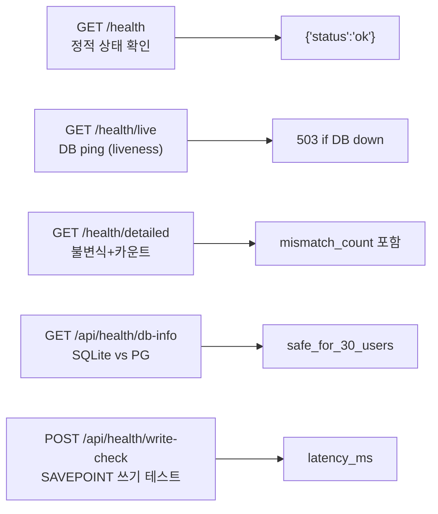

# 🚀 main.py — FastAPI 앱 진입점 & 라우터 등록

> [!summary]
> FastAPI 앱 생성, 14개 라우터 등록, CORS 미들웨어, X-Request-Id 미들웨어, 전역 예외 핸들러(ValueError/IntegrityError/OperationalError/Exception), 헬스 엔드포인트 5개를 담는 서버 진입점. **서버 기동만으로 DB 가 변하지 않는다** (bootstrap_db.py 분리).

---

## 1. 한 문장 목적

DEXCOWIN MES 백엔드 서버의 진입점으로, 앱을 생성하고 모든 라우터와 미들웨어를 등록한다.

---

## 2. 파일 위치 & 실행 명령

```
erp/backend/app/main.py
cd backend
python -m uvicorn app.main:app --reload
```

---

## 3. 라우터 등록 (14개)

```python
app.include_router(items.router,          prefix="/api/items",            tags=["Items"])
app.include_router(employees.router,      prefix="/api/employees",        tags=["Employees"])
app.include_router(departments.router,    prefix="/api/departments",      tags=["Departments"])
app.include_router(settings.router,       prefix="/api/settings",         tags=["Settings"])
app.include_router(inventory.router,      prefix="/api/inventory",        tags=["Inventory"])
app.include_router(io.router,             prefix="/api/io",               tags=["Inventory IO"])
app.include_router(bom.router,            prefix="/api/bom",              tags=["BOM"])
app.include_router(production.router,     prefix="/api/production",       tags=["Production"])
app.include_router(codes.router,          prefix="/api/codes",            tags=["Codes"])
app.include_router(variance.router,       prefix="/api/variance",         tags=["Variance"])
app.include_router(models_router.router,  prefix="/api/models",           tags=["Models"])
app.include_router(admin_audit.router,    prefix="/api/admin",            tags=["Admin Audit"])
app.include_router(admin_audit_csv.router,prefix="/api/admin",            tags=["Admin Audit"])
app.include_router(stock_requests.router, prefix="/api/stock-requests",   tags=["Stock Requests"])
app.include_router(dept_adjustment.router,prefix="/api/dept-adjustment",  tags=["Dept Adjustment"])
```

---

## 4. 헬스 엔드포인트 (5개)



| 엔드포인트 | 주기 | 용도 |
|-----------|------|------|
| `/health` | 항상 | 로드밸런서 프로브 |
| `/health/live` | 30초 | 컨테이너 liveness |
| `/health/detailed` | 수동 | 운영 점검 (무거움) |
| `/api/health/db-info` | 초기화 | preflight 엔진 확인 |
| `/api/health/write-check` | 초기화 | DB 쓰기 가능 확인 |

---

## 5. 전역 예외 핸들러

```python
@app.exception_handler(ValueError)
def _value_error_handler(...):   # 422 VALIDATION_ERROR

@app.exception_handler(IntegrityError)
def _integrity_error_handler(...):  # 409 DB_INTEGRITY

@app.exception_handler(OperationalError)
def _operational_error_handler(...):  # 503 DB_UNAVAILABLE

@app.exception_handler(Exception)
def _unhandled_exception_handler(...):  # 500 INTERNAL
```

모든 에러 응답 형식:
```json
{"detail": {"code": "VALIDATION_ERROR", "message": "...", "extra": {"request_id": "..."}}}
```

---

## 6. X-Request-Id 미들웨어

```python
@app.middleware("http")
async def _request_id_middleware(request, call_next):
    rid = request.headers.get("X-Request-Id") or uuid.uuid4().hex[:12]
    request.state.request_id = rid
    response = await call_next(request)
    response.headers["X-Request-Id"] = rid
    return response
```

모든 응답 헤더에 `X-Request-Id` 가 포함된다. 예외 핸들러와 감사 로그에서 이 값을 사용해 요청을 추적한다.

---

## 7. CORS 설정

```python
allow_origins = [
    "http://localhost:3000",
    "http://127.0.0.1:3000",
] + _extra_origins  # CORS_EXTRA_ORIGINS 환경 변수로 추가

allow_origin_regex = r"^https?://(localhost|127\.0\.0\.1|192\.168\.\d+\.\d+|...)..."
```

`CORS_EXTRA_ORIGINS` 환경 변수로 추가 origin 을 콤마 구분자로 지정할 수 있다.

---

## 8. 기동 시 부작용 없음

> [!important]
> `create_all` / 마이그레이션 / 시드 등 DB 변경 작업은 모두 `bootstrap_db.py` 로 분리됨.
> 서버 기동(`uvicorn app.main:app`) 만으로는 DB 가 변하지 않는다.
>
> DB 초기화가 필요할 때:
> ```bash
> cd backend
> python bootstrap_db.py --all
> ```

---

## 9. 앱 메타

```python
app = FastAPI(
    title="DEXCOWIN MES",
    version="1.3.0",
    docs_url="/docs",
    redoc_url="/redoc",
    redirect_slashes=False,
)
```

---

## 10. 기동 시 1회 초기화

```python
# audit_csv 세션 이벤트 후크 등록 (파일 상단, 라우터 등록 전)
audit_csv_svc.register_session_listeners()
```

---

## 11. 관련 노트 링크

- [[database.py]] — `get_db`, `_is_sqlite`
- [[audit_csv.py]] — `register_session_listeners`
- [[integrity.py]] — `/health/detailed` 에서 호출
- [[models.py]] — Item, Employee, Inventory, TransactionLog 조회
