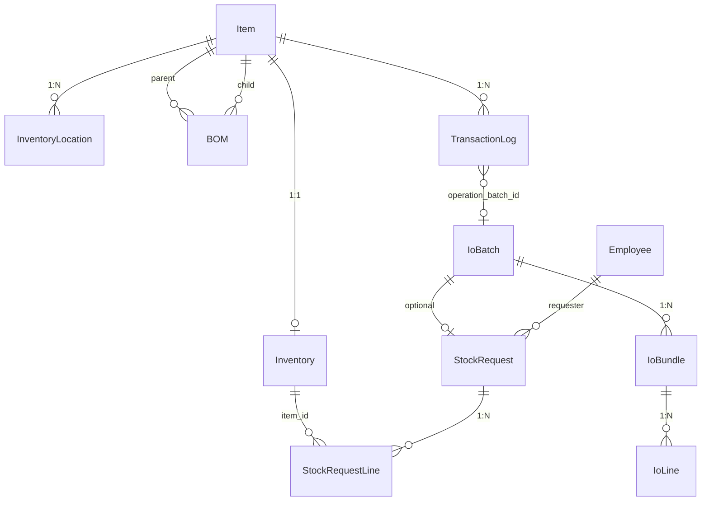

type: code-note
status: active
updated: 2026-05-21
project: DEXCOWIN MES
---

# 🗄️ models.py — 31개 ORM 엔터티 전체 정의

> [!summary]
> SQLAlchemy ORM 으로 정의된 31개 엔터티와 6개 Enum 이 담긴 DB 설계 기준 파일. 재고 3-bucket 불변식과 결재 상태머신의 구조적 기반이다. 모든 UUID PK, Decimal(15,4) 수량, UTC datetime.

---

## 1. 한 문장 목적

DEXCOWIN MES 전체 데이터 구조를 정의하며, 서비스 레이어와 라우터가 모두 이 파일의 클래스를 임포트한다.

---

## 2. 파일 위치 & 임포트 경로

```
erp/backend/app/models.py
from app.models import Inventory, Item, Employee, BOM, TransactionLog, ...
```

---

## 3. Enum 목록 (6개)

| Enum | 값 | 설명 |
|------|----|------|
| `TransactionTypeEnum` | 11종 | 재고 변동 거래 유형 |
| `LocationStatusEnum` | PRODUCTION, DEFECTIVE | 부서 재고 버킷 |
| `DepartmentEnum` | 10개 부서 | 조립/고압/진공/튜닝/튜브/AS/연구/영업/출하/기타 |
| `DeptAdjSubTypeEnum` | production/disassembly/correction | 부서 조정 세부 유형 |
| `EmployeeLevelEnum` | admin/manager/staff | 직원 권한 레벨 |
| `StockRequestStatusEnum` | 7종 | 결재 요청 상태 |
| `StockRequestTypeEnum` | 10종 | 결재 요청 유형 |
| `RequestBucketEnum` | warehouse/production/defective/none | 재고 버킷 |

---

## 4. TransactionTypeEnum 11종

```python
class TransactionTypeEnum(str, enum.Enum):
    RECEIVE          = "RECEIVE"          # 입고
    PRODUCE          = "PRODUCE"          # 생산 결과품 적재
    SHIP             = "SHIP"             # 출고
    ADJUST           = "ADJUST"           # 수량 조정
    BACKFLUSH        = "BACKFLUSH"        # 생산 소비 (구성품 차감)
    DISASSEMBLE      = "DISASSEMBLE"      # 분해
    TRANSFER_TO_PROD = "TRANSFER_TO_PROD" # 창고→생산 이동
    TRANSFER_TO_WH   = "TRANSFER_TO_WH"  # 생산→창고 복귀
    TRANSFER_DEPT    = "TRANSFER_DEPT"    # 부서간 이동
    MARK_DEFECTIVE   = "MARK_DEFECTIVE"  # 불량 등록
    SUPPLIER_RETURN  = "SUPPLIER_RETURN" # 공급사 반품
```

---

## 5. 엔터티 관계도



---

## 6. 핵심 엔터티 목록 (31개)

### 품목 & 재고 (5개)

| 클래스 | 테이블 | 설명 |
|--------|--------|------|
| `Item` | `items` | 품목 마스터. item_code(4-part), process_type_code, sort_order |
| `Inventory` | `inventory` | 품목당 1행. quantity = warehouse_qty + Σ location. CHECK 4개 |
| `InventoryLocation` | `inventory_locations` | 부서×상태 단위 재고. (item_id, dept, status) UNIQUE |
| `BOM` | `bom` | parent-child 관계. quantity, (parent, child) UNIQUE |
| `VarianceLog` | `variance_logs` | BOM 기대값 vs 실사용 차이 |

### 직원 (3개)

| 클래스 | 테이블 | 설명 |
|--------|--------|------|
| `Employee` | `employees` | warehouse_role / department_role / pin_hash / level |
| `EmployeeAssignedModel` | `employee_assigned_models` | 직원-제품 다대다 |
| `Department` | `departments` | 부서 마스터 (display_order, color_hex) |

### 거래 로그 (2개)

| 클래스 | 테이블 | 설명 |
|--------|--------|------|
| `TransactionLog` | `transaction_logs` | 재고 변동 감사 로그. 3중 복합 인덱스 |
| `TransactionEditLog` | `transaction_edit_logs` | 거래 메타 수정 이력 |

### 결재 흐름 (3개)

| 클래스 | 테이블 | 설명 |
|--------|--------|------|
| `StockRequest` | `stock_requests` | 결재 요청 헤더. requires_warehouse/dept_approval |
| `StockRequestLine` | `stock_request_lines` | 요청 라인. from/to bucket, dept |
| `AdminAuditLog` | `admin_audit_logs` | 마스터 변경 감사 |

### IO 배치 (3개)

| 클래스 | 테이블 | 설명 |
|--------|--------|------|
| `IoBatch` | `io_batches` | 입출고 작업 묶음 |
| `IoBundle` | `io_bundles` | 품목/패키지 단위 번들 |
| `IoLine` | `io_lines` | 개별 재고 반영 후보 라인 |

### 코드 마스터 (6개)

| 클래스 | 테이블 | 설명 |
|--------|--------|------|
| `ProductSymbol` | `product_symbols` | 100-slot 제품 기호 (is_finished_good) |
| `ItemModel` | `item_models` | 품목-제품 다대다 |
| `OptionCode` | `option_codes` | 2자 옵션 코드 |
| `ProcessType` | `process_types` | 2자 공정 코드 (prefix/suffix/stage_order) |
| `ProcessFlowRule` | `process_flow_rules` | 공정 전이 규칙 |
| `SystemSetting` | `system_settings` | key-value 시스템 설정 |

---

## 7. Inventory CHECK 제약

```python
class Inventory(Base):
    __table_args__ = (
        CheckConstraint("quantity >= 0",         name="ck_inventory_quantity_nonneg"),
        CheckConstraint("warehouse_qty >= 0",    name="ck_inventory_warehouse_nonneg"),
        CheckConstraint("pending_quantity >= 0", name="ck_inventory_pending_nonneg"),
        CheckConstraint("warehouse_qty >= pending_quantity",
                        name="ck_inventory_pending_le_warehouse"),
    )
```

---

## 8. Employee 권한 컬럼

```python
class Employee(Base):
    level          = Column(SAEnum(EmployeeLevelEnum), ...)  # admin/manager/staff
    warehouse_role = Column(String(20), default="none")      # none/primary/deputy
    department_role = Column(String(20), default="none")     # none/primary/deputy
    pin_hash       = Column(Text, nullable=True)             # None = 기본 PIN 0000
```

---

## 9. BoolAsString 커스텀 타입

```python
class BoolAsString(TypeDecorator):
    """Employee.is_active: DB에는 'true'/'false' VARCHAR(5),
    ORM에서는 bool 로 변환. 스키마 변경 없이 레거시 호환."""
    impl = String(5)
```

---

## 10. 주의 사항

> [!warning]
> 1. `InventoryLocation` 은 `Inventory` 와 직접 relationship 매핑이 없다. `item_id` 로 직접 쿼리한다.
> 2. `StockRequestLine.from_bucket` / `to_bucket` 은 같은 Enum 타입(`request_bucket_enum`)을 `create_type=False` 로 재사용한다.
> 3. `TransactionLog.archived_at` — 아직 아카이브 기능 미구현, NULL 유지.

---

## 11. 관련 노트 링크

- [[inventory.py]] — Inventory, InventoryLocation 조작
- [[schemas.py]] — Pydantic 응답 스키마
- [[database.py]] — Base, SessionLocal 정의
