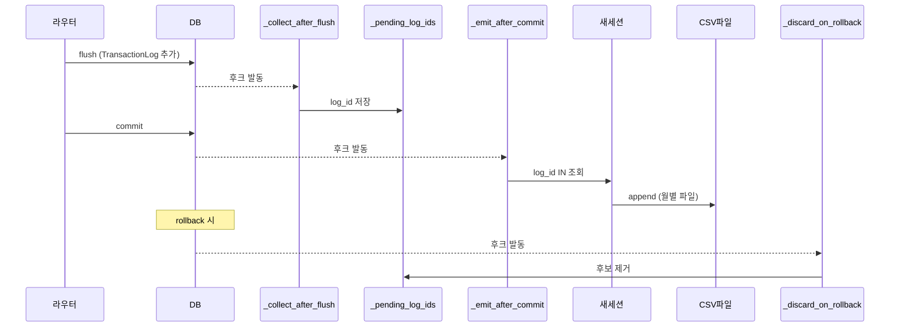

# 📊 audit_csv.py — CSV/XLSX 외부 감사 미러

> [!summary]
> `TransactionLog` DB 레코드를 월별 CSV 파일로 자동 미러링하는 서비스. SQLAlchemy 세션 이벤트(after_flush / after_commit / after_rollback)에 후크를 걸어 commit 완료된 거래만 파일에 append 한다. 파일 IO 실패는 거래 자체를 막지 않는다.

---

## 1. 한 문장 목적

외부 심사 대응을 위해 자재 이동 거래를 월별 CSV 파일로 자동 저장하고, 누락분을 backfill 하는 도구를 제공한다.

---

## 2. 파일 위치 & 임포트 경로

```
erp/backend/app/services/audit_csv.py
from app.services import audit_csv as audit_csv_svc
```

---

## 3. 포함 거래 유형 (AUDIT_TX_TYPES)

```python
AUDIT_TX_TYPES = frozenset({
    TransactionTypeEnum.RECEIVE,         # 입고
    TransactionTypeEnum.SHIP,            # 출고
    TransactionTypeEnum.TRANSFER_TO_PROD,# 창고→생산 이동
    TransactionTypeEnum.TRANSFER_TO_WH,  # 생산→창고 이동
    TransactionTypeEnum.TRANSFER_DEPT,   # 부서간 이동
    TransactionTypeEnum.ADJUST,          # 수량 조정
    TransactionTypeEnum.SUPPLIER_RETURN, # 공급사 반품
    TransactionTypeEnum.MARK_DEFECTIVE,  # 불량 처리
    TransactionTypeEnum.DISASSEMBLE,     # 분해
})
# PRODUCE, BACKFLUSH 는 생산 내부 소비 → 제외
```

---

## 4. 이벤트 후크 흐름



---

## 5. 파일 경로 규칙

```
backend/data/audit_csv/inout_YYYY-MM.csv
예: inout_2026-05.csv
```

`AUDIT_CSV_DIR` 환경 변수로 경로 override 가능. `created_at` 기준으로 월별 파일이 결정된다.

---

## 6. CSV 컬럼 (11개)

| 번호 | 컬럼명 | 내용 |
|------|--------|------|
| 1 | 일시 | YYYY-MM-DD HH:MM:SS |
| 2 | 거래유형 | 한글 라벨 (예: 입고, 출고) |
| 3 | 품목코드 | Item.item_code |
| 4 | 품목명 | Item.item_name |
| 5 | 수량 | quantity_change |
| 6 | 변경전 재고 | quantity_before |
| 7 | 변경후 재고 | quantity_after |
| 8 | 참조번호 | reference_no |
| 9 | 처리자 | produced_by |
| 10 | 비고 | notes (개행 → 공백) |
| 11 | 거래ID | log_id |

---

## 7. 핵심 코드 발췌

```python
def register_session_listeners(sessionmaker=None) -> None:
    """app 시작 시 1회 호출. after_flush / after_commit / after_rollback 후크 등록."""
    target = sessionmaker if sessionmaker is not None else SessionLocal
    if id(target) in _listeners_registered:
        return
    event.listen(target, "after_flush", _collect_after_flush)
    event.listen(target, "after_commit", _emit_after_commit)
    event.listen(target, "after_rollback", _discard_on_rollback)


def _emit_after_commit(session: Session) -> None:
    """commit 성공 후 별도 세션으로 log_id 재조회 → CSV append."""
    log_ids = _pending_log_ids.pop(id(session), None)
    if not log_ids:
        return
    db = _Session(bind=session.get_bind())
    try:
        logs = db.query(TransactionLog).filter(TransactionLog.log_id.in_(log_ids)).all()
        _append_logs(logs, items_by_id)
    except Exception:
        _log.exception("audit_csv after_commit 처리 실패 log_ids=%s", log_ids)
    finally:
        db.close()
```

---

## 8. Backfill (누락 복구)

```python
def backfill_all(db, *, overwrite=True) -> dict:
    """DB 의 모든 자재 이동 거래를 월별 CSV 로 재작성한다 (idempotent).
    overwrite=True 면 기존 파일 삭제 후 재생성.
    """
```

`scripts/dev/backfill_audit_csv.py` 에서도 동일 함수를 호출한다.

---

## 9. 운영 주의사항

> [!warning]
> 1. 파일 IO 실패는 거래를 막지 않는다. 누락된 기록은 `backfill_all` 로 복구한다.
> 2. `_file_lock` (threading.Lock) 으로 동시 append 를 직렬화한다. 고빈도 트랜잭션 환경에서 병목이 될 수 있다.
> 3. `register_session_listeners()` 는 `main.py` 에서 앱 기동 시 1회 호출한다. 중복 등록 방지 로직이 있다.

---

## 10. 의존 관계

```
audit_csv.py
  ← models (TransactionLog, TransactionTypeEnum, Item)
  ← database (SessionLocal, BACKEND_DIR)
  ← sqlalchemy.event (after_flush, after_commit, after_rollback)
  호출자: main.py (register_session_listeners), admin_audit_csv 라우터 (backfill, list_months)
```

---

## 11. 관련 노트 링크

- [[audit.py]] — 마스터 변경 감사 (다른 종류)
- [[main.py]] — `register_session_listeners()` 호출 지점
- [[models.py]] — TransactionLog ORM
