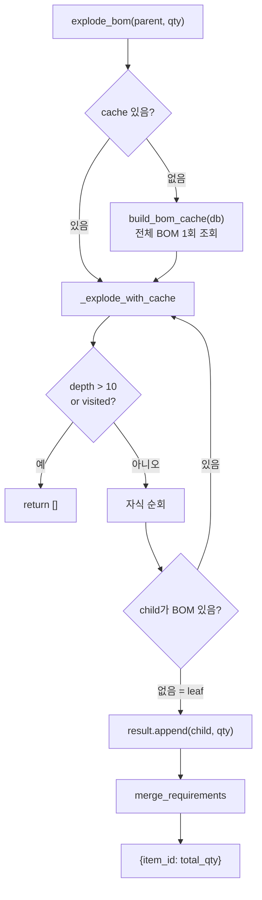

# 🌳 bom.py — BOM 전개 유틸리티

> [!summary]
> 생산 서비스와 큐 서비스가 공유하는 BOM 전개 로직. `MAX_DEPTH=10` 제한과 `visited` frozenset 으로 순환 참조를 방지하며, `BomCache` 를 한 번만 빌드해 재귀 내 N+1 쿼리를 제거한다.

---

## 1. 한 문장 목적

부모 품목 한 개를 생산하기 위해 필요한 **리프(leaf) 구성품 목록**을 재귀적으로 전개해 반환한다.

---

## 2. 파일 위치 & 임포트 경로

```
erp/backend/app/services/bom.py
from app.services import bom as bom_svc
```

---

## 3. 핵심 상수

```python
MAX_DEPTH = 10   # 재귀 최대 깊이 — 10단계 초과 BOM은 빈 목록 반환
BomCache = Dict[uuid.UUID, List[Tuple[uuid.UUID, Decimal]]]
# { parent_item_id: [(child_item_id, per-unit qty), ...] }
```

---

## 4. 전개 흐름



---

## 5. 핵심 코드 발췌

```python
MAX_DEPTH = 10

def explode_bom(db, parent_item_id, qty_to_produce, depth=0,
                visited=frozenset(), *, cache=None):
    """cache 없으면 진입 시 1회만 BOM 전체 조회 (재귀 내 N+1 제거)."""
    if cache is None:
        cache = build_bom_cache(db)
    return _explode_with_cache(parent_item_id, qty_to_produce, depth, visited, cache)


def _explode_with_cache(parent_item_id, qty_to_produce, depth, visited, cache):
    if depth > MAX_DEPTH or parent_item_id in visited:
        return []   # 순환 참조 또는 최대 깊이 — 조용히 중단

    visited = visited | {parent_item_id}  # frozenset 불변성 유지
    result = []
    for child_id, per_unit_qty in cache.get(parent_item_id, []):
        required_qty = per_unit_qty * qty_to_produce
        if child_id in cache:
            result.extend(_explode_with_cache(child_id, required_qty,
                                              depth + 1, visited, cache))
        else:
            result.append((child_id, required_qty))  # leaf
    return result
```

---

## 6. 함수 목록

| 함수 | 설명 |
|------|------|
| `build_bom_cache(db)` | 전체 BOM 1 쿼리 → `{parent: [(child, qty)]}` |
| `explode_bom(db, parent, qty, ...)` | 재귀 전개 → 리프 목록 |
| `merge_requirements(pairs)` | `[(item_id, qty)]` → `{item_id: total_qty}` |
| `direct_children(db, parent)` | 1단계 자식만 반환 (분해/회수용) |

---

## 7. 성능 고려사항

> [!info]
> 여러 품목을 연속 전개해야 하는 경우(`/capacity` 등):
> ```python
> cache = bom_svc.build_bom_cache(db)   # 1회만
> for item_id in item_ids:
>     parts = bom_svc.explode_bom(db, item_id, qty, cache=cache)  # 쿼리 추가 없음
> ```

---

## 8. 의존 관계

```
bom.py
  ← models (BOM)
  호출자: io.py (번들 생성), dept_adjustment.py (생산 템플릿)
           production.py (backflush), capacity 라우터
```

---

## 9. 주의 사항

> [!warning]
> `MAX_DEPTH=10` 초과 시 빈 목록을 반환하고 예외를 던지지 않는다. 실수로 10단계 넘는 BOM을 만들면 조용히 구성품이 누락된다. DB 제약으로 순환을 막는 것이 아니라 코드 레벨 보호이므로, BOM 등록 라우터에서 별도로 순환 검사를 해야 한다.

---

## 10. 관련 노트 링크

- [[models.py]] — BOM ORM 정의
- [[dept_adjustment.py]] — 생산 템플릿 빌더
- [[io.py]] — 번들 생성 시 direct_children 사용
