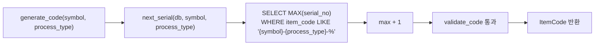

# 🏷️ codes.py — 4-파트 품목 코드 파싱·검증·생성

> [!summary]
> `[제품기호]-[구분코드]-[일련번호]-[옵션코드]` 형식의 4-파트 품목 코드를 파싱·포맷·마스터 테이블 검증·자동 채번하는 유틸리티. 이전 `ErpCode` 클래스는 `ItemCode` 로 rename 되었다 (commit `f1ff96c`).

---

## 1. 한 문장 목적

품목 코드 `376-TR-0012-BG` 같은 문자열을 파싱하고 마스터 테이블 대조 검증 후 자동 시리얼 번호를 발급한다.

---

## 2. 파일 위치 & 임포트 경로

```
erp/backend/app/services/codes.py
from app.services import codes as codes_svc
from app.services.codes import ItemCode, parse_item_code, generate_code
```

---

## 3. 코드 포맷 규칙

```
[제품기호] - [구분코드] - [일련번호] - [옵션코드]
   376          TR          0012           BG
```

| 파트 | 규칙 |
|------|------|
| 제품기호 | 숫자만, 1자 이상. 복수 자리 = 슬롯 조합 (예: "376" = 슬롯3+7+6) |
| 구분코드 | 정확히 2자, process_types.code 에 존재해야 함 |
| 일련번호 | 0 이상 정수, 표시 시 4자리 zero-pad (compact=True 로 생략 가능) |
| 옵션코드 | 정확히 2자 or None, option_codes.code 에 존재해야 함 |

> [!info] PA/AA 제한
> 완제품(PA) 과 최종조립체(AA) 는 반드시 **단일 슬롯 기호** + `is_finished_good=True` 슬롯만 허용

---

## 4. ItemCode 데이터 클래스

```python
@dataclass
class ItemCode:
    symbol: str          # "3" 또는 "376"
    process_type: str    # "TR", "PA"
    serial: int          # 정수 (패딩 없음)
    option: Optional[str] = None  # "BG" 또는 None
    symbol_slots: List[int] = field(default_factory=list)  # [3, 7, 6]

    def format(self, *, compact: bool = False) -> str:
        # compact=False → "376-TR-0012-BG"
        # compact=True  → "376-TR-12-BG"
```

---

## 5. 함수 목록

| 함수 | 설명 |
|------|------|
| `parse_item_code(raw)` | 문자열 → ItemCode (포맷만 검증) |
| `format_item_code(code, compact)` | ItemCode → 문자열 |
| `validate_code(db, code)` | 마스터 테이블 대조 검증 |
| `next_serial(db, symbol, process_type)` | 다음 시리얼 번호 조회 |
| `generate_code(db, *, symbol, process_type, option)` | 자동 채번 + 검증 후 ItemCode 반환 |

---

## 6. 핵심 코드 발췌

```python
def parse_item_code(raw: str) -> ItemCode:
    """3 또는 4개 토큰 허용 (옵션 생략 가능)."""
    tokens = raw.strip().upper().split("-")
    if len(tokens) not in (3, 4):
        raise ValueError(...)
    symbol, process_type, serial_str = tokens[0], tokens[1], tokens[2]
    option = tokens[3] if len(tokens) == 4 else None
    return ItemCode(symbol=symbol, process_type=process_type,
                    serial=int(serial_str), option=option,
                    symbol_slots=_split_symbol(symbol))


def validate_code(db, code):
    """마스터 3종 검사: ProductSymbol + ProcessType + OptionCode."""
    for digit in code.symbol:
        slot = db.query(ProductSymbol).filter(ProductSymbol.symbol == digit).one_or_none()
        if slot is None or slot.is_reserved:
            raise ValueError(f"제품기호 '{digit}' 미배정")

    ptype = db.query(ProcessType).filter(ProcessType.code == code.process_type).one_or_none()
    if ptype is None:
        raise ValueError(f"구분코드 '{code.process_type}' 미정의")

    if code.process_type in ("PA", "AA"):
        # 단일 슬롯 + is_finished_good 검사
        ...
```

---

## 7. 시리얼 채번 로직



---

## 8. rename 이력

> [!note] commit f1ff96c
> `ErpCode` 클래스 → `ItemCode` 로 rename.
> `parse_erp_code` → `parse_item_code`, `format_erp_code` → `format_item_code`.
> 기존 vault 노트에 `ErpCode` 가 남아 있으면 구버전이다.

---

## 9. 의존 관계

```
codes.py
  ← models (Item, OptionCode, ProcessType, ProductSymbol)
  호출자: codes 라우터 (코드 파싱/생성), items 라우터 (item_code 검증)
```

---

## 10. 관련 노트 링크

- [[models.py]] — ProductSymbol, ProcessType, OptionCode ORM
- [[main.py]] — `/api/codes` 라우터 등록
