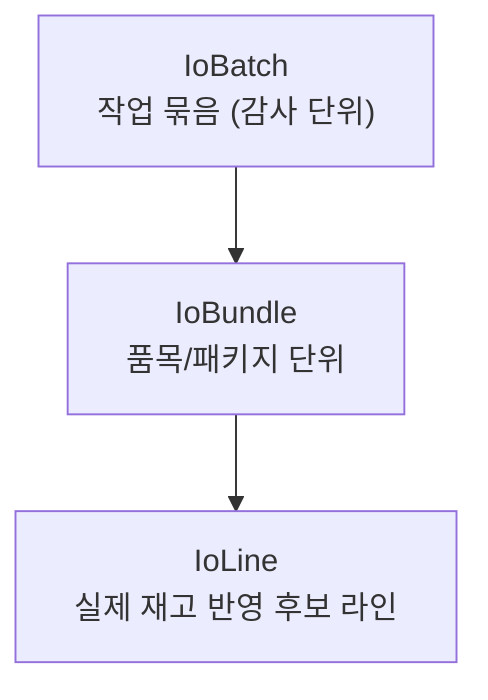
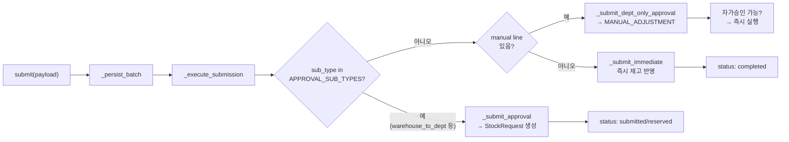

# 📦 io.py — 입출고 탭 2.0 오케스트레이션 서비스

> [!summary]
> 입출고 탭(UX)에서 사용자가 만든 번들/라인 컨텍스트를 유지하면서 실제 재고 이동을 `inventory` 와 `stock_requests` 서비스에 위임하는 오케스트레이터. IoBatch → IoBundle → IoLine 3단계 구조로 사용자 작업을 감사 단위로 저장한다.

---

## 1. 한 문장 목적

사용자의 입출고 작업(preview → draft → submit) 흐름을 DB에 저장하고, 승인이 필요한 경우 StockRequest 로 연결하며, 즉시 실행 가능한 경우 직접 재고를 반영한다.

---

## 2. 파일 위치 & 임포트 경로

```
erp/backend/app/services/io.py
from app.services import io as io_svc
```

---

## 3. 핵심 3계층 구조



---

## 4. 제출 분기



---

## 5. APPROVAL_SUB_TYPES

```python
APPROVAL_SUB_TYPES = {"warehouse_to_dept", "dept_to_warehouse", "defect_quarantine"}
# 이 세 가지는 창고 승인 경로 → StockRequest 생성
```

---

## 6. 주요 함수

| 함수 | 설명 |
|------|------|
| `preview(db, work_type, sub_type, targets)` | 번들/라인 미리보기 (DB 쓰기 없음) |
| `save_draft(db, payload)` | IoBatch draft 저장 (기존 draft 교체) |
| `submit(db, payload)` | 신규 batch 생성 + 즉시 제출 |
| `submit_existing_draft(db, batch_id, ...)` | 저장된 draft 제출 |
| `execute_batch_after_dept_approval(db, request, approver)` | 부서 결재 통과 후 실재고 반영 |
| `sync_batch_from_stock_request(db, request)` | StockRequest 상태 변경 → IoBatch 상태 동기화 |
| `find_by_client_request_id(db, id)` | 멱등 retry 시 기존 batch 조회 |

---

## 7. _apply_line 방향별 처리

```python
def _apply_line(db, *, batch, line, requester):
    """direction 에 따라 inventory_svc 를 분기 호출."""
    if line.direction == "in":
        inventory_svc.receive_confirmed(...)
    elif line.direction == "out":
        if line.from_bucket == "warehouse":  inventory_svc.consume_warehouse(...)
        elif line.from_bucket == "defective": inventory_svc.return_to_supplier(...)
        else:                                 inventory_svc.consume_from_department(...)
    elif line.direction == "move":
        if wh→prod: inventory_svc.transfer_to_production(...)
        elif prod→wh: inventory_svc.transfer_to_warehouse(...)
        else:         inventory_svc.transfer_between_departments(...)
    elif line.direction == "defective":
        inventory_svc.mark_defective(...)
    elif line.direction == "adjust":
        # production in/out 직접 조정
```

---

## 8. IoBatch 상태 목록

| status | 의미 |
|--------|------|
| `draft` | 임시 저장 |
| `submitted` | 제출됨 (승인 대기) |
| `reserved` | pending 예약 완료 |
| `completed` | 재고 반영 완료 |
| `rejected` | 반려됨 |
| `cancelled` | 취소됨 |
| `failed` | 처리 실패 |

---

## 9. 핵심 코드 발췌

```python
def _execute_submission(db, *, requester, batch):
    try:
        included_lines = _included_lines(batch)
        if batch.sub_type in APPROVAL_SUB_TYPES:
            _submit_approval(db, requester=requester, batch=batch)
        elif _has_manual_line(included_lines):
            _submit_dept_only_approval(db, requester=requester, batch=batch)
        else:
            _submit_immediate(db, requester=requester, batch=batch)
    except Exception:
        batch.status = "failed"
        db.flush()
        raise
```

---

## 10. 의존 관계

```
io.py
  ← models (IoBatch, IoBundle, IoLine, ...)
  ← services/inventory (모든 재고 변경)
  ← services/bom (direct_children, 번들 생성)
  ← services/stock_requests (create_request, create_manual_adjustment_request)
  ← services/dept_adjustment (execute_batch_after_dept_approval 에서 호출)
  호출자: io 라우터, stock_requests.py (sync_batch_from_stock_request)
```

---

## 11. 관련 노트 링크

- [[inventory.py]] — 실제 재고 변경 함수
- [[stock_requests.py]] — StockRequest 생성/승인
- [[bom.py]] — 번들 생성 시 BOM 전개
- [[models.py]] — IoBatch, IoBundle, IoLine ORM
