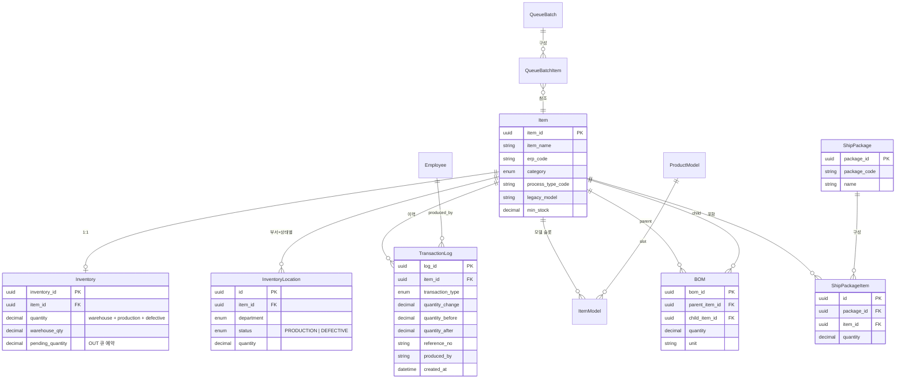

# ERD.md

> [!summary] 역할
> 현재 개발/운영 판단에 필요한 원본 문서다. Obsidian에서는 이 노트를 통해 빠르게 찾는다.

## 원본 위치

- Source: `docs/ERD.md`
- Layer: `docs`
- Kind: `documentation`
- Size: `3865` bytes

## 연결

- Parent hub: [[docs/docs|docs]]
- Related: [[docs/docs]]

## 읽는 포인트

- 원본 문서의 최신성은 실제 코드와 함께 검증한다.
- 품목코드 규칙은 `docs/ITEM_CODE_RULES.md`를 우선한다.

## 원본 발췌

````markdown
# 엔티티 관계도 (ERD)

핵심 엔티티 간 관계를 한 장에 정리. 자세한 컬럼 목록은 `backend/app/models.py` 가 단일 소스.



## 핵심 흐름

### 자재 → 재고 → 생산 → 출하

1. **수취**: `POST /api/inventory/receive` → `Inventory.warehouse_qty` 증가 + `TransactionLog(RECEIVE)`.
2. **생산 이동**: `POST /api/inventory/transfer-to-production` → `InventoryLocation(department=조립, status=PRODUCTION)` 생성/증가, `warehouse_qty` 감소.
3. **생산 입고**: `POST /api/production/receipt` → 대상 품목 `production_total` 증가 + BOM 자식들 `BACKFLUSH` 자동 차감.
4. **출하부 모음**: `POST /api/inventory/transfer-between-depts` → `SHIPPING/PRODUCTION` 으로 이동.
5. **출하**: `POST /api/inventory/ship` 또는 `/ship-package` → 출하부 차감 + `TransactionLog(SHIP)`.

### 불량 / 반품

- `POST /api/inventory/mark-defective` → 출처(창고/생산)에서 `InventoryLocation(status=DEFECTIVE)` 로 격리.
- `POST /api/inventory/return-to-supplier` → `DEFECTIVE` 분량을 0 으로 차감 + `SUPPLIER_RETURN` 로그.

### BOM Where-Used

- `GET /api/bom/where-used/{item_id}` → 이 자식이 들어간 parent 들의 (id, name, quantity, unit) 목록 (1단계).

## 불변식 (코드로 강제)

- `Inventory.quantity == warehouse_qty + sum(InventoryLocation.quantity for that item_id)`
  - `/health/detailed` 의 `inventory_mismatch_count` 가 이 식의 위반 수.
- `BOM` 은 순환 참조 금지 (`_is_circular`, `RecursionError` → `BOM 구조에 순환 참조` 400).
- `ship-package` 의 모든 구성품에 출하부 보유분이 충분해야 — 한 건이라도 부족하면 `STOCK_SHORTAGE` 422 (선처리 후 롤백 회피).

## 변경 시 주의

- DB 스키마 변경은 본 Phase 4 범위 외. 변경하려면 별도 사이클 + Alembic 도입 검토.
- 새 FK 추가 시 `cascade` / `back_populates` 를 `models.py` 의 기존 패턴과 동일하게 정의.
````

---

## 정책

- `main` 브랜치는 코드만 유지한다.
- `vault-sync` 브랜치는 같은 코드에 `vault/` 인수인계 문서를 더한다.
- 코드와 노트가 다르면 실제 코드가 우선이다.
