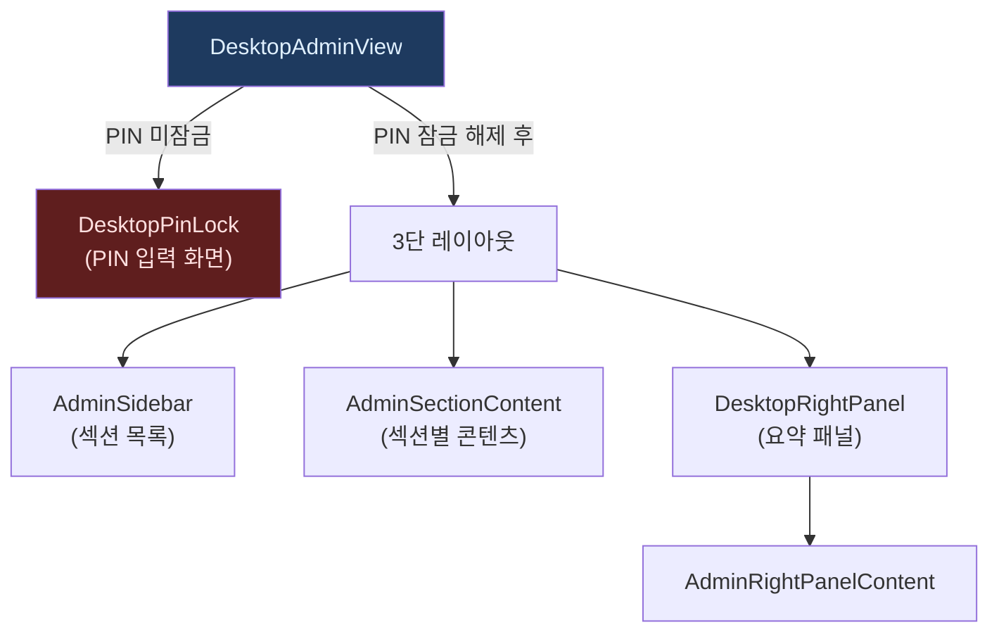
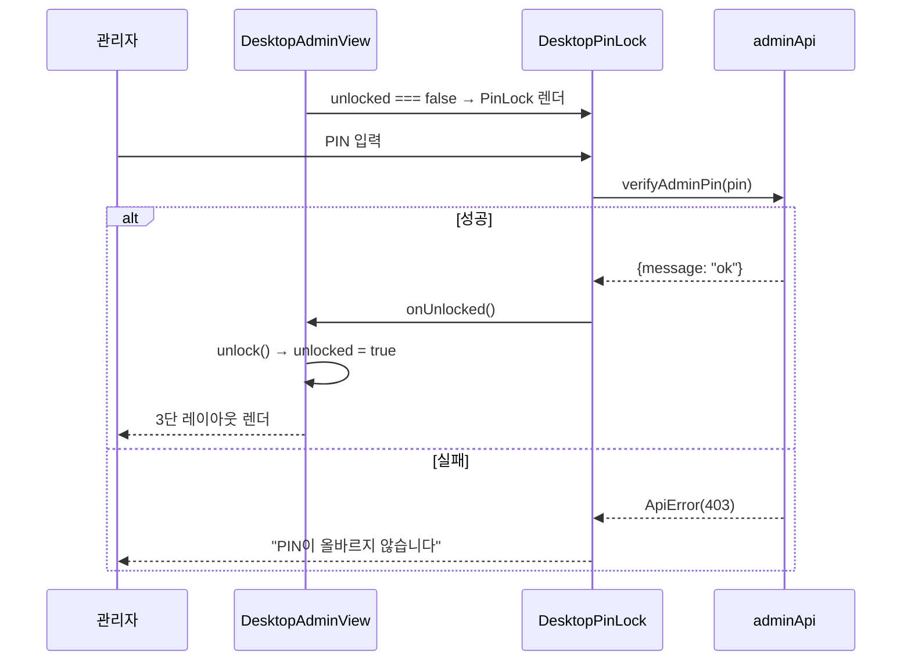

# DesktopAdminView.tsx — 관리자 탭

#layer/frontend #topic/component #topic/legacy

> [!summary] 한 줄 요약
> 관리자 탭의 최상위 컴포넌트. PIN 잠금 게이트 → 좌측 섹션 사이드바 + 중앙 워크스페이스 + 우측 요약 패널 3단 레이아웃. 본 파일은 레이아웃과 토스트 영역만 담당하고, 실제 섹션 콘텐츠는 하위 컴포넌트에 위임한다.

---

## 1. 위치 & 관계

| 항목 | 내용 |
|------|------|
| 원본 | `erp/frontend/app/legacy/_components/DesktopAdminView.tsx` |
| 레이어 | frontend / component |
| `"use client"` | O |
| 소비자 | [[erp/frontend/app/legacy/_components/DesktopLegacyShell.tsx]] |



---

## 2. 관리자 섹션 목록

| 섹션 ID | 라벨 | 설명 |
|---------|------|------|
| `models` | 모델 | 제품 모델 추가/삭제 (기본 섹션) |
| `items` | 품목 | 품목 기본 정보 수정 |
| `employees` | 직원 | 직원 활성 상태 관리 |
| `bom` | BOM | 부모-자식 자재 구성 |
| `packages` | 출하묶음 | 패키지 구성 관리 |
| `export` | 내보내기 | 엑셀 데이터 내보내기 |
| `departments` | 부서 | 부서 마스터 관리 |
| `settings` | 설정 | PIN 변경, 감사 CSV, DB 초기화 |

---

## 3. 3개 주요 훅

```typescript
// PIN/섹션/우측패널 UI 상태
const {
  unlocked, adminPin, section, showRightPanel, selectedDept,
  unlock, lock, selectSection, togglePanel, ...
} = useAdminViewState("models");

// 마스터 데이터 로드 (품목/직원/모델/부서/BOM)
const {
  items, employees, productModels, departments, allBomRows,
  refreshAllBom, refreshItems, loadData,
} = useAdminBootstrap({ unlocked, globalSearch, onError: setMessage });

// PIN 변경, DB 초기화
const {
  pinForm, setPinForm, changePin, resetDatabase, ...
} = useAdminSettings({ onStatusChange, onError: setMessage, onAfterReset: loadData });
```

---

## 4. PIN 잠금 흐름



---

## 5. 코드 발췌 — 레이아웃 + 토스트

```tsx
// PIN 미잠금: 잠금 화면
if (!unlocked) {
  return (
    <DesktopPinLock
      onUnlocked={unlock}
      onCancel={() => router.push("/legacy?tab=dashboard", { scroll: false })}
    />
  );
}

// 잠금 해제 후: 3단 레이아웃
return (
  <div className="flex min-h-0 flex-1 gap-4 pl-0 pr-4 overflow-y-auto lg:overflow-hidden">
    {/* 좌측 섹션 사이드바 (240px) + 중앙 워크스페이스 (1fr) */}
    <div style={{ gridTemplateColumns: "240px minmax(0,1fr)" }}>
      <AdminSidebar section={section} onSelect={selectSection} onLock={lock} ... />

      <section className="flex flex-col overflow-auto">
        {/* 토스트 영역 */}
        {(saveMessage || message) && (
          <div role="alert" aria-live="polite">
            {saveMessage && <div style={{ color: LEGACY_COLORS.green }}>...</div>}
            {message   && <div style={{ color: LEGACY_COLORS.red }}>...</div>}
          </div>
        )}

        {/* 섹션별 콘텐츠 위임 */}
        <AdminSectionContent
          section={section}
          items={items} employees={employees} productModels={productModels}
          departments={departments} allBomRows={allBomRows}
          changePin={changePin} resetDatabase={resetDatabase}
          adminPin={adminPin}
          ...
        />
      </section>
    </div>

    {/* 우측 요약 패널 (showRightPanel 시 400px) */}
    <div style={{ width: showRightPanel ? 420 : 0, transition: "width 160ms ..." }}>
      <DesktopRightPanel title="관리 요약" ...>
        <AdminRightPanelContent section={section} ... />
      </DesktopRightPanel>
    </div>
  </div>
);
```

---

## 6. 우측 패널 토글

```typescript
// AdminSidebar 에서 버튼 클릭 → togglePanel() 호출
// showRightPanel true/false 토글
// 너비 0 ↔ 420px CSS 전환
```

`<PanelRight>` lucide 아이콘 버튼으로 토글한다.

---

## 7. 토스트 색상 규칙

| 종류 | 변수 | 색상 |
|------|------|------|
| `saveMessage` | 성공 메시지 | `LEGACY_COLORS.green` |
| `message` | 에러 메시지 | `LEGACY_COLORS.red` |

`role="alert" aria-live="polite"` 로 접근성 지원.

---

## 8. `useAdminViewState` 초기 섹션

```typescript
useAdminViewState("models")
//                 ↑
// 관리자 탭 진입 시 기본으로 "모델" 섹션을 표시
```

`DesktopLegacyShell` 에서 admin 탭은 key 가 `"admin"` 으로 고정되어 remount 되지 않는다. 따라서 탭을 이동했다 돌아와도 입력 중이던 폼이 유지된다.

---

## 9. 관련 파일

- [[erp/frontend/app/legacy/_components/DesktopLegacyShell.tsx]] — 부모 컴포넌트
- [[erp/frontend/lib/api/admin.ts]] — verifyAdminPin, updateAdminPin, resetDatabase
- `erp/frontend/app/legacy/_components/_admin_hooks/useAdminViewState.ts`
- `erp/frontend/app/legacy/_components/_admin_hooks/useAdminBootstrap.ts`
- `erp/frontend/app/legacy/_components/_admin_hooks/useAdminSettings.ts`
- `erp/frontend/app/legacy/_components/_admin_sections/AdminSectionContent.tsx`
- [[erp/backend/app/routers/settings.py]] — PIN/DB 리셋 백엔드

---

## 10. 주의 사항

> [!warning] `resetDatabase` — PIN 재확인 포함
> DB 초기화는 `useAdminSettings.resetDatabase` 에서 처리된다. PIN 이 다시 한번 서버로 전달되어 검증 후 초기화된다. 취소 불가능한 작업이므로 UI 에서 반드시 이중 확인을 받아야 한다.

> [!info] admin 탭 remount 방지
> `DesktopLegacyShell` 의 `content = useMemo(...)` 에서 admin 탭은 `key="admin"` 고정.
> 탭 재클릭 시 `refreshNonce` 가 변하지 않아 자식이 unmount/remount 되지 않는다.

---

## 11. 정책

- `main` 브랜치: 코드만 유지
- `vault-sync` 브랜치: 코드 + `vault/` 노트
- 코드와 노트가 다르면 실제 코드 우선
