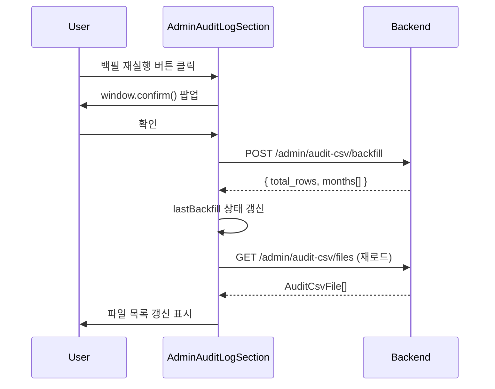

---
tags:
  - layer/frontend
  - topic/admin
  - audience/junior
aliases:
  - AdminAuditLogSection
created: 2026-05-21
---

# AdminAuditLogSection.tsx

> [!info] 한 줄 요약
> 외부 심사 대응용 월별 입출고 CSV 파일 목록 조회 + 다운로드 + 백필(재생성) 화면. 자재 이동 거래 발생 시 자동 누적된다.

## 1. 파일 위치

```
erp/frontend/app/legacy/_components/_admin_sections/AdminAuditLogSection.tsx
```

## 2. 책임 (단일 목적)

- 월별 CSV 파일 목록 표시 (월·파일명·거래 행 수·용량)
- 엑셀(.xlsx) / CSV 다운로드 버튼 제공
- 백필(backfill) 재실행 — DB 기준으로 모든 월 CSV 새로 생성
- KPI 바: 월 파일 수·총 거래 행·총 용량

## 3. 상태 구조

```ts
const [files, setFiles] = useState<AuditCsvFile[]>([]);
const [loading, setLoading] = useState(false);
const [busy, setBusy] = useState(false);          // 백필 실행 중
const [error, setError] = useState<string | null>(null);
const [lastBackfill, setLastBackfill] = useState<string | null>(null);
```

## 4. 주요 함수

| 함수 | 설명 |
|---|---|
| `loadFiles()` | `adminApi.listAuditCsvFiles()` 호출 → `files` 갱신 |
| `handleBackfill()` | `window.confirm` 후 `adminApi.triggerAuditCsvBackfill()` 실행 → 완료 후 `loadFiles()` 재호출 |
| `handleDownload(url, fileName)` | `<a>` 태그 클릭으로 파일 다운로드 트리거 |

## 5. API 엔드포인트 연결

```
adminApi.listAuditCsvFiles()        → GET  /admin/audit-csv/files
adminApi.triggerAuditCsvBackfill()  → POST /admin/audit-csv/backfill
adminApi.auditXlsxDownloadUrl(month) → /admin/audit-csv/{month}/xlsx
adminApi.auditCsvDownloadUrl(month)  → /admin/audit-csv/{month}/csv
```

## 6. CSV 컬럼 구성

파일 하단 안내문 기준 11개 컬럼:

```
일시 · 거래유형 · 품목코드 · 품목명 · 수량 · 변경전 재고 · 변경후 재고 ·
참조번호 · 처리자 · 비고 · 거래ID
```

## 7. 백필 흐름 다이어그램



## 8. 코드 발췌 (백필 핸들러)

```ts
// erp/frontend/app/legacy/_components/_admin_sections/AdminAuditLogSection.tsx (60-79)
const handleBackfill = useCallback(async () => {
  if (busy) return;
  const ok = window.confirm(
    "DB 기준으로 모든 월별 CSV 를 새로 만듭니다. 기존 파일은 덮어쓰여집니다. 계속할까요?",
  );
  if (!ok) return;
  setBusy(true);
  setError(null);
  try {
    const result = await adminApi.triggerAuditCsvBackfill();
    setLastBackfill(
      `${new Date().toLocaleString("ko-KR")} · ${result.total_rows.toLocaleString()}행 / ${result.months.length}개월`,
    );
    await loadFiles();
  } catch (e) {
    setError(e instanceof Error ? e.message : "백필 실패");
  } finally {
    setBusy(false);
  }
}, [busy, loadFiles]);
```

## 9. 파일 목록 그리드 컬럼

```
gridTemplateColumns: "1fr 120px 100px 80px 220px"
// 월 | 파일명 | 거래 행 | 용량 | 다운로드(엑셀+CSV)
```

## 10. 의존 관계

| 방향 | 대상 |
|---|---|
| 가져옴 | `adminApi` (`erp/lib/api/admin`) |
| 가져옴 | `AdminKpiBar`, `AdminPageHeader` (`_admin_primitives/`) |
| 사용됨 | `AdminSectionContent` → `audit` 섹션에서 렌더 |

## 11. 관련 파일

- `[[erp/lib/api/admin.ts]]` — adminApi 타입 및 엔드포인트
- `[[erp/backend/app/routers/admin.py]]` — 백필·파일목록·다운로드 라우터

> [!tip] 운영 시나리오
> 심사 공지 수신 → Admin 사이드바 "외부 제출용 로그" → 해당 월 행 클릭 → 엑셀 다운로드 → 제출.
> 누락 의심 시 "백필 재실행" 한 번으로 DB와 파일 정합성 복구.
