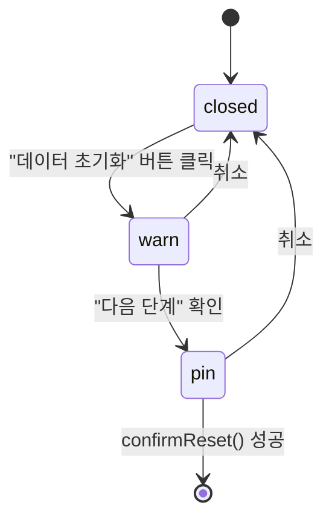

---
tags:
  - layer/frontend
  - topic/admin
  - audience/junior
aliases:
  - AdminDangerZone
created: 2026-05-21
---
type: code-note
status: active
updated: 2026-05-21
project: DEXCOWIN MES
---

# AdminDangerZone.tsx

> [!info] 한 줄 요약
> Admin "설정" 섹션. 관리자 PIN 변경(일반 설정)과 데이터 초기화(위험 영역) 두 블록으로 구성된다.

## 1. 파일 위치

```
erp/frontend/app/legacy/_components/_admin_sections/AdminDangerZone.tsx
```

## 2. 책임 (단일 목적)

- 관리자 PIN 변경 (현재 PIN / 새 PIN / 확인)
- 데이터 초기화: 2단계 Confirm — 1단계(삭제 대상 안내) → 2단계(PIN 입력 + 최종 확인)
- "시드 기준 재적재" 버튼 (현재 disabled — 준비 중)

## 3. Props 구조

```ts
// erp/frontend/app/legacy/_components/_admin_sections/AdminDangerZone.tsx (9-18)
type PinForm = { current_pin: string; new_pin: string; confirm_pin: string };

type Props = {
  pinForm: PinForm;
  setPinForm: (updater: (current: PinForm) => PinForm) => void;
  resetPin: string;
  setResetPin: (v: string) => void;
  onChangePin: () => void;    // PIN 변경 API 호출 — 부모(useAdminViewState)가 구현
  onResetDatabase: () => void; // 초기화 API 호출 — 부모가 구현
};
```

## 4. 데이터 초기화 시 삭제 목록

```ts
// erp/frontend/app/legacy/_components/_admin_sections/AdminDangerZone.tsx (20-26)
const DELETED_LIST = [
  "모든 품목 (Items) — 등록된 품목과 안전재고 정보",
  "모든 거래 이력 (Transactions) — 입출고·생산·조정 등",
  "모든 BOM 구성 — 부모-자식 자재 매핑",
  "모든 출하묶음 — 패키지와 포함 품목",
  "모든 직원과 부서 정보 — 권한·PIN 포함",
];
```

## 5. 초기화 2단계 흐름



| 단계 | `resetStage` 값 | Modal 내용 |
|---|---|---|
| 미열림 | `"closed"` | — |
| 1단계 | `"warn"` | 삭제 대상 목록 + 백업 권고 |
| 2단계 | `"pin"` | 관리자 PIN 입력 + 최종 확인 |

## 6. PIN 변경 유효성 검사

```ts
// erp/frontend/app/legacy/_components/_admin_sections/AdminDangerZone.tsx (39-43)
const canChangePin =
  pinForm.current_pin.trim() &&
  pinForm.new_pin.trim() &&
  pinForm.confirm_pin.trim() &&
  pinForm.new_pin === pinForm.confirm_pin;
```

`canChangePin` 이 false 면 "PIN 변경" 버튼 `disabled` (opacity 40%).

## 7. 코드 발췌 (초기화 최종 실행)

```ts
// erp/frontend/app/legacy/_components/_admin_sections/AdminDangerZone.tsx (56-65)
async function confirmReset() {
  if (!resetPin.trim()) return;
  setResetBusy(true);
  try {
    await Promise.resolve(onResetDatabase());
  } finally {
    setResetBusy(false);
    setResetStage("closed");
  }
}
```

## 8. 위험 영역 시각적 강조

```
배경: color-mix(in srgb, red 5%, transparent)
테두리: color-mix(in srgb, red 35%, transparent)
섹션 라벨: AlertTriangle 아이콘 + 빨간 텍스트
```

## 9. 의존 관계

| 방향 | 대상 |
|---|---|
| 가져옴 | `ConfirmModal` (`erp/lib/ui/ConfirmModal`) |
| 가져옴 | `AdminPageHeader` (`_admin_primitives/`) |
| 사용됨 | `AdminSectionContent` → `settings` 섹션에서 렌더 |
| 사용됨 | `AdminSidebar` → SETTINGS_ENTRY (danger 스타일) 클릭 시 진입 |

## 10. 주의 / 자주 하는 실수

> [!danger] 되돌릴 수 없는 작업
> 데이터 초기화는 즉시 실행되며 복구 불가. 반드시 [내보내기] 에서 엑셀 백업 후 진행할 것.
> 운영 환경에서 실수로 누르지 않도록 관리자 PIN 2단계 검증이 필수.

## 11. 관련 파일

- `[[erp/frontend/app/legacy/_components/_admin_sections/AdminSidebar.tsx]]` — SETTINGS_ENTRY 연결
- `[[erp/frontend/app/legacy/_components/_admin_hooks/useAdminViewState]]` — onChangePin / onResetDatabase 구현
- `[[erp/backend/app/routers/admin.py]]` — PIN 변경·DB 초기화 API
