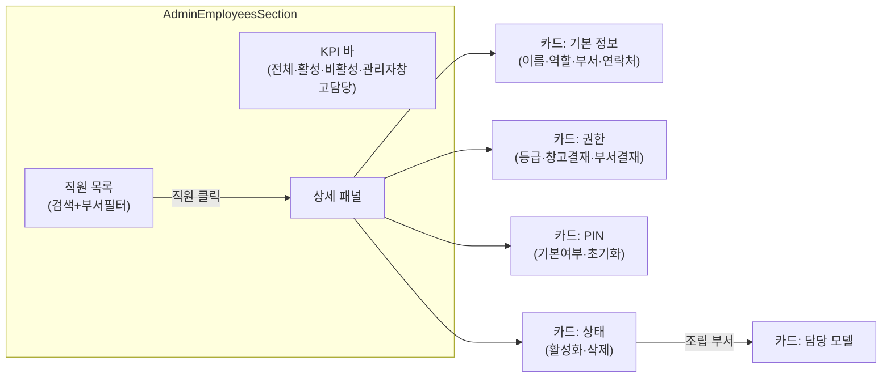

---
tags:
  - layer/frontend
  - topic/admin
  - audience/junior
aliases:
  - AdminEmployeesSection
created: 2026-05-21
---
type: code-note
status: active
updated: 2026-05-21
project: DEXCOWIN MES
---

# AdminEmployeesSection.tsx

> [!info] 한 줄 요약
> 직원 목록 · 권한 · PIN 관리 화면. 직원 추가/편집/활성화·비활성화/PIN 초기화/삭제를 모두 처리한다.

## 1. 파일 위치

```
erp/frontend/app/legacy/_components/_admin_sections/AdminEmployeesSection.tsx
```

## 2. 책임 (단일 목적)

- 직원 목록 검색 + 부서 필터 (AdminListPanel)
- 직원 추가 인라인 폼 (EmployeeAddInline)
- 직원 상세 4개 카드: 기본 정보 / 권한 / PIN / 상태
- ConfirmModal 3종: 활성화 토글 / 삭제 / PIN 초기화

## 3. Context 의존

`useAdminEmployeesContext()` 에서 가져오는 주요 값:

| 키 | 설명 |
|---|---|
| `employees` | 전체 직원 배열 |
| `departments` | 활성 부서 마스터 (부서 선택 드롭다운용) |
| `selectedEmployee` | 현재 선택된 직원 |
| `empAddMode` / `setEmpAddMode` | 추가 폼 활성 여부 |
| `addEmployee` | 직원 추가 API 호출 액션 |
| `toggleEmployee` | 활성/비활성 토글 트리거 (Confirm 전 단계) |
| `saveEmployee` | 편집 저장 |
| `requestPinReset` / `confirmPinReset` | PIN 초기화 2단계 |
| `requestDelete` / `confirmDelete` | 삭제 2단계 |

## 4. 권한 체계

```ts
// erp/frontend/app/legacy/_components/_admin_sections/AdminEmployeesSection.tsx (23-39)
const WAREHOUSE_ROLE_LABEL: Record<WarehouseRole, ...> = {
  none:    { label: "없음",  hint: "기본 작업만 수행",    tone: muted2 },
  primary: { label: "정",    hint: "창고 주담당 결재",     tone: blue   },
  deputy:  { label: "부",    hint: "보조 결재 가능",       tone: cyan   },
};

const DEPARTMENT_ROLE_LABEL: Record<DepartmentRole, ...> = {
  none:    { label: "없음",  hint: "기본 작업만 수행",    tone: muted2  },
  primary: { label: "정",    hint: "부서 주담당 결재",     tone: green  },
  deputy:  { label: "부",    hint: "보조 결재 가능",       tone: purple },
};

const LEVEL_LABEL: Record<string, ...> = {
  admin:   { label: "관리자", hint: "전체 시스템 관리 권한",  tone: red    },
  manager: { label: "매니저", hint: "부서 운영·데이터 수정",  tone: purple },
  staff:   { label: "사원",   hint: "기본 작업 권한",         tone: muted2 },
};
```

## 5. 화면 구조 다이어그램



## 6. 코드 발췌 (직원 목록 아이템)

```tsx
// erp/frontend/app/legacy/_components/_admin_sections/AdminEmployeesSection.tsx (185-232)
renderItem={(employee) => {
  const active = selectedEmployee?.employee_id === employee.employee_id;
  const deptName = normalizeDepartment(employee.department);
  const deptColor = getDepartmentFallbackColor(deptName);
  return (
    <button
      key={employee.employee_id}
      type="button"
      onClick={() => {
        setSelectedEmployee(employee);
        setEmpAddMode(false);
      }}
      className="flex w-full items-center gap-2.5 rounded-[10px] border px-3 py-2 text-left"
      style={{
        background: active
          ? `color-mix(in srgb, ${LEGACY_COLORS.blue} 14%, transparent)`
          : LEGACY_COLORS.s2,
        borderColor: active ? LEGACY_COLORS.blue : LEGACY_COLORS.border,
      }}
    >
      <span className="h-2 w-2 shrink-0 rounded-full" style={{ background: deptColor }} />
      <div className="min-w-0 flex-1">
        <div className="truncate text-[13px] font-bold">{employee.name}</div>
        <div className="truncate text-[11px]" style={{ color: LEGACY_COLORS.muted2 }}>
          {deptName}{employee.role ? ` · ${employee.role}` : ""}
        </div>
      </div>
      <StatusPill
        label={employee.is_active ? "활성" : "비활성"}
        tone={employee.is_active ? "success" : "neutral"}
        showDot
        maxWidth={70}
      />
    </button>
  );
}}
```

## 7. PIN 초기화 흐름

1. 사용자가 "PIN 초기화(0000)" 버튼 클릭 → `requestPinReset(employee)` 호출
2. `ConfirmModal` 열림 → 관리자 PIN 입력 필드 표시
3. 확인 → `confirmPinReset()` → API `PATCH /employees/{id}/pin-reset`
4. 성공 시 해당 직원 PIN이 `0000` 으로 초기화됨

> [!warning] 관리자 PIN 검증
> 잘못된 관리자 PIN 입력 시 `pinResetError` 상태에 에러 메시지가 표시되며 초기화되지 않는다.

## 8. 조립 부서 특수 처리

직원 부서가 `"조립"` 일 때만 "담당 모델" 카드가 렌더된다. `AssignedModelsEditor` 로 우선순위 순 모델 슬롯 관리 — 입출고 화면에서 조립 그룹 정렬에 사용됨.

```ts
// erp/frontend/app/legacy/_components/_admin_sections/AdminEmployeesSection.tsx (656-665)
{form.department === ASSEMBLY_DEPT ? (
  <div className="lg:col-span-2">
    <DetailCardSlot title="담당 모델 (우선순위 순)">
      <AssignedModelsEditor
        models={productModels}
        selected={form.assigned_model_slots}
        onChange={(next) => setForm((f) => ({ ...f, assigned_model_slots: next }))}
      />
    </DetailCardSlot>
  </div>
) : null}
```

## 9. ConfirmModal 3종

| Modal | 발동 | tone |
|---|---|---|
| 활성화 토글 | `toggleEmployee` 호출 | danger / normal |
| 직원 삭제 | `requestDelete` 호출 | danger |
| PIN 초기화 | `requestPinReset` 호출 | caution |

> [!note] 삭제 규칙
> 거래 이력이 있으면 **비활성화**, 없으면 **영구 삭제**. 백엔드에서 판단 후 응답.

## 10. 의존 관계

| 방향 | 대상 |
|---|---|
| 가져옴 | `useAdminEmployeesContext` |
| 가져옴 | `AssignedModelsEditor` (담당 모델 슬롯 편집) |
| 가져옴 | `ConfirmModal` (`erp/lib/ui/ConfirmModal`) |
| 사용됨 | `AdminSectionContent` → `employees` 섹션에서 렌더 |

## 11. 관련 파일

- `[[erp/frontend/app/legacy/_components/_admin_sections/AdminEmployeesContext.tsx]]`
- `[[erp/frontend/app/legacy/_components/_admin_sections/AssignedModelsEditor.tsx]]`
- `[[erp/backend/app/routers/employees.py]]`
