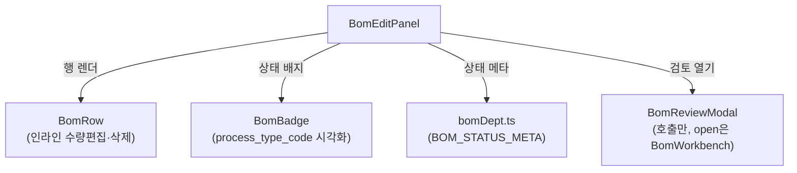

---
tags:
  - layer/frontend
  - topic/bom
  - audience/junior
aliases:
  - BomEditPanel
created: 2026-05-21
---

# BomEditPanel.tsx

> [!info] 한 줄 요약
> BOM 편집 모드 우측 패널. 선택된 부모 품목의 현재 BOM 구성 목록을 표시하고 수량 편집·삭제·완료 검토를 제공한다.

## 1. 파일 위치

```
erp/frontend/app/legacy/_components/_admin_sections/_bom_workbench/BomEditPanel.tsx
```

## 2. 책임 (단일 목적)

- 부모 헤더 카드 (배지 + 이름 + 코드 + 자식 수)
- 완료 상태 표시 칩 (done / wip / todo)
- "[검토·완료]" 버튼 → `BomReviewModal` 열기
- 현재 BOM 행 목록 (`BomRow` — 인라인 수량 편집 / 삭제 요청)

## 3. Props 구조

```ts
// erp/frontend/app/legacy/_components/_admin_sections/_bom_workbench/BomEditPanel.tsx (20-28)
interface Props {
  parent: Item | null;
  bomRows: BOMEntry[];
  items: Item[];
  isCompleted: boolean;
  onSaveQty: (bomId: string, qty: number) => void | Promise<void>;
  onRequestDelete: (row: BOMEntry, childName: string) => void;
  onOpenReview: () => void;
}
```

`onSaveQty` / `onRequestDelete` 의 실제 API 호출은 `BomWorkbench` 가 처리 — 이 패널은 UI 전용.

## 4. 상태 메타 계산

```ts
// erp/frontend/app/legacy/_components/_admin_sections/_bom_workbench/BomEditPanel.tsx (55)
const statusMeta = isCompleted
  ? BOM_STATUS_META.done
  : bomRows.length > 0
    ? BOM_STATUS_META.wip
    : BOM_STATUS_META.todo;
```

| 조건 | 상태 | 색상 |
|---|---|---|
| `isCompleted` | done | green |
| `bomRows.length > 0` | wip | yellow/orange |
| 나머지 | todo | muted |

## 5. 검토·완료 버튼 비활성화 조건

```ts
// erp/frontend/app/legacy/_components/_admin_sections/_bom_workbench/BomEditPanel.tsx (84-86)
disabled={bomRows.length === 0 && !isCompleted}
// BOM 구성이 없고 아직 완료 처리도 아닌 경우
// 이미 완료 상태면 "완료 해제" 용도로 활성화
```

## 6. 코드 발췌 (BOM 행 목록 렌더)

```tsx
// erp/frontend/app/legacy/_components/_admin_sections/_bom_workbench/BomEditPanel.tsx (113-130)
<div className="min-h-0 flex-1 overflow-y-auto">
  {bomRows.length === 0 ? (
    <div className="px-4 py-6 text-center text-sm" style={{ color: LEGACY_COLORS.muted2 }}>
      등록된 BOM 이 없습니다. 가운데에서 하위품목을 선택해 추가하세요.
    </div>
  ) : (
    bomRows.map((r) => (
      <BomRow
        key={r.bom_id}
        row={r}
        childItem={itemMap.get(r.child_item_id)}
        onSaveQty={onSaveQty}
        onRequestDelete={onRequestDelete}
      />
    ))
  )}
</div>
```

## 7. 빈 상태 처리

`parent` prop 이 `null` 이면 전체를 EmptyState("좌측에서 상위 품목을 선택하세요") 로 교체.

## 8. 의존 관계



## 9. 레이아웃 특성

이 패널은 `BomWorkbench` 안에서 `flex-1` 로 배치 — BomChildAddBox 와 50:50 으로 공간을 나눠 가짐.

## 10. 관련 파일

- `[[erp/frontend/app/legacy/_components/_admin_sections/_bom_workbench/BomWorkbench.tsx]]`
- `[[erp/frontend/app/legacy/_components/_admin_sections/_bom_workbench/BomRow.tsx]]`
- `[[erp/frontend/app/legacy/_components/_admin_sections/_bom_workbench/BomReviewModal.tsx]]`
- `[[erp/frontend/app/legacy/_components/_admin_sections/_bom_workbench/bomDept.ts]]`

## 11. 변경 이력 메모

| 날짜 | 변경 |
|---|---|
| 2026-05-21 | Vault 노트 최초 작성 (BomWorkbench 리팩터링 이후 구조 반영) |
