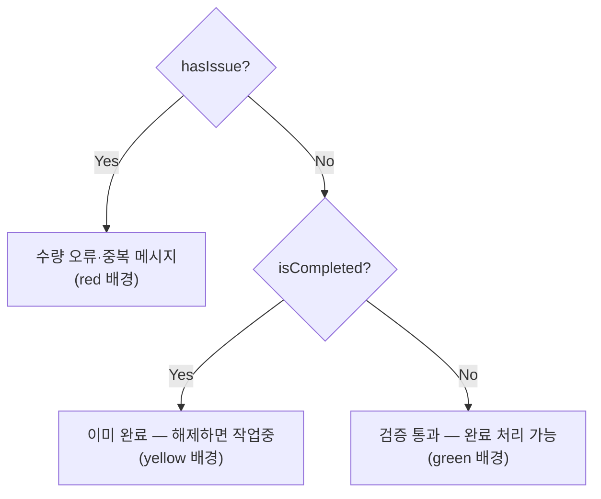

---
tags:
  - layer/frontend
  - topic/bom
  - audience/junior
aliases:
  - BomReviewModal
created: 2026-05-21
---

# BomReviewModal.tsx

> [!info] 한 줄 요약
> BOM 완료 처리 전 검토 모달. 저장된 BOM 행 요약 + 수량/중복 검증 후 "완료로 표시" 또는 "완료 해제"를 수행한다.

## 1. 파일 위치

```
erp/frontend/app/legacy/_components/_admin_sections/_bom_workbench/BomReviewModal.tsx
```

## 2. 책임 (단일 목적)

- 부모 품목 헤더 표시
- 현재 BOM 행 목록 요약 (자식명·코드·수량)
- 검증: 수량 ≤ 0 / 중복 자식 탐지
- 검증 통과 시 "완료로 표시" 활성화 / 이미 완료이면 "완료 해제" 제공

## 3. Props 구조

```ts
// erp/frontend/app/legacy/_components/_admin_sections/_bom_workbench/BomReviewModal.tsx (23-29)
interface Props {
  parent: Item;
  rows: BOMEntry[];
  items: Item[];
  isCompleted: boolean;
  onClose: () => void;
  onConfirm: (completed: boolean) => Promise<void>;
}
```

`onConfirm(!isCompleted)` 형태로 호출 — 완료↔미완료 토글.

## 4. 검증 로직

```ts
// erp/frontend/app/legacy/_components/_admin_sections/_bom_workbench/BomReviewModal.tsx (35-42)
const badQty = rows.filter((r) => !(Number(r.quantity) > 0));
const seen = new Map<string, number>();
for (const r of rows) seen.set(r.child_item_id, (seen.get(r.child_item_id) ?? 0) + 1);
const dupChildIds = Array.from(seen.entries())
  .filter(([, n]) => n > 1)
  .map(([id]) => id);

const hasIssue = badQty.length > 0 || dupChildIds.length > 0;
const canComplete = rows.length > 0 && !hasIssue;
```

> [!note] 순환 참조는 검사하지 않음
> 백엔드 BOM 추가 시점에 이미 순환 참조를 차단하므로 저장된 행에는 존재 불가.

## 5. 완료 버튼 활성화 조건

| `isCompleted` | `canComplete` | 버튼 상태 |
|---|---|---|
| false | true | "완료로 표시" 활성 (green) |
| false | false | "완료로 표시" 비활성 (border 색) |
| true | any | "완료 해제" 활성 (caution) |

## 6. 검증 결과 표시 흐름



## 7. 코드 발췌 (검증 결과 UI)

```tsx
// erp/frontend/app/legacy/_components/_admin_sections/_bom_workbench/BomReviewModal.tsx (141-180)
{hasIssue ? (
  <div className="flex items-start gap-2 rounded-[12px] border px-3 py-2 text-xs font-semibold"
       style={{ background: tint(red, 10), borderColor: tint(red, 40), color: red }}>
    <AlertTriangle size={14} className="mt-0.5 shrink-0" />
    <div>
      {badQty.length > 0 && <div>수량이 0 이하인 항목 {badQty.length}건 — 수정 후 완료하세요.</div>}
      {dupChildIds.length > 0 && <div>중복 자식 {dupChildIds.length}건 — 정리 후 완료하세요.</div>}
    </div>
  </div>
) : isCompleted ? (
  <div ... style={{ background: tint(yellow, 10), color: yellow }}>
    <AlertTriangle ... />
    이미 완료 처리된 BOM 입니다. 해제하면 &quot;작업중&quot; 으로 돌아갑니다.
  </div>
) : (
  <div ... style={{ background: tint(green, 10), color: green }}>
    <CheckCircle2 ... />
    검증 통과 — 완료로 표시할 수 있습니다.
  </div>
)}
```

## 8. 문제 있는 행 시각적 강조

중복(`dup`)이거나 수량 오류(`bad`)인 행:

```
배경: color-mix(in srgb, red 8%, transparent)
수량 텍스트 색: red
이름 옆 " · 중복" 텍스트 표시
```

## 9. 의존 관계

| 방향 | 대상 |
|---|---|
| 가져옴 | `ConfirmModal` (`erp/lib/ui/ConfirmModal`) |
| 가져옴 | `BomBadge` |
| 가져옴 | `TruncatedText` (`erp/lib/ui`) |
| 사용됨 | `BomWorkbench` → `reviewOpen` 상태로 마운트/언마운트 |

## 10. 관련 파일

- `[[erp/frontend/app/legacy/_components/_admin_sections/_bom_workbench/BomWorkbench.tsx]]`
- `[[erp/frontend/app/legacy/_components/_admin_sections/_bom_workbench/BomEditPanel.tsx]]` — 검토·완료 버튼 위치
- `[[erp/backend/app/routers/bom.py]]` — `PATCH /items/{id}/bom-completion`
