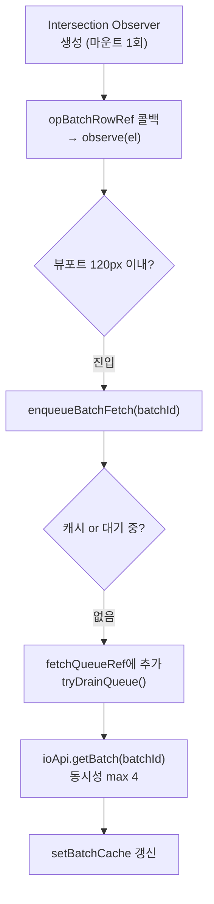

# HistoryTable.tsx

> [!summary] 역할
> **입출고 내역 테이블 컴포넌트.** 거래 로그를 solo(단건)·batch(레거시 묶음)·op_batch(2.0 IoBatch 묶음) 세 종류로 그룹핑해서 접기/펼치기 테이블로 렌더링한다. op_batch는 Intersection Observer 기반 lazy fetch로 IoBatch 상세를 로드한다.

---

## 1. 위치

```
erp/frontend/app/legacy/_components/_history_sections/HistoryTable.tsx
```

**부모**: `DesktopHistoryView.tsx`

---

## 2. 역할 한 줄 요약

`TransactionLog[]`를 받아 날짜·참조번호·배치ID 기준으로 그룹핑하고, 각 그룹을 접기/펼치기 가능한 테이블 행으로 렌더링한다. 선택 행은 우측 패널(HistoryDetailPanel)과 연동된다.

---

## 3. Props

| prop | 타입 | 설명 |
|---|---|---|
| `loading` | `boolean` | 최초 로딩 상태 |
| `filteredLogs` | `TransactionLog[]` | 필터링된 거래 로그 |
| `totalCount` | `number \| undefined` | 서버 전체 건수 (헤더 진행률 표시) |
| `selection` | `HistorySelection \| null` | 현재 선택된 항목 (log 또는 batch) |
| `onSelectLog` | `(log) => void` | 단건 선택 콜백 |
| `onSelectBatch` | `(batchId, logs) => void` | 배치 선택 콜백 |
| `batchCache` | `Map<string, IoBatch>` | 부모와 공유하는 IoBatch 캐시 |
| `setBatchCache` | `Dispatch` | 캐시 업데이트 |
| `canLoadMore` | `boolean` | "100건 더보기" 버튼 표시 여부 |
| `loadingMore` | `boolean` | 추가 로딩 중 |
| `onLoadMore` | `() => void` | 추가 로드 콜백 |

---

## 4. 그룹 타입 3종

```typescript
// historyTableHelpers.ts의 buildGroups 결과
type GroupRow =
  | { type: "solo";     log: TransactionLog }
  | { type: "batch";    refNo: string; logs: TransactionLog[] }
  | { type: "op_batch"; batchId: string; logs: TransactionLog[] }
```

| 그룹 타입 | 설명 | 클릭 동작 |
|---|---|---|
| `solo` | reference_no 없는 단건 | `onSelectLog(log)` |
| `batch` | 레거시 reference_no 기준 묶음 | 첫 로그 선택 + 펼침 |
| `op_batch` | 입출고 2.0 IoBatch 묶음 | `onSelectBatch(batchId, logs)` + 펼침/접기 |

---

## 5. op_batch Lazy Fetch 메커니즘



```typescript
const VISIBLE_FETCH_CONCURRENCY = 4;  // 동시 최대 4개 fetch

const enqueueBatchFetch = useCallback((batchId: string) => {
  if (batchCacheRef.current.has(batchId)) return;  // 캐시 히트
  if (pendingFetchesRef.current.has(batchId)) return;  // 이미 대기 중
  pendingFetchesRef.current.add(batchId);
  fetchQueueRef.current.push(batchId);
  tryDrainQueue();
}, [tryDrainQueue]);
```

> [!info] Eager Prefetch도 함께
> op_batch 그룹은 visible 여부와 무관하게 마운트 시 큐에 추가된다(`groups` useMemo 이후). 이는 접힌 묶음도 sub_type 기준 구분 라벨이 즉시 정확하게 표시되도록 하기 위함이다.

---

## 6. 선택 상태와 자동 토글

```typescript
const prevSelectedBatchRef = useRef<string | null>(null);
useEffect(() => {
  const currentBatchId = selection?.kind === "batch" ? selection.batchId : null;
  const prevBatchId = prevSelectedBatchRef.current;
  // 이전 선택 묶음 접기, 새 묶음 펼치기
  setExpandedGroups((s) => {
    const next = new Set(s);
    if (prevBatchId && next.has(prevBatchId)) next.delete(prevBatchId);
    if (currentBatchId && !next.has(currentBatchId)) next.add(currentBatchId);
    return next;
  });
}, [selection]);
```

수동 chevron으로 펼친 다른 묶음은 그대로 유지하고, 선택이 변경된 묶음만 자동 토글한다.

---

## 7. 코드 발췌 — 테이블 렌더링 분기

```tsx
{groups.map((group) => {
  if (group.type === "solo") {
    return <HistoryLogRow key={group.log.log_id} log={group.log}
      selected={selectedLogId === group.log.log_id} onSelect={onSelectLog} />;
  }

  if (group.type === "op_batch") {
    const expanded = expandedGroups.has(group.batchId);
    const batch = batchCache.get(group.batchId) ?? null;
    return (
      <Fragment key={`op-${group.batchId}`}>
        <OpBatchHeader group={group} expanded={expanded} batch={batch}
          onToggle={() => toggleGroup(group.batchId)}
          onSelect={() => { onSelectBatch(group.batchId, group.logs); ... }}
          rowRef={opBatchRowRef} />
        {expanded && <BomBatchDetail batchId={group.batchId} ... />}
      </Fragment>
    );
  }

  // type === "batch" (레거시)
  const expanded = expandedGroups.has(group.refNo);
  return (
    <Fragment key={`ref-${group.refNo}`}>
      <BatchHeader group={group} expanded={expanded}
        onToggle={() => toggleGroup(group.refNo)}
        onSelect={() => { onSelectLog(group.logs[0]); expandGroup(group.refNo); }} />
      {expanded && group.logs.map((log) => <HistoryLogRow key={log.log_id} ... />)}
    </Fragment>
  );
})}
```

---

## 8. 테이블 컬럼

| 컬럼 | 너비 | 비고 |
|---|---|---|
| 일시 | 140px | UTC → KST 변환 표시 |
| 구분 | 130px | FlowBadge (거래 유형 배지) |
| 품목명 | minWidth 180px | - |
| 변동요약 | 150px | `MovementSummaryCell` (+N / -N) |
| 담당자 | 130px | sm 이상만 표시 |
| 메모 | 70px | sm 이상만 표시 |

---

## 9. 전체 펼치기/접기

```typescript
const allExpanded = batchKeys.length > 0 && batchKeys.every((k) => expandedGroups.has(k));
function toggleAll() {
  if (allExpanded) setExpandedGroups(new Set());
  else setExpandedGroups(new Set(batchKeys));
}
```

---

## 10. 연결 관계

- **부모**: `erp/frontend/app/legacy/_components/DesktopHistoryView.tsx`
- **자식**: `HistoryLogRow`, `OpBatchHeader`, `BatchHeader`, `BomBatchDetail`
- **헬퍼**: `erp/frontend/app/legacy/_components/_history_sections/historyTableHelpers.tsx` (`buildGroups`)
- **API**: `erp/frontend/app/legacy/lib/api/io` (`ioApi.getBatch`)

---

## 11. 신입을 위한 맥락

> [!note] 처음 보는 신입에게
> 이 컴포넌트는 입출고 기록 조회 화면의 테이블이다. 이해해야 할 핵심 개념:
>
> 1. **그룹핑**: 여러 품목을 한 번에 입출고하면 여러 로그가 한 묶음(`op_batch`)으로 묶인다. 테이블에서는 접어서 한 행으로 표시하고, 클릭해서 펼치면 내부 품목들을 볼 수 있다.
> 2. **Lazy Fetch**: 테이블에 수십 개의 op_batch가 있어도 뷰포트에 보이는 것만 API 호출로 상세를 가져온다. 스크롤하면서 점진적으로 로드된다.
