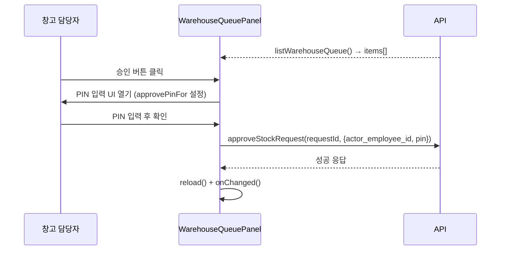

# WarehouseQueuePanel.tsx

> [!summary] 역할
> **창고 승인함 패널.** 창고 담당자(정/부)가 보는 결재 대기 목록. 각 요청에 대해 PIN 입력 후 승인 또는 반려 사유 + PIN 입력 후 반려를 처리한다.

---

## 1. 위치

```
erp/frontend/app/legacy/_components/_warehouse_sections/WarehouseQueuePanel.tsx
```

**부모**: `DesktopWarehouseView.tsx` (queue 탭 활성 시, `showQueue === true`인 경우만)

---

## 2. 역할 한 줄 요약

`api.listWarehouseQueue()`로 결재 대기 `StockRequest` 목록을 가져와 `WarehouseQueueRow`로 렌더링. 승인/반려는 PIN 기반 인증 처리.

---

## 3. Props

| prop | 타입 | 설명 |
|---|---|---|
| `approverEmployeeId` | `string` | 결재자(창고 담당자)의 employee_id |
| `refreshNonce` | `number` | 외부 증가 시 목록 재조회 |
| `onChanged` | `() => void` | 승인/반려 완료 후 부모 알림 |

---

## 4. 상태 관리

| 상태 | 용도 |
|---|---|
| `items` | 결재 대기 StockRequest 목록 |
| `loading` / `error` | 로딩·에러 표시 |
| `busyId` | 처리 중인 request_id (버튼 중복 방지) |
| `approvePinFor` | PIN 입력 인라인 UI를 열 대상 request_id |
| `approvePin` / `approveError` | 승인 PIN 입력값·에러 |
| `showRejectFor` | 반려 UI를 열 대상 request_id |
| `rejectReason` / `rejectPin` / `rejectError` | 반려 사유·PIN·에러 |

---

## 5. 흐름



---

## 6. 코드 발췌 — 승인/반려 API 호출

```tsx
const submitApprove = async (requestId: string) => {
  if (!approvePin) return;
  setBusyId(requestId);
  try {
    await api.approveStockRequest(requestId, {
      actor_employee_id: approverEmployeeId,
      pin: approvePin,
    });
    closeApprove();
    await reload();
    onChanged();
  } catch (err) {
    if (err instanceof ApiError && err.isConflict) {
      setApproveError("이미 처리된 요청입니다.");
    } else if (err instanceof ApiError && err.isUnavailable) {
      setApproveError("서버 과부하 — 잠시 후 다시 시도하세요.");
    } else {
      setApproveError(err instanceof Error ? err.message : "승인에 실패했습니다.");
    }
  } finally {
    setBusyId(null);
  }
};

const submitReject = async (requestId: string) => {
  if (!rejectPin || !rejectReason.trim()) {
    setRejectError("PIN과 반려 사유를 모두 입력해 주세요.");
    return;
  }
  // ... api.rejectStockRequest 호출
};
```

---

## 7. 에러 처리

| HTTP 상태 | 처리 |
|---|---|
| 409 Conflict | "이미 처리된 요청입니다." (동시 결재 방지) |
| 503 Unavailable | "서버 과부하 — 잠시 후 다시 시도하세요." |
| 그 외 | 에러 메시지 직접 표시 |

---

## 8. 빈 상태

결재 대기 목록이 없으면: "승인 대기 중인 요청이 없습니다." EmptyState 표시.

---

## 9. `WarehouseQueueRow`에 전달하는 상태

이 패널은 상태를 들고, 실제 UI 렌더링은 `WarehouseQueueRow`에 위임한다. PIN 입력 인라인 UI·에러 메시지·버튼 상태가 모두 row 단위로 관리된다.

---

## 10. 연결 관계

- **부모**: `erp/frontend/app/legacy/_components/DesktopWarehouseView.tsx`
- **자식**: `erp/frontend/app/legacy/_components/_warehouse_sections/WarehouseQueueRow.tsx`
- **API**: `api.listWarehouseQueue`, `api.approveStockRequest`, `api.rejectStockRequest`
- **에러 타입**: `@/lib/api-core` (`ApiError`)

---

## 11. 신입을 위한 맥락

> [!note] 처음 보는 신입에게
> 창고 담당자만 볼 수 있는 승인함이다. 부서에서 자재를 요청하면 여기로 들어온다.
>
> 승인·반려 모두 PIN이 필요한 이유: 누군가 창고 담당자 PC에 앉아 있어도 본인인지 확인하기 위한 이중 인증이다.
>
> 반려 시 "사유"도 필수인 이유: 요청자가 왜 거절됐는지 알아야 재요청을 올바르게 할 수 있기 때문이다.
