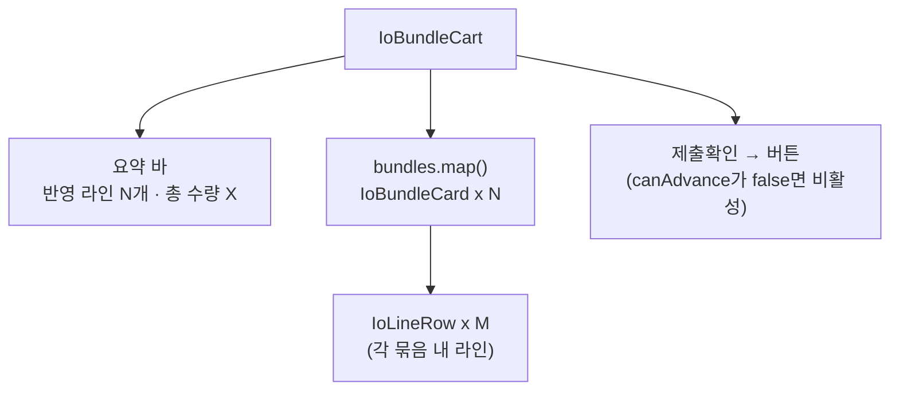

# IoBundleCart.tsx

> [!summary] 역할
> **입출고 마법사 Step 4 — 선택한 품목 카트 컨테이너.** 복수의 `IoBundleCard`를 렬거하고 전체 요약(반영 라인 수·총 수량)과 "제출확인 →" 버튼을 제공한다.

---

## 1. 위치

```
erp/frontend/app/legacy/_components/_warehouse_v2/IoBundleCart.tsx
```

**부모**: `IoComposeView.tsx` (Step 4 WizardStepCard 내부)  
**자식**: `IoBundleCard.tsx` (묶음 카드 한 개)

---

## 2. 역할 한 줄 요약

여러 개의 `IoBundle`을 카드 목록으로 렌더링하는 얇은 컨테이너. 실제 각 라인의 수량 편집 UI는 `IoBundleCard` → `IoLineRow`에 위임한다.

---

## 3. Props

| prop | 타입 | 설명 |
|---|---|---|
| `bundles` | `IoBundle[]` | 현재 선택된 묶음 목록 |
| `subType` | `IoSubType` | 세부 작업 유형 |
| `itemMap` | `Map<string, Item>` | `item_id → Item` 매핑 (재고 조회용) |
| `getAvailable` | `(line) => number \| null` | 라인별 가용 재고 계산 함수 |
| `onToggleLine` | `(bundleId, lineId) => void` | 라인 체크 토글 |
| `onQuantityChange` | `(bundleId, lineId, qty, shortage) => void` | 라인 수량 변경 |
| `onBundleQuantityChange` | `(bundleId, qty) => void \| undefined` | 묶음 기준 수량 변경 |
| `onRemoveLine` | `(bundleId, lineId) => void` | 라인 삭제 |
| `onRemoveBundle` | `(bundleId) => void` | 묶음 전체 삭제 |
| `onAdvance` | `() => void` | "제출확인 →" 버튼 |
| `canAdvance` | `boolean` | 다음 단계 가능 여부 |

---

## 4. 구조



---

## 5. 요약 계산

```tsx
const includedCount = bundles
  .flatMap((bundle) => bundle.lines)
  .filter((line) => line.included).length;

const totalQty = bundles
  .flatMap((bundle) => bundle.lines)
  .filter((line) => line.included)
  .reduce((acc, line) => acc + (Number.isFinite(line.quantity) ? line.quantity : 0), 0);
```

요약 바에 "반영 라인 N개 · 총 수량 X"를 표시. 체크 해제된 라인은 합산에서 제외.

---

## 6. 코드 발췌 — 전체 구조

```tsx
export function IoBundleCart({ bundles, subType, itemMap, getAvailable,
  onToggleLine, onQuantityChange, onBundleQuantityChange,
  onRemoveLine, onRemoveBundle, onAdvance, canAdvance }: Props) {

  return (
    <div className="flex h-full min-h-0 flex-col gap-4">
      <p className="text-sm" style={{ color: LEGACY_COLORS.muted2 }}>
        체크된 품목만 재고에 반영됩니다. 체크를 해제하면 이번 작업에서 제외됩니다.
      </p>

      {/* 요약 바 */}
      {bundles.length > 0 && (
        <div className="flex items-center justify-between rounded-[14px] border px-4 py-2.5"
          style={{ background: tint(LEGACY_COLORS.blue, 6), borderColor: tint(LEGACY_COLORS.blue, 24) }}>
          <span>반영 라인 {includedCount}개 · 총 수량</span>
          <span className="text-2xl font-black tabular-nums">{formatQty(totalQty)}</span>
        </div>
      )}

      {/* 묶음 카드 목록 */}
      {bundles.length === 0 ? (
        <EmptyState title="아직 선택된 품목이 없습니다." ... />
      ) : (
        <div className="space-y-3">
          {bundles.map((bundle) => (
            <IoBundleCard key={bundle.bundle_id} bundle={bundle} subType={subType}
              itemMap={itemMap} getAvailable={getAvailable}
              onToggleLine={(lineId) => onToggleLine(bundle.bundle_id, lineId)}
              onQuantityChange={(lineId, qty, shortage) =>
                onQuantityChange(bundle.bundle_id, lineId, qty, shortage)}
              onBundleQuantityChange={
                onBundleQuantityChange
                  ? (qty) => onBundleQuantityChange(bundle.bundle_id, qty)
                  : undefined}
              onRemoveLine={(lineId) => onRemoveLine(bundle.bundle_id, lineId)}
# ... (이하 17줄 생략. 원본 참조)

```

---

## 7. `canAdvance` 조건 (부모에서 계산)

`useIoWorkState`의 `canAdvance[4]`가 `false`이면 버튼 비활성. 조건:
- `bundles.length > 0`
- 포함된 라인이 1개 이상
- `hasShortage === false` (재고 부족 없음)
- `hasInvalidQuantity === false` (0 이하 수량 없음)

---

## 8. 빈 상태

카트에 아무것도 없으면 `EmptyState` 컴포넌트 표시:
- 제목: "아직 선택된 품목이 없습니다."
- 설명: "이전 단계에서 대상을 다시 선택하세요."

---

## 9. 연결 관계

- **부모**: `erp/frontend/app/legacy/_components/_warehouse_v2/IoComposeView.tsx`
- **자식**: `erp/frontend/app/legacy/_components/_warehouse_v2/IoBundleCard.tsx`
- **BOM 동기화**: `erp/frontend/app/legacy/_components/_warehouse_v2/bomSync.ts` (부모에서 호출되어 bundles 갱신 후 전달)
- **타입**: `erp/frontend/app/legacy/_components/_warehouse_v2/types.ts` (`IoBundle`, `IoLine`)

---

## 10. 신입을 위한 맥락

> [!note] 처음 보는 신입에게
> `IoBundleCart`는 장바구니 화면이다. 각 `IoBundle`은 "하나의 작업 묶음"인데, BOM 묶음이면 상위 품목 1개 + 하위 자재 여러 개가 한 묶음이다.
>
> 이 컴포넌트 자체는 매우 간단하다. 실제 복잡한 로직(수량 변경 시 BOM 비례 재계산)은 `bomSync.ts`에 있고, 부모(`IoComposeView`)가 `setBundles`에서 호출한다. 이 컴포넌트는 그 결과를 받아서 보여줄 뿐이다.
