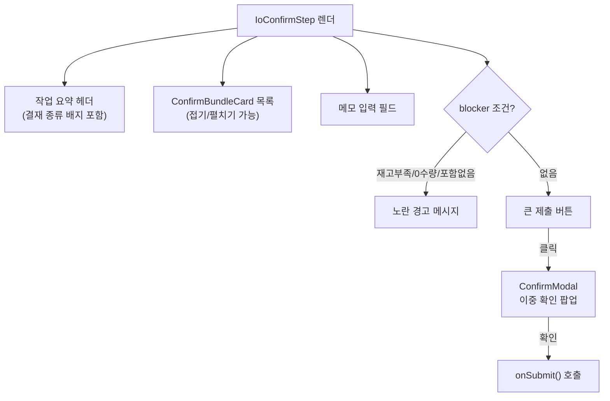

# IoConfirmStep.tsx

> [!summary] 역할
> **입출고 마법사 Step 5 — 최종 확인 및 제출 화면.** 작업 요약·묶음 카드 미리보기·메모 입력·결재 종류 표시·제출 버튼·이중 확인 모달을 제공한다.

---

## 1. 위치

```
erp/frontend/app/legacy/_components/_warehouse_v2/IoConfirmStep.tsx
```

**부모**: `IoComposeView.tsx` (Step 5 WizardStepCard 내부)

---

## 2. 역할 한 줄 요약

최종 제출 전 "이렇게 하시겠습니까?" 확인 화면. 결재 종류(즉시/창고/부서)에 따라 버튼 색상·문구가 바뀌고, 위험 작업(불량격리·공급처반품)에는 경고 배너가 추가된다.

---

## 3. Props

| prop | 타입 | 설명 |
|---|---|---|
| `workType` | `IoWorkType` | 작업 유형 |
| `subType` | `IoSubType` | 세부 작업 |
| `bundles` | `IoBundle[]` | 최종 확인할 묶음 목록 |
| `notes` | `string` | 메모 입력값 |
| `hasShortage` | `boolean` | 재고 부족 라인 존재 여부 |
| `hasInvalidQuantity` | `boolean` | 0 이하 수량 라인 존재 여부 |
| `submitting` | `boolean` | 제출 API 호출 중 여부 |
| `approvalKind` | `ApprovalKind` | `"none" \| "warehouse" \| "department"` |
| `onNotesChange` | `(value) => void` | 메모 변경 콜백 |
| `onSubmit` | `() => void` | 제출 실행 콜백 |

---

## 4. 결재 종류별 UI 분기

```tsx
const APPROVAL_META: Record<ApprovalKind, { summaryLabel, badgeText, submitText, accentColor }> = {
  none:       { summaryLabel: "즉시 재고 반영",  badgeText: "즉시 처리",    accentColor: "blue"   },
  warehouse:  { summaryLabel: "창고 결재 요청",  badgeText: "창고 결재 필요", accentColor: "yellow" },
  department: { summaryLabel: "부서 결재 요청",  badgeText: "부서 결재 필요", accentColor: "yellow" },
};
```

| 결재 종류 | 설명 | 버튼 문구 예시 |
|---|---|---|
| `none` | 즉시 반영 (BOM 입출고, 수량 보정 등) | "즉시 반영하기 3건" |
| `warehouse` | 창고 승인함으로 이동 (창고→부서 반출, 불량 격리 등) | "창고 결재 요청 2건" |
| `department` | 부서 승인함으로 이동 (낱개 manual 라인 포함 시) | "부서 결재 요청 1건" |

---

## 5. 핵심 흐름



---

## 6. BOM 부모 라인 필터링

```tsx
// BOM 부모 라인(생산 결과품 등)은 묶음 카드 헤더에서 이미 표시 → 표시 라인에서 숨김
const bomParentLineIds = new Set<string>();
for (const b of bundles) {
  if (b.source_kind !== "bom_parent") continue;
  for (const l of b.lines) {
    if (l.origin === "direct") bomParentLineIds.add(l.line_id);
  }
}
const visibleIncludedLines = includedLines.filter(
  (line) => !bomParentLineIds.has(line.line_id),
);
```

> [!info] 왜 BOM 부모를 숨기나?
> `produce` 작업에서 "생산 결과품(direct)"은 묶음 카드 헤더에 이미 표시되므로, 상세 라인 목록에서 중복 표시하지 않기 위해 필터링한다.

---

## 7. 코드 발췌 — 제출 버튼 및 경고

```tsx
const submitDisabled = submitting || includedLines.length === 0 || hasShortage || hasInvalidQuantity;
const isCaution = subType === "defect_quarantine" || subType === "supplier_return";

const blockerText = hasShortage
  ? "재고 부족 라인이 있어 제출할 수 없습니다. Step 4에서 라인을 다시 확인하세요."
  : hasInvalidQuantity
  ? "0 이하 수량 라인이 있어 제출할 수 없습니다."
  : includedLines.length === 0
  ? "체크된 라인이 없어 제출할 수 없습니다."
  : null;

<button type="button" onClick={() => setConfirmOpen(true)}
  disabled={submitDisabled}
  style={{ background: accent }}>
  {isCaution && !submitting && <AlertTriangle className="h-6 w-6" />}
  {submitting ? "처리 중..." : meta.submitText(includedLines.length)}
</button>

<ConfirmModal
  open={confirmOpen}
  title={copy.title}    // "불량 격리를 진행하시겠습니까?" 등
  tone={copy.tone}      // "danger" 또는 "normal"
  cautionMessage="제출 후 수정·취소는 관리자의 승인이 필요합니다."
  onConfirm={() => { setConfirmOpen(false); onSubmit(); }} />
```

---

## 8. `ConfirmBundleCard` 내부 컴포넌트

단일 라인 묶음(낱개)은 카드 없이 1줄로 평탄화. 복수 라인 묶음(BOM)은 접기/펼치기 가능한 카드로 표시.

```tsx
// 단일 비-BOM 묶음 → 1줄 평탄화
if (bundle.source_kind !== "bom_parent" && bundle.lines.length === 1) {
  return (
    <div className="flex min-h-[60px] items-center justify-between ...">
      <span>{onlyLine.item_name}</span>
      <span style={{ color: dir.color }}>{dir.sign}{formatQty(onlyLine.quantity)}</span>
    </div>
  );
}
```

---

## 9. 제출 불가 조건 요약

| 조건 | 메시지 |
|---|---|
| `hasShortage === true` | "재고 부족 라인이 있어 제출할 수 없습니다." |
| `hasInvalidQuantity === true` | "0 이하 수량 라인이 있어 제출할 수 없습니다." |
| `includedLines.length === 0` | "체크된 라인이 없어 제출할 수 없습니다." |

---

## 10. 연결 관계

- **부모**: `erp/frontend/app/legacy/_components/_warehouse_v2/IoComposeView.tsx`
- **의존**: `erp/frontend/app/legacy/_components/_warehouse_v2/ioWorkType.ts` (`deptIoDisplayLabel`, `subTypeLabel`, `ApprovalKind`)
- **UI**: `@/lib/ui/ConfirmModal` (이중 확인 모달)
- **백엔드**: `POST /io/submit` (부모에서 호출)

---

## 11. 신입을 위한 맥락

> [!note] 처음 보는 신입에게
> Step 5는 "마지막 점검 화면"이다. 여기서 중요한 점 두 가지:
>
> 1. **결재 vs 즉시 반영**: 창고→부서 반출이나 불량 격리는 창고 담당자 승인이 필요하다. 이 화면에서 버튼 문구가 "즉시 반영"이 아닌 "창고 결재 요청"으로 바뀌어 표시된다.
> 2. **이중 확인 팝업**: 버튼을 누르면 바로 제출되지 않고 한 번 더 팝업이 뜬다. 특히 불량 격리·공급처 반품은 `tone="danger"`(빨간) 팝업으로 경고를 강조한다.
