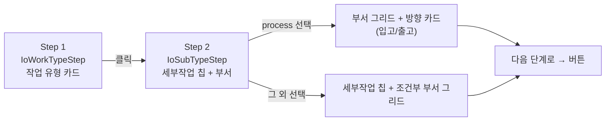

# IoWorkTypeStep.tsx

> [!summary] 역할
> **입출고 마법사 Step 1·2 UI 컴포넌트.** `IoWorkTypeStep`(Step 1: 큰 작업 유형 카드 4개)와 `IoSubTypeStep`(Step 2: 세부 작업 칩 + 부서 그리드)을 하나의 파일에서 export한다.

---

## 1. 위치

```
erp/frontend/app/legacy/_components/_warehouse_v2/IoWorkTypeStep.tsx
```

**부모**: `IoComposeView.tsx` (WizardStepCard 안에 렌더링)

---

## 2. 역할 한 줄 요약

"어떤 종류의 입출고 작업인가?"를 사용자에게 선택하게 하는 두 단계 UI. Step 1에서 대분류(receive / warehouse_io / process / defect)를 고르면, Step 2에서 세부 작업(칩)과 관련 부서를 선택한다.

---

## 3. Export 컴포넌트

### 3-1. `IoWorkTypeStep` (Step 1)

```tsx
export function IoWorkTypeStep({ workType, operator, onWorkTypeChange }: WorkTypeProps)
```

| prop | 타입 | 설명 |
|---|---|---|
| `workType` | `IoWorkType` | 현재 선택된 작업 유형 |
| `operator` | `OperatorLike \| null` | 로그인 작업자. `canSeeWorkType` 필터링에 사용 |
| `onWorkTypeChange` | `(workType) => void` | 카드 클릭 시 부모에 알림 |

- `IO_WORK_TYPES` 배열에서 `canSeeWorkType(row.id, operator)`를 통과한 항목만 렌더링
- `receive`(원자재 입고)는 **창고 정/부**만 볼 수 있다 (`warehouse_role === "primary" | "deputy"`)
- 카드 수에 따라 grid 열 수 자동 결정 (≤3: 전체 1행, 4: 2열, 5+: 3열)

### 3-2. `IoSubTypeStep` (Step 2)

```tsx
export function IoSubTypeStep({ workType, subType, fromDepartment, toDepartment,
  deptIoDirection, onSubTypeChange, onFromDepartmentChange,
  onToDepartmentChange, onDeptIoDirectionChange }: SubTypeProps)
```

- `process` 유형: 부서 그리드 + 방향 카드(입고/출고) 레이아웃
- 그 외 유형: `IO_SUB_TYPES[workType]` 칩 + `deptVisibility(subType)` 기반 부서 그리드

---

## 4. 핵심 흐름



---

## 5. 코드 발췌 — Step 1 카드 렌더링

```tsx
const visibleWorkTypes = IO_WORK_TYPES.filter((row) => canSeeWorkType(row.id, operator));
const n = visibleWorkTypes.length;
const cols = n <= 3 ? n : n === 4 ? 2 : 3;

return (
  <div className="grid h-full min-h-0 gap-3"
    style={{ gridTemplateColumns: `repeat(${cols}, minmax(0, 1fr))` }}>
    {visibleWorkTypes.map((row) => {
      const Icon = row.icon;
      const active = workType === row.id;
      const cardAccent = isExitWorkType(row.id) ? LEGACY_COLORS.red : LEGACY_COLORS.blue;
      return (
        <button
          key={row.id}
          aria-pressed={active}
          onClick={() => onWorkTypeChange(row.id)}
          style={{
            background: active ? tint(cardAccent, 14) : LEGACY_COLORS.s2,
            borderColor: active ? cardAccent : LEGACY_COLORS.border,
          }}
        >
          <Icon className="h-10 w-10 shrink-0" />
          <span>{row.label}</span>
          <span>{row.description}</span>
        </button>
      );
    })}
  </div>
);
```

---

## 6. 작업 유형별 Step 2 분기

| `workType` | Step 2 UI |
|---|---|
| `process` | 부서 그리드 + 방향 카드 (입고/출고) |
| `receive` | 세부 작업 칩만 (하위 1개: `receive_supplier`) |
| `warehouse_io` | 세부 작업 칩(2개) + 부서 그리드 |
| `defect` | 세부 작업 칩(2개) + 부서 그리드 + 빨간 경고 배너 |

> [!warning] 불량 격리·공급처 반품 경고 배너
> `defect_quarantine` 또는 `supplier_return` 선택 시 빨간 경고 블록이 자동 표시된다. "되돌릴 수 없습니다" 문구로 작업자에게 주의를 준다.

---

## 7. `DeptGrid` 내부 컴포넌트

```tsx
const PROD_DEPTS = ["튜브", "고압", "진공", "튜닝", "조립", "출하"];

function DeptGrid({ label, value, onChange, fill }) {
  return (
    <div>
      <Step2Label label={label} />
      <div className="grid grid-cols-6 gap-3">
        {PROD_DEPTS.map((d) => {
          const active = d === value;
          const deptColor = MES_DEPARTMENT_COLORS[d] ?? LEGACY_COLORS.purple;
          return (
            <button key={d} aria-pressed={active}
              onClick={() => onChange(d)}
              style={{ background: active ? tint(deptColor, 14) : LEGACY_COLORS.s2 }}>
              {d}
            </button>
          );
        })}
      </div>
    </div>
  );
}
```

부서 6개(튜브·고압·진공·튜닝·조립·출하)를 1행 6열로 배치. 각 부서마다 고유 색상이 있다 (`MES_DEPARTMENT_COLORS`).

---

## 8. 연결 관계

- **부모**: `erp/frontend/app/legacy/_components/_warehouse_v2/IoComposeView.tsx`
- **의존**: `erp/frontend/app/legacy/_components/_warehouse_v2/ioWorkType.ts` (IO_WORK_TYPES, IO_SUB_TYPES, canSeeWorkType, deptVisibility 등)
- **스타일**: `MES_DEPARTMENT_COLORS` from `@/lib/mes-department`

---

## 9. 신입을 위한 맥락

> [!note] 처음 보는 신입에게
> Step 1은 "어떤 작업을 할지" 고르는 큰 카드 4개 화면이다. Step 2는 "그 안에서 더 구체적으로" 선택하는 화면이다.
>
> - `process` 유형은 특이하게 Step 2에서 방향(입/출)을 먼저 고른다. 왜냐하면 "생산 입고(BOM)"와 "수량보정 출고(낱개)"처럼 같은 부서 작업이라도 성격이 달라서 방향이 subType을 결정하기 때문이다.
> - `receive` 유형은 세부 작업이 1개뿐이라서 Step 2가 간단하다.
