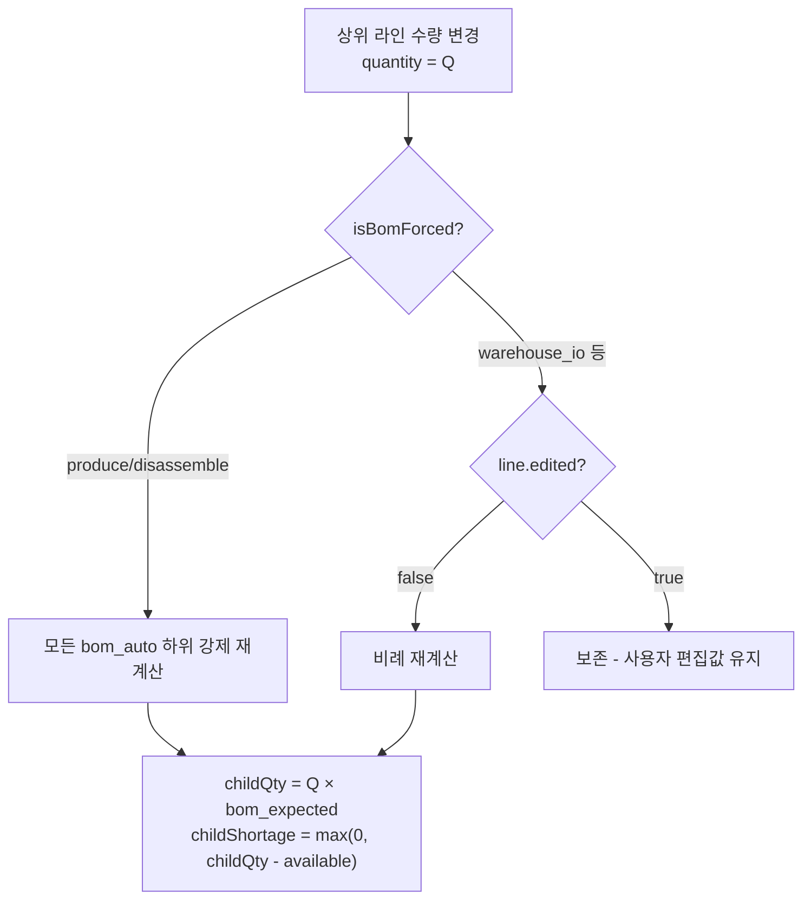

# bomSync.ts

> [!summary] 역할
> **BOM 비례 동기화 순수 함수 모음.** Step 4(IoBundleCart)에서 수량 변경·체크 토글·묶음 기준 수량 변경 시 BOM 하위 라인을 비례 재계산하는 로직. 부수효과 없음 — `IoComposeView`의 `setBundles` updater에서만 호출된다.

---

## 1. 위치

```
erp/frontend/app/legacy/_components/_warehouse_v2/bomSync.ts
```

순수 TypeScript 함수 파일. React 없음, 서버 호출 없음.

---

## 2. 역할 한 줄 요약

`IoComposeView`의 `onToggleLine / onQuantityChange / onBundleQuantityChange` 핸들러에 인라인 되어 있던 `setBundles` updater 로직을 독립 함수로 추출. 테스트 가능성과 가독성을 위해 분리됨.

---

## 3. Export 함수 3개

### 3-1. `applyToggleLine`

```typescript
export function applyToggleLine(
  bundles: IoBundle[],
  bundleId: string,
  lineId: string,
  subType: IoSubType,
  getAvailable: GetAvailable,
): IoBundle[]
```

**동작**: 특정 라인의 포함/제외 토글. 대상이 `origin === "direct"` (부모 라인)이면 같은 묶음 내 `bom_auto` 자식도 함께 토글.

```typescript
const isParentToggle = target.origin === "direct";
const newIncluded = !target.included;
lines.map((line) => {
  const shouldSync =
    line.line_id === lineId ||
    (isParentToggle && line.origin === "bom_auto" && Number(line.bom_expected) > 0);
  if (!shouldSync) return line;
  return {
    ...line,
    included: newIncluded,
    shortage: newIncluded ? Math.max(0, line.quantity - (avail ?? line.quantity)) : 0,
    exclusion_note: exclusionNoteFor(subType, line.origin, newIncluded),
  };
});
```

### 3-2. `applyLineQuantityChange`

```typescript
export function applyLineQuantityChange(
  bundles: IoBundle[],
  bundleId, lineId, quantity, shortage,
  subType: IoSubType,
  getAvailable: GetAvailable,
): IoBundle[]
```

**동작**: 라인 수량 변경. 대상이 `direct`(상위)이면 같은 묶음의 `bom_auto` 하위를 비례 재계산.

- **forced 모드** (`isBomForced(subType)` = produce/disassemble): `edited` 플래그 무시, 모든 하위 강제 재계산
- **비-forced 모드** (warehouse_io): `edited === true`인 하위는 보존 (사용자 직접 편집 값 유지)

### 3-3. `applyBundleQuantityChange`

```typescript
export function applyBundleQuantityChange(
  bundles: IoBundle[],
  bundleId: string,
  newQty: number,
  subType: IoSubType,
  getAvailable: GetAvailable,
): IoBundle[]
```

**동작**: 묶음 기준 수량 변경. `bom_expected`는 `parent_qty=1` 기준의 per-unit 비율이므로 `childQty = newQty * ratio`로 계산.

---

## 4. BOM 비례 계산 알고리즘



```typescript
const ratio = Number(line.bom_expected);  // per-unit 비율 (preview 시 parent_qty=1 기준)
const childQty = quantity * ratio;
const childAvail = getAvailable(line);
const childShortage = !line.included || childAvail === null
  ? 0
  : Math.max(0, childQty - childAvail);
return { ...line, quantity: childQty, shortage: childShortage, edited: false };
```

---

## 5. `bom_expected` 의미

`IoLine.bom_expected`는 백엔드 preview API가 내려주는 값:
- **단위**: 상위 품목 1개당 필요한 하위 품목 수량 (per-unit ratio)
- **예**: 상위 1개 생산 시 하위 A가 3개 필요 → `bom_expected = 3.0`
- 상위 수량이 5로 변경되면 → `childQty = 5 × 3.0 = 15`

백엔드 `erp/backend/app/services/bom.py`의 BOM 전개 로직이 이 값을 생성한다.

---

## 6. 코드 발췌 — applyLineQuantityChange 핵심부

```typescript
export function applyLineQuantityChange(
  bundles, bundleId, lineId, quantity, shortage, subType, getAvailable
): IoBundle[] {
  return bundles.map((bundle) => {
    if (bundle.bundle_id !== bundleId) return bundle;
    const target = bundle.lines.find((l) => l.line_id === lineId);
    if (!target) return bundle;

    if (target.origin === "direct") {
      const forced = isBomForced(subType);
      return {
        ...bundle,
        lines: bundle.lines.map((line) => {
          if (line.line_id === lineId) {
            return { ...line, quantity, shortage, edited: false };
          }
          // bom_auto 하위 비례 재계산
          if (line.origin === "bom_auto" &&
              line.bom_expected != null &&
              Number(line.bom_expected) > 0 &&
              (forced || !line.edited)) {
            const ratio = Number(line.bom_expected);
            const childQty = quantity * ratio;
            const childAvail = getAvailable(line);
            const childShortage = !line.included || childAvail === null
              ? 0 : Math.max(0, childQty - childAvail);
            return { ...line, quantity: childQty, shortage: childShortage, edited: false };
          }
          return line;
        }),
      };
    }
    // 단품/수동 라인 단순 갱신
    return {
      ...bundle,
      lines: bundle.lines.map((line) =>
        line.line_id === lineId
          ? { ...line, quantity, shortage,
              edited: line.bom_expected !== null
                ? Math.abs(quantity - line.bom_expected) > 0.0001
                : line.origin === "manual" || line.edited }
          : line,
      ),
    };
  });
}
```

---

## 7. `edited` 플래그 동작

| 상황 | `edited` 값 |
|---|---|
| 상위 변경으로 비례 재계산된 하위 | `false` |
| 사용자가 직접 입력한 하위 | `true` (비-forced 시 재계산 제외) |
| `bom_expected`와 다른 값으로 변경 | `true` |
| 새로 추가된 라인 | `false` |

---

## 8. `getAvailable` 주입 패턴

```typescript
type GetAvailable = (line: IoLine) => number | null;
```

`IoComposeView`의 클로저(`items` 현재 상태에 의존)를 인자로 받아서, 순수 함수임에도 최신 재고를 참조할 수 있게 한다. 이 패턴 덕분에 `bomSync.ts`가 React state에 직접 접근하지 않아도 된다.

---

## 9. 백엔드 대응

| 프론트엔드 | 백엔드 |
|---|---|
| `bom_expected` 값 사용 | `erp/backend/app/services/bom.py` `get_bom_entries` 반환값 |
| BOM 비례 재계산 로직 | `erp/backend/app/routers/inventory/` 서버사이드 동일 계산 |
| `isBomForced(produce/disassemble)` | 백엔드 `produce`/`disassemble` 처리 로직과 정책 동기화 필요 |

---

## 10. 연결 관계

- **호출처**: `erp/frontend/app/legacy/_components/_warehouse_v2/IoComposeView.tsx` (`setBundles` updater)
- **의존**: `erp/frontend/app/legacy/_components/_warehouse_v2/ioWorkType.ts` (`exclusionNoteFor`, `isBomForced`)
- **타입**: `erp/frontend/app/legacy/_components/_warehouse_v2/types.ts` (`IoBundle`, `IoLine`, `IoSubType`)

---

## 11. 신입을 위한 맥락

> [!note] 처음 보는 신입에게
> 이 파일은 "BOM 수량 자동 계산기"다. 가장 중요한 개념:
>
> 생산 작업에서 완제품 수량을 5개로 바꾸면 → 필요한 부품들이 자동으로 `5 × bom_expected` 로 계산된다. 이 계산이 여기에 있다.
>
> **forced vs 비-forced 차이**: `produce`/`disassemble`은 하위를 무조건 재계산한다. 창고 입출고(`warehouse_to_dept` 등)는 사용자가 한 번이라도 직접 수량을 바꾼 하위는(`edited=true`) 재계산하지 않고 그 값을 유지한다.
>
> 이 파일은 React가 없는 순수 함수라 단위 테스트하기 쉽다. `__tests__/warehouseFlow.golden.test.ts`에서 실제 테스트를 볼 수 있다.
