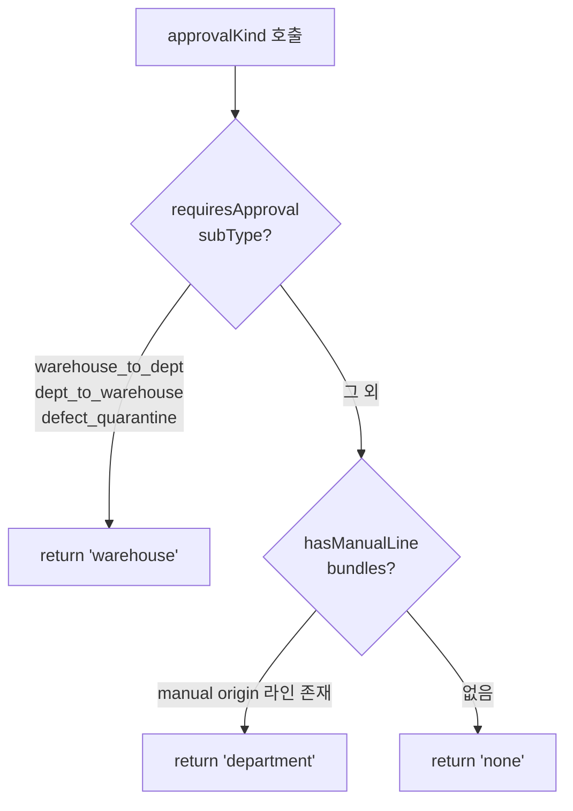

# ioWorkType.ts

> [!summary] 역할
> **입출고 2.0 작업 유형 정의 파일.** `IO_WORK_TYPES` 배열, `IO_SUB_TYPES` 매핑, 그리고 결재 판정·BOM 모드·라인 태그 등 프론트엔드 입출고 로직의 핵심 헬퍼 함수 30여 개를 모아둔 단일 소스.

---

## 1. 위치

```
erp/frontend/app/legacy/_components/_warehouse_v2/ioWorkType.ts
```

순수 TypeScript 유틸 파일 (React 없음). 다른 모든 warehouse_v2 컴포넌트가 이 파일에 의존한다.

---

## 2. 4가지 작업 유형 (IO_WORK_TYPES)

```typescript
export const IO_WORK_TYPES = [
  { id: "receive",      label: "원자재 입고",   description: "발주 품목 입고",    icon: Boxes        },
  { id: "warehouse_io", label: "창고 입출고",   description: "창고↔부서",         icon: ArrowLeftRight },
  { id: "process",      label: "부서 입출고",   description: "부서 내 작업",       icon: Wrench       },
  { id: "defect",       label: "불량",          description: "불량 재고 격리",     icon: AlertTriangle },
];
```

| workType | 시나리오 | 결재 흐름 |
|---|---|---|
| `receive` | 공급업체에서 원자재 입고 | 창고 정/부만 접근 가능. 즉시 반영 |
| `warehouse_io` | 창고↔부서 자재 이동 | 창고→부서 반출은 창고 결재 필요 |
| `process` | 부서 내 생산/분해/수량보정 | BOM 묶음은 즉시 반영, 낱개는 부서 결재 |
| `defect` | 불량 격리 또는 공급처 반품 | 창고 결재 필요 |

---

## 3. 세부 작업 유형 (IO_SUB_TYPES)

```typescript
export const IO_SUB_TYPES: Record<IoWorkType, Array<{ id: IoSubType; label; description }>> = {
  receive: [
    { id: "receive_supplier", label: "외부 입고", description: "선택 품목을 창고 재고로 증가" },
  ],
  warehouse_io: [
    { id: "warehouse_to_dept", label: "창고 → 부서", description: "BOM 1단계 하위 품목 자동 포함" },
    { id: "dept_to_warehouse", label: "부서 → 창고", description: "반납할 하위 품목만 체크" },
  ],
  process: [
    { id: "produce",     label: "생산",         description: "하위 자재 출고 + 결과 품목 입고" },
    { id: "disassemble", label: "분해",         description: "상위 품목 출고 + 회수 품목 입고" },
    { id: "adjust_in",   label: "수량보정 입고", description: "선택 품목 수량 증가" },
    { id: "adjust_out",  label: "수량보정 출고", description: "선택 품목 수량 감소" },
  ],
  defect: [
    { id: "defect_quarantine", label: "불량 격리",     description: "창고 승인 요청으로 격리" },
    { id: "supplier_return",   label: "공급처 반품",   description: "불량 재고를 반품 처리" },
  ],
};
```

---

## 4. 결재 판정 로직



```typescript
export function approvalKind(subType: IoSubType, bundles: IoBundle[]): ApprovalKind {
  if (requiresApproval(subType)) return "warehouse";
  if (hasManualLine(bundles)) return "department";
  return "none";
}
```

**`hasManualLine`**: 포함된 라인 중 `origin`이 `manual | adjust_in | adjust_out`인 것이 있으면 true → 부서 결재 필요.

---

## 5. BOM Forced 모드

```typescript
export function isBomForced(subType: IoSubType) {
  return subType === "produce" || subType === "disassemble";
}
```

- `produce`: 생산 작업 — BOM 하위 라인(투입 자재)은 상위(결과품) 수량에 비례해 자동 계산. 직접 편집 불가.
- `disassemble`: 분해 작업 — BOM 하위 라인(회수 품목)도 마찬가지.
- `warehouse_to_dept`/`dept_to_warehouse`: BOM 전개는 하지만 강제 잠금 아님 → 사용자가 개별 편집 가능.

---

## 6. process 유형 방향 매핑

```typescript
export type DeptIoDirection = "in" | "out";

// (방향, 모드) → subType
export function deptIoSubType(direction: DeptIoDirection, mode: "bom" | "single"): IoSubType {
  if (direction === "in") return mode === "bom" ? "produce" : "adjust_in";
  return mode === "bom" ? "disassemble" : "adjust_out";
}
```

| 방향 | BOM 버튼 | 낱개 버튼 |
|---|---|---|
| `in` (입고) | `produce` | `adjust_in` |
| `out` (출고) | `disassemble` | `adjust_out` |

---

## 7. 코드 발췌 — 라인 태그 레이블

```typescript
export function lineTagLabel(line: IoLine, subType: IoSubType): { text: string; tone: LineTagTone } {
  if (subType === "produce") {
    if (line.origin === "direct") return { text: "생산 결과품", tone: "green" };
    if (line.origin === "bom_auto") return { text: "투입 자재", tone: "red" };
  }
  if (subType === "disassemble") {
    if (line.origin === "direct") return { text: "분해 대상", tone: "red" };
    if (line.origin === "bom_auto") return { text: "회수 품목", tone: "green" };
  }
  if (subType === "warehouse_to_dept" || subType === "dept_to_warehouse") {
    if (line.origin === "direct") return { text: "상위", tone: "blue" };
    if (line.origin === "bom_auto") return { text: "하위", tone: "muted" };
  }
  if (line.origin === "manual") return { text: "이 품목만", tone: "muted" };
  return { text: "직접 선택", tone: "blue" };
}
```

---

## 8. 부서 그리드 가시성

```typescript
export function deptVisibility(subType: IoSubType): { from: boolean; to: boolean } {
  if (subType === "warehouse_to_dept")    return { from: false, to: true };
  if (subType === "dept_to_warehouse")    return { from: true,  to: false };
  if (subType === "defect_quarantine" ||
      subType === "supplier_return")      return { from: true,  to: false };
  if (subType === "produce" || subType === "disassemble" ||
      subType === "adjust_in" || subType === "adjust_out")
                                          return { from: false, to: true };
  return { from: false, to: false };
}
```

`IoSubTypeStep`에서 어느 부서 그리드(출발/도착)를 보여줄지 결정하는 단일 소스.

---

## 9. 주요 헬퍼 함수 목록

| 함수 | 용도 |
|---|---|
| `canSeeWorkType` | `receive`는 창고 정/부만 볼 수 있음 |
| `requiresDepartments` | 부서 선택이 필요한 subType 여부 |
| `requiresApproval` | 창고 결재가 필요한 subType 여부 |
| `approvalKind` | 결재 종류 최종 판정 (none/warehouse/department) |
| `isBomForced` | BOM 하위 라인 잠금 여부 |
| `deptIoSubType` | process 방향+모드 → subType 변환 |
| `deptIoDirectionOf` | subType → 방향 역변환 (draft 복원용) |
| `pickerDirectionLabel` | Step 3 타이틀 "입고/출고 품목 선택" |
| `targetDepartmentOf` | Step 3 피커 정렬 기준 부서 결정 |
| `lineTagLabel` | 라인 현장 친화 태그 텍스트+색상 |
| `isExitWorkType` | `defect` 유형이면 true (Step 1 카드 빨간색) |

---

## 10. 연결 관계

- **의존하는 파일**: warehouse_v2 내 모든 컴포넌트 (IoComposeView, IoWorkTypeStep, IoTargetPicker, IoLineRow, IoBundleCart, IoConfirmStep, bomSync)
- **백엔드 대응**: 결재 정책은 `erp/backend/app/routers/inventory/` 및 `erp/backend/app/services/queue.py`와 동기화되어야 한다

---

## 11. 신입을 위한 맥락

> [!note] 처음 보는 신입에게
> 이 파일은 warehouse_v2의 "규칙 책"이다. "어떤 작업은 결재가 필요한가?", "BOM은 언제 잠기나?", "각 라인은 어떤 태그를 달아야 하나?" 같은 비즈니스 규칙이 모두 여기 모여 있다.
>
> 새로운 작업 유형이나 결재 정책을 추가할 때 이 파일을 먼저 수정해야 한다. 컴포넌트들은 여기서 import해서 사용하므로, 이 파일을 바꾸면 전체 마법사 UI에 반영된다.
