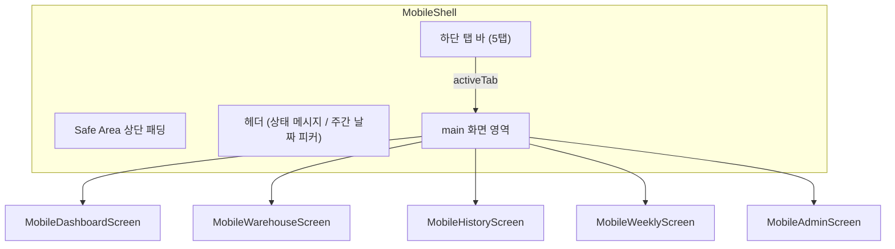

---
tags:
  - layer/frontend
  - topic/mobile
  - audience/junior
aliases:
  - MobileShell
created: 2026-05-21
---

# MobileShell.tsx

> [!info] 한 줄 요약
> 모바일 앱 전체 뼈대. 상단 상태 표시줄 · 5탭 하단 내비 · 화면 영역을 조합하는 최상위 컨테이너. [[mobile-overhaul-eval-loop]] 진행 중인 개선 작업의 진입점.

## 1. 파일 위치

```
erp/frontend/app/legacy/_components/mobile/MobileShell.tsx
```

## 2. 책임 (단일 목적)

- 5개 탭 상태 관리 (dashboard / warehouse / history / weekly / admin)
- URL `?tab=` 쿼리로 딥링크 초기 탭 동기화 (마운트 1회)
- 탭 재클릭 시 같은 탭 새로고침 (`refreshNonce` 증가)
- 상태 메시지 자동 복귀 (3초 후 기본값, 오류 계열은 sticky)
- 생산 용량 데이터 로드 + 포커스 재획득 시 재로드
- 탭 가시성 필터: `canEnterIO()` 기반으로 창고 탭 숨김

## 3. 탭 구성

```ts
// erp/frontend/app/legacy/_components/mobile/MobileShell.tsx (29-35)
const TAB_META: Record<MobileTabId, { label: string; icon: LucideIcon }> = {
  dashboard: { label: "대시보드", icon: Boxes },
  warehouse: { label: "입출고",   icon: Warehouse },
  history:   { label: "내역",     icon: HistoryIcon },
  weekly:    { label: "주간보고", icon: BarChart2 },
  admin:     { label: "관리",     icon: Settings2 },
};
```

## 4. 전체 구조 다이어그램



## 5. 상태 메시지 자동 복귀 로직

```ts
// erp/frontend/app/legacy/_components/mobile/MobileShell.tsx (62-74)
const handleStatusChange = useCallback((msg: string) => {
  if (autoRevertTimerRef.current) clearTimeout(autoRevertTimerRef.current);
  setStatus(msg);
  setStatusNonce((n) => n + 1);
  if (msg === DEFAULT_STATUS) return;
  const isSticky = /실패|못했습니다|오류|에러|부족|품절/.test(msg);
  if (!isSticky) {
    autoRevertTimerRef.current = setTimeout(() => {
      setStatus(DEFAULT_STATUS);
      setStatusNonce((n) => n + 1);
    }, 3000);
  }
}, []);
```

오류 키워드 포함 메시지는 sticky — 사용자가 확인할 때까지 유지.

## 6. 탭 재클릭 새로고침

```ts
// erp/frontend/app/legacy/_components/mobile/MobileShell.tsx (76-84)
const handleTabChange = useCallback((tab: MobileTabId) => {
  if (tab === activeTab) {
    if (tab !== "admin") {
      setRefreshNonce((n) => n + 1);  // admin 탭은 새로고침 제외
    }
    return;
  }
  setActiveTab(tab);
}, [activeTab]);
```

## 7. 창고 탭 권한 필터

```ts
// erp/frontend/app/legacy/_components/mobile/MobileShell.tsx (107-113)
const visibleTabs = useMemo(() => {
  const allTabs: MobileTabId[] = ["dashboard", "warehouse", "history", "weekly", "admin"];
  if (!operator) return allTabs;
  return allTabs.filter((tab) => {
    if (tab === "warehouse") return canEnterIO(operator);
    return true;
  });
}, [operator]);
```

`canEnterIO()` 는 `_warehouse_steps` 에서 import — 창고 권한 없는 직원은 탭 자체가 숨겨짐.

## 8. WCAG 탭 레이블 대비 처리

```
// 활성: LEGACY_COLORS.text (진한 색) + font-weight 800 — WCAG AA 대비 확보
// 비활성: LEGACY_COLORS.muted2 (5.55:1) — AA 통과
// 활성 blue(#2f74e7)는 흰 배경 4.14:1로 미달이라 text 색 사용
```

## 9. 의존 관계

| 방향 | 대상 |
|---|---|
| 렌더 | `MobileDashboardScreen`, `MobileWarehouseScreen`, `MobileHistoryScreen`, `MobileWeeklyScreen`, `MobileAdminScreen` |
| 가져옴 | `useCurrentOperator`, `canEnterIO` |
| 가져옴 | `CapacityDetailModal` (생산 용량 상세) |
| 가져옴 | `WeeklyWeekPicker` (주간 보고 날짜 선택) |
| 사용됨 | `erp/frontend/app/legacy/page.tsx` (모바일 진입 시 렌더) |

## 10. 관련 파일 / 작업 메모

- `[[erp/frontend/app/legacy/_components/mobile/screens/MobileWarehouseScreen.tsx]]`
- `[[erp/frontend/app/legacy/_components/mobile/warehouse/MobileIoComposeWizard.tsx]]`

> [!note] 진행 중 작업
> [[mobile-overhaul-eval-loop]] — 2026-05-21 기준: 관리·입출고 탭 디자인 개선 평가 중.

## 11. 변경 이력 메모

| 날짜 | 변경 |
|---|---|
| 2026-05-21 | 4탭 → 5탭(대시보드·입출고·내역·주간보고·관리) 리팩터 반영, Vault 심화 작성 |
