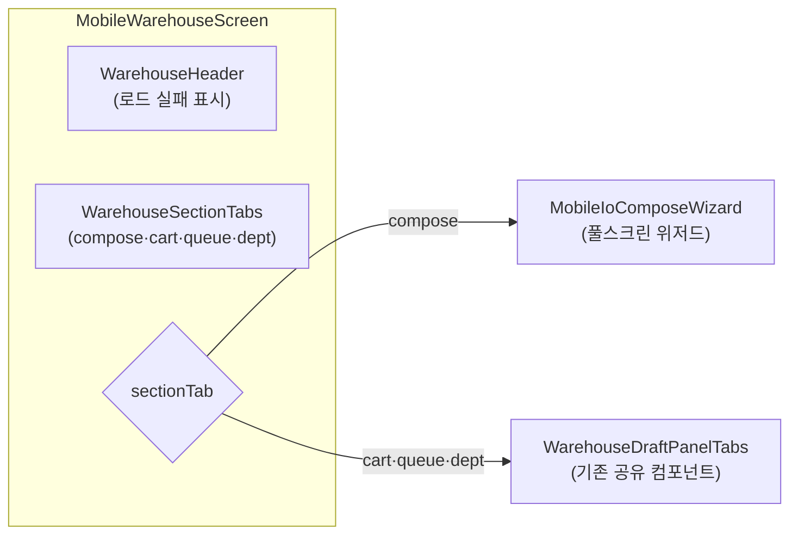

---
tags:
  - layer/frontend
  - topic/mobile
  - audience/junior
aliases:
  - MobileWarehouseScreen
created: 2026-05-21
---
type: code-note
status: active
updated: 2026-05-21
project: DEXCOWIN MES
---

# MobileWarehouseScreen.tsx

> [!info] 한 줄 요약
> 모바일 입출고 화면. `DesktopWarehouseView` 의 권한·데이터·섹션 오케스트레이션을 그대로 따르되, compose 섹션을 `MobileIoComposeWizard` (풀스크린 위저드)로 교체한 모바일 최적화 화면.

## 1. 파일 위치

```
erp/frontend/app/legacy/_components/mobile/screens/MobileWarehouseScreen.tsx
```

## 2. 책임 (단일 목적)

- `useWarehouseData` 훅으로 직원·품목·모델 데이터 로드
- 섹션 탭: compose(작성) / cart(장바구니) / queue(창고 대기) / dept-queue(부서 대기)
- compose 탭 → `MobileIoComposeWizard` 렌더
- 그 외 탭 → `WarehouseDraftPanelTabs` 재사용 (기존 데스크탑 공유)
- 탭 간 count 배지 캐시 (session 메모리)

## 3. Props 구조

```ts
// erp/frontend/app/legacy/_components/mobile/screens/MobileWarehouseScreen.tsx (30-39)
{
  globalSearch: string;
  onStatusChange: (status: string) => void;
  preselectedItem?: Item | null;   // 대시보드 "입고 바로가기" 연동
  onSubmitSuccess?: () => void;
}
```

## 4. 섹션 탭 흐름



## 5. 카운트 캐시 구조

```ts
// erp/frontend/app/legacy/_components/mobile/screens/MobileWarehouseScreen.tsx (18-20)
const cartCountCache = new Map<string, number>();
const warehouseQueueCountCache = { value: 0 };
const deptQueueCountCache = new Map<string, number>();
```

탭 전환 remount 사이 직전 카운트를 보존 — 깜박임 방지. `DesktopWarehouseView` 와 동일 패턴.

## 6. 권한 체크

```ts
// erp/frontend/app/legacy/_components/mobile/screens/MobileWarehouseScreen.tsx (64-67)
const canSeeQueue =
  (operator?.warehouse_role ?? "none") === "primary" ||
  (operator?.warehouse_role ?? "none") === "deputy";
const canSeeDeptQueue = isDepartmentApprover(operator);
```

`canEnterIO` 실패 시 `WarehouseAccessDenied` 화면 반환.

## 7. 코드 발췌 (compose / 드래프트 탭 분기)

```tsx
// erp/frontend/app/legacy/_components/mobile/screens/MobileWarehouseScreen.tsx (133-178)
{sectionTab === "compose" ? (
  <MobileIoComposeWizard
    globalSearch={globalSearch}
    operator={operator}
    employees={employees}
    items={items}
    productModels={productModels}
    setItems={setItems}
    preselectedItem={preselectedItem}
    restoreDraft={restoreIoDraft}
    onStatusChange={(status) => {
      onStatusChange(status);
      setPanelRefreshNonce((n) => n + 1);
    }}
    onSubmitSuccess={() => {
      setPanelRefreshNonce((n) => n + 1);
      onSubmitSuccess?.();
    }}
  />
) : (
  <div className="h-full overflow-y-auto px-3 pb-6">
    <WarehouseDraftPanelTabs
      sectionTab={sectionTab}
      canSeeQueue={canSeeQueue}
      ...
      onContinueIoDraft={(draft) => {
        setRestoreIoDraft(draft);
        setSectionTab("compose");   // 드래프트 복원 시 compose 탭으로 전환
      }}
    />
  </div>
)}
```

## 8. 드래프트 복원 흐름

1. cart 탭에서 "이어서 작성" 클릭
2. `setRestoreIoDraft(draft)` + `setSectionTab("compose")`
3. compose 탭으로 전환 → `MobileIoComposeWizard` 에 `restoreDraft` prop 전달
4. 위저드 내 `useIoDraftRestore` 훅이 상태 복원

## 9. 의존 관계

| 방향 | 대상 |
|---|---|
| 가져옴 | `useWarehouseData` 훅 |
| 가져옴 | `MobileIoComposeWizard` |
| 가져옴 | `WarehouseHeader`, `WarehouseSectionTabs`, `WarehouseDraftPanelTabs`, `WarehouseAccessDenied` |
| 사용됨 | `MobileShell` → warehouse 탭 콘텐츠로 렌더 |

## 10. 관련 파일

- `[[erp/frontend/app/legacy/_components/mobile/warehouse/MobileIoComposeWizard.tsx]]`
- `[[erp/frontend/app/legacy/_components/_warehouse_sections/WarehouseDraftPanelTabs.tsx]]`
- `[[erp/frontend/app/legacy/_components/_warehouse_hooks/useWarehouseData.tsx]]`

## 11. 변경 이력 메모

| 날짜 | 변경 |
|---|---|
| 2026-05-21 | 모바일 개편 1차 이후 구조 반영하여 Vault 노트 심화 작성 |
