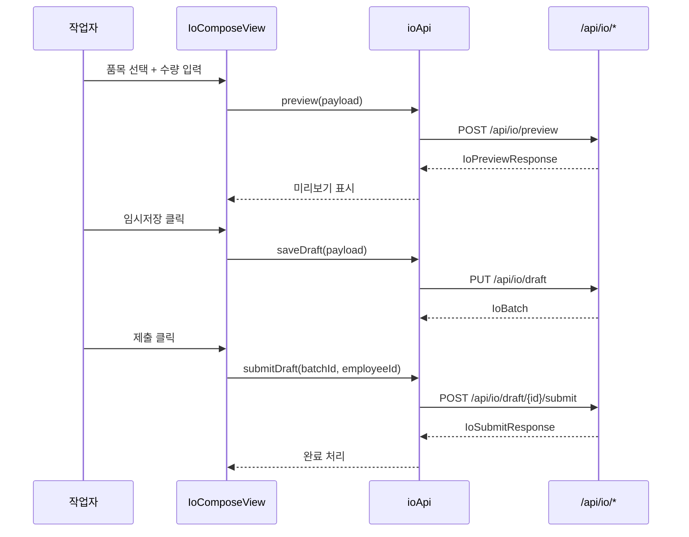
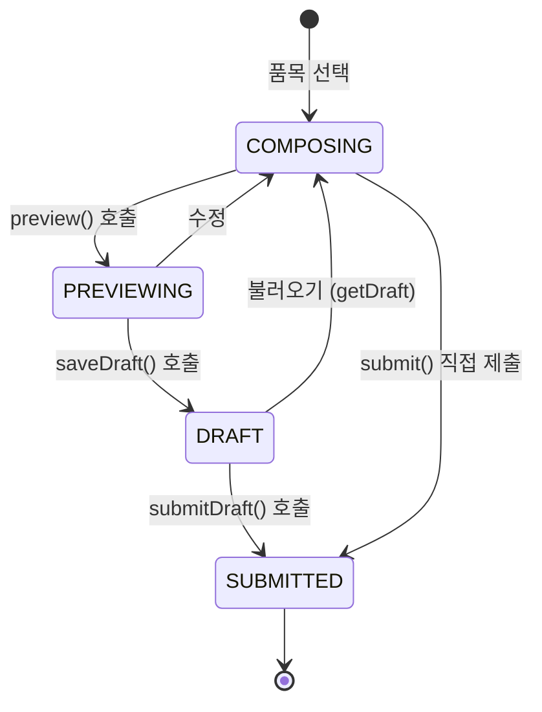

# lib/api/io.ts — 입출고 2.0 핵심 API

#layer/frontend #topic/api

> [!summary] 한 줄 요약
> 입출고 2.0 워크플로의 API 클라이언트. preview(미리보기) → draft(임시저장) → submit(제출) 3단계 흐름을 담당하며 `IoComposeView` 에서 직접 호출된다.

---

## 1. 위치 & 관계

| 항목 | 내용 |
|------|------|
| 원본 | `erp/frontend/lib/api/io.ts` |
| 레이어 | frontend / lib / api |
| 역할 | 입출고 2.0 API 8개 메소드 |
| 주요 소비자 | `IoComposeView`, `WarehouseDraftPanelTabs` |
| 백엔드 라우터 | [[erp/backend/app/routers/io.py]] |



---

## 2. 메소드 목록 (8개)

| 메소드 | HTTP | 엔드포인트 | 설명 |
|--------|------|-----------|------|
| `preview` | POST | `/api/io/preview` | 재고 영향 미리보기 (확정 전) |
| `saveDraft` | PUT | `/api/io/draft` | 작업 임시저장/갱신 |
| `getDraft` | GET | `/api/io/draft?...` | 단일 draft 조회 (work_type 기준) |
| `listDrafts` | GET | `/api/io/drafts?...` | 직원별 전체 draft 목록 |
| `deleteDraft` | DELETE | `/api/io/draft/{id}?...` | draft 삭제 |
| `submit` | POST | `/api/io/submit` | payload 직접 제출 (draft 없이) |
| `submitDraft` | POST | `/api/io/draft/{id}/submit?...` | 저장된 draft 를 제출 |
| `getBatch` | GET | `/api/io/{batchId}` | 확정된 batch 상세 조회 |

---

## 3. 코드 발췌

```typescript
import { deleteJson, fetcher, postJson, putJson, toApiUrl } from "../api-core";
import type {
  IoBatch, IoDraftPayload, IoPreviewPayload,
  IoPreviewResponse, IoSubmitResponse, IoWorkType,
} from "./types";

export const ioApi = {
  preview: (payload: IoPreviewPayload) =>
    postJson<IoPreviewResponse>(toApiUrl("/api/io/preview"), payload),

  saveDraft: (payload: IoDraftPayload) =>
    putJson<IoBatch>(toApiUrl("/api/io/draft"), payload),

  getDraft: (employeeId: string, workType: IoWorkType, subType?: string) => {
    const query = new URLSearchParams({
      requester_employee_id: employeeId,
      work_type: workType,
    });
    if (subType) query.set("sub_type", subType);
    return fetcher<IoBatch | null>(toApiUrl(`/api/io/draft?${query.toString()}`));
  },

  listDrafts: (employeeId: string) =>
    fetcher<IoBatch[]>(
      toApiUrl(`/api/io/drafts?requester_employee_id=${encodeURIComponent(employeeId)}`),
    ),

  deleteDraft: (batchId: string, employeeId: string) =>
    deleteJson<void>(
      toApiUrl(
        `/api/io/draft/${batchId}?requester_employee_id=${encodeURIComponent(employeeId)}`,
      ),
    ),

  submit: (payload: IoDraftPayload) =>
    postJson<IoSubmitResponse>(toApiUrl("/api/io/submit"), payload),

  submitDraft: (batchId: string, employeeId: string) =>
    postJson<IoSubmitResponse>(
      toApiUrl(
        `/api/io/draft/${encodeURIComponent(batchId)}/submit?requester_employee_id=${encodeURIComponent(employeeId)}`,
      ),
      {},
    ),

  getBatch: (batchId: string) =>
    fetcher<IoBatch>(toApiUrl(`/api/io/${encodeURIComponent(batchId)}`)),
};
```

---

## 4. 핵심 타입 설명

| 타입 | 설명 |
|------|------|
| `IoWorkType` | `"IO"` — 입출고 작업 종류 식별자 |
| `IoPreviewPayload` | preview 요청 본문 — 품목 목록 + work_type |
| `IoPreviewResponse` | 미리보기 결과 — 재고 변화 예측 |
| `IoDraftPayload` | draft 저장/제출 공통 본문 |
| `IoBatch` | 저장된 배치 전체 (lines 배열 포함) |
| `IoSubmitResponse` | 제출 완료 응답 — 생성된 거래 목록 |

> [!info] IoBatch vs StockRequest
> - `IoBatch` : 입출고 2.0 신규 방식. 라인 단위 품목 묶음. `api/io.ts` 담당.
> - `StockRequest` : 구형 창고 결재 방식. `api/stock-requests.ts` 담당.
> - 현재 두 방식이 병존하며 `DesktopWarehouseView` 가 둘 다 집계한다.

---

## 5. 3단계 흐름 상세



### preview (미리보기)
- 재고를 실제로 변경하지 않는다
- 예상 재고 변화, 부족 경고를 미리 표시
- `IoPreviewResponse` 에 각 라인별 영향이 담긴다

### saveDraft (임시저장)
- PUT 이므로 upsert — 없으면 생성, 있으면 갱신
- `work_type + requester_employee_id` 조합이 key

### submit / submitDraft (제출)
- 실제 재고를 변경한다
- `submitDraft` : 저장된 draft id 로 제출
- `submit` : draft 없이 payload 를 바로 제출 (일회성)

---

## 6. DesktopWarehouseView 와의 연결

```typescript
// DesktopWarehouseView.tsx 에서 draft 카운트 집계
Promise.all([
  api.listStockRequestDrafts(operatorEmployeeId),  // 구형 draft
  api.listDrafts(operatorEmployeeId),              // io 2.0 draft
]).then(([legacyRows, ioRows]) => {
  const n = legacyRows.length + ioRows.length;
  setCartCount(n);  // 탭 배지 숫자
});
```

`IoComposeView` 컴포넌트가 `ioApi.preview`, `ioApi.saveDraft`, `ioApi.submitDraft` 를 순서대로 호출한다.

---

## 7. 관련 파일

- [[erp/frontend/lib/api.ts]] — 이 파일을 spread merge 하는 허브
- [[erp/frontend/lib/api-core.ts]] — fetcher/postJson 기반
- [[erp/frontend/app/legacy/_components/DesktopWarehouseView.tsx]] — 입출고 화면
- [[erp/backend/app/routers/io.py]] — 백엔드 엔드포인트
- [[erp/frontend/lib/api/stock-requests.ts]] — 구형 결재 흐름 (병존)

---

## 8. 주의 사항

> [!warning] encodeURIComponent 필수
> `batchId` 와 `employeeId` 는 URL 경로/쿼리에 들어가므로 반드시 `encodeURIComponent` 처리.
> 직원 ID 에 `#`, `&` 등 특수문자가 포함될 수 있음.

> [!warning] getDraft 반환 타입 `IoBatch | null`
> draft 가 없으면 백엔드가 `null` 을 반환한다. 호출처에서 `null` 체크 필수.

---

## 9. 히스토리 메모

| 리비전 | 변경 내용 |
|--------|-----------|
| 입출고 2.0 | io 도메인 최초 분리 — preview/draft/submit 3단계 도입 |
| 이후 | `listDrafts`, `deleteDraft`, `getBatch` 추가 |

---

## 10. 신규 개발자를 위한 체크리스트

- [ ] `preview` 응답의 `shortage` 여부 확인 후 UI 경고 표시
- [ ] `saveDraft` 호출 후 `cartCount` 배지 갱신 필요
- [ ] `submitDraft` 성공 시 `onSubmitSuccess()` 콜백 호출 → capacity 갱신 트리거

---

## 11. 정책

- `main` 브랜치: 코드만 유지
- `vault-sync` 브랜치: 코드 + `vault/` 노트
- 코드와 노트가 다르면 실제 코드 우선
