# ERD — DEXCOWIN MES 데이터베이스 설계도

실제 구조는 `backend/app/models/` 가 기준입니다 (이 문서와 코드가 다르면 코드가 맞습니다).

이 문서는 DEXCOWIN MES 가 실제로 쓰는 데이터베이스 표(테이블)들이 서로 어떻게 연결되어 있는지를 한눈에 보여 줍니다. 표 하나하나는 엑셀의 시트 한 장이라고 생각하면 쉽습니다. 표와 표를 잇는 선은 "이 표의 한 행이 저 표의 어느 행을 가리킨다"는 외래키(ForeignKey) 관계입니다.

> 모델 코드 위치(폴더): [[ERP/backend/app/models/📁_models]]
> 가장 중심이 되는 표는 **품목(items)** 입니다. 거의 모든 표가 결국 품목 하나를 가리킵니다.

## 한눈에 보는 관계도

```mermaid
erDiagram
    ITEM ||--o| INVENTORY : "재고 1건"
    ITEM ||--o{ INVENTORY_LOCATION : "부서x상태별 분포"
    ITEM ||--o{ BOM : "부모로서 자재구성"
    ITEM ||--o{ BOM : "자식으로서 쓰임"
    ITEM ||--o{ TRANSACTION_LOG : "거래 이력"
    ITEM ||--o{ STOCK_REQUEST_LINE : "요청 라인"
    ITEM ||--o{ IO_LINE : "입출고 라인"
    ITEM ||--o{ HANDOVER_LINE : "인수인계 라인"
    ITEM ||--o{ WAREHOUSE_BOX_ITEM : "박스에 담김"

    PROCESS_TYPE ||--o{ ITEM : "공정코드"
    PRODUCT_SYMBOL ||--o{ EMPLOYEE_ASSIGNED_MODEL : "담당 모델"

    EMPLOYEE ||--o{ EMPLOYEE_ASSIGNED_MODEL : "담당 지정"
    EMPLOYEE ||--o{ STOCK_REQUEST : "요청자"
    EMPLOYEE ||--o{ TRANSACTION_LOG : "생산자"
    EMPLOYEE ||--o{ IO_BATCH : "요청자"
    EMPLOYEE ||--o{ HANDOVER_DOC : "작성자"
    EMPLOYEE ||--o{ NOTIFICATION : "수신자"
    EMPLOYEE ||--o{ TRANSACTION_EDIT_LOG : "수정자"

    STOCK_REQUEST ||--o{ STOCK_REQUEST_LINE : "요청 라인들"
    STOCK_REQUEST ||--o{ NOTIFICATION : "관련 알림"
    IO_BATCH ||--o{ STOCK_REQUEST : "결재 연계"
    IO_BATCH ||--o{ TRANSACTION_LOG : "배치 묶음"
    IO_BATCH ||--o{ IO_BUNDLE : "번들들"
    IO_BUNDLE ||--o{ IO_LINE : "실제 라인들"
    IO_LINE ||--o| STOCK_REQUEST_LINE : "결재 라인 연결"

    TRANSACTION_LOG ||--o{ TRANSACTION_EDIT_LOG : "수정 이력"

    HANDOVER_DOC ||--o{ HANDOVER_LINE : "인계 품목 라인"

    WAREHOUSE_ANGLE ||--o{ WAREHOUSE_BOX : "앵글 위 박스들"
    WAREHOUSE_BOX ||--o{ WAREHOUSE_BOX_ITEM : "박스 속 품목들"

    ITEM {
        uuid item_id PK
        string item_name
        string mes_code "생성열(STORED)"
        string model_symbol
        string process_type_code FK
        int serial_no
        int min_stock
        datetime deleted_at "소프트삭제"
    }
    INVENTORY {
        uuid inventory_id PK
        uuid item_id FK "유일"
        int quantity "창고+생산 합계"
        int warehouse_qty "창고 보관량"
        int pending_quantity "예약 대기분"
    }
    INVENTORY_LOCATION {
        uuid location_id PK
        uuid item_id FK
        string department
        enum status "PRODUCTION/DEFECTIVE"
        int quantity
    }
    BOM {
        uuid bom_id PK
        uuid parent_item_id FK
        uuid child_item_id FK
        int quantity
    }
    EMPLOYEE {
        uuid employee_id PK
        string employee_code "사번"
        string name
        string department
        enum level "admin/manager/staff"
        string warehouse_role
        string department_role
    }
    DEPARTMENT {
        int id PK
        string name "유일"
        bool io_enabled
    }
    STOCK_REQUEST {
        uuid request_id PK
        uuid requester_employee_id FK
        enum request_type
        enum status
        uuid operation_batch_id FK
    }
    STOCK_REQUEST_LINE {
        uuid line_id PK
        uuid request_id FK
        uuid item_id FK
        int quantity
        enum from_bucket
        enum to_bucket
    }
    TRANSACTION_LOG {
        uuid log_id PK
        uuid item_id FK
        enum transaction_type
        int quantity_change
        uuid operation_batch_id FK
        string department
    }
    TRANSACTION_EDIT_LOG {
        uuid edit_id PK
        uuid original_log_id FK
        uuid edited_by_employee_id FK
        text reason
    }
    IO_BATCH {
        uuid batch_id PK
        uuid requester_employee_id FK
        string work_type
        string sub_type
        string status
    }
    IO_BUNDLE {
        uuid bundle_id PK
        uuid batch_id FK
        uuid source_item_id FK
        int quantity
    }
    IO_LINE {
        uuid line_id PK
        uuid bundle_id FK
        uuid item_id FK
        int quantity
        bool included
    }
    HANDOVER_DOC {
        uuid handover_id PK
        uuid author_employee_id FK
        string from_department
        string to_department
        enum status
    }
    HANDOVER_LINE {
        uuid line_id PK
        uuid handover_id FK
        uuid item_id FK
        int quantity
    }
    NOTIFICATION {
        uuid notification_id PK
        uuid recipient_employee_id FK
        string type
        uuid related_request_id FK
        bool is_read
    }
    WAREHOUSE_ANGLE {
        int id PK
        string label
        int rows
        int layers
    }
    WAREHOUSE_BOX {
        uuid box_id PK
        int angle_id FK
        int row_no
        int layer_no
        int jari_index
        enum size
    }
    WAREHOUSE_BOX_ITEM {
        uuid id PK
        uuid box_id FK
        uuid item_id FK
        int quantity
    }
    PRODUCT_SYMBOL {
        smallint slot PK
        string symbol
        string model_name
    }
    PROCESS_TYPE {
        string code PK
        string prefix
        string suffix
    }
    EMPLOYEE_ASSIGNED_MODEL {
        uuid employee_id FK
        smallint slot FK
        int priority
    }
    ADMIN_AUDIT_LOG {
        uuid audit_id PK
        string action
        string target_type
        string actor_employee_code
    }
    SYSTEM_SETTING {
        string setting_key PK
        text setting_value
    }
```

> 위 다이어그램은 핵심 관계를 보여 줍니다. `ADMIN_AUDIT_LOG`(관리자 감사로그)와 `SYSTEM_SETTING`(시스템 설정)은 외래키 없이 독립적으로 존재해 선이 연결되지 않습니다 — 다른 표를 직접 가리키지 않고 텍스트로만 기록을 남기기 때문입니다.

## 테이블 설명

### 품목 / 자재구성

- **items (품목, `ITEM`)** — 모든 것의 중심. 품목 한 행이 부품 또는 완제품 하나입니다.
  - 핵심 컬럼: `item_id`(고유번호), `item_name`(품목명), `mes_code`(품목코드 — `model_symbol-process_type_code-serial_no` 세 조각을 DB 가 자동으로 합쳐 만드는 **생성열**이라 직접 입력하지 않습니다), `min_stock`(최소 재고), `deleted_at`(소프트 삭제 — 값이 있으면 삭제된 품목이지만 코드 이력은 보존).
  - 관계: `process_type_code` 로 **공정코드 표(process_types)** 를 가리킵니다. 재고·거래·요청·입출고·인수인계·창고박스 등 거의 모든 표가 이 품목을 가리킵니다.

- **bom (자재구성, `BOM`)** — "이 제품을 만들려면 어떤 부품이 몇 개 필요한가"를 담는 표. 한 행은 부모 품목(`parent_item_id`)과 자식 품목(`child_item_id`)을 잇는 한 줄이며 `quantity`(소요 수량)를 가집니다. 같은 부모-자식 조합은 한 번만 존재합니다(유일 제약).

### 재고

- **inventory (재고, `INVENTORY`)** — 품목 한 개당 정확히 한 행(유일). 현재 총 재고와 분포의 기준값입니다.
  - `quantity` = `warehouse_qty`(창고 보관량) + 각 부서 생산 위치 수량 합계. `pending_quantity` 는 결재 대기로 예약 잡힌 수량입니다. (가용 재고 = 창고 + 생산 합계 − 예약분)
  - DB 차원에서 음수 방지, 그리고 "예약분은 창고 보관량을 넘을 수 없다"는 안전 제약이 걸려 있습니다.

- **inventory_locations (위치별 재고, `INVENTORY_LOCATION`)** — 같은 품목이라도 **부서 x 상태(정상 PRODUCTION / 불량 DEFECTIVE)** 로 나누어 어디에 얼마나 있는지 기록합니다. (품목, 부서, 상태) 조합당 한 행만 존재합니다. 재고 표와는 `item_id` 로 맞춰 보지만 ORM 관계선은 두지 않고 직접 조회합니다.

### 직원 / 부서

- **employees (직원, `EMPLOYEE`)** — 사번(`employee_code`), 이름, 소속 부서, 권한등급(`level`: 관리자/매니저/일반). 창고 결재 역할(`warehouse_role`)과 부서 결재 역할(`department_role`)은 시스템 권한과 별개의 업무 역할입니다. `pin_hash` 는 작업자 식별용 PIN(보안 인증이 아니며 없으면 기본 PIN 0000).
- **departments (부서, `DEPARTMENT`)** — 부서명(유일)과 표시 순서, 입출고 사용 여부(`io_enabled`) 등. 직원·재고 표는 부서를 외래키가 아닌 **부서명 문자열**로 참조합니다(그래서 다이어그램에 직접 선은 없습니다).
- **employee_assigned_models (담당 모델, `EMPLOYEE_ASSIGNED_MODEL`)** — 직원과 제품기호(모델)를 잇는 다대다 표. 조립 직원에게 담당 모델을 지정하면 입출고 목록에서 담당 부품이 위로 정렬됩니다. `employee_id` 와 모델 슬롯(`slot`)을 함께 묶어 한 행을 이룹니다.

### 코드 마스터

- **product_symbols (제품기호, `PRODUCT_SYMBOL`)** — 모델 기호 한 글자(예: "3", "346")와 모델명의 사전. 품목코드 앞부분을 해석하는 기준이며 담당 모델 표가 이를 가리킵니다.
- **process_types (공정코드, `PROCESS_TYPE`)** — `code`(예: TR, HA, PA)와 그 앞글자(`prefix`: T/H/V/N/A/P), 뒷글자(`suffix`: R=원자재 / A=조립). 품목의 `process_type_code` 가 이 표를 가리킵니다.

### 입출고 결재 (요청 → 승인)

- **stock_requests (입출고 요청, `STOCK_REQUEST`)** — 창고 재고가 움직이는 작업은 이 요청이 승인된 뒤에만 실재고에 반영됩니다. 요청자(`requester_employee_id`), 요청 유형(`request_type`), 상태(`status`: 임시/제출/예약/반려/취소/완료/결재실패)를 담습니다. 창고 결재와 부서 결재를 따로 요구할 수 있고, 각각 승인/반려한 사람·시각을 기록합니다.
- **stock_request_lines (요청 라인, `STOCK_REQUEST_LINE`)** — 요청 한 건에 들어가는 품목별 줄. 품목, 수량, 출발 구역(`from_bucket`)과 도착 구역(`to_bucket`: 창고/생산/불량/없음)을 가집니다. 품목명·품목코드는 그 시점 값을 스냅샷으로 보관해 나중에 품목이 바뀌어도 요청 기록이 보존됩니다.

### 입출고 2.0 배치 (실제 반영 단위)

- **io_batches (입출고 배치, `IO_BATCH`)** — 사용자가 한 번에 제출한 작업 묶음. 감사(추적) 단위입니다. 결재가 필요하면 `stock_request` 와 연계됩니다.
- **io_bundles (번들, `IO_BUNDLE`)** — 배치 안에서 기준 품목/패키지 하나를 BOM 으로 펼친 묶음.
- **io_lines (라인, `IO_LINE`)** — 실제 재고에 반영될 후보 줄. `included=false`(제외)된 줄도 감사 내역으로 남깁니다. 결재가 필요한 경우 요청 라인(`stock_request_lines`)과 연결됩니다.

### 거래 이력

- **transaction_logs (거래 로그, `TRANSACTION_LOG`)** — 재고가 실제로 변한 모든 사건의 영구 기록. 입고/생산/출하/조정/역공정/분해/부서이동/불량처리/공급사반품 등 유형(`transaction_type`)과 변화량(`quantity_change`), 변경 전후 수량, 담당 부서, 묶음 배치(`operation_batch_id`)를 담습니다. 재고 변동의 본질적 감사 자료입니다.
- **transaction_edit_logs (거래 수정 이력, `TRANSACTION_EDIT_LOG`)** — 위 거래 로그를 나중에 수정·보정한 기록. 누가(`edited_by_employee_id`), 왜(`reason` 필수), 수정 전/후 JSON 스냅샷을 남깁니다.

### 인수인계 (튜브 → 고압/진공)

- **handovers (인수인계서, `HANDOVER_DOC`)** — 튜브 담당자가 작성·제출하고 인수 부서(고압/진공)가 PIN 으로 인수 확인합니다. 인수 확인 시 품목 수량만큼 튜브에서 인수 부서 생산으로 이동합니다. 상태(`status`: 작성중/제출됨/인수완료)와 작성자·인수자 정보를 가집니다.
- **handover_lines (인계 라인, `HANDOVER_LINE`)** — 인수인계서 한 건에 담긴 품목별 수량 줄. 시리얼 목록은 문서용 자유텍스트이고, 실제 재고 이동은 이 품목+수량 줄로만 처리됩니다.

### 알림

- **notifications (알림, `NOTIFICATION`)** — 직원별로 쌓이는 영속 알림. 결재 요청 도착 → 승인 담당자, 승인/반려 → 요청자, 인수인계 도착 → 인수 부서에 생깁니다. 수신자(`recipient_employee_id`), 유형(`type`), 관련 요청(`related_request_id`), 읽음 여부(`is_read`)를 담고 프론트가 주기적으로 폴링해 조회합니다.

### 창고 지도

- **warehouse_angles (앵글/랙, `WAREHOUSE_ANGLE`)** — 창고 평면도 한 블록(랙). 줄 수(`rows`), 층 수(`layers`), 평면도 좌표·크기를 가집니다.
- **warehouse_boxes (박스, `WAREHOUSE_BOX`)** — 앵글 위 한 자리에 놓인 박스 한 개. 자리는 별도 표 없이 (앵글, 줄, 층, 자리번호) 좌표로 식별합니다. 크기(`size`: 대/중/소)와 쌓임 순서를 가집니다.
- **warehouse_box_items (박스 내 품목, `WAREHOUSE_BOX_ITEM`)** — 박스 안에 담긴 실제 품목과 수량. `item_id` 로 품목 마스터를 가리켜 재고 대조의 핵심이 됩니다.

### 독립 표 (외래키 없음)

- **admin_audit_logs (관리자 감사로그, `ADMIN_AUDIT_LOG`)** — 재고 변동이 아닌 마스터/설정 변경(품목·직원·BOM·설정·코드)을 기록. 누가(사번 `actor_employee_code`), 무엇을(`action`, `target_type`) 했는지 남깁니다. 다른 표를 외래키로 가리키지 않고 텍스트로만 기록합니다.
- **system_settings (시스템 설정, `SYSTEM_SETTING`)** — 설정 키-값 한 쌍을 저장하는 단순 표.

## 관련 문서

- 모델 코드 폴더: [[ERP/backend/app/models/📁_models]]
- 데이터베이스 설정/세션: [[ERP/backend/app/database.py]]
- 위험한 영역 정리: [[위험지대_지도]]
- 용어 풀이: [[용어사전]]
- 전체 맥락: [[전체_컨텍스트]]

> 참고: 품목 수, 공정 종류 수 같은 변동 수치는 이 문서에 박지 않습니다. 실제 값은 `python _attic/backend-scripts/facts.py` 로 확인하세요.
