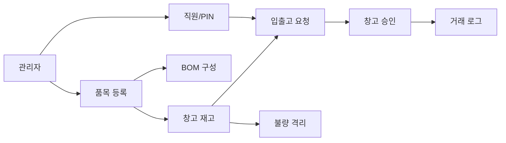

# 전체 컨텍스트

DEXCOWIN MES는 회사의 품목, 재고, 입출고, 승인, BOM, 불량 처리, 감사 기록을 관리하는 경량 MES입니다.

## 한 문장으로

공장 자재가 어디에 있고, 얼마나 있으며, 누가 어떤 요청을 했고, 실제로 재고가 어떻게 움직였는지 기록하는 시스템입니다.

## 큰 흐름

## 주요 영역

- [[ERP/backend/📁_backend]] — DB, API, 업무 규칙이 있는 서버
- [[ERP/frontend/📁_frontend]] — 현장 직원과 관리자가 보는 화면
- [[ERP/backend/app/models/📁_models]] — DB 테이블 구조가 모인 패키지(품목·재고·창고 지도·인수인계·알림 등)
- [[ERP/scripts/📁_scripts]] — 백업, 복구, 검증, 데이터 정리 도구
- [[ERP/_attic/data/📁_data]] — 과거 엑셀/CSV/백업 같은 참고 데이터 자료
- `_attic/docs/` — 도메인 용어집·구조·결정 기록(ADR) 같은 설명 문서 보관소

## 중요한 판단 기준

- [[ERP/backend/app/models/📁_models]]는 DB 구조의 기준입니다. 예전에는 `models.py` 한 파일이었지만, 지금은 영역별 파일(품목·재고·창고·인수인계·알림 등)로 나뉜 패키지입니다.
- [[ERP/backend/app/schemas/📁_schemas]]는 API 데이터 약속입니다. 예전에는 `schemas.py` 한 파일이었지만, 지금은 영역별 파일(품목·재고·요청·입출고 등)로 나뉜 패키지입니다.
- `services/`는 실제 업무 규칙입니다. 결재 규칙 같은 핵심 상수는 `services/approval_rules.py` 한 곳에 모읍니다.
- `routers/`는 화면이 호출하는 API 문입니다.
- `frontend/app/legacy/`는 현재 실제 운영 화면입니다.
- `_attic/`은 보관소입니다. 현재 기준으로 바로 쓰지 않습니다.

## 최근 변경 (2026-06)

> [!example]- 휴직(약 한 달) 동안 들어온 주요 변화 — 펼쳐서 보기
> - **창고 지도**: 평면도 위에 앵글(랙)·박스를 배치하고, 박스에 담긴 품목 수량을 창고 재고(`warehouse_qty`)와 대조합니다. 모델은 [[ERP/backend/app/models/warehouse.py]].
> - **인수인계서(HandoverDoc)**: 튜브 담당자가 작성·제출하면 고압/진공 담당자가 PIN으로 '인수 확인'을 합니다. 인수 확인하는 순간 품목 수량만큼 튜브→인수부서로 실제 재고가 이동합니다. 모델은 [[ERP/backend/app/models/handover.py]].
> - **결재 알림(Notification)**: 결재 요청 도착·승인·반려·인수인계 도착을 직원별로 쌓아 보여줍니다. 화면은 30초마다 새로 확인(폴링)합니다. 모델은 [[ERP/backend/app/models/notification.py]].
> - **재작업(불량) 격리**: 불량 격리 작업이 결재 대상으로 분리되어 별도로 다뤄집니다.
> - **mes_code unique**: 품목 식별 코드 `mes_code`가 전역에서 중복될 수 없게 막혔습니다(소프트삭제된 코드도 영구 점유 → 이력 추적성).
> - **결재 규칙 단일화(ADR-0005)**: 어떤 작업이 창고 결재·부서 결재·즉시 반영을 타는지 정하는 규칙 상수를 `services/approval_rules.py` 한 곳으로 모았습니다. 자세한 배경은 `_attic/docs/adr/ADR-0005-approval-rules-single-source.md`.

## 브랜치 정책

- `main`: 코드만 있습니다.
- `vault-sync`: 같은 코드에 `vault/` 설명을 더합니다.
- main에서 오래 작업한 뒤 vault-sync를 갱신할 때는 코드 diff가 vault 밖에 남지 않는지 확인해야 합니다.
