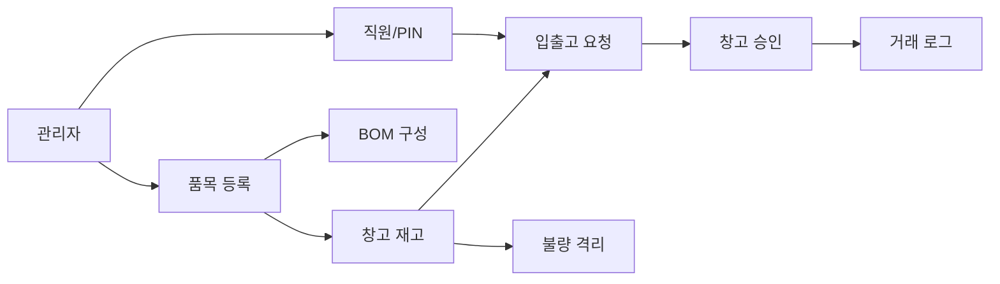

# 전체 컨텍스트

DEXCOWIN MES는 회사의 품목, 재고, 입출고, 승인, BOM, 불량 처리, 감사 기록을 관리하는 경량 MES입니다.

## 한 문장으로

공장 자재가 어디에 있고, 얼마나 있으며, 누가 어떤 요청을 했고, 실제로 재고가 어떻게 움직였는지 기록하는 시스템입니다.

## 큰 흐름

## 주요 영역

- [[ERP/backend/📁_backend]] — DB, API, 업무 규칙이 있는 서버
- [[ERP/frontend/📁_frontend]] — 현장 직원과 관리자가 보는 화면
- [[ERP/docs/📁_docs]] — 사용법, 운영법, 구조 문서
- [[ERP/scripts/📁_scripts]] — 백업, 복구, 검증, 데이터 정리 도구
- [[ERP/_attic/data/📁_data]] — 과거 엑셀/CSV/백업 같은 참고 데이터 자료

## 중요한 판단 기준

- `models.py`는 DB 구조의 기준입니다.
- `schemas.py`는 API 데이터 약속입니다.
- `services/`는 실제 업무 규칙입니다.
- `routers/`는 화면이 호출하는 API 문입니다.
- `frontend/app/legacy/`는 현재 실제 운영 화면입니다.
- `_attic/`은 보관소입니다. 현재 기준으로 바로 쓰지 않습니다.

## 브랜치 정책

- `main`: 코드만 있습니다.
- `vault-sync`: 같은 코드에 `vault/` 설명을 더합니다.
- main에서 오래 작업한 뒤 vault-sync를 갱신할 때는 코드 diff가 vault 밖에 남지 않는지 확인해야 합니다.
