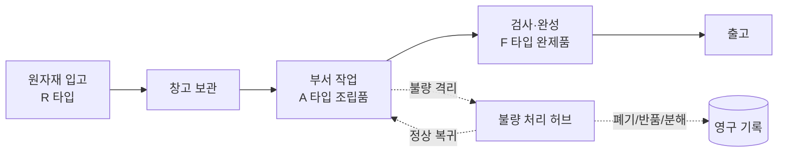

# 처음 읽는 사람을 위한 DEXCOWIN MES Vault 안내

> [!summary] 역할
> DEXCOWIN MES 프로젝트를 인수인계 받을 때 **첫날** 읽는 안내서다.
> 모르는 단어는 [[guides/용어사전]]에서 풀이를 확인한다.

> [!note]
> "모르는 게 있으면 먼저 찾아보고, 그래도 안 되면 물어본다."
> 첫 주는 코드를 고치지 말고 **읽기만** 한다. 한 화면을 누르면 어디로 흘러가는지 추적하는 데만 집중한다.

---

## 0. 이 시스템은 뭐예요?

> [!info] 한 문장 정의
> **DEXCOWIN MES**는 공장 자재가 어디에 얼마나 있고, 언제 어떻게 움직였는지를 기록하는 내부 운영 시스템이다.

- 공식 이름: **DEXCOWIN MES** (사내 문서·UI·발표 자료 모두 이 이름으로 통일)
- 옛 호칭: 초기엔 "ERP", "X-Ray ERP"로 불렸지만 현재는 사용하지 않는다. 단 폴더명 `erp/`, 일부 식별자(`erp_code`, `xray-erp`) 같은 **legacy 내부 식별자는 그대로 둔다** — 마음대로 바꾸면 마이그레이션·CI 가 와장창 깨진다.
- 대상 사용자: DEXCOWIN 내부 직원 (생산·창고·관리자)
- 주 화면: 데스크톱 셸 + 모바일 셸 (2026-05 모바일 4화면 1차 PASS)

> [!warning] 이름 규칙 (꼭 지킬 것)
> - 사용자 노출 텍스트: **DEXCOWIN MES**
> - 폴더·파일 경로: `erp/...` (그대로)
> - DB 컬럼·코드 식별자: `erp_code`, `xray-erp` 등 (그대로)

---

## 1. 이 Vault는 뭐예요?

`erp/` 프로젝트를 Obsidian에서 읽기 좋게 정리한 **문서 묶음**이다.

- 실제 코드는 `backend/`, `frontend/`, `scripts/`, `docs/`, `data/`, `docker/` 에 있다.
- `vault/` 는 그 구조를 **설명하는 레이어**일 뿐, 코드를 돌릴 때는 아무 영향을 주지 않는다.
- Vault 자체는 `vault-sync` 브랜치에만 존재한다. `main` 브랜치엔 `vault/` 폴더가 없다.
- `vault/ERP/` = 프로젝트 파일 구조를 미러한 노트 모음 (이전: `vault/backend/`, `vault/frontend/` 등 직접)
- `vault/guides/` = 사람이 읽는 가이드 (이전: `vault/_vault/guides/`)

> [!tip] 옵시디언으로 열어라
> 파일 트리만 봐도 헷갈리는데, Obsidian으로 `vault/` 를 vault 루트로 잡고 열면 wiki-link·callout·mermaid 가 다 렌더링돼서 훨씬 잘 읽힌다.

---

## 2. 가장 중요한 한 문장

> [!quote] 시스템 본질
> 이 MES는 공장 자재가 **어디에 / 얼마나 / 언제 / 어떻게** 움직였는지를 기록하는 내부 운영 시스템이다.

이걸 잊으면 코드를 읽다가 길을 잃는다. "이 함수는 결국 재고를 움직이는 거다"라는 한 줄로 모든 라우터를 다시 해석하라.

---

## 3. 전체 흐름 한눈에



> [!info] 자재 흐름 4단계
> **자재(R) → 부서 작업(A) → 완제품(F) → 출고**
> 중간에 불량이 발생하면 별도 풀(격리)로 빠졌다가 **정상 복귀 / 폐기 / 공급처 반품 / 분해** 중 하나로 처리된다.

---

## 4. 먼저 알아둘 폴더 구조

| 위치 | 의미 |
|---|---|
| `backend/` | FastAPI API 서버, DB 모델, 라우터, 서비스 |
| `backend/app/main.py` | 백엔드 엔트리 (uvicorn 진입점) |
| `backend/app/models.py` | SQLAlchemy 모델 (DB 스키마의 진실) |
| `backend/app/routers/` | HTTP 엔드포인트 묶음 (도메인별) |
| `backend/app/routers/inventory/` | **패키지로 분할된 재고 라우터** (단일 파일 아님) |
| `backend/app/services/` | 라우터에서 빼낸 비즈니스 로직 |
| `frontend/` | Next.js 14 사용자 화면 |
| `frontend/app/legacy/` | 현재 실제 데스크톱 UI (이름만 legacy) |
| `frontend/app/mobile/` 계열 | 모바일 셸 (2026-05 신규) |
| `frontend/lib/api/` | 도메인별 API 클라이언트 (13 도메인) |
| `scripts/ops/` | 백업, 복구, 헬스체크, 정합성 점검 |
| `scripts/migrations/` | 데이터/코드 기준 변경용 일회성 스크립트 |
| `scripts/dev/verify_local.ps1` | 커밋 전 5게이트 검증 |
| `docs/` | 규칙, 진행 기록, 운영 문서 |
| `data/` | 현장 엑셀/CSV 기준 자료 + DB 백업 |
| `docker/` | 컨테이너 정의 |
| `.github/workflows/` | CI 설정 |
| `vault/` | 이 vault (브랜치 `vault-sync` 전용) |
| `vault/ERP/` | 프로젝트 파일 구조 미러 노트 모음 |
| `vault/guides/` | 사람이 읽는 가이드 (이 파일 있는 곳) |

---

## 5. 현재 활성 라우터 (2026-05-22 기준)

> [!info] 라우터 = HTTP 엔드포인트 그룹
> `backend/app/routers/` 아래 파일/패키지 하나가 도메인 하나에 해당한다.

| 라우터 | 책임 |
|---|---|
| `items.py` | 품목 마스터 |
| `inventory/` (패키지) | 재고 조회·이동·격리 — 아래 5절에서 상세 |
| `io.py` | 입출고 통합 엔드포인트 (v2) |
| `dept_adjustment.py` | 부서 내 조정·격리·이동 |
| `stock_requests.py` | 입출고 요청·결재 흐름 |
| `defects.py` | 불량 처리 허브 API |
| `production.py` | 생산 가능 수량·BOM 분해 산출 |
| `bom.py` | BOM 트리 조회 |
| `departments.py` | 부서 마스터 |
| `employees.py` | 직원 마스터 + 권한 |
| `codes.py` | 공정코드·모델기호 마스터 |
| `variance.py` | 정합성 변동 추적 |
| `settings.py` | 시스템 설정 |
| `admin_audit.py` / `admin_audit_csv.py` | 외부 심사용 감사 로그 |

> [!warning] 죽은 라우터를 찾지 말 것
> 옛 문서에 등장하는 `queue`, `alerts`, `counts`, `loss`, `ship_packages` 라우터는 **현재 코드에 없다**. 이 이름들이 어디 적혀 있으면 그 문서가 낡은 거다.

### 5.1 inventory 패키지 구조

> [!example] inventory 는 단일 파일이 아니라 패키지다
> 예전엔 `backend/app/routers/inventory.py` 한 파일(807줄)이었지만, Phase 4 분할 이후 **패키지**가 됐다.

```
backend/app/routers/inventory/
├── __init__.py          # APIRouter 조립
├── _shared.py           # 응답 변환 헬퍼
├── query.py             # /summary, /locations/{item_id}
├── transactions.py      # /transactions, /transactions/export.{csv,xlsx}
├── transfer.py          # /transfer-to-production, /transfer-to-warehouse
├── receive.py           # /receive, /adjust
├── defective.py         # /mark-defective
├── supplier.py          # /return-to-supplier
└── weekly_report.py     # 주간보고 산출
```

---

## 6. 30분 안에 보기 (첫 시간)

> [!summary] 목표
> "이 시스템이 무엇을 하는지" 한 문단으로 말할 수 있게 된다.

1. [[ERP/📁_ERP]] — 프로젝트 루트 미러 진입점
2. [[guides/전체_컨텍스트]] — 전체 컨텍스트 한 장 요약
3. [[guides/용어사전]] — 모르는 단어가 나오면 여기로

---

## 7. 2시간 안에 구조 잡기

> [!summary] 목표
> 코드 트리를 보고 "이 변경은 어디를 건드려야 한다"가 머리에 그려진다.

1. [[ERP/frontend/app/legacy/_components/📁__components]] — 현재 활성 데스크톱 셸 컴포넌트
2. [[ERP/frontend/lib/📁_lib]] — fetch 헬퍼 + 도메인별 API 클라이언트
3. [[ERP/backend/app/routers/📁_routers]] — 라우터 목록
4. [[ERP/backend/app/services/📁_services]] — 비즈니스 로직 위치
5. [[ERP/backend/app/models.py]] — DB 모델 정본
6. [[guides/위험지대_지도]] — 함부로 손대면 안 되는 영역

---

## 8. 최근 변화 (2026-04-28 → 2026-05-22)

> [!info] 왜 이 절이 있나
> 옛 문서를 읽다 보면 "지금 코드랑 다른데?" 싶은 순간이 온다.

- **불량 처리 흐름 재설계** — `docs/defect-handling-redesign.md`
  격리·폐기·반품·분해 + 부서 계층(생산부 산하 6라인) + 결재 라우팅을 통째로 재설계. `_defect_hub` 컴포넌트 신규.
- **items.item_code 통합** / `ErpCode` → `ItemCode` 도메인 rename
  품목코드 컬럼·도메인 용어를 단일화. 단 DB 컬럼 `erp_code` 는 legacy 식별자로 그대로 유지.
- **UtcDatetime 응답 스키마 확산**
  모든 응답 시간 필드를 UtcDatetime 으로 통일해 화면 9시간 오차 문제를 근본 수정.
- **입출고 내역 죽은 거래 타입 5종 제거**
  실제로 호출되지 않던 거래 타입 라벨/분기를 제거해 내역 화면 정리.

> [!question] 옛 문서가 새 코드와 안 맞으면?
> **코드가 정답**이다. 문서는 따라잡지 못한 거다. CLAUDE.md 의 "If docs and live code disagree, trust the live code" 규칙 그대로.

---

## 9. 헷갈리기 쉬운 것

> [!warning] `legacy` 는 현재 실제 UI 다
> 이름이 legacy 라서 폐기된 것 같지만, 지금 사용자가 보는 **주 데스크톱 화면**이 `frontend/app/legacy/` 다.

> [!warning] 예전 단일 파일을 찾지 마라
> - `backend/app/routers/inventory.py` → 지금은 **패키지** (`inventory/` 폴더)
> - 옛 `AdminTab.tsx` 단일 거대 파일 → 섹션별 하위 컴포넌트로 분리
>
> 옛 import 경로가 검색돼도 지금은 그 파일이 없거나 형태가 바뀌었을 수 있다.

> [!warning] 죽은 라우터 이름들
> `queue`, `alerts`, `counts`, `loss`, `ship_packages` 는 코드에 없다.

> [!warning] 브랜치 정책
> - `main` — 코드만 (vault 없음)
> - `vault-sync` — vault 포함 (현재 브랜치)
> 합치지 말 것. `main` 에 vault 가 올라가면 코드 PR 리뷰가 진흙탕이 된다.

> [!warning] DB 는 함부로 만들지 마라
> 스키마/시드/마이그레이션 작업은 명시적으로:
> ```bash
> cd backend
> python bootstrap_db.py --all
> ```
> 그리고 영향을 사용자에게 먼저 보고하고 진행.

---

## 10. 첫 수정 전 체크

> [!example] 변경 유형별 함께 봐야 할 파일
>
> **화면 변경**
> - `frontend/app/legacy/` (해당 화면)
> - `frontend/lib/api/` (호출하는 API 클라이언트)
> - 모바일 영향이 있으면 모바일 셸도 같이
>
> **API 변경**
> - `backend/app/routers/` (해당 라우터)
> - `backend/app/schemas.py` (요청/응답 스키마)
> - `backend/app/services/` (위임된 비즈니스 로직)
> - `backend/tests/` (관련 테스트)
> - `_attic/docs/openapi.json` (CI drift gate — 갱신 필수)
>
> **DB 변경**
> - `backend/app/models.py`
> - `backend/schema.sql`
> - migration/seed 영향
> - 사용자에게 영향 먼저 보고
>
> **운영 작업**
> - `scripts/ops/` (백업·헬스·정합성 스크립트)
> - 백업 절차 먼저 확인

---

## 11. 커밋·푸시 직전

> [!tip] 5게이트 검증
> 사용자가 "커밋해줘"라고 명시적으로 말했을 때만 진행한다. 자동 커밋 금지.
> 그리고 커밋 직전에는 항상:
> ```powershell
> powershell -ExecutionPolicy Bypass -File .\scripts\dev\verify_local.ps1
> ```
> backend pytest / frontend lint:strict / tsc / vitest+coverage / next build / OpenAPI drift 5게이트를 CI 와 동일 기준으로 검증한다.

---

## 12. 관련 가이드

- [[guides/전체_컨텍스트]] — 전체 컨텍스트 한 장 요약
- [[guides/위험지대_지도]] — 손대면 위험한 모듈·플로우 지도
- [[guides/볼트_갱신_작업요령]] — vault-sync 브랜치 갱신 루틴
- [[guides/용어사전]] — 도메인 용어 사전

---

## 13. 인수인계 첫 주를 위한 메모

- 첫 주는 **코드를 고치지 마라**. 화면 하나 누르고 → 호출 path 추적 → 라우터·서비스·모델까지 따라가 보는 훈련만.
- 모르는 단어는 [[guides/용어사전]]에 다 있다. 없으면 추가하면 된다.
- 옛 문서와 코드가 다르면 **코드가 정답**이다.
- 한 화면 동선이 끝까지 안 풀리면 [[guides/위험지대_지도]] 를 봐라.

> [!tip] 둘러보기 순서 요약
> 1. 이 문서를 끝까지 본다
> 2. [[guides/용어사전]] 으로 모르는 단어 5개만 찍어 본다
> 3. [[guides/전체_컨텍스트]] 로 큰 그림을 잡는다
> 4. `start.bat` 한 번 실행해서 실제 화면을 본다 (코드 수정 X, **보기만**)
> 5. [[guides/위험지대_지도]] 를 읽는다

---

Up: [[ERP/📁_ERP]]
