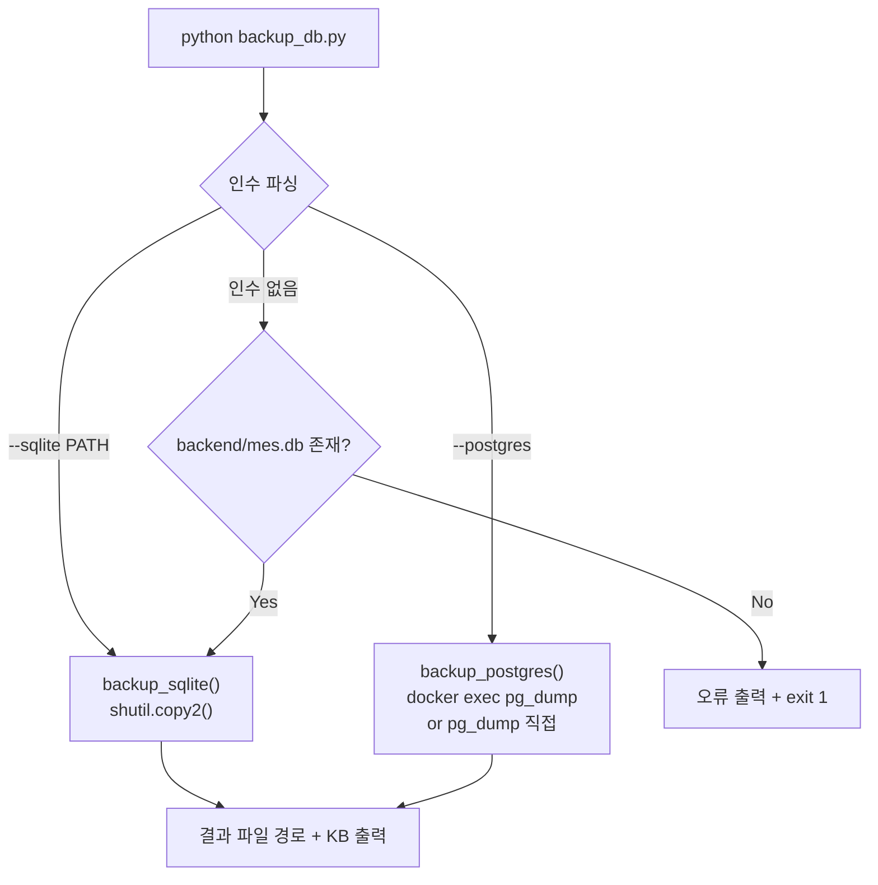

---
tags:
  - layer/scripts
  - topic/ops
  - audience/junior
aliases:
  - backup_db
created: 2026-05-21
---

# backup_db.py

> [!info] 한 줄 요약
> DB 백업 유틸리티. SQLite 직접 파일 복사 또는 PostgreSQL pg_dump 를 지원. 결과물은 `outputs/backups/` 에 타임스탬프 파일명으로 저장.

## 1. 파일 위치

```
erp/scripts/ops/backup_db.py
```

## 2. 실행 방법

```bash
# SQLite 직접 백업 (기본)
python scripts/ops/backup_db.py --sqlite backend/mes.db

# 인수 없이 실행 → backend/mes.db 자동 탐지
python scripts/ops/backup_db.py

# PostgreSQL — Docker 컨테이너 기준
python scripts/ops/backup_db.py --postgres --container <container_name>

# PostgreSQL — 직접 연결
python scripts/ops/backup_db.py --postgres --host localhost --port 5432 --user mes_user --dbname mes_db
```

## 3. 출력 파일

| DB 종류 | 파일명 패턴 | 위치 |
|---|---|---|
| SQLite | `mes_YYYYMMDD_HHMMSS.db` | `erp/outputs/backups/` |
| PostgreSQL | `mes_YYYYMMDD_HHMMSS.sql` | `erp/outputs/backups/` |

`outputs/backups/` 디렉터리가 없으면 자동 생성.

## 4. 백업 흐름 다이어그램



## 5. 코드 발췌 (SQLite 백업)

```python
# erp/scripts/ops/backup_db.py (28-39)
def backup_sqlite(db_path: str) -> None:
    src = Path(db_path).resolve()
    if not src.exists():
        print(f"❌ SQLite 파일 없음: {src}")
        sys.exit(1)

    OUTPUT_DIR.mkdir(parents=True, exist_ok=True)
    ts = datetime.now().strftime("%Y%m%d_%H%M%S")
    dst = OUTPUT_DIR / f"mes_{ts}.db"
    shutil.copy2(src, dst)
    size_kb = dst.stat().st_size // 1024
    print(f"✅ SQLite 백업 완료: {dst} ({size_kb} KB)")
```

`shutil.copy2` 는 파일 메타데이터(수정 시간 등)도 보존하는 복사.

## 6. PostgreSQL 백업 — Docker 경로

```python
# erp/scripts/ops/backup_db.py (47-54)
if container:
    cmd = [
        "docker", "exec", container,
        "pg_dump", "-U", user, dbname,
    ]
```

컨테이너 이름 지정 시 `docker exec` 로 컨테이너 내부 `pg_dump` 실행.

## 7. 기본 인수값

| 인수 | 기본값 |
|---|---|
| `--host` | `localhost` |
| `--port` | `5432` |
| `--user` | `mes_user` |
| `--dbname` | `mes_db` |

## 8. 출력 디렉터리 경로 계산

```python
# erp/scripts/ops/backup_db.py (25)
OUTPUT_DIR = Path(__file__).resolve().parents[2] / "outputs" / "backups"
# __file__ = scripts/ops/backup_db.py
# parents[2] = 프로젝트 루트 (ERP/)
```

## 9. 운영 주의사항

> [!warning] 초기화 전 반드시 백업
> `AdminDangerZone` 의 "데이터 초기화" 실행 전에 이 스크립트로 SQLite 백업을 수행하도록 운영 가이드에 명시됨.

> [!note] outputs/ 는 .gitignore 대상
> 백업 파일은 git 에 추적되지 않음. 별도 안전한 위치에 복사하거나 주기적으로 외부 스토리지로 이동 권장.

## 10. 관련 파일

- `[[erp/scripts/ops/restore_db.py]]` — 백업 파일로 복원
- `[[erp/scripts/ops/_verify_backup.py]]` — 백업 파일 정합성 검증
- `[[erp/frontend/app/legacy/_components/_admin_sections/AdminDangerZone.tsx]]` — 초기화 전 백업 권고 안내
